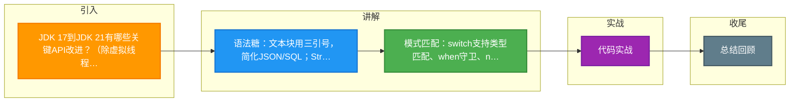

# JDK 17到JDK 21有哪些关键API改进？（除虚拟线程外）

**JDK 17 到 JDK 21 的关键 API 改进（除虚拟线程外）：**

**1. 文本块（Text Blocks，JDK 15 正式）：**
- 使用 `"""` 定义多行字符串，自动处理换行符和大部分缩进。
- **细节**：编译器会移除每行行尾的空格，以及与结尾 `"""` 对齐的共性空白。
- **转义**：可以使用 `\` 取消换行，`\s` 表示显式空格。

**2. String 新方法：**
- `formatted(Object... args)`：替代 `String.format`，写法为 `"Hello %s".formatted(name)`。
- `indent(int n)`：调整缩进，n 为正增加，为负减少。
- `translateEscapes()`：处理字符串中的转义字符（如 `\n` 变为换行）。
- `repeat(int)`：重复字符串内容。

**3. Record（记录类，JDK 16 正式）：**
- **原理**：Record 是一种不可变数据的载体，编译器自动生成：全参构造器、私有 final 字段、访问器方法（无 `get` 前缀）、`equals`, `hashCode`, `toString`。
- **紧凑构造器**：允许在构造器中书写验证逻辑，而不必列出参数列表。
  ```java
  record Point(int x, int y) {
      public Point {
          if (x < 0 || y < 0) throw new IllegalArgumentException();
      }
  }
  ```

**4. Pattern Matching（模式匹配）：**
- **instanceof 模式匹配（JDK 16）**：
  - `if (obj instanceof String s)`：直接将 `obj` 转型为 `String` 并赋值给 `s`，作用域限定在 if 块内。
  - 避免了显式的 `(String)obj` 强转和重复的变量声明。
- **switch 模式匹配（JDK 21 正式）**：
  - **类型模式**：`case Integer i -> ...`
  - **Null 处理**：`case null -> ...` （解决 switch 不允许 null 的历史问题）。
  - **守卫子句**：`case String s when s.length() > 5 -> ...`，允许在 case 后加 `when` 条件。
  - **Record 解构**：`case Point(int x, int y) -> ...`，直接提取 Record 组件。

**5. Sealed Classes（密封类，JDK 17 正式）：**
- **作用**：限制继承层级，确保只有 `permits` 列出的类可以继承。
- **约束**：
  - Sealed 类及其子类必须在同一个模块或同一个包内。
  - 子类必须声明为 `final`, `sealed`, 或 `non-sealed`。
- **意义**：配合模式匹配，编译器可以精确判断 switch 的穷举性，无需 default 分支。

**6. Sequenced Collections（JDK 21）：**
- **背景**：统一 `List`, `Deque`, `Set` 等有序集合的访问 API。
- **新接口**：
  - `SequencedCollection`：提供 `addFirst`, `addLast`, `getFirst`, `getLast`, `reversed()` 等方法。
  - `SequencedSet` / `SequencedMap`：针对 Set 和 Map 的变体。
- **影响**：不再需要针对 `LinkedList` 写特定代码，通用的 `List` 接口现在也支持双端队列操作（如果实现类支持）。

**7. 其他实用 API：**
- `Stream.toList()`（JDK 16）：直接返回不可变 List，替代 `collect(Collectors.toList())`。
- `Optional.orElseThrow()`（JDK ? 无参版）：为空时直接抛出 `NoSuchElementException`，简化代码。
- **ScopedValue（JDK 21 预览）**：作为 `ThreadLocal` 的替代者，在结构化并发中共享数据，且随线程生命周期自动清理。

#### 💡 实战案例
在重构遗留的订单处理逻辑时，我们利用 **Record Pattern Matching** 简化了大量的 `instanceof` 判断和强制转换代码。原来处理不同支付渠道（支付宝、微信、银行卡）的响应对象需要 50+ 行样板代码，重构后在 `switch` 中通过 `record` 解构直接提取字段，代码缩减至 15 行且更易读。

#### 🔑 关键代码示例
```java
// JDK 21: Record Pattern + Switch (Sealed Class 穷举匹配)
sealed interface Payment permits Alipay, WeChat, BankCard {}
record Alipay(String tradeNo) implements Payment {}
record WeChat(String transactionId) implements Payment {}

// 业务逻辑：直接解构获取字段
String extractKey(Payment payment) {
    return switch (payment) {
        case Alipay(String tNo) -> "ALI_" + tNo;
        case WeChat(String tId) -> "WX_" + tId;
        // 编译器会检查是否覆盖了所有 permits，若 BankCard 未处理则报错
    };
}
```

#### 📊 旧版 API vs 新版 API 对比
| 场景 | 旧版实现 (JDK 8-11) | 新版实现 (JDK 17-21) | 优势 |
| :--- | :--- | :--- | :--- |
| **List 构建** | `list.stream().collect(Collectors.toList())` | `list.stream().toList()` | 简洁，且返回不可变集合（更安全） |
| **字符串格式化** | `String.format("Name: %s", name)` | `"Name: %s".formatted(name)` | 流式 API，可读性更高 |
| **类型判断与转型** | `if (obj instanceof String) { String s = (String)obj; ... }` | `if (obj instanceof String s) { ... }` | 减少变量重复声明，避免强制转换 |
| **获取集合首尾元素** | `list.get(0)`, `list.get(list.size()-1)` (需判空) | `list.getFirst()`, `list.getLast()` (统一接口) | 统一 `List/Deque/Set` API，无需类型转换 |
| **多行 JSON** | `String s = "{\"key\": \"value\"}";` (转义地狱) | `String s = """{"key": "value"}""";` | 可读性强，接近原始格式 |


## 核心架构图

```mermaid
flowchart TD
    classDef start fill:#4CAF50,color:#fff
    classDef process fill:#2196F3,color:#fff
    classDef decision fill:#FF9800,color:#fff
    classDef special fill:#9C27B0,color:#fff
    classDef error fill:#f44336,color:#fff
    classDef info fill:#607D8B,color:#fff
    class A start
    class API process
    class B decision
    class B1 special
    class B2 error
    class B3 info
    class B4 start
    class C process
    class C1 decision
    class C2 special
    class C3 error
    class C4 info
    class C5 start
    class CMS process
    class Classes decision
    class Collections special
    class Concurrency error
    class D info
    class E start
    class F process
    class G decision
    class G1 special
    class GC error
    class Generational info
    class H start
    class HashMap process
    class I decision
    class J special
    class JDK error
    class K info
    class LTS start
    class Matching process
    class Optional decision
    class Parallel special
    class Pattern error
    class Records info
    class Sealed start
    class Sequenced process
    class Stream decision
    class String special
    class Structured error
    class Switch info
    class Threads start
    class Virtual process
    class ZGC decision
    class for special
    class instanceof error
    class isBlank info
    class orElseThrow start
    class repeat process
    class strip decision
    class switch special
    class toList error
    class zipWith info
    A[JDK 17-21 关键改进] --> B[JDK 17 LTS]
    B --> B1[Sealed Classes 密封类]
    B --> B2[Pattern Matching instanceof]
    B --> B3[Records 增强]
    B --> B4[Switch 模式匹配 预览]
    A --> C[JDK 21 LTS]
    C --> C1[Virtual Threads 虚拟线程]
    C --> C2[Sequenced Collections]
    C --> C3[Pattern Matching for switch 正式]
    C --> C4[Generational ZGC 分代]
    C --> C5[Structured Concurrency 预览]
    D[API 改进] --> E[HashMap 内部优化]
    D --> F[String.repeat/strip/isBlank]
    D --> G[Stream toList/zipWith]
    D --> H[Optional.orElseThrow 等]
    I[GC 演进] --> J[Parallel/CMS 淘汰]
    I --> K[G1 默认 ZGC 低延迟]
```



## 记忆要点

- 语法糖：文本块用三引号，简化JSON/SQL；Stream直接用toList()替代collect收集
- 模式匹配：switch支持类型匹配、when守卫、null处理及Record解构提取字段
- 数据建模：Record作为不可变数据载体，自动生成全参及访问器；Sealed类限制继承配合穷举匹配
- 集合统一：JDK 21引入Sequenced Collections，统一了List和Set等的正反向获取及操作API

## 结构化回答

**30 秒电梯演讲：** 增强语法表达力和API易用性。打个比方，给Java语言装上“语法糖”和“工具箱”，写代码更省力。

**展开框架：**
1. **语法糖** — 文本块用三引号，简化JSON/SQL；Stream直接用toList()替代collect收集
2. **模式匹配** — switch支持类型匹配、when守卫、null处理及Record解构提取字段
3. **数据建模** — Record作为不可变数据载体，自动生成全参及访问器；Sealed类限制继承配合穷举匹配

**收尾：** 我在项目里踩过坑——在重构遗留的订单处理逻辑时，我们利用 Record Pattern Matching 简化了大量的 `instanceof` 判断和强制转换代码。您想深入聊哪一段：原理、避坑还是对比选型？

## 视频脚本

> 预计时长：2 分钟 | 由浅入深

| 时间 | 画面/字幕 | 口播台词 | 讲解要点 |
|------|----------|----------|----------|
| 0:00 | 标题卡：JDK 17到JDK 21有哪些关键… | "JDK 17到JDK 21有哪些关键API改进？（除虚拟线程外）？一句话——给Java语言装上“语法糖”和“工具箱”，写代码更省力。" | 开场钩子 |
| 0:40 | 概念动画/示意图 | "增强语法表达力和API易用性——给Java语言装上“语法糖”和“工具箱”，写代码更省力" | 核心定义 |
| 1:20 | 语法糖示意 | "文本块用三引号，简化JSON/SQL；Stream直接用toList()替代collect收集" | 要点1 |
| 2:00 | 总结卡 | "记住这几条，面试不慌。下期讲进阶追问。" | 收尾 |

### 视频流程图



