# JDK 21 引入的虚拟线程与传统的平台线程在底层模型上有何本质区别？在什么场景下使用虚拟线程能显著提升吞吐量，又有哪些场景不适用？

传统平台线程是与操作系统线程一一对应的“重量级”线程，创建成本高，上下文切换开销大。而虚拟线程是 JVM 管理的轻量级线程，底层使用 M:N 调度模型，即大量虚拟线程（M）映射到少量操作系统线程（N）上运行，栈内存存储在堆中而非栈区。在 I/O 密集型任务（如高并发 Web 请求、数据库查询、RPC 调用）中，虚拟线程能大幅提升吞吐量，因为阻塞不会阻塞底层 OS 线程。但在 CPU 密集型任务中，虚拟线程无优势，因为瓶颈在于 CPU 核心数。此外，持有 `synchronized` 锁或使用 native 方法进行阻塞操作时（Pinning），会“钉住”载体线程，导致调度效率下降，需避免此类长时阻塞。

## 技术原理

- **底层模型：平台线程是 1:1 对应 OS 线程；虚拟线程是 M:N 映射，由 JVM 调度**：传统 `Thread` 直接包装操作系统线程，每个 Java 线程对应一个内核线程，创建要陷入内核态（约 1MB 栈 + 内核数据结构），上下文切换也是内核切换（微秒级，昂贵）。虚拟线程（JDK 21，JEP 444）是 JVM 管理的用户态线程——M 个虚拟线程被调度到 N 个载体线程（Carrier，即 ForkJoinPool 的 worker）上运行，创建在用户态完成（约几 KB，栈存在堆上按需扩展），上下文切换在 JVM 内部完成（纳秒级）。
- **适用场景：IO 密集型任务吞吐量显著提升；CPU 密集型任务无优势**：I/O 密集场景（Web 请求、DB 查询、RPC 调用）线程大部分时间在阻塞等待 I/O。平台线程阻塞会占用整个 OS 线程，万级并发要万级线程，撑不住；虚拟线程在阻塞 I/O 时会自动 unmount 释放 Carrier 给其他虚拟线程用，所以少量 Carrier 就能支撑百万级并发虚拟线程。但 CPU 密集任务的瓶颈是 CPU 核心数，再多虚拟线程也跑不快，反而有调度开销。
- **注意事项：避免在 synchronized 或 Native 方法中长时阻塞，防止线程钉住（Pinning）**：虚拟线程遇到 `synchronized` 块、JNI 调用等"不可卸载"操作时无法 unmount，会"钉住"Carrier 线程阻塞等待。少量 pinning 可接受，但高并发下大量 pinning 会耗尽 Carrier 池（默认 CPU 核数），让所有虚拟线程都跑不动。JDK 24（JEP 491）已修复 `synchronized` 的 pinning，老版本要改用 `ReentrantLock`。

## 对比/选型

| 维度 | 平台线程 | 虚拟线程 |
|------|----------|----------|
| 与 OS 线程关系 | 1:1 | M:N |
| 创建成本 | ~1MB，内核态 | ~几 KB，用户态 |
| 上下文切换 | 微秒级（内核） | 纳秒级（JVM） |
| 并发上限 | 千级 | 百万级 |
| 适用场景 | CPU 密集、线程局部重计算 | I/O 密集、高并发请求 |
| Pinning 风险 | 无 | synchronized/JNI 会 pin |

## 代码示例

虚拟线程创建与使用：

```java
// 1. 直接启动虚拟线程（JDK 21+）
Thread vt = Thread.ofVirtual().start(() -> {
    System.out.println("虚拟线程: " + Thread.currentThread());
});

// 2. 用虚拟线程的 Executor（每请求一虚拟线程，经典 Web 模型）
try (var executor = Executors.newVirtualThreadPerTaskExecutor()) {
    List<Future<String>> futures = IntStream.range(0, 100_000)
        .mapToObj(i -> executor.submit(() -> {
            String db = queryDb(i);          // 阻塞 I/O 时自动 unmount
            String rpc = callRpc(i);
            return db + rpc;
        }))
        .toList();
}  // try-with-resources 等所有任务完成

// 3. Spring Boot 3.3+ 开启虚拟线程
// spring.threads.virtual.enabled=true
```

检测 pinning：

```bash
# 启动时开启 pinning 追踪
java -Djdk.tracePinnedThreads=short -jar app.jar
# 输出: VirtualThread[#42] pinned at com.app.Service.syncMethod
```

## 常见坑/注意事项

- **不要池化虚拟线程**：平台线程因创建贵所以要池化复用；虚拟线程创建几乎免费，用完即弃（one-shot），用 `newVirtualThreadPerTaskExecutor` 每任务一个虚拟线程即可。池化反而破坏其设计。
- **ThreadLocal 慎用**：百万虚拟线程各持有 ThreadLocal 副本会爆内存，JDK 引入 `ScopedValue`（不可变、作用域绑定）替代。
- **CPU 密集无收益**：纯计算的虚拟线程跑在 Carrier 上，Carrier 数 = CPU 核数，所以并发计算不会比直接用平台线程快，还多一层调度。
- **synchronized 改 ReentrantLock**：JDK 21 下 `synchronized` 会 pin，长临界区改用 `ReentrantLock`（可 unmount）。JDK 24+ 才彻底修复。
- **监控 Carrier 池**：默认 `ForkJoinPool` 大小 = CPU 核数，pinning 严重时 Carrier 耗尽，要监控 `jdk.VirtualThread.pinned` 指标。
- **库兼容性**：用反射/动态代理的库（旧版 Spring、CGLIB）和 native 库可能未适配虚拟线程，引入前验证。


## 核心架构图

```mermaid
flowchart TD
    classDef start fill:#4CAF50,color:#fff
    classDef process fill:#2196F3,color:#fff
    classDef decision fill:#FF9800,color:#fff
    classDef special fill:#9C27B0,color:#fff
    classDef error fill:#f44336,color:#fff
    classDef info fill:#607D8B,color:#fff
    class A start
    class API process
    class B decision
    class B1 special
    class B2 error
    class B3 info
    class B4 start
    class C process
    class C1 decision
    class C2 special
    class C3 error
    class C4 info
    class C5 start
    class CMS process
    class Classes decision
    class Collections special
    class Concurrency error
    class D info
    class E start
    class F process
    class G decision
    class G1 special
    class GC error
    class Generational info
    class H start
    class HashMap process
    class I decision
    class J special
    class JDK error
    class K info
    class LTS start
    class Matching process
    class Optional decision
    class Parallel special
    class Pattern error
    class Records info
    class Sealed start
    class Sequenced process
    class Stream decision
    class String special
    class Structured error
    class Switch info
    class Threads start
    class Virtual process
    class ZGC decision
    class for special
    class instanceof error
    class isBlank info
    class orElseThrow start
    class repeat process
    class strip decision
    class switch special
    class toList error
    class zipWith info
    A[JDK 17-21 关键改进] --> B[JDK 17 LTS]
    B --> B1[Sealed Classes 密封类]
    B --> B2[Pattern Matching instanceof]
    B --> B3[Records 增强]
    B --> B4[Switch 模式匹配 预览]
    A --> C[JDK 21 LTS]
    C --> C1[Virtual Threads 虚拟线程]
    C --> C2[Sequenced Collections]
    C --> C3[Pattern Matching for switch 正式]
    C --> C4[Generational ZGC 分代]
    C --> C5[Structured Concurrency 预览]
    D[API 改进] --> E[HashMap 内部优化]
    D --> F[String.repeat/strip/isBlank]
    D --> G[Stream toList/zipWith]
    D --> H[Optional.orElseThrow 等]
    I[GC 演进] --> J[Parallel/CMS 淘汰]
    I --> K[G1 默认 ZGC 低延迟]
```



## 记忆要点

- 模型对比：平台线程是1:1的OS线程，而虚拟线程是M:N调度且由JVM管理的轻量级线程
- 内存差异：虚拟线程的栈内存存储在堆上，创建成本极低，支持海量并发
- 适用场景：因为阻塞时不占用OS线程，所以极大提升I/O密集型任务的吞吐量
- 避坑指南：CPU密集型无优势；长耗时synchronized或Native阻塞会钉住载体线程

## 结构化回答

**30 秒电梯演讲：** 虚拟线程是JVM调度的轻量级用户线程，高并发下替代OS线程。打个比方，平台线程好比这就好比“服务员”，每个客人一个服务员，成本极高；虚拟线程好比“叫号机”，一个服务员（载体线程）在多个客人（虚拟线程）间快速流转切换，极大降低了人力成本。

**展开框架：**
1. **模型对比** — 平台线程是1:1的OS线程，而虚拟线程是M:N调度且由JVM管理的轻量级线程
2. **内存差异** — 虚拟线程的栈内存存储在堆上，创建成本极低，支持海量并发
3. **适用场景** — 因为阻塞时不占用OS线程，所以极大提升I/O密集型任务的吞吐量

**收尾：** 这三点都能配合实战聊。您想深入聊原理、对比还是避坑？

## 视频脚本

> 预计时长：2 分钟 | 由浅入深

| 时间 | 画面/字幕 | 口播台词 | 讲解要点 |
|------|----------|----------|----------|
| 0:00 | 标题卡：JDK 21 引入的虚拟线程与传统的… | "JDK 21 引入的虚拟线程与传统的平台线程在底层模型上有何本质区别？在什么场景下使用虚拟线程能显著提升吞吐量，又有哪些场景不适用？一句话——平台线程好比这就好比“服务员”，每个客人一个服务员，成本极高；虚拟线程好比“叫号机”，一个服务员（载体线程）在多个客人（虚拟线程）间快速流转切换，极大降低了人力成本。" | 开场钩子 |
| 0:40 | 概念动画/示意图 | "虚拟线程是JVM调度的轻量级用户线程，高并发下替代OS线程——平台线程好比这就好比“服务员”，每个客人一个服务员，成本极高；虚拟线程好比“叫号机”，一个服务员（载体线程）在多个客人（虚拟线程）间快速流转切换，极大降低了人力成本" | 核心定义 |
| 1:20 | 模型对比示意 | "平台线程是1:1的OS线程，而虚拟线程是M:N调度且由JVM管理的轻量级线程" | 要点1 |
| 2:00 | 总结卡 | "记住这几条，面试不慌。下期讲进阶追问。" | 收尾 |
