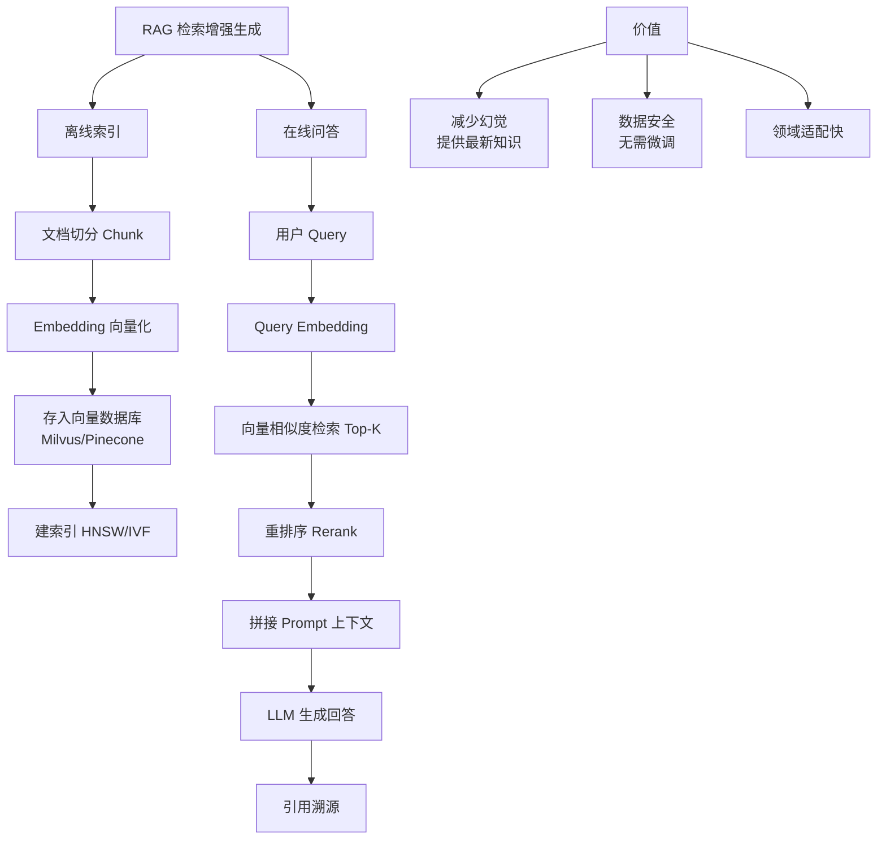
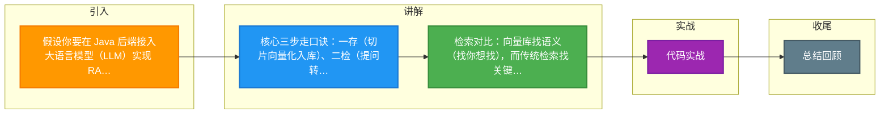

# 假设你要在 Java 后端接入大语言模型（LLM）实现 RAG（检索增强生成）。请简述 RAG 的核心流程，并说明如何使用向量数据库来提升回答的准确性。

RAG的核心流程分为三步：1. 知识切片与向量化：将非结构化的私有数据（如文档）切分为小块，利用 Embedding 模型将其转化为向量并存储在向量数据库中；2. 检索：用户发起提问，将问题转化为向量，在向量数据库中通过余弦相似度或欧氏距离检索出 Top-K 个相关的文档片段；3. 生成：将检索到的相关片段作为上下文，连同用户问题一起构建 Prompt 发送给大模型，让大模型基于这些事实生成回答。向量数据库的作用在于快速进行语义检索，不同于传统的关键词匹配，它能理解“用户想找什么”而非仅匹配“用户写了什么”，从而大幅提升回答的事实准确性和专业度，减少大模型的幻觉。实战中，单纯切片会导致上下文丢失，通常采用“重叠切片”策略并引入“重排序”机制，先用向量库粗筛，再用专门的小模型精排，以解决检索不精准导致的幻觉问题。

## 技术原理

- **知识向量化：切片存入向量库，支持语义检索**：第一步是离线准备——把私有知识（PDF、Wiki、数据库）切分成段落级 chunk（通常 200-500 token），每个 chunk 用 Embedding 模型（如 BGE、OpenAI text-embedding）编码成稠密向量（768-1536 维），连同原文和元数据存入向量数据库（Milvus/Pinecone/pgvector）。切片质量直接决定召回上限，常加元数据（来源、时间、权限）便于过滤。
- **检索增强：提问向量化查 Top-K，拼入 Prompt 作为上下文**：在线查询时，用户提问用同一 Embedding 模型编码成向量，在向量库做 ANN 检索（HNSW/IVF）召回 Top-K（如 5-20）最相似的 chunk。然后把召回的 chunk 拼进 Prompt 模板（`context: {chunks}\nquestion: {query}`），送给 LLM 生成回答。LLM 基于这些"开卷资料"回答，而不是凭参数记忆，幻觉大幅降低。
- **精准优化：用重排和重叠切片解决上下文丢失与幻觉**：①重叠切片——相邻 chunk 保留 10%-20% 重叠，避免关键信息被切断在两个 chunk 之间；②两步检索（粗排+精排）——先向量库粗召回 Top-50（高召回低精度），再用 Cross-Encoder 重排模型（如 BGE-reranker）对每个候选与 query 做精细打分，取 Top-5 注入 Prompt，精度拉满。还可加混合检索（BM25+向量）补语义和实体。

## 对比/选型

| 检索方式 | 匹配逻辑 | 优势 | 劣势 |
|----------|----------|------|------|
| 关键词（BM25） | 字面词频 | 精确实体、快 | 不懂语义 |
| 向量稠密 | 语义相似 | 理解意图 | 弱实体、计算贵 |
| 混合（BM25+向量） | 双路融合 | 两者互补 | 实现复杂 |
| 向量 + Cross-Encoder 重排 | 粗排+精排 | 精度最高 | 多一次模型调用 |

## 代码示例

Java 后端接入 RAG（Spring AI）：

```java
@Service
public class RagService {
    private final EmbeddingModel embedding;
    private final VectorStore vectorStore;          // Milvus/Pinecone/pgvector
    private final ChatClient chat;
    private final RerankModel reranker;

    // 1. 离线：知识切片入库
    public void ingest(Document doc) {
        List<TextChunk> chunks = new TokenTextSplitter(500, 100).split(doc); // 500 token + 100 重叠
        chunks.forEach(c -> {
            float[] vec = embedding.embed(c.getText());
            vectorStore.add(new Embedding(vec, c.getText(), c.getMetadata()));
        });
    }

    // 2. 在线：检索增强生成
    public String ask(String question) {
        float[] qVec = embedding.embed(question);
        List<Embedding> candidates = vectorStore.search(qVec, 50);     // 粗排 Top-50
        List<Embedding> topK = reranker.rerank(question, candidates, 5); // 精排 Top-5

        String context = topK.stream().map(Embedding::getText)
                             .collect(Collectors.joining("\n---\n"));
        Prompt prompt = new Prompt("""
            根据以下资料回答问题，若资料不足请说明。
            资料：{context}
            问题：{question}
            """.replace("{context}", context).replace("{question}", question));
        return chat.call(prompt).getContent();
    }
}
```

## 常见坑/注意事项

- **Embedding 模型和 LLM 要对齐**：查询编码、入库编码必须用同一 Embedding 模型，否则向量空间不一致召回失效；升级 Embedding 模型要全量重建索引。
- **切片大小决定上下文完整性**：切太大 chunk 噪声多、召回不准；切太小上下文断章取义。经验值 200-500 token + 10-20% 重叠，要按文档类型调。
- **Top-K 不是越大越好**：K 太大 Prompt 膨胀超 context window，且噪声稀释关键信息；典型 K=3-10，配重排后可缩小。
- **召回率要离线评估**：用人工标注的 query-doc 对算 Recall@K，盲目上线无法判断 RAG 质量。
- **LLM 仍可能"无视"上下文幻觉**：即便给了正确 chunk，LLM 也可能编造，要在 Prompt 强约束（"仅依据资料回答，无依据说不知道"）+ 引用标注（要求输出引用 chunk 编号）。
- **知识更新要重新入库**：RAG 的知识是向量库里的快照，文档更新要触发重新切片入库，否则查到的是过期内容。


## 核心架构图



## 记忆要点

- 核心三步走口诀：一存（切片向量化入库）、二检（提问转向量找Top-K）、三生成（拼上下文给大模型）。
- 检索对比：向量库找语义（找你想找），而传统检索找关键词（找你写的），从而大幅降幻觉。
- 关键参数：采用「重叠切片」防上下文丢失，防止信息断层。
- 性能优化：两步检索法。先向量库「粗筛」，再引入小模型「重排序」精排，精准度拉满。

## 结构化回答

**30 秒电梯演讲：** 私有知识向量化入库，语义检索增强大模型生成。打个比方，这就像开卷考试：大模型是学霸但没看过你的内部文档。向量数据库是课本索引，RAG是把考题转换成向量，在课本里找到相关段落，最后让学霸结合这些内容写答案。

**展开框架：**
1. **核心三步走口诀** — 一存（切片向量化入库）、二检（提问转向量找Top-K）、三生成（拼上下文给大模型）。
2. **检索对比** — 向量库找语义（找你想找），而传统检索找关键词（找你写的），从而大幅降幻觉。
3. **关键参数** — 采用「重叠切片」防上下文丢失，防止信息断层。

**收尾：** 这三点都能配合实战聊。您想深入聊原理、对比还是避坑？

## 视频脚本

> 预计时长：2 分钟 | 由浅入深

| 时间 | 画面/字幕 | 口播台词 | 讲解要点 |
|------|----------|----------|----------|
| 0:00 | 标题卡：假设你要在 Java 后端接入大语言… | "假设你要在 Java 后端接入大语言模型（LLM）实现 RAG（检索增强生成）。请简述 RAG 的核心流程，并说明如何使用向量数据库来提升回答的准确性。？一句话——这就像开卷考试：大模型是学霸但没看过你的内部文档。向量数据库是课本索引，RAG是把考题转换成向量，在课本里找到相关段落，最后让学霸结合这些内容写答案。" | 开场钩子 |
| 0:40 | 概念动画/示意图 | "私有知识向量化入库，语义检索增强大模型生成——这就像开卷考试：大模型是学霸但没看过你的内部文档。向量数据库是课本索引，RAG是把考题转换成向量，在课本里找到相关段落，最后让学霸结合这些内容写答案" | 核心定义 |
| 1:20 | 核心三步走口诀示意 | "一存（切片向量化入库）、二检（提问转向量找Top-K）、三生成（拼上下文给大模型）。" | 要点1 |
| 2:00 | 总结卡 | "记住这几条，面试不慌。下期讲进阶追问。" | 收尾 |

### 视频流程图



