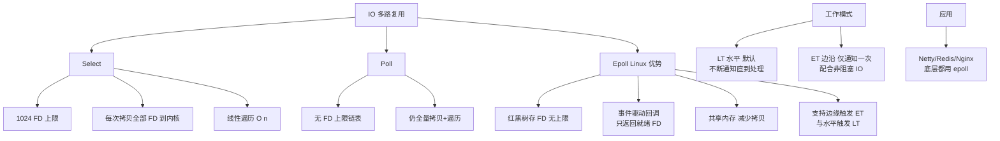

# 深度解析 Linux 的 Epoll 相比传统 Select/BIO 的优势。

Epoll 是 Linux 特有的 I/O 事件通知机制，解决了 Select/BIO 的性能瓶颈。Select 使用轮询方式，每次调用都需要将 fd_set 从用户态拷贝到内核态，且受限于 FD_SETSIZE（通常 1024），时间复杂度为 O(N)。而 Epoll 基于“事件驱动”，只在初始化时通过 `epoll_ctl` 将感兴趣的 FD 添加到内核的红黑树中，并注册回调函数。当 FD 就绪时，内核通过回调机制将该 FD 加入到就绪链表（Ready List），应用调用 `epoll_wait` 时直接返回就绪链表，无需遍历所有 FD。Epoll 支持 ET（边缘触发）和 LT（水平触发）两种模式，ET 模式下只有状态变化才通知，减少了系统调用次数，使其在处理高并发连接时性能几乎不随连接数增加而下降。

**实战案例**：在早期的高并发即时通讯系统（如百万连接的推送服务）中，使用 Select 往往会导致 CPU 软中断过高且频繁上下文切换；改用 Epoll 的 ET 模式后，能轻松支撑 C10K 甚至 C100K 的连接规模，但需注意 ET 模式下必须一次性读写完数据，否则容易丢失事件通知。

**代码示例（C语言）**：
```c
int epfd = epoll_create1(0);
struct epoll_event ev, events[MAX_EVENTS];
ev.events = EPOLLIN | EPOLLET; // 设置为边缘触发模式
ev.data.fd = listen_sock;
epoll_ctl(epfd, EPOLL_CTL_ADD, listen_sock, &ev);
int nfds = epoll_wait(epfd, events, MAX_EVENTS, -1);
for (int i = 0; i < nfds; ++i) {
    if (events[i].data.fd == listen_sock) {
        // 处理新连接
    }
}
```

**对比表格**：

| 特性 | Select | Epoll |
| :--- | :--- | :--- |
| 底层实现 | 轮询 | 事件驱动回调 (红黑树 + 就绪链表) |
| 最大连接数 | 有限制 (默认 1024) | 无限制 (受限于系统内存) |
| 时间复杂度 | O(N) | O(1) (仅处理活跃连接) |
| 消息传递方式 | 每次调用全量拷贝 | 仅在初始化和状态变更时拷贝 |
| 触发模式 | 仅支持水平触发 (LT) | 支持水平触发 (LT) 和 边缘触发 (ET) |

## 技术原理

Select 和 Epoll 都是 I/O 多路复用机制，但实现思路截然不同，决定了它们的性能上限差几个数量级：

- **Select 的 O(N) 轮询和 1024 上限的根因**：`select(fd_set* readfds, ...)` 把所有感兴趣的 FD 放在一个 bitmap（`fd_set`，默认 1024 bit）里，每次调用要从用户态**全量拷贝**到内核态。内核遍历每个 FD 调用其驱动注册的 `poll` 方法检查是否就绪——O(N) 复杂度。返回后用户态还得**再遍历一遍** 1024 个 bit 找出哪些被置位。1 万连接时每次 select 都要遍历 1 万次，CPU 全浪费在空轮询上。
- **Epoll 的红黑树 + 就绪链表**：①`epoll_create` 在内核创建一个 eventpoll 对象，包含一棵红黑树（存储所有注册的 FD）和一个双向链表（就绪链表）。②`epoll_ctl(ADD/MOD/DEL)` 把 FD 插入红黑树（查找/插入 O(log N)），并为该 FD 在底层设备驱动注册一个**回调函数**。③当网卡收到数据触发硬中断、内核把数据搬到 socket 接收队列后，会调用这个回调，把 FD 对应的 `epitem` 节点塞进就绪链表。④`epoll_wait` 只需要把就绪链表里的 FD 拷贝到用户态——**O(就绪 FD 数)**，而不是 O(总 FD 数)。
- **ET vs LT 的本质区别**：
  - **LT（水平触发）**：只要 socket 接收缓冲区还有数据（状态处于"就绪"），每次 `epoll_wait` 都会返回这个 FD。即使上次没读完，下次还会通知，应用可以分多次读。
  - **ET（边缘触发）**：只在状态**发生变化**（如从"无数据"到"有数据"）时通知一次。如果应用这次没读完，下次 `epoll_wait` 不会再通知——必须用 `while` 循环读到 `EAGAIN`/`EWOULDBLOCK` 为止，否则数据丢失。
  - ET 的优势是减少系统调用次数（避免反复唤醒），适合 Nginx、Redis 这种追求极致性能的场景；缺点是编程复杂，必须配合非阻塞 socket。
- **fd_set 全量拷贝 vs 内核持久化**：Select 每次调用都要传全量 FD 集合，因为内核不保存状态。Epoll 状态保存在内核的红黑树里，`epoll_ctl` 只在 FD 加入/修改时触发一次拷贝，后续 `epoll_wait` 不再传 FD 集合，只传就绪结果。

## 代码示例

```c
#include <sys/epoll.h>
#include <unistd.h>
#include <fcntl.h>

// 完整的 Epoll ET 模式回显服务器
int main() {
    int epfd = epoll_create1(0);
    int listen_sock = socket(AF_INET, SOCK_STREAM | SOCK_NONBLOCK, 0);  // 非阻塞
    bind_and_listen(listen_sock, 8080);

    // 注册监听 socket，用 ET 边缘触发
    struct epoll_event ev = {0};
    ev.events = EPOLLIN | EPOLLET;        // ET 模式必须加 EPOLLET
    ev.data.fd = listen_sock;
    epoll_ctl(epfd, EPOLL_CTL_ADD, listen_sock, &ev);

    struct epoll_event events[1024];
    while (1) {
        int n = epoll_wait(epfd, events, 1024, -1);   // 阻塞等就绪事件
        for (int i = 0; i < n; i++) {
            if (events[i].data.fd == listen_sock) {
                // ET 模式下必须循环 accept 直到 EAGAIN，否则可能漏接连接
                while (1) {
                    int conn_sock = accept4(listen_sock, NULL, NULL, SOCK_NONBLOCK);
                    if (conn_sock == -1) break;
                    ev.events = EPOLLIN | EPOLLET;
                    ev.data.fd = conn_sock;
                    epoll_ctl(epfd, EPOLL_CTL_ADD, conn_sock, &ev);
                }
            } else {
                int fd = events[i].data.fd;
                // ET 模式下必须循环读到 EAGAIN，否则数据丢失
                char buf[512];
                while (read(fd, buf, sizeof(buf)) > 0) {
                    // 处理数据
                }
                if (errno == EAGAIN || errno == EWOULDBLOCK) {
                    // 读完，正常退出循环
                }
            }
        }
    }
}
```

```java
// Java NIO 的 Selector 底层就是 epoll（Linux 平台）
Selector selector = Selector.open();
ServerSocketChannel server = ServerSocketChannel.open();
server.bind(new InetSocketAddress(8080));
server.configureBlocking(false);
server.register(selector, SelectionKey.OP_ACCEPT);

while (true) {
    selector.select();   // 阻塞，底层就是 epoll_wait
    Iterator<SelectionKey> keys = selector.selectedKeys().iterator();
    while (keys.hasNext()) {
        SelectionKey key = keys.next();
        keys.remove();   // 必须手动移除，否则下次还会出现
        if (key.isAcceptable()) {
            SocketChannel client = server.accept();
            client.configureBlocking(false);
            client.register(selector, SelectionKey.OP_READ);
        } else if (key.isReadable()) {
            // 处理读事件
        }
    }
}
```

## 注意事项

- **ET 模式必须用非阻塞 socket + 循环读完**：这是 ET 模式的硬约束。如果用阻塞 socket，循环读到最后会阻塞在 `read` 上，整个线程卡死；如果不循环读，剩余数据会"丢失"（下次 epoll_wait 不再通知）。Nginx、Netty 都严格遵守这个模式。
- **`epoll_wait` 的 `max_events` 要合理设置**：传 1024 表示一次最多返回 1024 个就绪事件。设太小（如 8）会导致高并发下多次调用 `epoll_wait`；设太大占用栈空间（`struct epoll_event` 数组在栈上）。一般 512-1024 合适。
- **惊群效应（Thundering Herd）**：多线程同时 `epoll_wait` 同一个 epfd，当监听 socket 有新连接时，所有线程被唤醒，但只有一个能 `accept` 成功，其他空转。Linux 4.5+ 引入 `EPOLLEXCLUSIVE` 标志解决这个问题，Nginx 用它。
- **`epoll_create` vs `epoll_create1`**：前者参数 size 已废弃（内核动态扩容），后者用 flags（`EPOLL_CLOEXEC` 防 fd 泄漏到子进程），永远用 `epoll_create1(0)`。
- **跨平台问题**：Epoll 是 Linux 独有。macOS 用 kqueue，Windows 用 IOCP，FreeBSD 也是 kqueue。Java NIO 的 Selector 在不同平台用不同底层实现，但 API 一致。Netty 封装了 epoll/kqueue 的原生 binding（`EpollEventLoopGroup` / `KQueueEventLoopGroup`），比 JDK 的 Selector 性能更好。


## 核心架构图



## 记忆要点

- 核心对比：Select全量拷贝+O(N)轮询，而Epoll事件驱动+O(1)返回就绪。
- 底层数据结构：因为FD存入红黑树，就绪FD放入双向链表，所以无1024限制。
- 消息传递：Select每次拷贝全量fd_set，而Epoll仅在状态变更时拷贝。
- 触发模式：ET状态变化才通知（需一次读完），LT只要有数据就常通知。

## 结构化回答

**30 秒电梯演讲：** 基于红黑树回调的事件驱动机制，实现O(1)高并发IO。打个比方，Select像老师每节课都点名问谁举手，全班扫一遍效率低；Epoll像谁举手老师就记下来，直接点名举手的人，人数再多也不怕。

**展开框架：**
1. **核心对比** — Select全量拷贝+O(N)轮询，而Epoll事件驱动+O(1)返回就绪。
2. **底层数据结构** — 因为FD存入红黑树，就绪FD放入双向链表，所以无1024限制。
3. **消息传递** — Select每次拷贝全量fd_set，而Epoll仅在状态变更时拷贝。

**收尾：** 我在项目里踩过坑——在早期的高并发即时通讯系统（如百万连接的推送服务）中，使用 Select 往往会导致 CPU 软中断过高且频繁上下文切换；改用 Epoll 的 ET 模式后，能轻松支撑 C10K 甚至 C100K 的连接规模，但需注意 ET 模式下必须一次性读写完数据，否则容易丢失事件通知。您想深入聊哪一段：原理、避坑还是对比选型？

## 视频脚本

> 预计时长：3 分钟 | 由浅入深

| 时间 | 画面/字幕 | 口播台词 | 讲解要点 |
|------|----------|----------|----------|
| 0:00 | 标题卡：深度解析 Linux 的 Epoll… | "深度解析 Linux 的 Epoll 相比传统 Select/BIO 的优势。？一句话——Select像老师每节课都点名问谁举手，全班扫一遍效率低；Epoll像谁举手老师就记下来，直接点名举手的人，人数再多也不怕。" | 开场钩子 |
| 0:45 | 概念动画/示意图 | "基于红黑树回调的事件驱动机制，实现O(1)高并发IO——Select像老师每节课都点名问谁举手，全班扫一遍效率低；Epoll像谁举手老师就记下来，直接点名举手的人，人数再多也不怕" | 核心定义 |
| 1:30 | 核心对比示意 | "Select全量拷贝+O(N)轮询，而Epoll事件驱动+O(1)返回就绪。" | 要点1 |
| 2:15 | 底层数据结构示意 | "因为FD存入红黑树，就绪FD放入双向链表，所以无1024限制。" | 要点2 |
| 3:00 | 总结卡 | "记住这几条，面试不慌。下期讲进阶追问。" | 收尾 |
