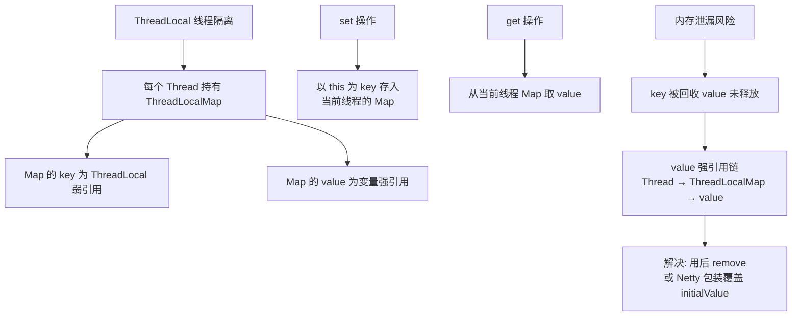
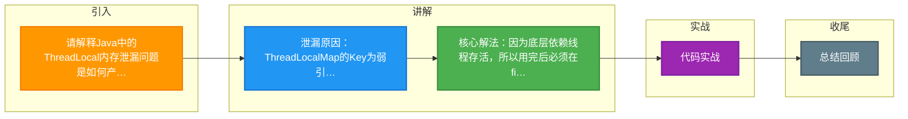

# 请解释Java中的ThreadLocal内存泄漏问题是如何产生的？在Netty等框架中是如何解决这个问题的？

ThreadLocal内部维护了一个静态的ThreadLocalMap，其中Key是ThreadLocal实例的弱引用，Value是强引用。当外部ThreadLocal引用置为null后，Key在下一次GC时会被回收，变成null。但此时Entry中的Value还被Entry对象强引用，而Entry对象被当前Thread的ThreadLocalMap强引用。只要线程不结束（如线程池中的核心线程），这个Value对象就无法被回收，导致内存泄漏。

**Netty的解决方案**：Netty提供了`FastThreadLocal`类。它弃用了JDK原生的ThreadLocalMap，自己实现了一个`InternalThreadLocalMap`，并使用数组来存储数据，查找效率更高（常数时间O(1) vs JDK的哈希冲突）。更重要的是，Netty利用了对象回收机制。当`FastThreadLocal`被移除或线程被回收时，会自动触发`removeAll`操作，清理该线程相关的所有`FastThreadLocal`变量，从而彻底避免了Value对象的内存泄漏问题。此外，Netty还提供了`ObjectCleaner`来辅助检测和清理泄漏的ByteBuf。

**实战案例**：在 Tomcat 等容器中，线程是长期存活的，如果使用了 ThreadLocal 缓存大对象且未在请求结束时调用 `remove()`，随着业务运行，堆积的对象会导致频繁 Full GC 甚至 OOM 崩溃。这是线上最常见的内存泄漏原因之一。

**代码示例（标准清理规范）**：
```java
try {
    threadLocal.set(new LargeObject());
    // 业务逻辑处理
} finally {
    // 防止内存泄漏的关键：必须在使用完毕后手动移除
    threadLocal.remove();
}
```

**对比表格**：

| 特性 | JDK ThreadLocal | Netty FastThreadLocal |
| :--- | :--- | :--- |
| 底层结构 | 哈希表 (ThreadLocalMap) | 数组 (InternalThreadLocalMap) |
| 查找性能 | O(N) 最坏情况 (哈希冲突) | O(1) 直接索引 (常量时间) |
| 内存泄漏处理 | 依赖开发者手动 remove 或被动 GC | 主动 removeAll (配合 FastThreadLocalThread) |
| 适用场景 | 通用 Java 开发 | 高性能网络编程 (如 Netty RPC 框架) |

## 技术原理

ThreadLocal 内存泄漏的根源是 **Key 用了弱引用、Value 却是强引用**——两者生命周期不一致，加上线程池的长生命周期特性，Value 永久残留：

- **ThreadLocalMap 的非典型哈希表设计**：普通的 HashMap 是 `Entry[]` + 链表/红黑树。而 ThreadLocalMap 的 `Entry` 继承自 `WeakReference<ThreadLocal<?>>`，Key 是对 ThreadLocal 实例的**弱引用**，Value 是**强引用**。这样设计是为了让 ThreadLocal 实例本身可以被 GC（避免 ThreadLocal 对象随线程永久存活），但却埋下了 Value 残留的坑。
- **泄漏链路（GC Roots 分析）**：当前线程 `Thread` → `threadLocals` 字段（ThreadLocalMap）→ `Entry[]` → `Entry` → `value` 字段（强引用）→ 实际 Value 对象。只要线程不结束，这条链就是 GC Root 可达的。即使业务代码里把外部对 ThreadLocal 实例的强引用置为 null，Entry 的 Key 被回收变成 null，但 Value 还在——这就是"Key=null 但 Value 还残留"的泄漏现象。
- **JDK 的被动清理为何不够**：ThreadLocalMap 在 `get/set/remove` 操作时会扫描到 Key 为 null 的 Entry，并顺手把 Value 也置为 null（expungeStaleEntry）。但这是**被动触发**——如果线程池里的线程一直空闲、没有新的 ThreadLocal 操作，这个清理永远不会执行。线程池核心线程永不销毁，泄漏就一直存在。
- **Netty FastThreadLocal 的两步彻底解决**：①改用**数组**而非哈希表存储——每个 `FastThreadLocal` 在创建时分配一个全局递增的 `index`，线程内部用 `Object[] indexedVariables`，直接 `array[index]` 访问，O(1) 查找且无哈希冲突。②配合 `FastThreadLocalThread` + `ObjectCleaner`——线程销毁或 FastThreadLocal 被卸载时，自动调用 `removeAll()` 清空整个数组，不依赖业务代码记得 `remove()`。

## 代码示例

```java
// 1. JDK ThreadLocal 标准用法 —— 必须在 finally 里 remove
public class UserContext {
    private static final ThreadLocal<User> CURRENT = new ThreadLocal<>();

    public static void set(User user) {
        CURRENT.set(user);
    }

    public static User get() {
        return CURRENT.get();
    }

    public static void clear() {
        CURRENT.remove();   // 关键：线程池场景必须清理
    }
}

// 业务代码的规范写法（Spring 的 RequestContextHolder 就是这么做的）
public class AuthInterceptor implements HandlerInterceptor {
    @Override
    public boolean preHandle(HttpServletRequest req, HttpServletResponse resp, Object h) {
        UserContext.set(parseUser(req));
        return true;
    }

    @Override
    public void afterCompletion(HttpServletRequest req, HttpServletResponse resp,
                                 Object h, Exception ex) {
        // 即使抛异常也要清理，否则下一个请求复用线程会读到上个请求的用户
        UserContext.clear();
    }
}
```

```java
// 2. Netty FastThreadLocal —— 自动清理，无内存泄漏风险
import io.netty.util.concurrent.FastThreadLocal;

public class NettyHandler {
    // 自动分配全局 index，O(1) 访问
    private static final FastThreadLocal<ByteBuf> BUF_CACHE = new FastThreadLocal<>();

    public void handle() {
        ByteBuf buf = BUF_CACHE.get();
        if (buf == null) {
            buf = Unpooled.buffer(1024);
            BUF_CACHE.set(buf);
        }
        // 业务处理...
        // 不需要手动 remove：FastThreadLocalThread 销毁时自动 removeAll
        // 但如果用普通线程，仍需 ObjectCleaner 兜底
    }

    // 主动清理（可选）
    public void cleanup() {
        BUF_CACHE.remove();
    }
}

// 3. 查找性能对比
// JDK ThreadLocalMap：开放寻址法 + ThreadLocal 的 hashCode（魔数 0x61c88647 黄金分割）
//   冲突时线性探测，最坏 O(N)
// Netty InternalThreadLocalMap：indexedVariables[index]，直接数组下标，恒定 O(1)
```

```java
// 4. 检测泄漏的工具：用 jmap 找出 Key=null 的 Entry
// 命令：jmap -histo:live <pid> | grep ThreadLocal
// 或用 Arthas：watch java.lang.ThreadLocal getEntry 'params' -x 2
```

## 注意事项

- **线程池场景必须 `finally` 里 `remove()`**：这是最常见、最致命的坑。Tomcat、Dubbo、定时任务都用线程池，线程复用意味着上一个任务的 ThreadLocal 残留会被下一个任务读到，导致用户串号、权限越权（典型如 Spring Security 的 SecurityContextHolder 未清理导致用户身份泄漏）。必须保证 `remove()` 在 `finally` 块里执行。
- **不要用 `ThreadLocal` 缓存大对象**：缓存几 KB 的小数据问题不大，但如果缓存 MB 级对象（如 PDF 字节流、大 List），泄漏几小时就会撑爆堆。大对象应该用专门缓存（Caffeine/Redis），ThreadLocal 只适合存用户上下文、TraceId 这种小数据。
- **`InheritableThreadLocal` 也有同样的泄漏问题**：子线程继承父线程的值，但同样在父子线程池场景下不会自动传递（需要 `TransmittableThreadLocal` 阿里开源库）。所有 ThreadLocal 变体都需要手动清理。
- **Netty FastThreadLocal 必须配合 `FastThreadLocalThread` 才高效**：如果用普通 `Thread`，FastThreadLocal 会回退到慢路径（每次访问要查 ThreadLocal 类型）。Netty 自家的 EventLoop 内部线程都是 `FastThreadLocalThread`，所以受益最大。其他框架直接用可能没有性能优势。
- **G1/ZGC 不会自动救你**：弱引用 Key 会被 GC 回收，但 Value 的强引用链仍然存在。GC 不能解决强引用残留问题，必须靠显式 `remove()`。可以打开 `-XX:+PrintReferenceGC` 观察弱引用回收情况辅助排查。


## 核心架构图



## 记忆要点

- 泄漏原因：ThreadLocalMap的Key为弱引用，而Value为强引用，线程不销毁导致Value无法回收
- 核心解法：因为底层依赖线程存活，所以用完后必须在finally中手动执行remove()
- Netty优化：FastThreadLocal改用数组存储实现O(1)查找，并主动触发removeAll彻底清理

## 结构化回答

**30 秒电梯演讲：** 弱引用Key失效但强引用Value残留，Netty改用数组并自动清理。打个比方，这就好比把房间钥匙（Key）扔了，但房间里的家具（Value）还在。由于门锁坏了（线程不结束），保洁员（GC）进不去，家具永远占着房间。Netty的做法是不用门锁改用储物柜，还配备了专门的保洁员，人走柜净。

**展开框架：**
1. **泄漏原因** — ThreadLocalMap的Key为弱引用，而Value为强引用，线程不销毁导致Value无法回收
2. **核心解法** — 因为底层依赖线程存活，所以用完后必须在finally中手动执行remove()
3. **Netty优化** — FastThreadLocal改用数组存储实现O(1)查找，并主动触发removeAll彻底清理

**收尾：** 我在项目里踩过坑——在 Tomcat 等容器中，线程是长期存活的，如果使用了 ThreadLocal 缓存大对象且未在请求结束时调用 `remove()`，随着业务运行，堆积的对象会导致频繁 Full GC 甚至 OOM 崩溃。您想深入聊哪一段：原理、避坑还是对比选型？

## 视频脚本

> 预计时长：2 分钟 | 由浅入深

| 时间 | 画面/字幕 | 口播台词 | 讲解要点 |
|------|----------|----------|----------|
| 0:00 | 标题卡：请解释Java中的ThreadLoc… | "请解释Java中的ThreadLocal内存泄漏问题是如何产生的？在Netty等框架中是如何解决这个问题的？一句话——这就好比把房间钥匙（Key）扔了，但房间里的家具（Value）还在。由于门锁坏了（线程不结束），保洁员（GC）进不去，家具永远占着房间。Netty的做法是不用门锁改用储物柜，还配备了专门的保洁员，人走柜净。" | 开场钩子 |
| 0:40 | 概念动画/示意图 | "弱引用Key失效但强引用Value残留，Netty改用数组并自动清理——这就好比把房间钥匙（Key）扔了，但房间里的家具（Value）还在。由于门锁坏了（线程不结束），保洁员（GC）进不去，家具永远占着房间。Netty的做法是不用门锁改用储物柜，还配备了专门的保洁员，人走柜净" | 核心定义 |
| 1:20 | 泄漏原因示意 | "ThreadLocalMap的Key为弱引用，而Value为强引用，线程不销毁导致Value无法回收" | 要点1 |
| 2:00 | 总结卡 | "记住这几条，面试不慌。下期讲进阶追问。" | 收尾 |

### 视频流程图



