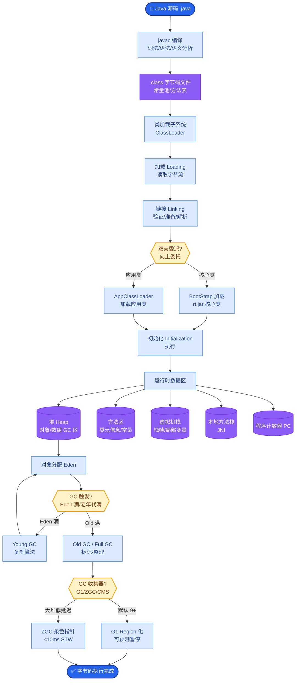
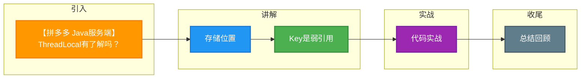

# 【拼多多 Java服务端】ThreadLocal有了解吗？

> 来源：拼多多复活赛一面面经（小红书）

## 一、费曼类比

```
共享变量 + synchronized:              ThreadLocal:
                                     
  ┌─────────────────────┐           线程A          线程B         线程C
  │   共享变量 counter   │           ┌──────┐      ┌──────┐      ┌──────┐
  │                     │           │TLMap │      │TLMap │      │TLMap │
  │  线程A ─┐           │           │      │      │      │      │      │
  │  线程B ─┼─ 获取锁 ──│           │conn=A│      │conn=B│      │conn=C│
  │  线程C ─┘ 排队      │           │user=X│      │user=Y│      │user=Z│
  │                     │           └──────┘      └──────┘      └──────┘
  └─────────────────────┘           各自独立，无需加锁
  每次只有一个线程能访问              
```

## 二、第一性原理分析

**并发变量访问的两条路：**

```
路径1: 共享 + 同步 (synchronized/Lock)
  → 多线程访问同一变量，通过锁保证安全
  → 问题：锁竞争开销、死锁风险

路径2: 隔离 + 无锁 (ThreadLocal)
  → 每个线程持有自己的副本，互不可见
  → 优势：无竞争、无等待
  → 代价：内存占用增加（每线程一份）
```

## 三、详细答案

### 3.1 ThreadLocal内部结构

```
┌──────────────────────────────────────────────────────┐
│                    Thread 对象                        │
│                                                      │
│  ThreadLocal.ThreadLocalMap threadLocals             │
│  ThreadLocal.ThreadLocalMap inheritableThreadLocals  │
│                                                      │
│  ┌────────────────────────────────────────────────┐  │
│  │            ThreadLocalMap                       │  │
│  │                                                 │  │
│  │  Entry[] table:                                 │  │
│  │  ┌──────────────┬──────────────────┐           │  │
│  │  │     Key      │      Value       │           │  │
│  │  │ (弱引用)      │ (强引用)          │           │  │
│  │  ├──────────────┼──────────────────┤           │  │
│  │  │ ThreadLocal1 │  "连接对象conn"   │           │  │
│  │  ├──────────────┼──────────────────┤           │  │
│  │  │ ThreadLocal2 │  "用户信息user"   │           │  │
│  │  ├──────────────┼──────────────────┤           │  │
│  │  │ ThreadLocal3 │  "SimpleDateFmt"  │           │  │
│  │  └──────────────┴──────────────────┘           │  │
│  │                                                 │  │
│  │  ⚠️ Key = WeakReference<ThreadLocal>            │  │
│  │  ⚠️ Value = 强引用（直接指向对象）                │  │
│  └────────────────────────────────────────────────┘  │
└──────────────────────────────────────────────────────┘
```

### 3.2 核心源码流程

```java
// ThreadLocal.set()
public void set(T value) {
    Thread t = Thread.currentThread();      // 获取当前线程
    ThreadLocalMap map = getMap(t);          // 获取线程的ThreadLocalMap
    if (map != null) {
        map.set(this, value);               // this=ThreadLocal实例作为Key
    } else {
        createMap(t, value);                // 首次访问时创建Map
    }
}

// ThreadLocal.get()
public T get() {
    Thread t = Thread.currentThread();
    ThreadLocalMap map = getMap(t);
    if (map != null) {
        Entry e = map.getEntry(this);       // 用this(ThreadLocal)作为Key查找
        if (e != null) return (T) e.value;
    }
    return setInitialValue();
}
```

### 3.3 内存泄漏分析

```
引用链:
  Thread (强) → ThreadLocalMap (强) → Entry
                                       ├→ Key: WeakRef → ThreadLocal对象
                                       └→ Value: 强引用 → 实际数据对象

场景: ThreadLocal对象外部无强引用 → GC回收Key → Entry的Key=null
      但Value仍被Entry强引用 → Value无法回收 → 内存泄漏!

  ┌────────────────────────────────────────────────┐
  │ Thread (线程池中永不销毁)                        │
  │   → ThreadLocalMap                              │
  │     → Entry[Key=null, Value=大对象] ← 泄漏!     │
  └────────────────────────────────────────────────┘

解决: 用完必须调用 threadLocal.remove()！
```

### 3.4 经典应用场景

```java
// 场景1: 数据库连接管理（每个线程一个连接）
private static ThreadLocal<Connection> connHolder = new ThreadLocal<>();

public Connection getConnection() {
    Connection conn = connHolder.get();
    if (conn == null) {
        conn = DriverManager.getConnection(url);
        connHolder.set(conn);
    }
    return conn;
}

// 场景2: 用户上下文传递（避免方法参数层层传递）
public class UserContext {
    private static ThreadLocal<User> userHolder = new ThreadLocal<>();
    
    public static void set(User user) { userHolder.set(user); }
    public static User get() { return userHolder.get(); }
    public static void clear() { userHolder.remove(); }  // 必须清理!
}

// 场景3: 线程安全的日期格式化（SimpleDateFormat非线程安全）
private static ThreadLocal<SimpleDateFormat> dateFormat = 
    ThreadLocal.withInitial(() -> new SimpleDateFormat("yyyy-MM-dd"));
```

## 四、ThreadLocal vs Synchronized

| 维度 | Synchronized | ThreadLocal |
|------|-------------|-------------|
| 思路 | 共享变量+加锁同步 | 每线程独立副本 |
| 并发性能 | 锁竞争开销 | 无竞争（空间换时间） |
| 内存占用 | 一份共享变量 | N份（每线程一份） |
| 数据一致性 | 强一致 | 各线程数据隔离 |
| 适用场景 | 需要共享状态的同步 | 需要线程隔离的上下文 |

## 五、扩展知识

- **InheritableThreadLocal**: 子线程可以继承父线程的ThreadLocal值（构造方法中复制）
- **TransmittableThreadLocal (TTL)**: 阿里开源，解决线程池中ThreadLocal值传递问题
- **ThreadLocalMap使用开放寻址法**（非链表法）解决哈希冲突

## 六、苏格拉底式面试提问

1. **"如果线程池中的线程被复用了，上一个任务设置的ThreadLocal会怎样？"** — 引出必须手动remove()，否则数据残留和内存泄漏
2. **"为什么Key用弱引用而Value不用？"** — 引出设计权衡：Key回收避免Entry永久持有ThreadLocal引用；Value强引用保证数据可用
3. **"子线程能拿到父线程的ThreadLocal值吗？"** — 引出InheritableThreadLocal，但线程池场景需要TTL
4. **"ThreadLocalMap的哈希冲突怎么解决的？"** — 开放寻址法（线性探测），不是HashMap的链表法
5. **"你说ThreadLocal无锁，那它内部ThreadLocalMap的set操作不需要加锁吗？"** — 不需要，因为每个线程访问自己的Map，不存在竞争

## 七、面试加分点

1. **画出引用链图** — Thread→Map→Entry(WeakRef Key, StrongRef Value)，展示底层理解
2. **强调remove()的重要性** — 特别在线程池场景，这是生产事故常见原因
3. **知道内存泄漏原因** — Key被GC但Value无法回收
4. **对比Synchronized** — 展示对两种并发控制思路的理解
5. **提到TTL** — 线程池场景的ThreadLocal传递，展示实际项目经验


## 核心流程图



## 结构化回答

**30 秒电梯演讲：** ThreadLocal为每个线程提供独立的变量副本，实现线程隔离。数据存在每个线程自己的ThreadLocalMap中，不存在共享竞争。

**展开框架：**
1. **存储位置** — Thread.threadLocals（ThreadLocalMap），不是存在ThreadLocal对象中
2. **Key是弱引用** — Key是弱引用(WeakReference<ThreadLocal>)，Value是强引用
3. **内存泄漏** — 线程池中线程复用，ThreadLocal不remove会导致Value泄漏

**收尾：** 这块我踩过坑——要不要深入聊：ThreadLocal和Synchronized有什么区别？

## 视频脚本

> 预计时长：3 分钟 | 由浅入深

| 时间 | 画面/字幕 | 口播台词 | 讲解要点 |
|------|----------|----------|----------|
| 0:00 | 标题卡 | "并发/ThreadLocal一句话：ThreadLocal为每个线程提供独立的变量副本，实现线程隔离。数据存在每个线程自己的ThreadLocalMap中…。" | 开场钩子 |
| 0:15 | JVM 内存结构图 | "存储位置：Thread.threadLocals（ThreadLocalMap），不是存在ThreadLocal对象中" | 存储位置 |
| 1:06 | JVM 内存结构图分步演示 | "Key是弱引用(WeakReference<ThreadLocal>)，Value是强引用" | Key是弱引用 |
| 1:57 | 关键代码/伪代码片段 | "内存泄漏：线程池中线程复用，ThreadLocal不remove会导致Value泄漏" | 内存泄漏 |
| 2:50 | 总结卡 | "核心抓住这条主线，下期咱们接着聊：ThreadLocal和Synchronized有什么区别。" | 收尾 |

### 视频流程图




