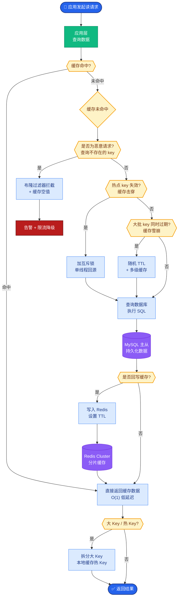

# 【拼多多一面】volatile 关键字的作用和底层实现

## 🎯 一句话本质

volatile是Java提供的**最轻量级的同步机制**，保证变量的**可见性**（Visibility）和**有序性**（Ordering），但**不保证原子性**（Atomicity）。底层通过CPU**内存屏障**（Memory Barrier）实现。

## 🧒 费曼类比

```
没有volatile的世界：
  CPU核心1: 我把flag改成true了（写在自己的缓存里）
  CPU核心2: flag还是false啊？（读的是自己缓存的旧值）
  结果：核心2永远等不到flag变true 💀

有volatile的世界：
  CPU核心1: flag=true! → 白板通知所有核心 → 缓存失效
  CPU核心2: flag被改了？重新读主内存 → true!
  结果：核心2立刻看到变更 ✅
```

## 📊 可见性原理（JMM层面）

```
       Thread-1                    Main Memory                  Thread-2
    ┌──────────┐                ┌──────────────┐             ┌──────────┐
    │ 工作内存  │                │              │             │ 工作内存  │
    │ flag=true│─── Store ────→ │  flag = true │ ←─ Load ────│ flag=false│
    │ (本地缓存)│   Barrier      │  (主内存)     │   Barrier   │(缓存失效) │
    └──────────┘                └──────────────┘             └──────────┘
         │                                                        │
    volatile写操作:                                          volatile读操作:
    1. 写工作内存                                        1. 缓存行被标记为无效
    2. StoreStore屏障（前面普通写不能重排到后面）            2. LoadLoad屏障（后面的读不能重排到前面）
    3. 写主内存                                          3. 从主内存重新加载
    4. StoreLoad屏障（防止后面的读重排到前面）               4. 读主内存值
```

## 🔧 三大特性详解

### 1. 可见性

当一个线程修改了volatile变量，JMM会立刻将线程工作内存中的值刷新到主内存；其他线程读取时，JMM会将它们工作内存中的缓存置为无效，强制从主内存重新加载。

```java
// 没有volatile → 程序可能永远不停止
class NoVolatileDemo {
    private boolean running = true; // 加 volatile 才能正常退出

    void stop() { running = false; }

    void run() {
        while (running) {
            // JIT优化后可能永远读取寄存器中的缓存值
        }
        System.out.println("stopped");
    }
}
```

### 2. 有序性（禁止指令重排序）

编译器和CPU为了提高性能会对指令进行重排序。volatile通过插入**内存屏障**来禁止特定方向的重排序：

```
volatile写之前的普通读写  ←StoreStore屏障→  不能重排到volatile写之后
volatile写                                ←StoreLoad屏障→  后面的读写不能重排到写之前
volatile读                                ←LoadLoad屏障→  后面的读不能重排到读之前
volatile读                                ←LoadStore屏障→ 后面的写不能重排到读之前
```

### 3. 不保证原子性

```java
volatile int count = 0;

// 10个线程各执行1000次 count++
// 结果大概率不等于 10000
// 因为 count++ = 读 + 加1 + 写，三步之间可以被其他线程打断
```

**修复方案**：
```java
AtomicInteger count = new AtomicInteger(0);
count.incrementAndGet(); // CAS保证原子性

// 或者
synchronized void increment() { count++; }
```

## 💻 经典应用：DCL单例模式

```java
public class Singleton {
    // 必须加volatile！
    private static volatile Singleton instance;

    public static Singleton getInstance() {
        if (instance == null) {                   // 第一次检查（无锁）
            synchronized (Singleton.class) {
                if (instance == null) {            // 第二次检查
                    instance = new Singleton();    // 非原子操作！
                }
            }
        }
        return instance;
    }
}
```

**为什么必须加volatile？**

`instance = new Singleton()` 在字节码层面分三步：

```
1. 分配内存空间                  memory = allocate()
2. 初始化对象                    ctorInstance(memory)  
3. 将引用指向内存地址             instance = memory

如果步骤2和3被重排序 → 另一个线程在第一次检查时拿到未初始化的对象 → NPE！
volatile禁止2和3重排序，确保要么都没做，要么都做完了。
```

## 🔧 底层实现：内存屏障

JMM定义了4种内存屏障：

| 屏障类型 | 指令 | 作用 |
|---------|------|------|
| StoreStore | Store1; **StoreStore**; Store2 | Store1必须在Store2前刷新到内存 |
| StoreLoad | Store1; **StoreLoad**; Load2 | Store1刷新后才能执行Load2（开销最大） |
| LoadLoad | Load1; **LoadLoad**; Load2 | Load1必须在Load2前完成读取 |
| LoadStore | Load1; **LoadStore**; Store2 | Load1必须在Store2前完成读取 |

在x86架构上，volatile写最终会生成 `lock addl $0x0,(%rsp)` 指令，它有两个作用：
1. 锁定缓存行，将当前处理器缓存写回内存
2. 使其他CPU缓存中该地址无效（触发MESI协议）

## 📋 面试加分点

1. **volatile vs synchronized对比**：
   - volatile轻量级（无上下文切换），synchronized重量级（可能引起线程阻塞）
   - volatile只修饰变量，synchronized可修饰方法和代码块
   - volatile不保证原子性，synchronized保证原子性

2. **happens-before规则**：volatile变量的写操作 happens-before 后续的读操作

3. **x86的强内存模型**：x86是TSO（Total Store Order），只有StoreLoad需要显式屏障，其他三种自动保证。所以volatile在x86上几乎零开销。

4. **CAS操作自带volatile语义**：`AtomicInteger.incrementAndGet()` 底层是Unsafe.compareAndSwapInt，本身就有全屏障效果

## ❓ 苏格拉底式面试追问

1. **"volatile保证了可见性，那为什么i++还是不安全？你能拆解i++的底层操作来解释吗？"**
   → 引导分析i++的三步：读取→加1→写回，中间有间隙

2. **"你提到DCL单例需要volatile，那用静态内部类实现的懒加载需要volatile吗？为什么？"**
   → 测试对类加载机制的理解（静态内部类利用JVM类加载机制保证线程安全，不需要volatile）

3. **"在ARM架构上volatile的开销和在x86上一样吗？为什么？"**
   → 引导思考不同CPU内存模型的差异，ARM是弱内存模型需要更多屏障

4. **"如果把volatile数组中的某个元素修改了，其他线程能看到吗？"**
   → volatile修饰的是引用，不是数组元素。修改arr[i]对其他线程不可见

5. **"volatile的happens-before规则和synchronized的happens-before规则有什么区别？"**
   → volatile是变量级别的happens-before，synchronized是锁释放/获取的happens-before


## 核心流程图



## 结构化回答

**30 秒电梯演讲：** volatile保证变量的可见性（修改立刻对其他线程可见）和有序性（禁止指令重排序），但不保证原子性。

**展开框架：**
1. **volatile两保证一** — 保证可见性+有序性，不保证原子性
2. **底层** — Store Barrier（写后插入）+ Load Barrier（读前插入）
3. **DCL单例必须用** — —防止new对象时的指令重排序（分配内存→赋值引用→初始化，重排为分配→赋值→其他线程拿到未初始化对象）

**收尾：** 这块我踩过坑——要不要深入聊：volatile能替代synchronized吗？为什么？

## 视频脚本

> 预计时长：3 分钟 | 由浅入深

| 时间 | 画面/字幕 | 口播台词 | 讲解要点 |
|------|----------|----------|----------|
| 0:00 | 标题卡 | "并发一句话：volatile保证变量的可见性（修改立刻对其他线程可见）和有序性（禁止指令重排序），但不保证原子性。" | 开场钩子 |
| 0:15 | 排序算法柱状图动画 | "volatile两保证一不保证：保证可见性+有序性，不保证原子性" | volatile两保证一 |
| 1:06 | 排序算法柱状图动画分步演示 | "底层：Store Barrier（写后插入）+ Load Barrier（读前插入）" | 底层 |
| 1:57 | 关键代码/伪代码片段 | "DCL单例必须用volatile——防止new对象时的指令重排序（分配内存到赋值引用到初始化，重排为分配到赋值到其他…" | DCL单例必须用 |
| 2:50 | 总结卡 | "核心抓住这条主线，下期咱们接着聊：volatile能替代synchronized吗？为什么。" | 收尾 |

### 视频流程图


