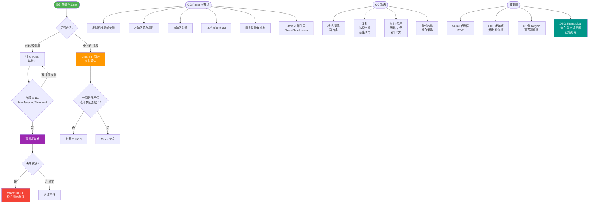
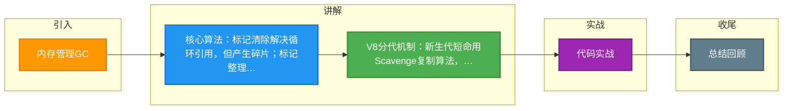

# 内存管理GC

### 内存管理 GC

#### 垃圾回收机制
JavaScript 引擎主要通过 **标记-清除** 算法进行自动垃圾回收。其核心流程如下：
1. **标记**：垃圾回收器从根节点出发，遍历内存中的所有对象，标记所有可达（活动）对象。
2. **清除**：回收所有未被标记的对象内存。
3. **整理**（部分算法）：整理内存空间以减少碎片。

#### 算法分类
1. **引用计数**
   - **原理**：记录对象被引用的次数。被引用时+1，引用失效时-1，为0时回收。
   - **缺点**：无法解决循环引用问题（如A引用B，B引用A），导致内存泄漏。现代JS引擎已较少作为主算法使用。

2. **标记-清除**
   - **原理**：将“不再使用的对象”定义为“无法到达的对象”。遍历标记可达对象，清除剩余对象。
   - **优点**：解决了循环引用问题。
   - **缺点**：会产生内存碎片，不利于分配大对象。

3. **复制算法**
   - **原理**：将内存分为两块，将存活对象复制到另一块，然后清空当前块。
   - **优点**：无内存碎片，性能好。
   - **缺点**：内存利用率减半（仅用一半）。

4. **标记-整理**
   - **原理**：标记存活后，将其向一端移动，然后清理边界外的内存。
   - **优点**：既无碎片又不浪费内存。

#### V8 垃圾回收优化
- **分代回收**：将堆分为**新生代**（存活时间短，使用复制算法）和**老生代**（存活时间长，使用标记-整理+标记-清除）。
- **栈内存回收**：通过 ESP 指针移动，执行上下文切换时自动清理。

#### V8 垃圾回收全流程图
```text
   内存堆
┌───────────────────────────────┐
│  新生代       │            │
│  ┌──────┐   ┌─────┐        │
│  │ From │   │ To  │  -> 复制算法 (Scavenge) │
│  └──────┘   └─────┘        │
│   空间较小 (1MB - 8MB)       │
├───────────────────────────────┤
│  老生代                     │
│  ┌───────────────────────┐  │
│  │ 标记-清除 (产生碎片)   │  │
│  └───────────────────────┘  │
│  ┌───────────────────────┐  │
│  │ 标记-整理 (移动对象)   │  │
│  └───────────────────────┘  │
│   空间较大                    │
└───────────────────────────────┘
```

#### 内存泄漏识别与常见原因
1. **识别方法**：使用 Chrome DevTools 的 Memory 面板进行堆快照分析。连续多次 GC 后内存仍持续增长通常意味着泄漏。
2. **常见原因**：
   - 意外的全局变量
   - 未清除的定时器或回调函数
   - 未移除的 DOM 事件监听
   - 闭包引起的引用滞留

> 注：原回答中关于 async/await 和 setTimeout 的内容不属于内存管理 GC 范畴，已移除。

#### 补充细节：V8 的增量标记与并行回收
为了避免全堆垃圾回收导致的长时间停顿，V8 引入了以下优化技术：
- **增量标记**：将巨大的 GC 任务拆分为多个小任务，让 JS 执行逻辑和 GC 逻辑交替执行，最大停顿时间可控制在毫秒级。
- **并行回收**：在主线程执行 JS 代码的同时，辅助线程在后台进行清理工作，充分利用多核 CPU 性能。

**实战案例**：在开发大型 Canvas 游戏时，曾遇到高频创建临时对象导致频繁 GC 造成的掉帧问题。通过引入“对象池”模式复用游戏粒子对象，将 FPS 从 30 稳定到了 60。

**代码示例**：
```javascript
// 对象池模式复用对象，减少 GC 压力
class ObjectPool {
  constructor(factoryFn) {
    this.pool = [];
    this.factoryFn = factoryFn;
  }
  acquire() {
    return this.pool.length ? this.pool.pop() : this.factoryFn();
  }
  release(obj) {
    this.pool.push(obj); // 归还对象而不销毁
  }
}
// 使用：const particle = pool.acquire(); ... pool.release(particle);
```


## 核心流程图



## 记忆要点
- 核心算法：标记清除解决循环引用，但产生碎片；标记整理消除碎片，复制算法牺牲空间换时间
- V8分代机制：新生代短命用Scavenge复制算法，老生代存活久用标记清除与整理交替执行
- 性能优化：通过增量标记拆分任务和并行回收辅助线程，将GC停顿降至毫秒级
- 防泄漏策略：利用Chrome Memory快照排查，前端重点防范未清除的定时器和滞留闭包

## 结构化回答


**30 秒电梯演讲：** 保洁阿姨定期清理房间，只扔没人要的东西，并整理物品位置

**展开框架：**
1. **JS** — 现代JS主要使用标记-清除算法
2. **分为新生代和** — 分为新生代和老生代分代回收
3. **循环引用** — 循环引用会被自动回收

**收尾：** 这是我实战中的理解，您想深入哪一段？


## 视频脚本

> 预计时长：6 分钟 | 由浅入深

| 时间 | 画面/字幕 | 口播台词 | 讲解要点 |
|------|----------|----------|----------|
| 0:00 | 标题卡：内存管理GC | 今天这道题：内存管理GC。30 秒先给你讲清楚。 | 开场钩子 |
| 0:20 | 核心概念动画/示意图 | 保洁阿姨定期清理房间，只扔没人要的东西，并整理物品位置。 | 核心概念 |
| 0:40 | 现代JS主要示意图 | 现代JS主要使用标记-清除算法 | 现代JS主要 |
| 1:10 | 分为新生代和老生代分代回收示意图 | 分为新生代和老生代分代回收 | 分为新生代和老生代分代回收 |
| 1:40 | 循环引用会被自动回收示意图 | 循环引用会被自动回收 | 循环引用会被自动回收 |
| 2:10 | 总结卡 + 下期预告 | 记住今天这几个关键词，面试一定用得上。下期见。 | 收尾 |

### 视频流程图



