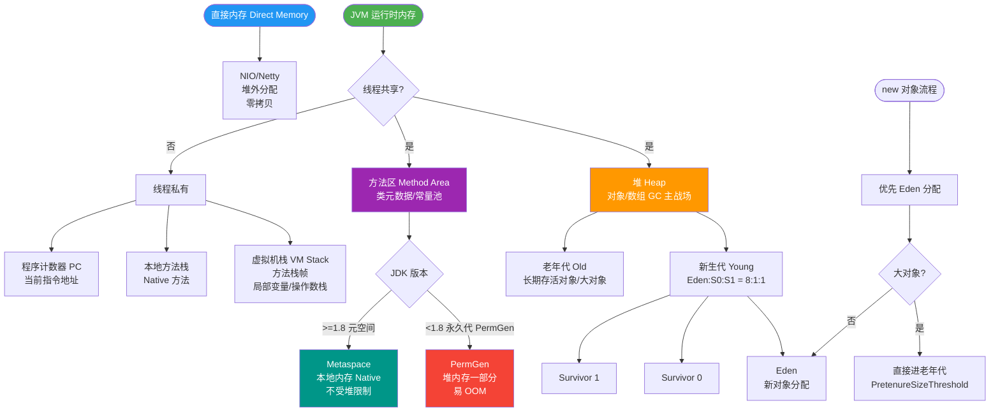

# JVM内存区域

### JVM 内存区域

JVM 运行时内存区域主要划分为以下几个部分：

#### 1. 线程私有区域
生命周期与线程相同，随线程创建而创建，随线程销毁而销毁。

- **程序计数器**：
  - 是一块较小的内存空间。
  - 可以看作是当前线程所执行的字节码的行号指示器。
  - 如果线程正在执行的是一个 Java 方法，这个计数器记录的是正在执行的虚拟机字节码指令的地址；如果正在执行的是 Native 方法，这个计数器值则为空。
  - 唯一一个在 Java 虚拟机规范中没有规定任何 OutOfMemoryError 情况的区域。

- **Java 虚拟机栈**：
  - 描述 Java 方法执行的内存模型：每个方法在执行的同时都会创建一个栈帧用于存储局部变量表、操作数栈、动态链接、方法出口等信息。
  - 局部变量表存放了编译期可知的各种基本数据类型、对象引用和 returnAddress 类型。
  - 异常：如果线程请求的栈深度大于虚拟机所允许的深度，将抛出 StackOverflowError；如果虚拟机栈可以动态扩展（当前大部分 Java 虚拟机都可动态扩展），扩展时无法申请到足够的内存，会抛出 OutOfMemoryError。

- **本地方法栈**：
  - 与虚拟机栈作用类似，区别在于虚拟机栈为虚拟机执行 Java 方法服务，而本地方法栈则为虚拟机使用的 Native 方法服务。

#### 2. 线程共享区域
生命周期随虚拟机启动而创建，随虚拟机退出而销毁。

- **Java 堆**：
  - 是 JVM 中内存最大的一块。
  - 被所有线程共享，在虚拟机启动时创建。
  - 此内存区域的唯一目的就是存放对象实例，几乎所有的对象实例都在这里分配内存。
  - 异常：如果在堆中没有内存完成实例分配，并且堆也无法再扩展时，将会抛出 OutOfMemoryError。

- **方法区**：
  - 用于存储已被虚拟机加载的类信息、常量、静态变量、即时编译器编译后的代码等数据。
  - 异常：当方法区无法满足内存分配需求时，将抛出 OutOfMemoryError。
  - 运行时常量池是方法区的一部分。

#### 3. 直接内存
- 并不是虚拟机运行时数据区的一部分，也不是 JVM 规范中定义的内存区域。
- 但这部分内存也被频繁使用（如 NIO），可能导致 OutOfMemoryError。

#### JVM 运行时数据区架构图
```text
┌──────────────────────────────────────────────────────────────┐
│                         线程共享区                           │
├───────────────────────────────┬───────────────────────────────┤
│           Heap (堆)           │      Method Area (方法区)     │
│   (存储对象实例、数组)        │   (类信息、常量、静态变量)    │
├───────────────────────────────┴───────────────────────────────┤
│                          直接内存                            │
│                  (NIO操作，堆外内存)                          │
└──────────────────────────────────────────────────────────────┘
┌────────────────────┐ ┌────────────────────┐ ┌───────────────────┐
│  线程 1            │ │  线程 2            │ │      线程 N       │
├────────────────────┤ └────────────────────┘ └───────────────────┘
│ PC Register       │
│ JVM Stack         │  (栈帧: 局部变量表、操作数栈、动态链接等)
│ Native Method Stack│
└────────────────────┘
```

**实战案例**：在一次使用 CGLib 动态代理生成大量类的服务中，遭遇了 `java.lang.OutOfMemoryError: Metaspace` 错误。这是因为元空间默认上限较小，且生成的代理类过多。通过调整 `-XX:MaxMetaspaceSize` 并限制类的生成数量解决了问题。

**对比表格：堆 vs 栈**
| 特性 | 堆 | 栈 |
| :--- | :--- | :--- |
| **作用** | 存储对象实例 | 存储方法调用链、局部变量 |
| **可见性** | 线程共享 | 线程私有 |
| **空间大小** | 较大（几G） | 较小（几M） |
| **异常类型** | OutOfMemoryError | StackOverflowError / OOM |
| **回收方式** | GC 回收 | 自动出栈释放 |

**代码示例**：
```java
public class HeapStackDemo {
    // 对象在堆中，引用 obj 在栈中
    public Object createObject() {
        Object obj = new Object(); // new 在堆，obj 在栈
        return obj;
    }
    // 递归导致栈溢出
    public void recursiveCall() {
        recursiveCall(); // StackOverflowError
    }
}
```


## 核心流程图



## 记忆要点
- 区域划分：分为线程私有（PC寄存器、虚拟机栈、本地方法栈）和线程共享（堆、方法区）
- 职责对比：栈管运行（方法栈帧与局部变量），堆管存储（对象实例），方法区存类元数据
- 异常区分：栈深度超限抛StackOverflowError，堆或元空间分配不足抛OOM
- 实战避坑：CGLib等动态代理生成大量类易撑爆Metaspace，需调大MaxMetaspaceSize

## 结构化回答


**30 秒电梯演讲：** 工厂车间：工人有独立工位（栈），共享仓库（堆）和规章制度手册（方法区）

**展开框架：**
1. **栈、程序计数器** — 栈、程序计数器、本地方法栈为线程私有
2. **堆和方法区为** — 堆和方法区为线程共享
3. **栈存储局部变量和方法调** — 栈存储局部变量和方法调用链

**收尾：** 这是我实战中的理解，您想深入哪一段？


## 视频脚本

> 预计时长：3 分钟 | 由浅入深

| 时间 | 画面/字幕 | 口播台词 | 讲解要点 |
|------|----------|----------|----------|
| 0:00 | 标题卡：JVM内存区域 | 今天这道题：JVM内存区域。30 秒先给你讲清楚。 | 开场钩子 |
| 0:20 | 核心概念动画/示意图 | 工厂车间：工人有独立工位（栈），共享仓库（堆）和规章制度手册（方法区）。 | 核心概念 |
| 0:40 | 栈、程序计数器、本地方法栈示意图 | 栈、程序计数器、本地方法栈为线程私有 | 栈、程序计数器、本地方法栈 |
| 1:10 | 总结卡 + 下期预告 | 记住今天这几个关键词，面试一定用得上。下期见。 | 收尾 |
