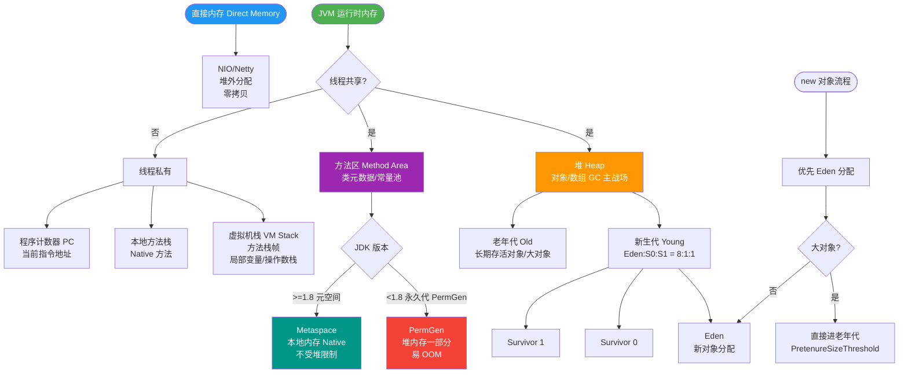

# JVM运行时内存

### JVM 运行时内存（堆内存结构）

Java 堆是 GC 管理的主要区域，从垃圾回收（GC）的角度，通常将堆划分为 **新生代** 和 **老年代**。

#### 1. 新生代
- **作用**：存放新创建的对象。
- **特点**：大部分对象生命周期短，朝生夕灭，因此新生代垃圾回收频繁且速度快。
- **比例**：通常占据堆的 1/3 空间（可通过 `-XX:NewRatio` 调整）。
- **划分**：新生代内部进一步分为三个区：
  1. **Eden 区**：绝大多数新创建的对象首先分配在 Eden 区。
  2. **Survivor From 区**：上一次 GC 的幸存者。
  3. **Survivor To 区**：保留本次 GC 过程中的幸存者。
  - *注*：Eden:From:To 的比例通常为 8:1:1。

#### 2. Minor GC 过程（新生代回收）
新生代主要采用 **复制算法** 进行垃圾回收，过程如下：
1. **复制**：当 Eden 区满了，触发 Minor GC。扫描 Eden 和 Survivor From 区，将所有存活的对象复制到 Survivor To 区。同时，如果对象年龄达到阈值（默认15），晋升至老年代。
2. **清空**：清空 Eden 区和 Survivor From 区。
3. **互换**：Survivor From 和 Survivor To 角色互换，原来的 To 变为下一次 GC 的 From。

> **注**：如果 Survivor To 区空间不足，存活对象将通过分配担保机制进入老年代。

#### 3. 老年代
- **作用**：存放生命周期较长的对象。
- **来源**：
  - 经历多次 Minor GC 后依然存活的对象（默认 15 岁，由 `-XX:MaxTenuringThreshold` 决定）。
  - 大对象直接进入（通过 `-XX:PretenureSizeThreshold` 设置）。
  - Survivor 区空间不足时担保进入的对象。
- **回收算法**：主要采用 **标记-清除** 或 **标记-整理** 算法。

#### 堆内存结构与对象流转流程图
```text
┌─────────────────────────────────────────────────────────────┐
│                        JVM Heap                             │
├─────────────────────────────────────────────────────────────┤
│  老年代                 │                              │
│  - 存活时间长的对象      │                              │
│  - 大对象直接进入        │                              │
├─────────────────────────────────────────────────────────────┤
│  新生代                                             │
│  ┌─────────────────┐  ┌───────────┐  ┌───────────┐       │
│  │ Eden 区 (80%)   │  │ S0 (10%)  │  │ S1 (10%)  │       │
│  │ 新对象分配      │  │ Survivor  │  │ Survivor  │       │
│  └────────┬────────┘  └─────┬─────┘  └─────┬─────┘       │
│           │                │               │              │
│           │ (GC 复制存活对象)│               │              │
│           └────────────────┼───────────────┘              │
│                            │                              │
│                   (晋升至老年代:                          │
│                    年龄>阈值)                             │
└─────────────────────────────────────────────────────────────┘
```

**实战案例**：在处理日志导出功能时，由于频繁拼接大字符串产生大量临时对象，这些对象在 Eden 区迅速填满并频繁触发 Minor GC。优化后，将大对象直接配置为进入老年代（虽然增加了老年代压力，但平滑了 Young GC 的频率），或者改用 StringBuilder 并增加 Eden 区大小。

**对比表格：Minor GC vs Full GC**
| 特性 | Minor GC | Full GC (Major GC) |
| :--- | :--- | :--- |
| **回收区域** | 新生代 | 整个堆（新生代+老年代+方法区） |
| **触发频率** | 高，速度快 | 低，速度慢（STW时间长） |
| **算法** | 复制算法 | 标记-清除 / 标记-整理 |
| **影响** | 对应用影响较小 | 严重影响系统吞吐量和响应 |

**代码示例**：
```java
// JVM 参数调优示例
// 1. 调整新生代与老年代比例 (1:2)
-XX:NewRatio=2

// 2. 大对象直接进入老年代 (防止 Eden 区满了 GC 搬移)
-XX:PretenureSizeThreshold=3MB 

// 3. 晋升年龄调整 (默认15)
-XX:MaxTenuringThreshold=10
```


## 核心流程图



## 记忆要点
- 堆分新生代与老年代，比例默认1:2，对象多在新生代朝生夕灭
- 新生代分Eden和S0/S1，比例8:1:1，采用复制算法避免碎片
- 对象存活到阈值(默认15)或为大对象时，会直接晋升老年代
- Minor GC快且频繁仅新生代，Full GC慢且波及全堆导致长STW

## 结构化回答


**30 秒电梯演讲：** 幼儿园分班：新来的孩子在小班（新生代），长大的升大班（老年代）

**展开框架：**
1. **堆分为新生代** — 堆分为新生代和老年代
2. **Eden** — 新生代分为Eden和两个Survivor区
3. **GC** — 新生代使用复制算法进行GC

**收尾：** 这是我实战中的理解，您想深入哪一段？


## 视频脚本

> 预计时长：3 分钟 | 由浅入深

| 时间 | 画面/字幕 | 口播台词 | 讲解要点 |
|------|----------|----------|----------|
| 0:00 | 标题卡：JVM运行时内存 | 今天这道题：JVM运行时内存。30 秒先给你讲清楚。 | 开场钩子 |
| 0:20 | 核心概念动画/示意图 | 幼儿园分班：新来的孩子在小班（新生代），长大的升大班（老年代）。 | 核心概念 |
| 0:40 | 堆分示意图 | 堆分为新生代和老年代 | 堆分 |
| 1:10 | 总结卡 + 下期预告 | 记住今天这几个关键词，面试一定用得上。下期见。 | 收尾 |
