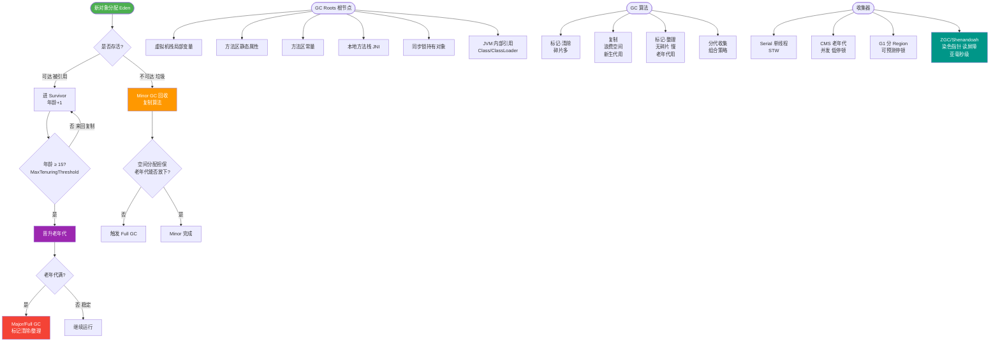

# GC垃圾收集器

### GC 垃圾收集器

Java 堆内存被划分为新生代和年老代，不同年代的垃圾回收算法不同，因此 JVM 针对不同年代提供了多种垃圾收集器。

#### 1. Serial 收集器
- **类型**：新生代收集器
- **算法**：复制算法
- **特点**：单线程收集器。在进行垃圾收集时，必须暂停其他所有的工作线程，直到收集结束。
- **适用场景**：单 CPU 环境或客户端应用。简单高效，没有线程交互开销。

#### 2. ParNew 收集器
- **类型**：新生代收集器
- **算法**：复制算法
- **特点**：Serial 收集器的多线程版本。除了使用多线程进行垃圾收集外，其余行为与 Serial 完全一致。同样需要 STW (Stop The World)。
- **适用场景**：Server 模式下的新生代首选收集器，常与 CMS 收集器搭配使用。

#### 3. Parallel Scavenge 收集器
- **类型**：新生代收集器
- **算法**：复制算法
- **特点**：多线程，关注点是**吞吐量**（高效利用 CPU）。自适应调节策略也是其特点。
- **适用场景**：后台运算而不需要太多交互的任务。

#### 4. Serial Old 收集器
- **类型**：老年代收集器
- **算法**：标记-整理算法
- **特点**：Serial 的老年代版本，单线程，STW。
- **用途**：Client 模式下的老年代收集器；在 Server 模式下，作为 CMS 收集器发生失败时的后备预案。

#### 5. Parallel Old 收集器
- **类型**：老年代收集器
- **算法**：标记-整理算法
- **特点**：多线程，关注吞吐量。JDK 1.6 提供。
- **用途**：与 Parallel Scavenge 搭配使用，注重吞吐量的场景。

#### 6. CMS (Concurrent Mark Sweep) 收集器
- **类型**：老年代收集器
- **算法**：标记-清除算法
- **特点**：以获取**最短回收停顿时间**为目标的收集器。基于“标记-清除”算法，过程分为 4 步：
  1. 初始标记 (STW) -> 标记 GC Roots 能直接关联到的对象
  2. 并发标记 -> 进行 GC Roots Tracing
  3. 重新标记 (STW) -> 修正并发标记期间因用户程序继续运作而导致标记产生变动的那一部分对象的标记记录
  4. 并发清除
- **缺点**：对 CPU 资源敏感；无法处理浮动垃圾；基于标记-清除算法会导致大量内存碎片。

#### 7. G1 (Garbage-First) 收集器
- **类型**：面向服务端的收集器，全堆管理
- **算法**：标记-整理 + 复制算法（整体看是标记整理，Region 之间是复制）
- **特点**：将堆内存划分为多个大小相等的独立区域，不再物理隔离新生代和老年代。可预测停顿时间。
- **适用场景**：大内存（>4GB - 6GB）、多核 CPU 的服务端应用，替代 CMS。

#### 垃圾收集器搭配关系图
```text
┌───────────────┐     STW     ┌───────────────┐
│   新生代       │ <─────────> │    老年代      │
├───────────────┤             ├───────────────┤
│  Serial       │             │  Serial Old   │
├───────────────┤             ├───────────────┤
│  ParNew       │             │  CMS          │
├───────────────┤             ├───────────────┤
│ ParallelScavenge│           │ Parallel Old  │
├───────────────┤             ├───────────────┤
│  G1 (混合)     │             │    G1         │
└───────────────┘             └───────────────┘
```

#### 补充：CMS 的浮动垃圾与并发模式失败
- **浮动垃圾**：在并发清除阶段，用户线程继续运行产生的新的垃圾对象，这部分垃圾只能在下次 GC 时清理。CMS 需要预留一部分空间给浮动垃圾，若预留不足可能导致 `Concurrent Mode Failure`，此时会触发 Full GC（退化为 Serial Old）。

**实战案例**：在 8GB 堆内存的服务上，曾遇到 CMS GC 停顿时间过长（超过 1s）的报警。分析发现是因为由于 CPU 资源紧张导致 CMS 并发标记耗时过长，且老年代碎片化严重。最终通过切换到 G1 收集器，并设置 `-XX:MaxGCPauseMillis=200`，成功将停顿时间控制在 200ms 以内，且系统吞吐量未受明显影响。

**对比表格：G1 vs CMS**
| 特性 | CMS | G1 |
| :--- | :--- | :--- |
| **内存布局** | 物理隔离 (新生代/老年代) | Region 划分 (逻辑分代) |
| **碎片化** | 有 (标记-清除) | 无 (复制/整理) |
| **目标** | 最短回收停顿 | 可控停顿 + 高吞吐 |
| **适用堆大小** | < 4-6GB | > 6GB (大堆首选) |

**代码示例**：
```java
// 生产环境 G1 推荐配置 (JDK 8+)
// 目标停顿时间 200ms
-XX:+UseG1GC 
-XX:MaxGCPauseMillis=200
// 并发标记线程数 (约为 CPU 核数的 1/4)
-XX:ConcGCThreads=4 
// 保留 Region 用于 Survival，防止 To-space Exceeded
-XX:G1ReservePercent=15 
```


## 核心流程图



## 记忆要点
- 吞吐量优先：Parallel Scavenge配Parallel Old，适合后台计算
- 响应时间优先：ParNew配CMS，基于标记-清除算法
- CMS四大步：初始标记(STW)->并发标记->重新标记(STW)->并发清除
- G1通吃大堆：划分Region逻辑分代，无碎片且停顿时间可控(>6GB首选)

## 结构化回答


**30 秒电梯演讲：** 不同类型的扫地机器人：有单人的、多人的，也有只扫角落的或全屋规划的

**展开框架：**
1. **Serial/P** — arNew用于新生代
2. **CMS关注低延迟** — G1兼顾吞吐量和延迟
3. **Parallel** — Parallel关注吞吐量

**收尾：** 这是我实战中的理解，您想深入哪一段？


## 视频脚本

> 预计时长：3 分钟 | 由浅入深

| 时间 | 画面/字幕 | 口播台词 | 讲解要点 |
|------|----------|----------|----------|
| 0:00 | 标题卡：GC垃圾收集器 | 今天这道题：GC垃圾收集器。30 秒先给你讲清楚。 | 开场钩子 |
| 0:20 | 核心概念动画/示意图 | 不同类型的扫地机器人：有单人的、多人的，也有只扫角落的或全屋规划的。 | 核心概念 |
| 0:40 | Serial/ParNew示意图 | Serial/ParNew用于新生代 | Serial/ParNew |
| 1:10 | 总结卡 + 下期预告 | 记住今天这几个关键词，面试一定用得上。下期见。 | 收尾 |

---

## 延伸：Java中有哪些GC垃圾收集器？各自的特点？

> 合并自 `jvm-023`（相似度 77%）

Java堆内存被划分为新生代和老年代，针对不同年代提供了不同的垃圾收集器。主要收集器如下：

**1. Serial 收集器**
- **特点**：单线程、复制算法（新生代）/ 标记-整理算法（老年代）。
- **机制**：进行GC时必须暂停所有工作线程。
- **适用**：单CPU环境或Client模式，简单高效，无线程交互开销。

**2. ParNew 收集器**
- **特点**：Serial的多线程版本，使用复制算法。
- **机制**：多线程GC，仍需暂停所有用户线程。
- **适用**：Server模式下的新生代收集器，常与CMS搭配。

**3. Parallel Scavenge 收集器**
- **特点**：多线程、复制算法，关注**吞吐量**（Throughput = 运行用户代码时间 / (运行用户代码时间 + 垃圾收集时间)）。
- **机制**：自适应调节策略，目标是达到可控的最大吞吐量。提供了两个关键参数：`-XX:MaxGCPauseMillis`（最大停顿时间）和`-XX:GCTimeRatio`（吞吐量大小）。
- **适用**：后台运算而不需要太多交互的任务。

**4. Serial Old 收集器**
- **特点**：Serial的老年代版本，单线程、标记-整理算法。
- **适用**：Client模式默认老年代收集器；Server模式下作为CMS的后备预案（并发收集发生`Concurrent Mode Failure`时使用）。

**5. Parallel Old 收集器**
- **特点**：Parallel Scavenge的老年代版本，多线程、标记-整理算法。
- **适用**：注重吞吐量的场景，与Parallel Scavenge搭配，在JDK 6之后提供。

**6. CMS (Concurrent Mark Sweep) 收集器**
- **特点**：多线程、标记-清除算法，以获取**最短回收停顿时间**为目标。
- **机制**：整个过程分为4个阶段：
  1. **初始标记**（STW）：标记GC Roots能直接关联到的对象，速度很快。
  2. **并发标记**（与用户线程并发）：进行GC Roots Tracing。
  3. **重新标记**（STW）：修正并发标记期间因用户程序继续运作而导致标记产生变动的那一部分对象的标记记录，比初始标记稍慢，但远比并发标记快。
  4. **并发清除**（与用户线程并发）：清除标记为不可达的对象。
- **缺点**：
  - 对CPU资源敏感：默认开启的回收线程数=(CPU数量+3)/4。
  - 无法处理浮动垃圾：并发清理时用户线程产生的垃圾只能在下次GC回收，可能导致`Concurrent Mode Failure`而退化为Serial Old。
  - 产生内存碎片：基于标记-清除算法，空间碎片过多时大对象分配困难。

**7. G1 (Garbage-First) 收集器**
- **特点**：面向服务端的收集器，基于“标记-整理”算法，可预测停顿时间，化整为零（Region化）。
- **机制**：将堆内存划分为多个大小相等的独立区域，不再物理隔离新生代和老年代。G1跟踪各个Region里垃圾堆积的价值大小，在后台维护一个优先列表，优先回收价值最大的Region（Garbage-First）。
- **过程**：初始标记 -> 并发标记 -> 最终标记 -> 筛选回收。
- **适用**：大内存（>6GB）多核CPU，替代CMS。

### 实战案例
在实际高并发电商大促场景中，CMS常因碎片过多导致Full GC，引发服务雪崩。我们曾将核心服务从 CMS 迁移至 G1，通过设置 `-XX:MaxGCPauseMillis=200`，成功将偶发的 5秒+ 停顿控制在 200ms 以内，但代价是 CPU 占用率略有上升。

### 代码示例
```bash
# JVM参数配置示例：开启G1并设置目标停顿时间
java -XX:+UseG1GC -XX:MaxGCPauseMillis=200 -Xmx4g -jar app.jar

# 退化场景排查：当CMS发生Concurrent Mode Failure时日志会显示
# JVM会自动切换到Serial Old，通常伴随长时间的“Full GC (Allocation Failure)”
```

### 选型对比
| 特性 | Serial/Parallel | CMS | G1 |
| :--- | :--- | :--- | :--- |
| **核心目标** | 吞吐量 / 简单 | 最短停顿 | 可预测停顿 + 大内存 |
| **内存布局** | 物理隔离 | 物理隔离 | Region (逻辑分代) |
| **碎片问题** | 整理算法无碎片 | **有碎片** (标记-清除) | 整理算法无碎片 |
| **适用堆大小** | 小内存 (<100MB-2GB) | 中等内存 (<4-6GB) | **大内存 (>6GB)** |
| **JDK 默认** | Java 8 | Java 8 (旧) | Java 9+ 默认 |

```text
 GC Collectors Evolution & Architecture:

       [Young Gen]           [Old Gen]

       Serial  +-----------> Serial Old  (Client / Single CPU)
       (Copy)  |            (Mark-Compact)
               |
       ParNew  +-----------> CMS          (Server, Low Pause)
       (Copy)  |            (Mark-Sweep)
               |
    Parallel  +-----------> Parallel Old (Server, High Throughput)
    Scavenge  |            (Mark-Compact)
               |
               +-----------> G1       
```

## 记忆要点

- 选型对比：Serial/Parallel主打吞吐量，CMS主打低停顿，G1主打可预测停顿与大内存。
- G1核心设计：化整为零打破物理分代，将堆划分为Region，按收益优先回收。
- CMS四大阶段：初始与重新标记STW，并发标记与清除，因标记-清除算法易生碎片。
- CMS致命退化：并发清理若内存不足触发Concurrent Mode Failure，会退化为Serial Old。

## 结构化回答

**30 秒电梯演讲：** 保洁阿姨打扫：单人扫(Serial)、多人分工扫(Parallel)、边干活边让人过(CMS)。

**展开框架：**
1. **Serial/ParNew** — Serial/ParNew适合新生代，CMS/Parallel Old适合老年代
2. **CMS追求低停顿** — CMS追求低停顿，Parallel Scavenge追求高吞吐量
3. **除CMS外** — 除CMS外，大部分老年代收集器使用标记-整理算法

**收尾：** 这块我踩过一些坑，您想深入聊哪一段——原理细节、实战案例还是常见踩坑？

## 视频脚本

> 预计时长：4 分钟 | 由浅入深

| 时间 | 画面/字幕 | 口播台词 | 讲解要点 |
|------|----------|----------|----------|
| 0:00 | 标题卡：Java中有哪些GC垃圾收集器？各自的特点 | 今天这道题：Java中有哪些GC垃圾收集器？各自的特点。30 秒先给你讲清楚。 | 开场钩子 |
| 0:20 | 核心概念动画/示意图 | 保洁阿姨打扫：单人扫(Serial)、多人分工扫(Parallel)、边干活边让人过(CMS)。 | 核心概念 |
| 0:40 | Serial/ParNew示意图 | Serial/ParNew适合新生代，CMS/Parallel Old适合老年代 | Serial/ParNew |
| 1:10 | CMS追求低停顿示意图 | CMS追求低停顿，Parallel Scavenge追求高吞吐量 | CMS追求低停顿 |
| 1:40 | 总结卡 + 下期预告 | 记住今天这几个关键词，面试一定用得上。下期见。 | 收尾 |

---

## 延伸：G1垃圾收集器的工作原理是什么？

> 合并自 `jvm-067`（相似度 71%）

G1 (Garbage-First) 是面向服务端的垃圾收集器，它将堆内存划分为多个大小相等的独立区域，称为 Region。Region 大小通常是 2 的 N 次幂，范围在 1MB 到 32MB 之间（通过 `-XX:G1HeapRegionSize` 设定）。

**架构原理**：
G1 不再坚持物理上的年轻代和老年代隔离，而是逻辑上的。每个 Region 可以动态扮演 Eden、Survivor、Old 或 Humongous（巨型对象，超过 Region 大小 50% 的对象）角色。

```text
G1 堆内存布局：
┌─────────────────────────────────────────────────────────────┐
│  G1 Heap (多个 Region 组成)                                  │
├────────────┬────────────┬────────────┬─────────────────────┤
│  Region E  │  Region E  │  Region S  │  Region O           │
│ (Eden)     │ (Eden)     │ (Survivor) │ (Old)               │
├────────────┴────────────┴────────────┼─────────────────────┤
│            Mixed Region Area        │  Region H           │
│        (混合回收区域，含垃圾多)      │ (Humongous)         │
└──────────────────────────────────────┴─────────────────────┘
```

**工作流程**：
1. **Young GC**：
   - 当 Eden 区耗尽触发。
   - 回缩所有 Eden 区和 Survivor 区，复制存活对象到新的 Survivor 或 Old 区。
   - STW，利用多线程并行复制，效率高。

2. **Concurrent Mark（并发标记）**：
   - 在整个堆上进行的并发标记阶段。
   - 计算每个 Region 中垃圾堆积的“价值”（回收所获空间 vs 回收耗时）。
   - 使用 SATB 算法处理并发引用变更。

3. **Mixed GC（混合回收）**：
   - 并不是清理所有老年代，而是优先回收垃圾占比最高的 Region（这就是 **Garbage First** 名字的由来）。
   - 根据用户设定的 `-XX:MaxGCPauseMillis`（默认 200ms）目标，计算在指定时间内能回收多少个高收益 Region。
   - 过程：全局并发标记 -> 混合回收（复制整理，将存活对象复制到空闲 Region）。

**核心特点**：
- **可预测停顿**：建立可预测的停顿时间模型，让用户指定在 M 毫秒的时间片段内，消耗在垃圾收集上的时间不得超过 N 毫秒。
- **无内存碎片**：基于“标记-整理”（复制）算法，回收时将存活对象复制到空闲 Region，规整内存。
- **适合大堆**：在 6GB 以上的堆上表现优异，解决了 CMS 的碎片化和停顿不可控问题。

### 实战案例
在日志报表系统中，曾遇到因 `-XX:MaxGCPauseMillis` 设置过严（如 50ms），导致 G1 为了满足停顿目标，每次 Mixed GC 回收的 Region 极少，最终后台回收跟不上对象分配速率，引发“并发模式失败”，退化为单线程 Full GC，导致系统假死。后调整为 200ms 恢复正常。

### 关键代码配置
```bash
# 生产环境推荐配置示例 (JDK 8+)
-XX:+UseG1GC 
-XX:MaxGCPauseMillis=200   # 目标停顿时间
-XX:InitiatingHeapOccupancyPercent=45 # 老年代占用45%时触发并发标记
-XX:G1HeapRegionSize=16m   # Region大小，建议根据堆大小调整
```

## 常见考点
1. G1 的 Humongous Region 是什么？
   专门用于存放巨型对象。如果一个对象跨越多个 Region，则这几个连续的 Region 都被标记为 Humongous。除了 Full GC，巨型对象通常不会被移动（避免了复制大对象的成本，但也可能提前触发 GC）。
2. G1 和 CMS 的根本区别？
   G1 是标记-整理（复制），无碎片；CMS 是标记-清除，有碎片。G1 可以预测停顿时间，CMS 主要追求低停顿但不可控。
3. 什么时候触发 Mixed GC？
   当老年代占用率达到阈值（默认 45%，由 `-XX:InitiatingHeapOccupancyPercent` 控制）时，G1 会启动并发标记周期，随后进行 Mixed GC。
4. G1 在 JDK 9 之后的地位？
   JDK 9 开始成为默认 GC。

## 记忆要点

- 核心布局：堆化整为零为 Region，逻辑分代且角色可动态切换
- 回收策略：优先回收垃圾最多的 Region，故名 Garbage-First
- 停顿可控：因为维护 Region 回收耗时模型，所以能满足 MaxGCPauseMillis 目标
- 对比 CMS：G1 基于复制算法无碎片，适合 6GB 以上大堆，JDK 9 起为默认 GC

## 结构化回答


**30 秒电梯演讲：** 不搞全场大扫除，哪里脏先扫哪里，控制每次打扫时间。

**展开框架：**
1. **堆划分为多个Region** — 堆划分为多个Region，角色动态切换
2. **追踪Region回收价值** — 追踪Region回收价值，建立优先级列表
3. **根据停顿时间目标** — 选择Region回收

**收尾：** 这是我实战中的理解，您想深入哪一段？


## 视频脚本

> 预计时长：4 分钟 | 由浅入深

| 时间 | 画面/字幕 | 口播台词 | 讲解要点 |
|------|----------|----------|----------|
| 0:00 | 标题卡：G1垃圾收集器的工作原理是什么 | 今天这道题：G1垃圾收集器的工作原理是什么。30 秒先给你讲清楚。 | 开场钩子 |
| 0:20 | 核心概念动画/示意图 | 不搞全场大扫除，哪里脏先扫哪里，控制每次打扫时间。 | 核心概念 |
| 0:40 | 堆划分示意图 | 堆划分为多个Region，角色动态切换 | 堆划分 |
| 1:10 | 追踪Region回收价值示意图 | 追踪Region回收价值，建立优先级列表 | 追踪Region回收价值 |
| 1:40 | 总结卡 + 下期预告 | 记住今天这几个关键词，面试一定用得上。下期见。 | 收尾 |
