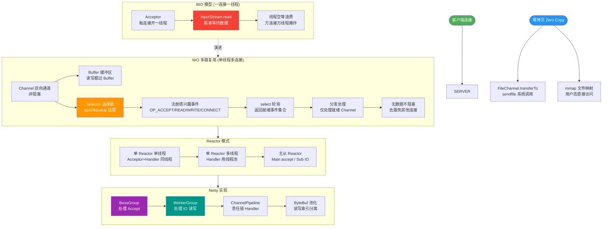

# 什么是异步通讯NIO？

### 什么是异步通讯NIO？

Netty 的IO 线程 `NioEventLoop` 由于聚合了多路复用器 `Selector`，可以同时并发处理成百上千个客户端 `Channel`，由于读写操作都是非阻塞的，这就可以充分提升IO 线程的运行效率，避免由于频繁 IO 阻塞导致的线程挂起。

#### 核心原理对比
传统同步阻塞 I/O (BIO) 和异步非阻塞 I/O (NIO/AIO) 的模型区别如下：

**BIO 模型 (一连接一线程)**:
- 每个 Socket 连接都需要一个独立的线程处理。
- 当连接没有数据读写时，线程会被阻塞，造成大量线程资源的浪费。

**NIO 模型 (I/O 多路复用)**:
- 单个线程可以管理多个 Channel。
- 使用 Selector 监听多个 Channel 上的事件。
- 只有当 Channel 真正有读写事件发生时，才分配线程进行处理，线程无需阻塞等待。

#### NIO 模型架构图
```text
传统 BIO 模型:                  NIO 多路复用模型:

Client 1 ──> Thread 1          Client 1 ──┐
           (Block Read)                     │
Client 2 ──> Thread 2          Client 2 ──┤
           (Block Read)                     │
Client 3 ──> Thread 3          Client 3 ──┼──> Selector (事件监听)
           (Block Read)                     │    ┌─────────────┐
...                                       └──> │ EventLoop   │
                                              │ (单线程/线程池)│
                                              └─────────────┘
                                                    │
                                                    ▼
                                              Handle Event (非阻塞)
```

#### 异步通讯 NIO 的优势
由于 Netty 采用了异步通信模式，一个 IO 线程可以并发处理 N 个客户端连接和读写操作，这从根本上解决了传统同步阻塞 IO 一连接一线程模型，架构的性能、弹性伸缩能力和可靠性都得到了极大的提升。

#### 补充细节：Reactor 模式
NIO 的底层实现通常基于 Reactor 模式：
1. **Acceptor**：处理客户端连接请求。
2. **Handler**：处理具体的读写业务逻辑。
3. **Dispatcher**：分发事件到对应的 Handler。

Netty 的设计正是基于主从 Reactor 多线程模型，BossGroup 负责 Accept，WorkerGroup 负责 IO 读写，保证了高并发处理能力。

---

#### 实战案例
在开发高并发网关服务时，若使用传统 BIO，面对上万级连接会因线程上下文切换导致 CPU 飙升；改用 NIO 后，单机轻松支撑 10W+ 长连接，但需警惕“ByteBuf 没释放”导致的内存泄漏，常发生在异步回调逻辑复杂时。

#### 代码示例 (Java NIO Selector)
```java
Selector selector = Selector.open();
ServerSocketChannel serverChannel = ServerSocketChannel.open();
serverChannel.bind(new InetSocketAddress(8080));
serverChannel.configureBlocking(false);
serverChannel.register(selector, SelectionKey.OP_ACCEPT);

while (true) {
    int readyCount = selector.select(); // 阻塞直到有事件
    if (readyCount == 0) continue;
    Set<SelectionKey> selectedKeys = selector.selectedKeys();
    Iterator<SelectionKey> iter = selectedKeys.iterator();
    while (iter.hasNext()) {
        SelectionKey key = iter.next();
        if (key.isAcceptable()) handleAccept(key);
        iter.remove(); // 关键：手动移除已处理的key
    }
}
```

---

## 常见考点
1. **NIO 的核心组件有哪些？**
   - **Channel (通道)**：相当于 BIO 中的 Stream，但它是双向的。
   - **Buffer (缓冲区)**：数据必须通过 Buffer 进行读写。
   - **Selector (选择器)**：用于监听多个 Channel 的事件，是 NIO 实现多路复用的关键。
2. **什么是零拷贝？**
   - 在传统 I/O 中，数据需要从磁盘读取到内核缓冲区，再拷贝到用户缓冲区，然后又拷贝到 Socket 缓冲区。NIO 的 `FileChannel.transferTo` 方法利用操作系统底层的 sendfile 能力，直接将数据从文件系统缓存传输到网卡，跳过用户态的内存拷贝，极大提升了性能。
3. **Netty 为什么要自己实现 ByteBuf 而不使用 NIO 的 ByteBuffer？**
   - Netty 的 ByteBuf 提供了更友好的 API（如读写索引分离），支持池化技术减少内存分配开销，支持复合缓冲区，且解决了 ByteBuffer 长度固定扩容不便的问题。


## 核心流程图



## 记忆要点
- 核心差异：BIO一连接一线程且阻塞；NIO单线程管多路复用且非阻塞
- 三大核心组件：双向传输的Channel、承载数据的Buffer、事件监听器Selector
- 基于Reactor模式，Netty采用主从模型，Boss接客(Accept)，Worker干活(IO)
- 机制优势：避免线程频繁挂起与上下文切换，单机轻松支撑10W+长连接

## 结构化回答


**30 秒电梯演讲：** 像餐厅一个服务员同时服务多桌客人，有事就响应，没事就去服务别的。

**展开框架：**
1. **非阻塞IO** — 读写不阻塞线程
2. **基于缓冲区和** — 基于缓冲区和通道操作
3. **Selector** — Selector实现多路复用

**收尾：** 这是我实战中的理解，您想深入哪一段？


## 视频脚本

> 预计时长：2 分钟 | 由浅入深

| 时间 | 画面/字幕 | 口播台词 | 讲解要点 |
|------|----------|----------|----------|
| 0:00 | 标题卡：什么是异步通讯NIO | 今天这道题：什么是异步通讯NIO。30 秒先给你讲清楚。 | 开场钩子 |
| 0:20 | 核心概念动画/示意图 | 像餐厅一个服务员同时服务多桌客人，有事就响应，没事就去服务别的。 | 核心概念 |
| 0:40 | 非阻塞IO示意图 | 非阻塞IO：读写不阻塞线程 | 非阻塞IO |
| 1:10 | 总结卡 + 下期预告 | 记住今天这几个关键词，面试一定用得上。下期见。 | 收尾 |
