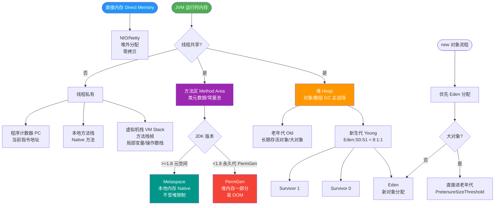

# JVM永久代和元空间的区别是什么？

### 永久代 vs 元空间 (Metaspace)

**1. 存储位置**
- **永久代**：是 JVM 堆内存的一部分，逻辑上属于堆的连续空间。
- **元空间**：并不在虚拟机中，而是使用**本地内存**。这意味着元空间的大小只受限于本机可用内存，而不再是 `MaxPermSize`。

**2. 存储内容**
- **永久代**：存储类的元数据、常量池、静态变量等。
- **元空间**：存储类的元数据。**重点**：Java 8 中，**字符串常量池**和**静态变量**被移入了**Java 堆**中，不再放在元空间。

**3. 内存限制**
- **永久代**：大小固定（`-XX:PermSize` 和 `-XX:MaxPermSize`），容易发生 OOM（如加载类过多）。
- **元空间**：默认无上限（受限于物理内存），可使用 `-XX:MaxMetaspaceSize` 设定最大值。它默认使用 Native Memory 进行分配，且可以通过参数 `-XX:MetaspaceSize` 设置触发 GC 的阈值（高水位线）。

**4. 垃圾回收**
- **永久代**：Full GC 时会扫描永久代，效率低且影响性能。
- **元空间**：如果元空间达到其触发阈值，会触发 Full GC 来卸载无用的类。由于使用本地内存，其 GC 机制与堆内存不同，更依赖于系统的内存分配。

```text
  内存结构对比

  Java 7 (永久代)              Java 8+ (元空间)
  ┌─────────────────┐          ┌──────────────────┐
  │     Heap        │          │      Heap        │
  ├─────────────────┤          ├──────────────────┤
  │  Old / Young    │          │  Old / Young     │
  ├─────────────────┤          ├──────────────────┤
  │   Perm Gen      │          │  Strings / Static│  <-- 移入堆
  │ (Class Metadata)│          │                  │
  │ (Constant Pool) │          └──────────────────┘
  │ (Static Vars)   │          ┌──────────────────┐
  └─────────────────┘          │   Metaspace      │  <-- 本地内存
                               │  (Class Metadata)│
                               └──────────────────┘
```

---

#### 实战案例
在使用 Spring Boot 打包 Fat Jar 部署时，若大量使用反射、JSP 编译或动态代理，曾遇到 `java.lang.OutOfMemoryError: Metaspace`。排查发现是由于 `-XX:MaxMetaspaceSize` 未设置，应用在容器环境（Docker）内存受限时被 OS Kill，设置上限后监控复用情况得以解决。

#### 代码示例 (JVM 参数调优)
```bash
# Java 8 元空间配置
-XX:MetaspaceSize=256m        # 初始高水位线，达到该值触发 Full GC (卸载类)
-XX:MaxMetaspaceSize=512m     # 设置元空间最大上限，防止无限吞噬本地内存
-XX:CompressedClassSpaceSize=256m # 类指针压缩空间大小
```

#### 对比表格：永久代 vs 元空间

| 维度 | 永久代 | 元空间 |
| :--- | :--- | :---
| **内存归属** | JVM 堆内存 | 本地内存 |
| **大小限制** | 固定 (`-XX:MaxPermSize`)，调优困难 | 默认无限 (`-XX:MaxMetaspaceSize` 控制)，受物理内存限制 |
| **内容存储** | 类元数据、常量池、静态变量 | 仅类元数据 (字符串常量池/静态变量移至堆) |
| **垃圾回收** | Full GC 时回收，效率低 | 达到阈值时触发 Full GC 卸载无用类，效率较高 |
| **常见问题** | `OutOfMemoryError: PermGen space` | `OutOfMemoryError: Metaspace` 或 容器内存溢出 (OOMKilled) |

---

## 常见考点
1. **为什么要将永久代替换为元空间？**
   - 主要是为了解决 OOM 问题（永久代大小固定难调优）和融合 HotSpot 与 JRockit 代码库。
2. **StringTable 为什么要移到堆中？**
   - 永久代 GC 效率低，且仅发生在 Full GC 时。移入堆后，垃圾回收更加及时，可避免内存泄漏。
3. **元空间会发生 OOM 吗？**
   - 会。如果加载了太多的类，或者设置了 `-XX:MaxMetaspaceSize` 且元空间使用超过该值，会抛出 `OutOfMemoryError: Metaspace`。


## 核心流程图



## 记忆要点
- 存储位置大挪移：永久代在JVM堆中，元空间移至机器本地内存
- 元空间上限高：摆脱MaxPermSize固定限制，受物理内存控制
- 内容缩减：元空间仅存类元数据，字符串常量池和静态变量移入堆
- GC优化：常量池移入堆可被及时Minor GC回收，避免Full GC效率低

## 结构化回答

**30 秒电梯演讲：** 以前货物存在自家仓库（永久代，大小固定），现在租用外部仓库（元空间，空间更大）。

**展开框架：**
1. **存储位置** — 存储位置：永久代在JVM内，元空间在本地内存
2. **大小限制** — 大小限制：永久代固定易OOM，元空间受系统内存限制
3. **存储内容** — 存储内容：元空间存类元数据，字符串池移至堆

**收尾：** 这块我踩过一些坑，您想深入聊哪一段——原理细节、实战案例还是常见踩坑？

## 视频脚本

> 预计时长：3 分钟 | 由浅入深

| 时间 | 画面/字幕 | 口播台词 | 讲解要点 |
|------|----------|----------|----------|
| 0:00 | 标题卡：JVM永久代和元空间的区别是什么 | 今天这道题：JVM永久代和元空间的区别是什么。30 秒先给你讲清楚。 | 开场钩子 |
| 0:20 | 核心概念动画/示意图 | 以前货物存在自家仓库（永久代，大小固定），现在租用外部仓库（元空间，空间更大）。 | 核心概念 |
| 0:40 | 存储位置示意图 | 存储位置：永久代在JVM内，元空间在本地内存 | 存储位置 |
| 1:10 | 总结卡 + 下期预告 | 记住今天这几个关键词，面试一定用得上。下期见。 | 收尾 |

---

## 延伸：JDK 1.7和1.8的内存区域有什么变化？

> 合并自 `jvm-043`（相似度 67%）

JDK 1.7时方法区由永久代实现，字符串常量池和静态变量已移到堆中。JDK 1.8彻底移除了永久代，改用元空间实现方法区。元空间使用本地内存而非JVM内存，大小不再受MaxPermSize限制，避免了java.lang.OutOfMemoryError: PermGen space错误。运行时常量池和类常量池也移到了元空间中。

### 关键细节补充
1. **JDK 1.7 的过渡状态**：
   - 在JDK 1.7中，虽然字符串常量池和静态变量移到了堆中，但**符号引用**仍然保留在永久代中。
   - 这导致了永久代仍然容易溢出，特别是在大量使用反射、动态代理或JSP生成的场景下。

2. **JDK 1.8 的内存结构变化**：
   - **元空间**：存储类的元数据（Class元数据），使用本地内存。
   - **堆**：存储实例对象、静态变量、字符串常量池。
   - 元空间受 `-XX:MaxMetaspaceSize` 控制（如果不设置，默认仅受限于本地内存大小），而非 `-XX:MaxPermSize`。

3. **垃圾回收机制**：
   - 永久代：GC在Full GC时扫描永久代，效率低且难以调优。
   - 元空间：元数据与其中的类对象生命周期一致。当该类加载器被回收时，对应的元空间内存自动释放，无需专门的GC扫描元空间。

### 内存布局对比图
```text
+-----------------------+  JDK 1.7                +-----------------------+  JDK 1.8
|          Heap         |                         |          Heap         |
| +-------------------+ |                         | +-------------------+ |
| | Instance Data     | |                         | | Instance Data     | |
| +-------------------+ |                         | +-------------------+ |
| | String Pool       | |  <-- Moved here         | | String Pool       | |
| +-------------------+ |                         | +-------------------+ |
| | Static Variables  | |  <-- Moved here         | | Static Variables  | |
| +-------------------+ |                         | +-------------------+ |
+-----------------------+                         +-----------------------+
|     Perm Gen (Method) |  <-- Still Here          |      Method Area      |
| +-------------------+ |                         |   (No Heap)          |
| | Class Metadata    | |                         +-----------------------+
| | Symbol Refs       | |                         |    Metaspace (Native) |
| +-------------------+ |                         | +-------------------+ |
+-----------------------+                         | | Class Metadata    | |
                                                 | +-------------------+ |
                                                 +-----------------------+
```

### 版本特性对比表
| 特性 | JDK 1.7 (PermGen) | JDK 1.8 (Metaspace) |
| :--- | :--- | :--- |
| **存储位置** | JVM 堆内存的一部分 | 本地内存 | 
| **大小限制** | 受 `-XX:MaxPermSize` 限制 (固定) | 受系统可用内存限制 (默认无限) |
| **调整难度** | 难 (需预估并手动设置) | 易 (自动扩容) |
| **字符串常量池** | 已移至堆 | 仍在堆 |
| **垃圾回收** | Full GC 时回收，效率低 | 类加载器卸载时随行回收，性能高 |
| **常见错误** | `OutOfMemoryError: PermGen space` | `OutOfMemoryError: Metadata space` (极难触发) |

**实战案例**
在微服务架构中，如果项目使用了大量的 **CGLib 动态代理**（如 Spring AOP），在 JDK 1.7 环境下高并发调用时容易抛出 `PermGen space` OOM。这是因为动态代理类会动态生成大量的 Class 信息填充永久代。升级至 JDK 1.8 后，元空间利用本地内存，且垃圾回收机制优化，此类 OOM 问题基本消失。

## 记忆要点

- 核心变化：JDK1.8 移除永久代，改用元空间实现方法区，元空间使用本地内存。
- 布局变迁：JDK1.7已将字符串常量池与静态变量移至堆，1.8仅将类元数据移至元空间。
- OOM 变化：PermGen 受 JVM 参数 MaxPermSize 限制易溢出，而元空间受物理内存限制。
- 位置对比：永久代在 JVM 内存中，而元空间在本地内存中，降低了 Full GC 压力。

## 结构化回答


**30 秒电梯演讲：** 把堆在仓库（堆内存）里的档案搬到无限大的云端（本地内存），仓库不再挤爆。

**展开框架：**
1. **JDK** — JDK1.8移除永久代
2. **方法区改** — 方法区改用元空间实现
3. **元空间使** — 元空间使用本地内存

**收尾：** 这是我实战中的理解，您想深入哪一段？


## 视频脚本

> 预计时长：3 分钟 | 由浅入深

| 时间 | 画面/字幕 | 口播台词 | 讲解要点 |
|------|----------|----------|----------|
| 0:00 | 标题卡：JDK 1.7和1.8的内存区域有什么变化 | 今天这道题：JDK 1.7和1.8的内存区域有什么变化。30 秒先给你讲清楚。 | 开场钩子 |
| 0:20 | 核心概念动画/示意图 | 把堆在仓库（堆内存）里的档案搬到无限大的云端（本地内存），仓库不再挤爆。 | 核心概念 |
| 0:40 | JDK1.8移除永久代示意图 | JDK1.8移除永久代 | JDK1.8移除永久代 |
| 1:10 | 总结卡 + 下期预告 | 记住今天这几个关键词，面试一定用得上。下期见。 | 收尾 |
