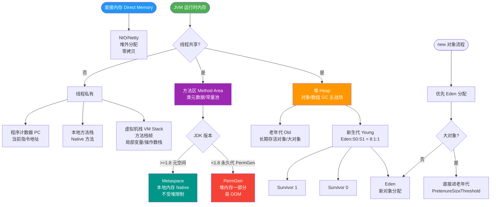

# JVM虚拟机栈的结构和作用是什么？

### 虚拟机栈 的结构与作用

**作用**：
虚拟机栈是**线程私有**的，生命周期与线程相同。它描述的是 Java 方法执行的内存模型：每个方法在执行的同时都会创建一个**栈帧**（Stack Frame）用于存储局部变量表、操作数栈、动态链接、方法出口等信息。每一个方法从调用直至执行完成的过程，就对应着一个栈帧在虚拟机栈中从**入栈**到**出栈**的过程。

**结构细节**：

1. **局部变量表**：
   - 存放编译期可知的各种基本数据类型、对象引用和 returnAddress 类型。
   - **细节**：以**局部变量槽** 为单位，所需内存空间在编译期完成分配。如果是实例方法，第 0 位 Slot 默认存放 `this` 引用。

2. **操作数栈**：
   - 后进先出（LIFO）栈。方法执行过程中，各种字节码指令往栈中写入数据或提取数据。
   - **细节**：用于算术运算、类型转换、方法调用参数传递等。

3. **动态链接**：
   - 每个栈帧都包含一个指向运行时常量池中该栈帧所属方法的引用，持有这个引用是为了支持方法调用过程中的**动态链接**。
   - **细节**：将符号引用转换为直接引用。

4. **返回地址**：
   - 存放调用该方法的 PC 寄存器的值。
   - **细节**：方法正常退出或异常退出时，决定如何恢复上层方法的执行。

```text
    虚拟机栈内部结构

    ┌─────────────────────────────────────┐
    │           当前方法栈帧              │
    ├─────────────────────────────────────┤
    │  返回地址        │                │
    ├─────────────────────────────────────┤
    │  动态链接        │                │
    ├─────────────────────────────────────┤
    │  操作数栈           │ (LIFO)      │
    ├─────────────────────────────────────┤
    │  局部变量表  │              │
    └─────────────────────────────────────┘
                    ▲
                    │ (方法调用)
    ┌─────────────────────────────────────┐
    │           上层方法栈帧              │
    └─────────────────────────────────────┘
```

**异常**：
- 如果线程请求的栈深度大于虚拟机所允许的深度，抛出 `StackOverflowError`。
- 如果虚拟机栈动态扩展无法申请到足够的内存，抛出 `OutOfMemoryError`。

### 深化实战

**实战案例**：
生产环境曾出现因递归调用未设置终止条件导致的 `StackOverflowError`，甚至框架层（如旧版 Hibernate 的某些深度检索场景）也可能因对象层级过深导致栈溢出。另外，在 Goroutine 或协程模型中，若启动数万个线程处理请求，需警惕物理内存耗尽导致无法为新线程分配栈空间而抛出 OOM。

**代码示例**：
```java
/**
 * 模拟栈溢出与局部变量表占用演示
 */
public class StackDemo {
    // 场景1：递归过深导致 StackOverflowError
    public static void recursion() {
        recursion(); // 无限递归，栈帧不断入栈
    }

    // 场景2：局部变量表 Slots 占用演示
    public static void largeLocalVars() {
        int a = 1;  // Slot 0 (this), Slot 1
        int b = 2;  // Slot 2
        // ... 更多局部变量 ...
        // 局部变量表的大小在编译期确定，Slot 复用可能发生
    }
}
```

## 常见考点
1. **栈帧中的局部变量表是线程共享的吗？**
   - 不是，栈帧属于线程私有，因此局部变量表也是线程安全的。
2. **方法参数和局部变量存储在哪里？**
   - 存储在栈帧的局部变量表中。对象引用指向堆内存。
3. **什么是 StackOverflowError？**
   - 通常由无限递归调用导致，栈深度超过 JVM 配置的 `-Xss` 大小。


## 核心流程图



## 记忆要点
- 核心作用：线程私有，方法调用入栈执行，出栈销毁的内存模型
- 栈帧四组件：局部变量表、操作数栈、动态链接、方法返回地址
- 局部变量表：存基本类型与对象引用，实例方法第0位Slot固定为this
- 深度溢出：递归调用过深致栈超限报StackOverflowError，而非OOM

## 结构化回答


**30 秒电梯演讲：** 像餐厅的订单夹，每个顾客的订单（方法）按顺序叠放，吃完一个拿走一个。

**展开框架：**
1. **线程私** — 线程私有，生命周期与线程相同
2. **每个方法调** — 每个方法调用创建一个栈帧
3. **栈帧包含** — 局部变量表、操作数栈、动态链接等

**收尾：** 这是我实战中的理解，您想深入哪一段？


## 视频脚本

> 预计时长：3 分钟 | 由浅入深

| 时间 | 画面/字幕 | 口播台词 | 讲解要点 |
|------|----------|----------|----------|
| 0:00 | 标题卡：JVM虚拟机栈的结构和作用是什么 | 今天这道题：JVM虚拟机栈的结构和作用是什么。30 秒先给你讲清楚。 | 开场钩子 |
| 0:20 | 核心概念动画/示意图 | 像餐厅的订单夹，每个顾客的订单（方法）按顺序叠放，吃完一个拿走一个。 | 核心概念 |
| 0:40 | 线程私有示意图 | 线程私有，生命周期与线程相同 | 线程私有 |
| 1:10 | 总结卡 + 下期预告 | 记住今天这几个关键词，面试一定用得上。下期见。 | 收尾 |
