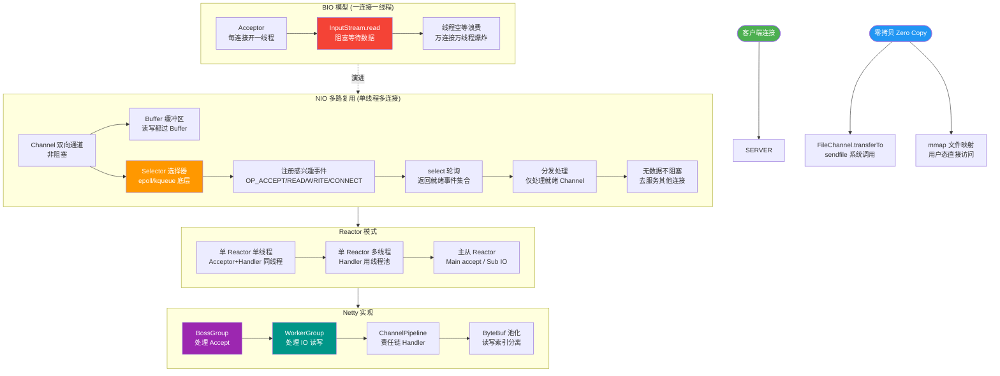

# Java NIO的核心组件有哪些？和BIO的区别？

### Java NIO 核心组件及与 BIO 的区别

**核心组件**：
1. **Channel (通道)**：
   - 数据的源头或目的地，双向读写（不同于 Stream 的单向）。
   - 常见实现：`FileChannel`, `SocketChannel`, `ServerSocketChannel`。

2. **Buffer (缓冲区)**：
   - 容器，数据从 Channel 读入 Buffer，或从 Buffer 写入 Channel。
   - **核心属性**：`capacity` (容量), `position` (当前位置), `limit` (限制), `mark` (标记)。

3. **Selector (选择器)**：
   - **多路复用器**。单个线程可以监听多个 Channel 的事件（连接就绪、读就绪、写就绪）。
   - **核心原理**：通过 `select()` 方法阻塞直到有事件就绪，避免了多线程频繁切换的开销。

**与 BIO 的区别**：

| 特性 | BIO (Blocking IO) | NIO (Non-blocking IO) |
| :--- | :--- | :--- |
| **IO 模型** | 面向流 | **面向缓冲区** |
| **阻塞特性** | 阻塞式（线程挂起） | **非阻塞式** (可配合 Selector) |
| **线程模型** | 一连接一线程（高并发下线程开销大） | **多路复用**（单线程/少量线程管理多连接） |
| **数据处理** | 流式读，不可移动 | 缓冲区读写，可前后移动数据 |

**NIO 非阻塞流程**：
```text
   NIO Selector 模型流程

   ┌─────────┐       ┌─────────┐       ┌─────────┐
   │ Client1 │       │ Client2 │       │ Client3 │
   └────┬────┘       └────┬────┘       └────┬────┘
        │                │                │
        ▼                ▼                ▼
   ┌───────────────────────────────────────┐
   │           Channels (Sockets)           │
   └───────────────────────────────────────┘
                        │
                        │ (注册)
                        ▼
   ┌───────────────────────────────────────┐
   │              Selector                  │
   │  (监听 Accept, Read, Write 事件)      │
   └───────────────────────────────────────┘
                        │
                        │ (select 阻塞直到有事件)
                        ▼
   ┌───────────────────────────────────────┐
   │      单线程/少量线程处理就绪事件        │
   └───────────────────────────────────────┘
```

### 深化实战

**实战案例**：
在 HTTP 服务器开发（如 Netty）中，如果未正确处理 Buffer 的 `flip()` 操作，会导致读取到“脏数据”或数据为空；另外，在高并发短连接场景下，NIO 的 Selector 处理能力极强，但在文件传输时，传统 BIO 的 `FileInputStream` 往往利用了操作系统层面的 Sendfile 零拷贝优化，直接使用 NIO 的 FileChannel 进行内存映射读写反而可能因上下文切换导致性能下降，需根据场景选型。

**代码示例**：
```java
// NIO 读取数据的关键步骤
ByteBuffer buffer = ByteBuffer.allocate(1024);
int bytesRead = socketChannel.read(buffer); // 写入 Buffer，position 移动

if (bytesRead != -1) {
    buffer.flip(); // 切换模式：limit=position, position=0
    
    // 处理数据...
    while(buffer.hasRemaining()) {
        System.out.print((char) buffer.get());
    }
    
    buffer.clear(); // 清空 buffer，准备下次写入
}
```

## 常见考点
1. **NIO 的 Buffer 中 position、limit、capacity 的含义及切换？**
   - `capacity`: 最大容量。
   - `limit`: 读/写的边界。
   - `position`: 下一个要操作的索引。
   - 切换：`buffer.flip()` -> `limit=position`, `position=0` (写转读)；`buffer.clear()` -> `position=0`, `limit=capacity`。
2. **Selector 是如何实现多路复用的？**
   - 底层依赖操作系统的 `select`, `poll`, `epoll` (Linux) 或 `kqueue` (BSD/Mac) 系统调用，实现高效的 IO 事件轮询。


## 核心流程图



## 记忆要点
- NIO三剑客：双向通道Channel、数据容器Buffer、多路复用器Selector
- 数据处理对比：BIO面向流单向单向阻塞，NIO面向缓冲区双向非阻塞
- Buffer核心属性：capacity总容量、limit读写限制、position当前位置
- 必备操作：写转读需flip()重置指针，读后clear()清空准备下次写入

## 结构化回答


**30 秒电梯演讲：** 像办公室的公共区域（会议室、资料室），所有员工都能访问和使用。

**展开框架：**
1. **Java** — 包含Java堆（存对象实例）
2. **包含方法区（存类信息** — 包含方法区（存类信息、常量、静态变量）
3. **线程间共享** — 线程间共享，需要考虑线程安全

**收尾：** 这是我实战中的理解，您想深入哪一段？


## 视频脚本

> 预计时长：3 分钟 | 由浅入深

| 时间 | 画面/字幕 | 口播台词 | 讲解要点 |
|------|----------|----------|----------|
| 0:00 | 标题卡：Java NIO的核心组件有哪些？和BIO的区别 | 今天这道题：Java NIO的核心组件有哪些？和BIO的区别。30 秒先给你讲清楚。 | 开场钩子 |
| 0:20 | 核心概念动画/示意图 | 像办公室的公共区域（会议室、资料室），所有员工都能访问和使用。 | 核心概念 |
| 0:40 | 包含Java堆（存对象实例）示意图 | 包含Java堆（存对象实例） | 包含Java堆（存对象实例） |
| 1:10 | 总结卡 + 下期预告 | 记住今天这几个关键词，面试一定用得上。下期见。 | 收尾 |
