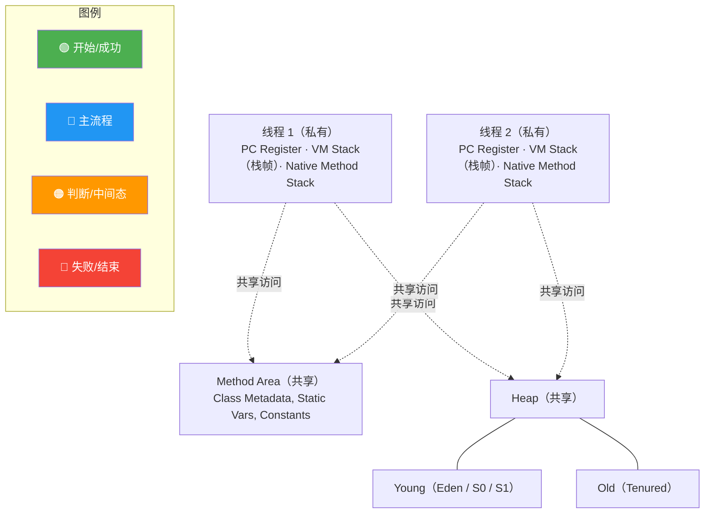

# 什么是共享数据区？

### JVM 运行时数据区 - 共享数据区

**定义**：
共享数据区是被所有线程共享的内存区域，随虚拟机的启动/关闭而创建/销毁。主要包括：**堆** 和 **方法区**（元空间/永久代）。

**1. Java 堆**：
- **作用**：存放对象实例。几乎所有的对象实例都在这里分配内存。
- **细节**：
  - 是垃圾收集器管理的核心区域（GC 堆）。
  - 可细分为：**新生代**（Eden 区、Survivor From/To 区）和**老年代**。
  - 可通过 `-Xms` (初始堆大小) 和 `-Xmx` (最大堆大小) 调整。
  - 在物理上可以不连续，但在逻辑上应该被视为连续的。

**2. 方法区**：
- **作用**：存储已被虚拟机加载的**类型信息**、常量、静态变量、即时编译器编译后的代码缓存等数据。
- **细节**：
  - HotSpot 在 JDK 8 以前使用永久代实现，JDK 8 及以后使用元空间，使用本地内存。
  - 它与 Java 堆一样，是各个线程共享的内存区域。
  - 虽然 JVM 规范将其描述为堆的一个逻辑部分，但它有一个别名叫做“Non-Heap”（非堆），目的是与 Java 堆区分开来。



### 深化实战

**实战案例**：
- **堆溢出**：生产环境曾遇到批量导出功能未分页，一次性加载几十万对象到内存，触发 `OutOfMemoryError: Java heap space`。解决：通过 MAT 分析 Dump 文件定位大对象，优化逻辑分批处理，或调整 `-Xmx`。
- **元空间溢出**：在 Spring Boot 应用中，若频繁使用动态代理（如某些老旧框架）或动态生成类（CGLib），JDK 8 下可能导致 `Metaspace` 溢出。解决：调整 `-XX:MaxMetaspaceSize` 并排查代码中的类生成逻辑。

**代码示例**：
```java
/**
 * 模拟堆溢出
 * VM Args: -Xms20m -Xmx20m -XX:+HeapDumpOnOutOfMemoryError
 */
public class HeapOOM {
    static class OOMObject {}

    public static void main(String[] args) {
        List<OOMObject> list = new ArrayList<>();
        while (true) {
            list.add(new OOMObject()); // 不断在堆中创建对象，无法回收
        }
    }
}
```

## 常见考点
1. **堆和方法区是共享的，栈是私有的，为什么？**
   - 堆和方法区存储的是对象和类数据，需要被跨线程访问；栈存储方法调用链和局部变量，不需要线程间共享，否则会导致复杂的同步问题，也违反了封装性。
2. **栈是否是唯一的线程私有区域？**
   - 不是，还有程序计数器 和本地方法栈。
3. **栈溢出和堆溢出通常在什么场景发生？**
   - 栈溢出：递归过深或方法调用层级过深。
   - 堆溢出：创建了太多对象且无法回收，超过 `-Xmx` 限制。


## 记忆要点
- 共享区随JVM生命周期创建，因需跨线程访问数据，所以包含堆和方法区
- 堆存对象且是GC核心，逻辑分新生代(Eden/S)和老年代，物理可不连续但逻辑连续
- 方法区别名非堆，因存储类元数据、静态变量和常量；JDK8后由永久代改用元空间(本地内存)
- 栈私有而堆共享，因为局部变量无需跨线程同步，对象和类数据需被多线程共用
- 调参口诀：堆用-Xms/-Xmx调大小，元空间溢出(如动态代理生成类过多)用-XX:MaxMetaspaceSize控制

## 结构化回答

**30 秒电梯演讲：** 像外卖员在一个区域等单，哪家的餐好了就取哪家的，不用在每个店死等。

**展开框架：**
1. **事件驱动** — 基于事件驱动，轮询监听状态
2. **单线程** — 单线程管理多连接，减少线程切换
3. **相比非阻塞IO** — 相比非阻塞IO，轮询由内核完成效率更高

**收尾：** 这块我踩过一些坑，您想深入聊哪一段——原理细节、实战案例还是常见踩坑？

## 视频脚本

> 预计时长：3 分钟 | 由浅入深

| 时间 | 画面/字幕 | 口播台词 | 讲解要点 |
|------|----------|----------|----------|
| 0:00 | 标题卡：什么是共享数据区 | 今天这道题：什么是共享数据区。30 秒先给你讲清楚。 | 开场钩子 |
| 0:20 | 核心概念动画/示意图 | 像外卖员在一个区域等单，哪家的餐好了就取哪家的，不用在每个店死等。 | 核心概念 |
| 0:40 | 事件驱动示意图 | 基于事件驱动，轮询监听状态 | 事件驱动 |
| 1:10 | 总结卡 + 下期预告 | 记住今天这几个关键词，面试一定用得上。下期见。 | 收尾 |
