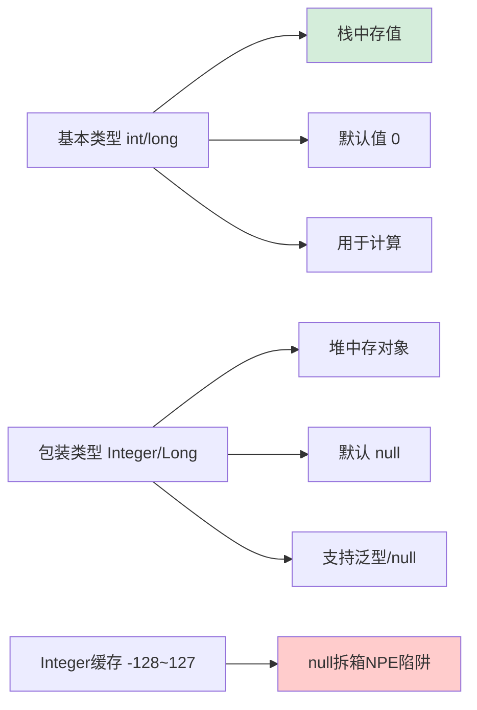

# 什么是热点代码？

### 什么是热点代码

从启动速度上看 解释器>C1编译器>C2编译器，从程序执行效率上看 C2>C1>解释器。随着C1性能监控搜集的信息越来越多，性能开销也越大。第⼆层和第三层基本是为第4层服务的，减少第四层编译执行的时间。

程序最后会在1或者4编译，C2编译出的效果最好，所以最后要进⼊4，但是如果一段程序本身就简单，可以优化的地方不多，那么就不值得花费时间去搜集程序执行信息，直接去第1层用C1编译就可以，这样编译的效果也很好。

通常情况下，热点代码会被第三层C1编译，然后交给第4层的C2编译。
在字节码较少的情况下，此时性能监控收集的数据很少，就交给第1层的C1进行编译。
在C1比较繁忙时，会在第0层解释执行收集程序执行状态数据，然后直接交给第4层的C2编译。
在C2繁忙的时候，先交给第2层的C1，再交给低3层的C1，最后交给第4层的C2。

#### 热点代码类型
1. 被多次调用的方法，触发标准编译请求。
2. 被多次执行的循环体，触发栈上编译请求（OSR）。

热点代码编译的都是整个方法体。即使是方法中的循环体被认定是热点代码，热点只是整个方法的一部分，但编译器依然必须以整个方法作为编译对象，只是执行⼊口（从方法第几条指令开始执行）有不同。

编译时会传⼊⼊口点字节码序号，这种编译方式因为 编译发生在方法执行的过程中因此称为”栈上替换（OSR）“，即方法还在方法栈上但是具体执行的指令已经被替换了，注意方法栈本身并没有改变也没有移动，只是执行到热点代码时去内存中读取编译后的方法。因为循环体是从某条指令开始执行，一轮完成之后会再次跳转到开始位置，所只传⼊一个⼊口点序号就可以（⼊口点也是出口）。

#### 热点探测
判断一个方法是不是热点代码，需不需要出发即时编译。主流有两种方法：
1. **基于采样的热点探测**：
   虚拟机会周期性地检查各个线程的调用栈顶，如果发现某个（或某些）方法经常出现在栈顶，那这个方法就是“热点方法”。好处是实现简单，只需要采样当前的栈顶即可。缺点是精度不行，容易因为受到线程阻塞或别的外界因素的影响而扰乱热点探测。

2. **基于计数器的热点探测**：
   虚拟机为每个方法建立计数器，统计执行次数，超过一定阈值则认为是热点代码。好处是结果精确，缺点是比较麻烦，为每个方法建立计数器。
   HotSpot 采用此种方法，给每个方法准备两类计数器：**方法调用计数器**和**回边计数器**。

**方法调用计数器**：
统计方法被调用的次数。方法调用时判断是否存在编译后的版本，如果存在则执行编译后的本地代码。如果不存在，方法计数器+1，和阈值比较判断是否触发即时编译。一旦超过，申请即时编译。

- **统计绝对次数**：统计方法所有时间段内执行次数，计数器值不会减少。只要程序执行足够多，一定会触发即时编译。
- **统计相对次数**：统计一段时间执行次数，如果超出时间还未能出发即时编译，统计次数减少一半。这个称为方法调用计数器热度的衰减，这段时间半衰周期。默认统计相对次数。

**回边计数器**：
统计一个方法中循环体代码执行的次数，在字节码中遇到控制流向后跳转的指令就称为“回边“。当计数达到阈值后会触发栈上的替换操作（OSR），每个循环体都应该有一个回边计数器，所以一个方法内可能存在多个回边计数器。回边调用只记录绝对次数，触发的阈值可以间接设置。

### 深化实战

**实战案例**：
- **分层编译**：JDK 7 之后默认开启分层编译，启动初期解释执行快速响应，随着运行时间推移，C1 和 C2 编译器介入提升吞吐量。若发现服务启动后 CPU 飙升但吞吐未明显提升，可能触发了大量 C2 编译，可通过 `-XX:TieredStopAtLevel=1` 限制只使用 C1 来调试或降低 CPU 峰值（牺牲部分峰值性能）。
- **OSR 掉坑**：有时循环体内代码很热触发了 OSR 编译，但编译后的代码仅对循环生效，方法退出后再次调用时未编译，导致性能出现“忽快忽慢”的现象。

**代码示例**：
```java
/**
 * 演示热点代码探测与 OSR (On-Stack Replacement)
 * 运行时可通过 -XX:CompileThreshold=1000 调整阈值观察编译行为
 * 或使用 -XX:+PrintCompilation 查看编译日志
 */
public class HotSpotDemo {

    public static void main(String[] args) {
        long start = System.currentTimeMillis();
        
        // 场景：循环体是热点（回边计数器增加）
        // 当超过阈值，JVM 会编译整个方法，但执行入口会切换到循环体开始处（OSR）
        int sum = 0;
        for (int i = 0; i < 20000; i++) {
            sum += factorial(i); // 方法调用增加调用计数器
        }
        
        System.out.println("Result: " + sum);
        System.out.println("Time: " + (System.currentTimeMillis() - start));
    }

    // 简单的计算方法，会被识别为热点方法并进行 JIT 编译
    private static int factorial(int n) {
        if (n == 0) return 1;
        return n * factorial(n - 1);
    }
}
```


## 核心流程图



## 记忆要点

- 核心思想：单线程通过注册监听，同时管理成千上万个Socket连接
- 工作原理：内核负责轮询，把就绪事件通知用户线程处理，避免CPU空转
- Linux高效基石：Epoll基于事件回调机制，时间复杂度O(1)，无连接数限制
- 架构基石：Java NIO底层依赖多路复用，支撑Netty解决C10K高并发

## 结构化回答


**30 秒电梯演讲：** 基本类型是“零钱”，包装类型是“钱包（装零钱的）”，后者能null但占空间。

**展开框架：**
1. **存储** — 基本类型栈中存值，包装类型堆中存对象
2. **默认值** — 基本类型有默认值（如0），包装类型默认null
3. **使用** — 包装类型支持泛型和null，基本类型用于计算

**收尾：** 这是我实战中的理解，您想深入哪一段？


## 视频脚本

> 预计时长：3 分钟 | 由浅入深

| 时间 | 画面/字幕 | 口播台词 | 讲解要点 |
|------|----------|----------|----------|
| 0:00 | 标题卡：什么是热点代码 | 今天这道题：什么是热点代码。30 秒先给你讲清楚。 | 开场钩子 |
| 0:20 | 核心概念动画/示意图 | 基本类型是“零钱”，包装类型是“钱包（装零钱的）”，后者能null但占空间。 | 核心概念 |
| 0:40 | 存储示意图 | 存储：基本类型栈中存值，包装类型堆中存对象 | 存储 |
| 1:10 | 总结卡 + 下期预告 | 记住今天这几个关键词，面试一定用得上。下期见。 | 收尾 |
