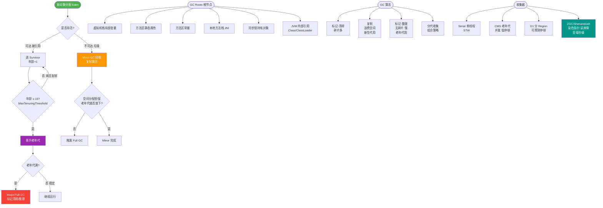

# GC分代收集算法 VS 分区收集算法？

**分代收集算法**：
基于对象存活周期的不同，将内存划分为新生代和老年代。新生代存活率低，采用复制算法；老年代存活率高，采用标记-整理或标记-清除算法。

**分区收集算法**：
将堆内存划分为多个大小相等的独立区域，不强制要求物理上分代。可以跟踪每个区域的垃圾收集进度，只回收部分区域（G1收集器的基础），从而避免全堆回收。

---

### 深度解析

**核心原理对比：**
1.  **分代收集**：假设“弱分代假说”，即绝大多数对象都是朝生夕死的。它将堆物理隔离为新生代和老年代。
    *   **优点**：针对不同代的生命周期选择最优算法（新生代复制，老年代标记-整理），效率高。
    *   **缺点**：存在内存碎片风险（标记-清除）；跨代引用需要扫描整个老年代，解决方式是**写屏障** + **卡表** 记录跨代引用；很难做到以毫秒为单位的停顿时间控制。

2.  **分区收集**：打破物理分代，将堆划分为数千个大小相等的 Region。动态分配 Region 给新生代或老年代。
    *   **优点**：可预测停顿时间（用户指定 M 毫秒停顿，G1 回收收益最高的 M 毫秒垃圾）；通过复制算法实现 Region 整体移动，消除碎片；只需回收部分 Region，不需要全堆扫描（利用 Remembered Set 处理跨代引用）。
    *   **缺点**：G1 为了维护 Remembered Set 和记忆集，会占用约 10%-20% 的堆内存；CPU 负载相对 CMS 略高。

### 架构对比图

**分代模型布局：**
```
+-------------------------------------------------------+
|                   Java Heap                           |
|  +-------------------+      +----------------------+  |
|  |    Young Gen      |      |      Old Gen        |  |
|  |  (Eden + S0 + S1)  | ---> |  (Mark-Sweep/Compact)|  |
|  +-------------------+      +----------------------+  |
+-------------------------------------------------------+
```

**分区模型布局：**
```
+-------------------------------------------------------+
|                   Java Heap (Regions)                 |
|  +---+---+---+---+---+---+---+---+---+---+---+---+    |
|  | E | E | S | O | O | H | E | S | O | E | E | ... |    |
|  +---+---+---+---+---+---+---+---+---+---+---+---+    |
|  (E=Eden, S=Survivor, O=Old, H=Humongous)             |
|  垃圾回收时：只选择部分 Region (Garbage-First)        |
+-------------------------------------------------------+
```

### ## 常见考点
1.  **为什么新生代用复制算法，老年代用标记整理？**
    *   新生代存活率低，复制少量存活对象效率高且无碎片；老年代存活率高，复制成本大，且需要整理碎片以备大对象分配。
2.  **跨代引用如何处理？**
    *   分代收集通常使用**卡表** 和**写屏障**：当老年代引用新生代对象时，在卡表标记为 Dirty，GC 时只扫描 Dirty 卡对应的内存块。
3.  **G1 为什么叫 Garbage-First？**
    *   它会跟踪每个 Region 的垃圾堆积价值（回收所得空间大小和回收耗时），在后台维护一个优先列表，每次根据允许的停顿时间优先回收垃圾最多的 Region。
4.  **CMS 和 G1 的区别？**
    *   CMS 是基于**标记-清除**算法的，关注低停顿但有碎片；G1 是基于**复制+标记-整理**的，关注可预测停顿且无碎片，且 G1 是物理分区。

---

### 实战深化

#### 1. 实战案例：大堆下的停顿问题
在 **32GB 大内存** 且 **CMS 分代收集** 的场景下，Full GC 会导致单次停顿超过 10 秒，严重影响 SLA。切换到 **G1 分区收集** 并配置 `-XX:MaxGCPauseMillis=200` 后，系统将回收拆分为多个 200ms 左右的小任务，虽然吞吐量略有下降，但彻底消除了秒级卡顿。

#### 2. 选型对比表格
| 维度 | 分代收集 (如 Parallel, CMS) | 分区收集 (如 G1, ZGC) |
| :--- | :--- | :--- |
| **内存布局** | 物理隔离的连续内存块 (Eden/Old) | 离散的 Region 块 (不连续) |
| **适用场景** | 小于 6GB 堆内存，追求高吞吐 | 大于 6GB 堆内存，追求低延迟 |
| **碎片问题** | 老年代易产生碎片 (CMS Mark-Sweep) | 整体无碎片 (复制算法) |
| **停顿模型** | 不可控，内存越大停顿越长 | 可预测停顿时间 (User-defined) |
| **额外开销** | 较低 (仅需简单的 Card Table) | 较高 (RSet 占用 10%~20% Heap) |


## 核心流程图



## 记忆要点
- 分代基于生命周期划分：因为新生代朝生夕死所以用复制算法，老年代存活率高用标记-整理算法。
- 分区打破物理分代：因为将堆划分为大小相等的Region，所以能自定义停顿时间并按收益回收。
- 跨代引用解决对比：分代用卡表+写屏障，而G1分区收集使用RSet（记忆集）避免全堆扫描。
- 适用场景不同：分代收集适合小于6GB且追求吞吐量，而分区收集适合大内存且追求低延迟。

## 结构化回答

**30 秒电梯演讲：** 分代是把垃圾按新旧分开处理，分区是把房间切小块按需打扫。

**展开框架：**
1. **分代** — 分代利用了弱分代假说（大部分对象朝生夕死）
2. **新生代用复制** — 新生代用复制，老年代用整理
3. **分区将堆切分** — 分区将堆切分为Region，可控停顿时间

**收尾：** 这块我踩过一些坑，您想深入聊哪一段——原理细节、实战案例还是常见踩坑？

## 视频脚本

> 预计时长：4 分钟 | 由浅入深

| 时间 | 画面/字幕 | 口播台词 | 讲解要点 |
|------|----------|----------|----------|
| 0:00 | 标题卡：GC分代收集算法 VS 分区收集算法 | 今天这道题：GC分代收集算法 VS 分区收集算法。30 秒先给你讲清楚。 | 开场钩子 |
| 0:20 | 核心概念动画/示意图 | 分代是把垃圾按新旧分开处理，分区是把房间切小块按需打扫。 | 核心概念 |
| 0:40 | 分代示意图 | 分代利用了弱分代假说（大部分对象朝生夕死） | 分代 |
| 1:10 | 新生代用复制示意图 | 新生代用复制，老年代用整理 | 新生代用复制 |
| 1:40 | 总结卡 + 下期预告 | 记住今天这几个关键词，面试一定用得上。下期见。 | 收尾 |
