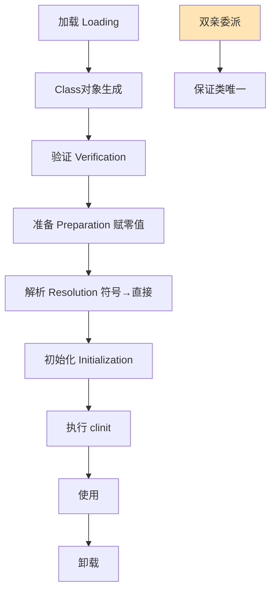

# JVM 类加载机制是什么？

JVM 类加载机制是指 JVM 将编译后的 `.class` 字节码文件加载到内存，并转换为运行时可用的 `Class` 对象的完整过程。整个过程分为五个阶段：**加载**（找到并读取字节码生成 Class 对象）、**验证**（校验字节码合法性防恶意代码）、**准备**（为静态变量分配内存赋零值）、**解析**（符号引用转直接引用）、**初始化**（执行 `<clinit>` 静态块）。加载过程遵循**双亲委派模型**——子类加载器先把请求委托给父加载器，保证核心类的唯一性和安全性。

## 技术原理

- **加载获取二进制流生成 Class 对象**：通过类的全限定名获取字节码二进制流（从 jar/网络/动态生成），转化为方法区的运行时数据结构，并在堆上生成一个 `Class` 对象作为方法区数据的访问入口。
- **验证确保字节码符合规范**：包含文件格式验证（魔数、版本）、元数据验证（语义合法）、字节码验证（数据流和控制流合法）、符号引用验证（解析阶段能否找到对应类）。这是防恶意字节码注入的关键防线。
- **准备阶段赋零值（final 除外）**：为类变量（`static`）在方法区分配内存并赋**默认零值**（如 int=0、引用=null）。`static final` 常量在此阶段直接赋声明值（因 ConstantValue 属性）。
- **解析符号引用为直接引用**：常量池里的符号引用（如 `Ljava/lang/String;`、方法名描述符）替换为内存直接指针/偏移量。可在初始化前（eager）或首次使用时（lazy）发生。
- **初始化执行 `<clinit>` 方法**：执行类构造器 `<clinit>`——合并所有 `static` 变量赋值和 `static {}` 块按源码顺序。JVM 保证 `<clinit>` 线程安全（同步）。触发时机：`new`/`getstatic`/`putstatic`/`invokestatic` 指令、反射调用、主类启动、子类初始化触发父类初始化。
- **双亲委派保证类加载唯一性**：类加载器收到请求时先委托父加载器，父加载失败才自己加载。层级：Bootstrap（核心 rt.jar）→ Extension（ext 目录）→ Application（classpath）→ 自定义。这保证 `java.lang.Object` 永远由 Bootstrap 加载，防止自定义同名类篡改。

## 代码示例

观察类加载过程：

```bash
# 打印类加载日志，能看到加载顺序
java -verbose:class -cp app.jar com.app.Main
# [Loaded java.lang.Object from .../lib/rt.jar]
# [Loaded com.app.Main from file:.../app.jar]
```

触发初始化 vs 不触发：

```java
class Config {
    static { System.out.println("Config <clinit> 执行"); }
    static int VALUE = 42;
}

// 触发初始化的情况
new Config();                       // new
int v = Config.VALUE;               // getstatic
Class.forName("com.app.Config");    // 反射

// 不触发初始化的情况
Config[] arr = new Config[10];      // 数组创建不触发
Class<?> c = Config.class;          // 类字面量不触发（编译期已知）
```

## 双亲委派模型

```
        Bootstrap ClassLoader        (JVM 内部，加载 rt.jar 核心 API)
                ↑ 委派
        Extension ClassLoader        (加载 jre/lib/ext)
                ↑ 委派
        Application ClassLoader      (加载 classpath)
                ↑ 委派
        自定义 ClassLoader            (Tomcat/Web 容器等)
```

## 常见坑/注意事项

- **`<clinit>` 死锁**：多线程同时触发相互引用的类初始化会死锁（JVM 只对单类 `<clinit>` 加锁）。复杂循环依赖要重构。
- **`<clinit>` 异常导致类不可用**：`<clinit>` 抛异常后该类进入"错误状态"，后续任何初始化尝试都抛 `NoClassDefFoundError`（不是首次的 `ExceptionInInitializerError`）。
- **打破双亲委派的场景**：SPI（JDBC 用 `ServiceLoader` 让 Bootstrap 加载的类反向调 Application 类的驱动）用 `Thread.context ClassLoader`；热部署（Tomcat）每个 webapp 一个 ClassLoader 实现隔离。
- **类相等需 ClassLoader 相同**：同一个类被不同 ClassLoader 加载得到的是"两个不同的 Class"，`instanceof` 会失败——这是 JNDI、热部署的常见坑。
- **加载和初始化时机不同**：加载 + 链接（验证/准备/解析）可在初始化前预热，但 JVM 规范允许实现延迟，只有初始化时机是明确规定的。


## 核心流程图



## 记忆要点

- 类加载过程是按顺序执行的：加载、验证、准备、解析、初始化五个阶段依次进行。
- 准备阶段赋零值而初始化赋真实值：静态变量在准备阶段赋默认零值，在初始化阶段执行赋值逻辑。
- 因为解析阶段将符号引用替换为直接引用，所以方法与字段的真实内存地址在此时确定。
- 初始化触发时机：遇到new、getstatic等指令或主类启动时，才会真正执行类构造器<clinit>方法。

## 结构化回答


**30 秒电梯演讲：** 像看书：买书（加载）、验真伪（验证）、做笔记（准备）、查目录（解析）、正式阅读（初始化）。

**展开框架：**
1. **Class** — 加载获取二进制流生成Class对象
2. **准备阶段赋零** — 准备阶段赋零值（final除外）
3. **解析符号引用为直接引** — 解析符号引用为直接引用

**收尾：** 这是我实战中的理解，您想深入哪一段？


## 视频脚本

> 预计时长：4 分钟 | 由浅入深

| 时间 | 画面/字幕 | 口播台词 | 讲解要点 |
|------|----------|----------|----------|
| 0:00 | 标题卡：JVM 类加载机制是什么 | 今天这道题：JVM 类加载机制是什么。30 秒先给你讲清楚。 | 开场钩子 |
| 0:20 | 核心概念动画/示意图 | 像看书：买书（加载）、验真伪（验证）、做笔记（准备）、查目录（解析）、正式阅读（初始化）。 | 核心概念 |
| 0:40 | 加载获取二进制流生成示意图 | 加载获取二进制流生成Class对象 | 加载获取二进制流生成 |
| 1:10 | 准备阶段赋零值（final示意图 | 准备阶段赋零值（final除外） | 准备阶段赋零值（final |
| 1:40 | 总结卡 + 下期预告 | 记住今天这几个关键词，面试一定用得上。下期见。 | 收尾 |
