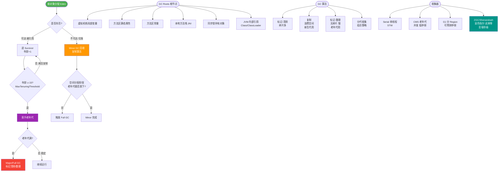

# JVM之经典收集器---G1是什么？

**G1 (Garbage-First) 收集器**：

是一款面向服务端的垃圾收集器，它将堆内存划分为多个大小相等的独立区域。G1 可以预测停顿时间，它不再物理隔离新生代和老年代，而是通过 Region 之间的动态分配来实现逻辑上的分代。它通过复制算法实现 Region 内的回收，整体上看是标记-整理算法，局部（两个 Region 之间）看是复制算法。

---

### 深度解析

**关键机制：**
1.  **Region 内存布局**：
    *   堆被划分为多个大小相等的 Region（通常 2048 个）。Region 不要求物理连续。
    *   **Humongous Region**：专门存储超过 Region 大小 50% 以上的巨型对象，通常直接分配在老年代。

2.  **Remembered Set (RSet/记忆集)**：
    *   G1 的核心痛点是解决跨 Region 引用问题（全堆扫描代价太大）。
    *   每个 Region 都有一个 RSet，记录**“谁引用了我”**（即指向该 Region 的外部引用）。
    *   实现：使用 **Hash Table**，Key 是引用它的其他 Region 的起始地址，Value 是内部卡表的索引。
    *   写屏障：当对象发生引用变更时，JVM 会拦截更新操作，维护 RSet。

3.  **运行过程**：
    *   **Young GC**：回收所有 Eden 区和 Survivor 区，利用 RSet 只扫描引用了新生代的老年代 Region。
    *   **Concurrent Marking**：并发标记阶段，在整个堆中进行可达性分析，找出存活对象。
    *   **Mixed GC**：回收整个新生代 + 部分老年代（垃圾占比高的 Region）。

### G1 运作流程图

```
       +-------------------+
       |    Young GC       | (Eden 满，触发复制存活对象)
       +---------+---------+
                 |
                 v
       +---------+---------+
       |   Global Marking  | (并发标记阶段，计算 Region 回
       +---------+---------+  收价值，可达性分析)
                 |
      (堆占用 > 45%?) --Yes---> +---------+---------+
                               |    Mixed GC      | (STW, 回收新生代 + 
                               +-------------------+  高收益老年代 Region)
```

### ## 常见考点
1.  **G1 与 CMS 的核心区别？**
    *   算法上，CMS 是标记-清除（有碎片）；G1 是整体看标记-整理，局部看复制（无碎片）。
    *   内存布局上，CMS 是物理分代；G1 是 Region 分区。
    *   停顿目标上，CMS 尽量缩短 STW；G1 是可预测停顿时间模型。
2.  **G1 的 RSet 是什么？有什么作用？**
    *   Remembered Set。用于解决跨 Region 引用，记录了别的 Region 中引用当前 Region 的对象指针。这样在 Mixed GC 时，不需要扫描整个堆，只需扫描 RSet。
3.  **什么时候触发 Full GC？**
    *   如果 CMS/G1 并发标记期间发现回收速度赶不上分配速度（或者内存碎片化严重），导致分配失败，会退化为 Serial Old 收集器进行 Full GC（单线程，停顿极长）。
4.  **G1 为什么适合大堆？**
    *   分区机制使得回收可以分批进行，不需要一次性处理整个大堆，且通过 RSet 避免了全堆扫描。

---

### 实战深化

#### 1. 实战案例：G1 的 Evacuation Failure (疏散失败)
在 Promotion Failed 或 Evacuation Failure 时，G1 会退化为 Single-threaded Full GC。这通常是因为 **Survivor 区空间不足** 或 **Humongous Region 对象回收失败** 导致。实战中，通过调大 `-XX:G1ReservePercent`（默认 10%）预留更多内存，或优化 `-XX:InitiatingHeapOccupancyPercent`（提前触发并发标记，默认 45%）可以有效规避此类 Full GC。

#### 2. 关键调优代码参数
```bash
# -XX:MaxGCPauseMillis=200    # 期望最大停顿时间 (G1 试图通过调整回收 Region 数量来达标)
# -XX:G1HeapRegionSize=16m   # Region 大小 (通常为堆的 1/2000，需平衡大对象分配和指针开销)
# -XX:ParallelGCThreads=8    # STW 时的并发线程数
```

#### 3. G1 与 CMS 选型对比
| 特性 | CMS (Concurrent Mark Sweep) | G1 (Garbage First) |
| :--- | :--- | :--- |
| **内存布局** | 物理分代 (连续) | 逻辑分代，物理分区 (离散) |
| **回收算法** | 标记-清除 (有碎片) | 标记-整理 + 复制 (无碎片) |
| **停顿控制** | 尽力缩短 STW，无法预测 | **可预测停顿模型** (Real-time) |
| **适用堆大小** | < 6GB (大堆下标记扫描耗时过长) | **> 6GB** (大堆下表现优异) |
| **CPU 开销** | 较低 (并发阶段占用 CPU) | 较高 (RSet 维护占用 ~10-20% CPU) |


## 核心流程图



## 记忆要点
- 内存布局对比：G1物理分区而逻辑分代，将堆划分为多个大小相等的Region，不再物理隔离。
- 回收算法结合：G1从整体看是标记-整理（无碎片），从局部（两个Region间）看是复制算法。
- 核心机制RSet：因为每个Region维护记忆集记录谁引用了我，所以避免了全堆扫描解决跨Region引用。
- 可预测停顿模型：用户设置期望停顿时间，G1优先回收垃圾最多的Region（Garbage-First）。

## 结构化回答


**30 秒电梯演讲：** 把大仓库切成很多小格子，哪里脏了扫哪里，还能控制打扫时长。

**展开框架：**
1. **Region** — 堆划分为多个大小相等的Region
2. **可预测停顿时** — 可预测停顿时间（建立可预测的模型）
3. **无物理分代** — 无物理分代，逻辑分代

**收尾：** 这是我实战中的理解，您想深入哪一段？


## 视频脚本

> 预计时长：4 分钟 | 由浅入深

| 时间 | 画面/字幕 | 口播台词 | 讲解要点 |
|------|----------|----------|----------|
| 0:00 | 标题卡：JVM之经典收集器---G1是什么 | 今天这道题：JVM之经典收集器---G1是什么。30 秒先给你讲清楚。 | 开场钩子 |
| 0:20 | 核心概念动画/示意图 | 把大仓库切成很多小格子，哪里脏了扫哪里，还能控制打扫时长。 | 核心概念 |
| 0:40 | 堆划分示意图 | 堆划分为多个大小相等的Region | 堆划分 |
| 1:10 | 预测停顿时间（建立示意图 | 可预测停顿时间（建立可预测的模型） | 预测停顿时间（建立 |
| 1:40 | 总结卡 + 下期预告 | 记住今天这几个关键词，面试一定用得上。下期见。 | 收尾 |
