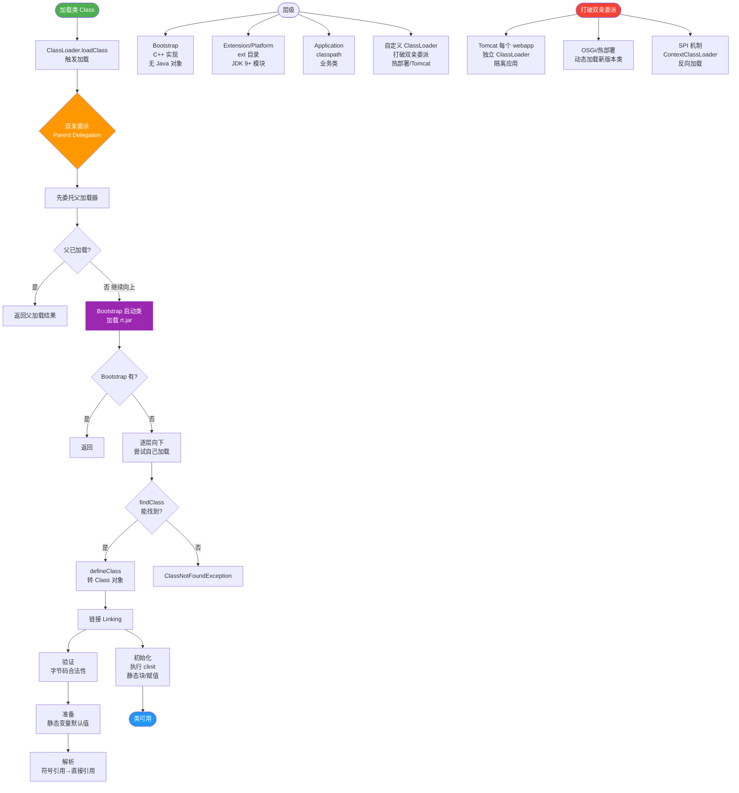

# JVM双亲委派模型的工作原理是什么？

启动类加载器(Bootstrap ClassLoader)
1. 负责加载 JAVA_HOME\lib 目录中的，或通过-Xbootclasspath 参数指定路径中的，且被
虚拟机认可（按文件名识别，如rt.jar）的类。

扩展类加载器(Extension ClassLoader)
2. 负责加载 JAVA_HOME\lib\ext 目录中的，或通过java.ext.dirs 系统变量指定路径中的类
库。

应用程序类加载器(Application ClassLoader)：
3. 负责加载用户路径上的类库。
JVM 通过双亲委派模型进行类的加载，当然我们也可以通过继承java.lang.ClassLoader
实现自定义的类加载器。

2.9.3. 双亲委派
当一个类收到了类加载请求，他首先不会尝试自己去加载这个类，而是把这个请求委派给父
类去完成，每一个层次类加载器都是如此，因此所有的加载请求都应该传送到启动类加载其中，
只有当父类加载器反馈自己无法完成这个请求的时候（在它的加载路径下没有找到所需加载的
Class），子类加载器才会尝试自己去加载。
采用双亲委派的一个好处是比如加载位于rt.jar 包中的类java.lang.Object，不管是哪个加载
器加载这个类，最终都是委托给顶层的启动类加载器进行加载，这样就保证了使用不同的类加载
器最终得到的都是同样一个Object 对象。

---

### 深度解析

**源码逻辑：**
双亲委派的实现逻辑在 `java.lang.ClassLoader.loadClass(String name, boolean resolve)` 方法中：
1.  **检查缓存**：`findLoadedClass(name)`，看是否已加载。
2.  **委派父类**：若无，调用父加载器的 `loadClass`（`parent.loadClass`）。
3.  **自身加载**：若父加载器无法完成（抛出异常或返回null），调用自己的 `findClass(name)` 尝试加载。

**打破双亲委派：**
双亲委派是一个推荐的模型，但不是强制的规则。常见打破场景：
*   **SPI (Service Provider Interface)**：如 JDBC (java.sql.Driver)。接口在 rt.jar (BootStrap 加载)，但实现类 (如 com.mysql.jdbc.Driver) 在 classpath (App 加载)。BootStrap 加载器无法“向下”去加载用户代码，于是利用 **Thread Context ClassLoader (TCCL)** 获取当前线程的上下文加载器（通常为 AppClassLoader）来加载第三方实现。
*   **Web 容器**：如 Tomcat。多个 WebApp 可能依赖不同版本的 Spring 或其他库，需要实现类隔离。Tomcat 会优先加载 WebApp 自己的类，找不到再委派父类，从而实现应用级隔离。
*   **热部署**：OSGi 等模块化技术，通过网状加载结构替换树状结构。

### 双亲委派流程图

```
+----------------------+
|  App ClassLoader     | <--- 收到加载请求
+----------+-----------+
           |
           | 1. check cache (No)
           |
           v
+----------------------+
|  Ext ClassLoader     |
+----------+-----------+
           |
           | 2. Parent.loadClass()
           |
           v
+----------------------+
|  Bootstrap ClassLoader|
+----------+-----------+
           |
           | 3. 尝试加载
           +---> 成功: 返回 Class
           |
           | 失败: ClassNotFoundException
           v
+----------------------+
|  Ext ClassLoader     |
+----------+-----------+
           |
           | 4. findClass() -> 失败
           |

---

### 实战深化

#### 1. 实战案例：Jar 包冲突导致的方法找不到
当项目中同时引入 `Spring A` (依赖 `commons-lang 2.6`) 和 `Spring B` (依赖 `commons-lang 3.6`) 时，双亲委派保证了类加载的唯一性。如果 JVM 加载了错误的 Jar 包版本（例如应用优先加载了低版本），且代码中调用了仅在高版本中存在的方法，运行时会抛出 `java.lang.NoSuchMethodError`。**解决思路**：利用 Maven `mvn dependency:tree` 排除冲突依赖，或自定义 ClassLoader 在不同模块间隔离类版本。

#### 2. 代码示例：打破双亲委派（自定义加载器）
```java
// Java
public class CustomClassLoader extends ClassLoader {
    private String classPath;

    public CustomClassLoader(String classPath) {
        this.classPath = classPath;
    }

    @Override
    protected Class<?> findClass(String name) throws ClassNotFoundException {
        try {
            byte[] data = loadByte(name); // 自定义读取字节码逻辑
            return defineClass(name, data, 0, data.length);
        } catch (Exception e) {
            throw new ClassNotFoundException(name);
        }
    }
    // 1. 重写 loadClass 即可打破双亲委派（优先自己加载）
    @Override
    public Class<?> loadClass(String name) throws ClassNotFoundException {
        if (name.startsWith("java.")) { // 核心类仍需双亲委派
            return super.loadClass(name);
        }
        // 2. 尝试自己加载
        Class<?> clazz = findLoadedClass(name);
        if (clazz == null) {
            clazz = findClass(name);
        }
        return clazz;
    }
}
```

#### 3. 场景对比：双亲委派 vs 破坏委派
| 场景 | 加载策略 | 核心目的 | 示例 |
| :--- | :--- | :--- | :--- |
| **标准 Java 应用** | 双亲委派 | 保证 Java 核心类安全与唯一性 | `java.lang.Object` 不会被覆盖 |
| **JDBC / SPI** | 线程上下文类加载器 (TCCL) | 让启动类加载器能加载用户类 | `DriverManager` 加载 MySQL Driver |
| **Tomcat / OSGi** | 隔离加载 / 网状结构 | 实现模块间依赖隔离与版本共存 | 两个 WebApp 运行不同版本的 Spring |


## 核心流程图



## 记忆要点
- 自底向上委派：因为收到加载请求先委派给父类，所以总由顶层加载器统一加载保证唯一性。
- 三层加载器对比：BootStrap加载核心库，Ext加载扩展库，App加载用户类路径（classpath）。
- 源码逻辑：加载时先检查缓存，再委派父类加载，只有父类失败时子类才会自己尝试findClass加载。
- 打破模型场景：因为SPI机制和Tomcat类隔离需求，所以用线程上下文加载器或自定义加载器打破双亲委派。

## 结构化回答


**30 秒电梯演讲：** 找东西：问爸爸，爸爸问爷爷，爷爷没有再自己找。

**展开框架：**
1. **自底向上检查类** — 自底向上检查类是否已加载
2. **自顶向下尝试** — 自顶向下尝试加载类
3. **Java** — 保证Java核心类库安全

**收尾：** 这是我实战中的理解，您想深入哪一段？


## 视频脚本

> 预计时长：4 分钟 | 由浅入深

| 时间 | 画面/字幕 | 口播台词 | 讲解要点 |
|------|----------|----------|----------|
| 0:00 | 标题卡：JVM双亲委派模型的工作原理是什么 | 今天这道题：JVM双亲委派模型的工作原理是什么。30 秒先给你讲清楚。 | 开场钩子 |
| 0:20 | 核心概念动画/示意图 | 找东西：问爸爸，爸爸问爷爷，爷爷没有再自己找。 | 核心概念 |
| 0:40 | 自底向上检查类示意图 | 自底向上检查类是否已加载 | 自底向上检查类 |
| 1:10 | 自顶向下尝试加载类示意图 | 自顶向下尝试加载类 | 自顶向下尝试加载类 |
| 1:40 | 总结卡 + 下期预告 | 记住今天这几个关键词，面试一定用得上。下期见。 | 收尾 |

---

## 延伸：什么是双亲委派模型？为什么要用？

> 合并自 `jvm-077`（相似度 78%）

### 双亲委派模型原理
双亲委派模型要求除了顶层的启动类加载器外，其余的类加载器都应当有自己的父类加载器。**工作流程**：
1. 类加载器收到类加载请求。
2. 将请求**委派**给父类加载器去完成。
3. 递归向上委派，直至启动类加载器。
4. 只有父类加载器反馈自己无法完成这个加载请求（找不到所需的类）时，子加载器才会尝试自己去加载。

### 三层类加载器
1. **启动类加载器**
   - C++ 实现，是 JVM 自身的一部分。
   - 负责加载 JVM 的核心类库，如 `JAVA_HOME/lib/rt.jar`、`resources.jar` 等。
2. **扩展类加载器**
   - Java 实现 (`sun.misc.Launcher$ExtClassLoader`)。
   - 负责加载 `JAVA_HOME/lib/ext` 目录下的，或者被 `java.ext.dirs` 系统变量所指定的路径中的所有类库。
3. **应用程序类加载器**
   - Java 实现 (`sun.misc.Launcher$AppClassLoader`)。
   - 负责加载用户类路径 (`ClassPath`) 上所指定的类库。是程序中默认的类加载器。

### 为什么要用双亲委派？
1. **安全性**：防止核心 API 被篡改。例如用户自定义一个 `java.lang.String` 类，如果没有双亲委派，JVM 会加载用户的类，导致系统崩溃或安全隐患。有了双亲委派，JVM 始终加载 `rt.jar` 中的标准类。
2. **避免重复加载**：父加载器已经加载过的类，子加载器无需再次加载，提高了加载效率。
3. **保证 Java 核心类的唯一性**：确保全限定类名相同的类在内存中只存在一份，避免类型混淆。

### 架构图
```text
            ┌──────────────────────┐
            │  Bootstrap ClassLoader│ (启动类加载器)
            │      (C++ 实现)       │
            └──────────┬───────────┘
                       │
                       ▼
            ┌──────────────────────┐
            │ Extension ClassLoader│ (扩展类加载器)
            │    (Java 实现)        │
            └──────────┬───────────┘
                       │
                       ▼
            ┌──────────────────────┐
            │ Application ClassLoader│ (应用类加载器)
            │    (Java 实现)        │
            └──────────────────────┘
                       ▲
                       │
              用户自定义类加载器
```

## 常见考点
1. **如何自定义类加载器以及需要注意什么？**（继承 `ClassLoader`，重写 `findClass` 方法，遵循双亲委派需调用 `super.loadClass`）。
2. **类加载器的双亲委派是如何在代码层面实现的？**（`java.lang.ClassLoader.loadClass` 方法的逻辑）。
3. **为什么需要打破双亲委派？**（SPI 机制、Web 容器隔离等场景）。

## 记忆要点

- 一句话定义：收到加载请求时，层层向上委派给父加载器，父加载不到才自己加载
- 三层架构：启动类加载核心库，扩展类加载 ext 目录，应用类加载 ClassPath
- 安全防篡改：防止用户自定义 java.lang.String 篡改核心 API，保证系统安全
- 避免重复加载：保证全限定类名相同的类在内存中只存在一份，避免类型混淆

## 结构化回答

**30 秒电梯演讲：** 找东西先问老爸，老爸没有再自己找，防止家里的东西被调包。

**展开框架：**
1. **加载顺序** — 加载顺序：App→Ext→Bootstrap，逆向委托
2. **核心类** — 核心类由Bootstrap加载防篡改
3. **避免重复加载** — 避免重复加载，保证类唯一性

**收尾：** 这块我踩过一些坑，您想深入聊哪一段——原理细节、实战案例还是常见踩坑？

## 视频脚本

> 预计时长：3 分钟 | 由浅入深

| 时间 | 画面/字幕 | 口播台词 | 讲解要点 |
|------|----------|----------|----------|
| 0:00 | 标题卡：什么是双亲委派模型？为什么要用 | 今天这道题：什么是双亲委派模型？为什么要用。30 秒先给你讲清楚。 | 开场钩子 |
| 0:20 | 核心概念动画/示意图 | 找东西先问老爸，老爸没有再自己找，防止家里的东西被调包。 | 核心概念 |
| 0:40 | 加载顺序示意图 | 加载顺序：App→Ext→Bootstrap，逆向委托 | 加载顺序 |
| 1:10 | 总结卡 + 下期预告 | 记住今天这几个关键词，面试一定用得上。下期见。 | 收尾 |

---

## 延伸：为什么 SPI 机制（如 JDBC Driver）需要破坏双亲委派？ThreadContextClassLoader 如何解决？

> 合并自 `jvm-085`（相似度 65%）

【问题背景】
**双亲委派模型**：类加载请求先委托给父加载器（Bootstrap -> Extension -> Application）。
**SPI 场景冲突**：
- 接口（如 `java.sql.Driver`）定义在核心库（rt.jar），由 **BootstrapClassLoader** 加载。
- 实现类（如 `com.mysql.jdbc.Driver`）在第三方 jar 包中，位于 classpath，理应由 **AppClassLoader** 加载。
- 根据双亲委派，父加载器（Bootstrap）无法反向加载子加载器（App）路径下的类，因此 Bootstrap 中的代码无法直接实例化 Driver 实现。

【解决方案：Thread Context ClassLoader (TCCL)】
每个线程拥有一个独立的 `ContextClassLoader`（默认继承自父线程，通常初始为 `AppClassLoader`）。
核心 API（如 `java.sql.DriverManager`）利用 TCCL 来打破层级限制：
```java
// 核心库中的代码
Class.forName(driverClass, true, Thread.currentThread().getContextClassLoader());
```
这样，由 Bootstrap 加载的 DriverManager 类，通过调用当前线程绑定的 AppClassLoader，成功加载并实例化了 classpath 下的 SPI 实现类。

【SPI 机制详解】
1. **配置**：在 jar 包的 `META-INF/services/接口全限定名` 文件中写入实现类的全限定名。
2. **发现**：`java.util.ServiceLoader` 读取上述配置文件。
3. **加载**：`ServiceLoader.load()` 内部使用 TCCL 加载配置中列出的实现类。
4. **实例化**：通过反射实例化对象。

【双亲委派破坏的其他场景】
1. **Tomcat 类加载机制**：为了实现应用间隔离，每个 WebApp 拥有独立的 `WebAppClassLoader`。加载顺序优先自己加载，找不到再委托父加载器，从而允许不同 WebApp 运行同一库的不同版本。
2. **OSGi**：模块化系统，每个 Bundle 拥有自己的 ClassLoader，支持网状结构的委托和导入/导出声明，实现了热插拔。
3. **JDK 动态代理**：生成的代理类属于特定包（如 `com.sun.proxy`），由 `ProxyClassLoader` 定义，打破了标准委派。

【类加载架构示意图】
```text
   Bootstrap ClassLoader (rt.jar, java.sql.*)
       ▲
       │ (无法向下加载)
       │
   Extension ClassLoader (ext目录)
       ▲
       │
   Application ClassLoader (classpath)
       ▲
       │ (TCCL 桥接: 线程持有 ContextClassLoader 指向 AppClassLoader)
  ┌────┴──────────────────────────────┐
  │        Main Thread                │
  │  DriverManager.getConnection()    │
  └───────────────────────────────────┘
``` 

## 常见考点
1. **为什么 JDBC 4.0 不需要显式 Class.forName？**：因为 SPI 机制会自动利用 ServiceLoader 在 DriverManager 初始化时扫描并注册驱动。
2. **TCCL 内存泄漏风险**：在 Web 容器（如 Tomcat）中，如果线程池中的线程是从父线程继承的 TCCL，而应用卸载时未重置 TCCL，会导致应用无法被 GC 回收（ClassLoader 泄漏），最终引发 PermGen/Metaspace OOM。解决：线程归还前重置 `setContextClassLoader(null)` 或默认加载器。
3. **ServiceLoader 的缺点**：不支持按需加载（一次性加载所有实现类），不支持按配置灵活传参。
4. **双亲委派的破坏方式**：除了直接重写 `loadClass`（如 Tomcat），还有一种更温和的方式是重写 `findClass`（如默认实现），但在 SPI 场景下通常直接使用 TCCL 指定加载器。

## 记忆要点

- 核心冲突：核心接口由 Bootstrap 加载，无法反向找到 AppClassLoader 下的第三方实现
- 破局核心：TCCL（线程上下文加载器），父委派逆向加载的桥梁
- SPI四步曲：配置 -> ServiceLoader发现 -> TCCL加载 -> 反射实例化
- 经典场景：JDBC DriverManager 使用 TCCL 加载 classpath 下的驱动实现
- 其他破坏场景：Tomcat 隔离 WebApp 各自加载，OSGi 网状委托

## 结构化回答

**30 秒电梯演讲：** 父(Bootstrap)只认户口本(rt.jar)，子(第三方)带身份证(JDBC)，TCCL就是中间介绍人。

**展开框架：**
1. **接口** — 接口在核心库，实现在classpath，父加载器不可见
2. **DriverManager** — DriverManager使用TCCL加载驱动实现
3. **ServiceLoader.** — ServiceLoader.load底层依赖TCCL

**收尾：** 关于这个问题，我还可以展开聊——Tomcat如何破坏双亲委派？您想从哪个角度深入？

## 视频脚本

> 预计时长：5 分钟 | 由浅入深

| 时间 | 画面/字幕 | 口播台词 | 讲解要点 |
|------|----------|----------|----------|
| 0:00 | 标题卡：为什么 SPI 机制（如 JDBC Driver）需要破坏双亲委派？ThreadContextClassLoader 如何解决 | 今天这道题：为什么 SPI 机制（如 JDBC Driver）需要破坏双亲委派？ThreadContextClassLoader 如何解决。30 秒先给你讲清楚。 | 开场钩子 |
| 0:20 | 核心概念动画/示意图 | 父(Bootstrap)只认户口本(rt.jar)，子(第三方)带身份证(JDBC)，TCCL就是中间介绍人。 | 核心概念 |
| 0:40 | 接口示意图 | 接口在核心库，实现在classpath，父加载器不可见 | 接口 |
| 1:10 | DriverManager示意图 | DriverManager使用TCCL加载驱动实现 | DriverManager |
| 1:40 | ServiceLoader.示意图 | ServiceLoader.load底层依赖TCCL | ServiceLoader. |
| 2:10 | 总结卡 + 下期预告 | 记住三个词就能答好这道题。下期追问：Tomcat如何破坏双亲委派？类加载器结构是什么？ | 收尾 |

---

## 延伸：如何破坏双亲委派模型？有哪些实际应用？

> 合并自 `jvm-079`（相似度 67%）

### 如何破坏双亲委派模型？
双亲委派模型的逻辑集中在 `java.lang.ClassLoader.loadClass()` 方法中。要破坏它，就是**不遵循“先找父加载器”的逻辑**。
- **常规方式**：重写 `loadClass()` 方法，修改加载的顺序（例如先尝试自己加载，找不到再委派父加载器）。**注意**：通常自定义类加载器建议只重写 `findClass()`，因为那是父加载器找不到后的回调，符合双亲委派；只有破坏时才重写 `loadClass()`。

### 实际应用场景

#### 1. SPI (Service Provider Interface) 机制
- **背景**：核心接口（如 `java.sql.Driver`）定义在 `rt.jar`，由 Bootstrap 加载。具体实现（如 `com.mysql.jdbc.Driver`）在 ClassPath 下，Bootstrap 无法向下加载实现类。
- **破坏方式**：利用 **线程上下文类加载器**。JDK (如 `java.util.ServiceLoader`) 获取当前线程绑定的 ContextClassLoader（通常是 AppClassLoader），利用它加载第三方实现类。

#### 2. 热部署与模块化 (OSGi / Tomcat)
- **需求**：容器内运行的多个应用可能依赖同一个库的不同版本，或者应用需要在不重启容器的情况下重新加载类。
- **破坏方式**：每个应用模块拥有独立的类加载器。加载顺序修改为：**先加载本地类，加载不到再委派父加载器**。这样优先加载应用自己的类，而非父加载器（容器）的类，实现隔离和热替换。

#### 3. Tomcat 类加载机制
- **目的**：实现 Web 应用隔离，支持不同应用依赖不同版本的 jar 包（如 AppA 用 Spring 4，AppB 用 Spring 5），同时保证 Tomcat 自身库不被应用覆盖。
- **策略**：WebAppClassLoader 收到请求后，先尝试自己加载（`/WEB-INF/classes` 和 `/WEB-INF/lib`），找不到再委托给父加载器。但对于 `java.*` 开头的核心类，仍然必须委托父加载器。

### 流程对比图
```text
┌─────────────────┐      ┌──────────────────────┐
│ 标准双亲委派     │      │    破坏双亲委派        │
├─────────────────┤      ├──────────────────────┤
│ 1. 请求 AppLoader│      │ 1. 请求 WebAppLoader │
│ 2. 委派 ExtLoader│      │ 2. 自己先尝试加载      │
│ 3. 委派 Bootstrap│      │ 3. 找不到才委派父加载器 │
│ 4. Bootstrap加载 │      │ 4. 父加载器尝试加载    │
│ 5. Ext加载...    │      │ 5. ...               │
└─────────────────┘      └──────────────────────┘
```

## 常见考点
1. **JDBC 为什么需要破坏双亲委派？**（Driver 接口在 Java 核心库，实现类在厂商包，需要 TCCL 来桥接）。
2. **Tomcat 的类加载机制如何保证 JSP 的热修改？**（JSP 编译后的类改变时，销毁旧的 ClassLoader，新建一个加载新的类）。

## 记忆要点

- 破坏方式：重写 loadClass 方法，不走先父后子逻辑，改为优先自己加载
- SPI 机制：核心接口由启动类加载，具体实现类靠线程上下文类加载器反向加载
- Tomcat 隔离：每个 WebApp 独立类加载器，优先加载本地依赖，实现多应用版本隔离
- JDBC 场景：因为 Driver 接口在 rt.jar，而实现类在第三方包，所以必须破坏双亲委派

## 结构化回答


**30 秒电梯演讲：** 正常找东西先问长辈，热部署就是自己口袋里有了就不找长辈了。

**展开框架：**
1. **SPI** — SPI用TCCL让父加载器加载子类
2. **Tomcat** — Tomcat/WebApp优先加载自身WEB-INF类
3. **OSGi** — OSGi实现网状加载结构

**收尾：** 这是我实战中的理解，您想深入哪一段？


## 视频脚本

> 预计时长：4 分钟 | 由浅入深

| 时间 | 画面/字幕 | 口播台词 | 讲解要点 |
|------|----------|----------|----------|
| 0:00 | 标题卡：如何破坏双亲委派模型？有哪些实际应用 | 今天这道题：如何破坏双亲委派模型？有哪些实际应用。30 秒先给你讲清楚。 | 开场钩子 |
| 0:20 | 核心概念动画/示意图 | 正常找东西先问长辈，热部署就是自己口袋里有了就不找长辈了。 | 核心概念 |
| 0:40 | SPI用TCCL示意图 | SPI用TCCL让父加载器加载子类 | SPI用TCCL |
| 1:10 | Tomcat/WebApp示意图 | Tomcat/WebApp优先加载自身WEB-INF类 | Tomcat/WebApp |
| 1:40 | 总结卡 + 下期预告 | 记住今天这几个关键词，面试一定用得上。下期见。 | 收尾 |
