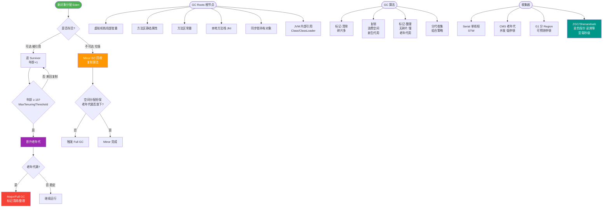

# JVM垃圾回收的算法有哪些？

垃圾回收与算法

2.4.1. 如何确定垃圾

引用计数法
在Java 中，引用和对象是有关联的。如果要操作对象则必须用引用进行。因此，很显然一个简单
的办法是通过引用计数来判断一个对象是否可以回收。简单说，即一个对象如果没有任何与之关
联的引用，即他们的引用计数都不为0，则说明对象不太可能再被用到，那么这个对象就是可回收
对象。

可达性分析
为了解决引用计数法的循环引用问题，Java 使用了可达性分析的方法。通过一系列的“GC roots”
对象作为起点搜索。如果在“GC roots”和一个对象之间没有可达路径，则称该对象是不可达的。

要注意的是，不可达对象不等价于可回收对象，不可达对象变为可回收对象至少要经过两次标记
过程。两次标记后仍然是可回收对象，则将面临回收。
2.4.2. 标记清除算法（Mark-Sweep）
最基础的垃圾回收算法，分为两个阶段，标注和清除。标记阶段标记出所有需要回收的对象，清
除阶段回收被标记的对象所占用的空间。如图

从图中我们就可以发现，该算法最大的问题是内存碎片化严重，后续可能发生大对象不能找到可
利用空间的问题。

2.4.3. 复制算法
为了解决Mark-Sweep 算法内存碎片化的缺陷而被提出的算法。按内存容量将内存划分为等大小
的两块。每次只使用其中一块，当这一块内存满后将尚存活的对象复制到另一块上去，把已使用
的内存清掉，如图：

这种算法虽然实现简单，内存效率高，不易产生碎片，但是最大的问题是可用内存被压缩到了原
本的一半。且存活对象增多的话，Copying 算法的效率会大大降低。

2.4.4. 标记整理算法(Mark-Compact)
结合了以上两个算法，为了避免缺陷而提出。标记阶段和Mark-Sweep 算法相同，标记后不是清
理对象，而是将存活对象移向内存的一端。然后清除端边界外的对象。如图：

2.4.5. 分代收集算法
分代收集法是目前大部分JVM 所采用的方法，其核心思想是根据对象存活的不同生命周期将内存
划分为不同的域，一般情况下将GC 堆划分为老生代(Tenured/Old Generation)和新生代(Young
Generation)。老生代的特点是每次垃圾回收时只有少量对象需要被回收，新生代的特点是每次垃
圾回收时都有大量垃圾需要被回收，因此可以根据不同区域选择不同的算法。

新生代与复制算法
目前大部分JVM 的GC 对于新生代都采取Copying 算法，因为新生代中每次垃圾回收都要
回收大部分对象，即要复制的操作比较少，但通常并不是按照1：1 来划分新生代。一般将新生代
划分为一块较大的Eden 空间和两个较小的Survivor 空间(From Space, To Space)，每次使用
Eden 空间和其中的一块Survivor 空间，当进行回收时，将该两块空间中还存活的对象复制到另
一块Survivor 空间中。

老年代与标记复制算法
而老年代因为每次只回收少量对象，因而采用Mark-Compact 算法。
1.
JAVA 虚拟机提到过的处于方法区的永生代(Permanet Generation)，它用来存储class 类，
常量，方法描述等。对永生代的回收主要包括废弃常量和无用的类。
2.
对象的内存分配主要在新生代的Eden Space 和Survivor Space 的From Space(Survivor 目
前存放对象的那一块)，少数情况会直接分配到老生代。
3.
当新生代的Eden Space 和From Space 空间不足时就会发生一次GC，进行GC 后，Eden
Space 和From Space 区的存活对象会被挪到To Space，然后将Eden Space 和From
Space 进行清理。
4.
如果To Space 无法足够存储某个对象，则将这个对象存储到老生代。
5.
在进行GC 后，使用的便是Eden Space 和To Space 了，如此反复循环。
6.
当对象在Survivor 区躲过一次GC 后，其年龄就会+1。默认情况下年龄到达15 的对象会被
移到老生代中。

---

### 深度解析

**GC Roots 对象包括：**
1.  虚拟机栈（栈帧中的本地变量表）中引用的对象。
2.  方法区中类静态属性引用的对象。
3.  方法区中常量引用的对象。
4.  本地方法栈中 JNI（Native 方法）引用的对象。
5.  Java 虚拟机内部的引用（如基本数据类型对应的 Class 对象，一些常驻的异常对象等）。

**算法优化细节：**
*   **标记-清除**：速度较快，但产生大量不连续内存碎片。若无法找到足够大的连续空间分配大对象，会提前触发 Full GC。
*   **标记-整理**：

### 实战拓展

**实战案例**：
在 JVM 参数调优中，如果遇到频繁 Full GC 且老年代内存使用率不高，往往是**标记-清除**算法产生的内存碎片导致无法分配大对象，此时应调整垃圾回收器为 CMS 并开启`-XX:+UseCMSCompactAtFullCollection`，或直接使用 G1 收集器来解决碎片问题。

**算法对比表**：

| 特性 | 标记-清除 (Mark-Sweep) | 复制算法 (Copying) | 标记-整理 (Mark-Compact) |
| :--- | :--- | :--- | :--- |
| **速度** | 中等（需遍历两次） | 快（只需遍历存活） | 最慢（需移动对象） |
| **内存利用率** | 高（无浪费） | 低（通常浪费50%） | 高（无浪费） |
| **内存碎片** | **严重（产生大量碎片）** | **无（紧凑）** | **无（紧凑）** |
| **适用场景** | 老年代 | 新生代 | 老年代 |

**代码示例（模拟对象可达性分析）**：
```java
// Java 代码示例：模拟弱引用与 GC 回收关系
import java.lang.ref.WeakReference;

public class GcDemo {
    public static void main(String[] args) {
        Object obj = new Object(); // 强引用，GC Roots 关联
        WeakReference<Object> weakRef = new WeakReference<>(obj);
        
        obj = null; // 断开强引用，仅剩弱引用
        
        System.gc(); // 建议进行 GC
        
        // 此时弱引用对象通常会被回收
        if (weakRef.get() == null) {
            System.out.println("对象已被回收 (不可达)");
        }
    }
}
```


## 核心流程图



## 记忆要点
- 识别垃圾对比：引用计数法无法解决循环引用，而可达性分析通过GC Roots根对象能彻底解决。
- 标记清除算法：速度快但因为产生大量不连续碎片，所以极易导致后续大对象分配失败触发Full GC。
- 复制算法：无碎片且高效但因为每次只能使用一半内存，所以极度浪费可用空间。
- 分代收集思想：因为老年代存活率高用标记整理避免移动成本，新生代朝生夕死用复制算法高效清理。

## 结构化回答


**30 秒电梯演讲：** 清理教室：标记坏桌子（标记）、扔掉（清除）、挪位置整理（整理/复制）。

**展开框架：**
1. **标记-清除产** — 标记-清除产生内存碎片
2. **复制算法适合** — 复制算法适合存活率低的新生代
3. **标记-整理适** — 标记-整理适合存活率高的老年代

**收尾：** 这是我实战中的理解，您想深入哪一段？


## 视频脚本

> 预计时长：4 分钟 | 由浅入深

| 时间 | 画面/字幕 | 口播台词 | 讲解要点 |
|------|----------|----------|----------|
| 0:00 | 标题卡：JVM垃圾回收的算法有哪些 | 今天这道题：JVM垃圾回收的算法有哪些。30 秒先给你讲清楚。 | 开场钩子 |
| 0:20 | 核心概念动画/示意图 | 清理教室：标记坏桌子（标记）、扔掉（清除）、挪位置整理（整理/复制）。 | 核心概念 |
| 0:40 | 标记-清除产生内存碎片示意图 | 标记-清除产生内存碎片 | 标记-清除产生内存碎片 |
| 1:10 | 复制算法示意图 | 复制算法适合存活率低的新生代 | 复制算法 |
| 1:40 | 总结卡 + 下期预告 | 记住今天这几个关键词，面试一定用得上。下期见。 | 收尾 |
