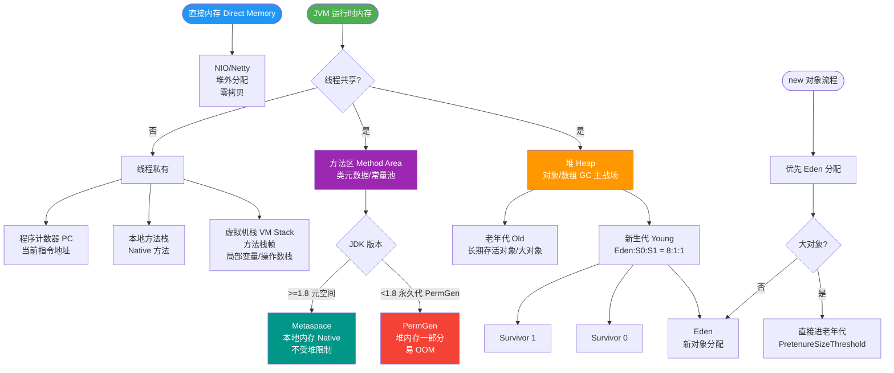

# JVM新生代的内存结构是怎样的？

JVM新生代是堆内存的一部分，主要用来存放新生的对象。一般占据堆的1/3空间。由于Java对象大多朝生夕灭，新生代会频繁触发MinorGC进行垃圾回收。新生代内部具体划分为三个区域：Eden区、ServivorFrom区（S0）和ServivorTo区（S1）。

**各区详解**：
1. **Eden区**：Java新对象的出生地（如果新创建的对象占用内存很大，超过`-XX:PretenureSizeThreshold`阈值，则直接分配到老年代）。大多数新创建的对象首先都在这里分配内存。当Eden区内存不够的时候就会触发MinorGC。
2. **Servivor区**：分为From和To两个区，用于存放经过一次或多次GC后仍然存活的对象。其大小可通过`-XX:SurvivorRatio`参数调整（默认Eden:S0:S1 = 8:1:1）。

**MinorGC的过程（复制算法）**：
MinorGC采用复制算法，其核心流程如下：
1. **复制**：当Eden区满时，触发MinorGC。扫描Eden区和From Survivor区，将所有存活的对象复制到To Survivor区。
2. **清空**：清空Eden区和From Survivor区。
3. **互换**：From Survivor区和To Survivor区角色互换，原来的To区成为下一次GC的From区。
4. **晋升**：如果对象在Survivor区中熬过一定次数的GC（默认15次，可通过`-XX:MaxTenuringThreshold`设置），则晋升到老年代。如果Survivor区空间不足以容纳所有存活对象，将通过**担保机制**直接进入老年代。

```text
              Heap Memory
       ┌───────────────────────┐
       │      Old Generation   │
       └───────────┬───────────┘
                   │
       ┌───────────▼───────────┐
       │    New Generation     │
       │  ┌─────────────────┐  │
       │  │      Eden       │  │
       │  └────────┬────────┘  │
       │           │           │
       │  ┌────────┴────────┐  │
       │  │  S0 (From)      │  │
       │  │  S1 (To)        │  │
       │  └─────────────────┘  │
       └───────────────────────┘

      MinorGC Process Flow:

      [Eden] + [From S0]  --(Copy Alive)-->  [To S1]
            │                                    │
            └------(Clear)-----------------------┘
                   (Swap Roles: S1->From, S0->To)
```

## 常见考点
1. **为什么需要两个Survivor区？**
   如果没有两个Survivor区，每次GC后，Eden区还是满的，且幸存对象无处存放或需要移动到老年代。两个区可以解决内存碎片化问题，并保证复制算法有“空”的接收空间。
2. **对象何时直接进入老年代？**
   - 大对象直接进入：通过`-XX:PretenureSizeThreshold`设置。
   - 长期存活对象：超过`MaxTenuringThreshold`次数。
   - 动态年龄判定：如果在Survivor区中相同年龄所有对象大小的总和大于Survivor空间的一半，年龄大于或等于该年龄的对象就可以直接进入老年代。
3. **内存担保机制是什么？**
   当MinorGC时，Survivor空间不足以容纳所有存活对象，需要依赖老年代进行分配担保，将这些对象直接通过Handle Promotion晋升到老年代。

### 实战拓展

**实战案例**：
在排查高并发接口 OOM 问题时常发现，如果 Survivor 区设置过小（默认只有 10%），大量短生命周期对象会过早通过担保机制进入老年代，导致老年代迅速填满并触发 Full GC，造成 STW（Stop The World）时间过长。建议根据对象存活周期适当调大 SurvivorRatio（如调整为 4:1:1）。

**参数配置示例（JVM 启动参数）**：
```bash
# 设置新生代大小为 512m，Eden:S0:S1 = 2:1:1（即 SurvivorRatio=2）
# 开启打印 GC 详情以观察对象晋升情况
java -Xmn512m -XX:SurvivorRatio=2 -XX:+PrintGCDetails -jar app.jar
```

**MinorGC 与 FullGC 对比**：

| 特性 | Minor GC | Full GC |
| :--- | :--- | :--- |
| **回收区域** | 新生代 | 整个堆（新生代 + 老年代 + 方法区） |
| **触发频率** | 高（Eden 满时） | 低（老年代不足、显式调用等） |
| **耗时 (STW)** | 较短（通常 < 100ms） | 较长（秒级甚至分钟级） |
| **算法** | 复制算法 | 标记-清除 或 标记-整理 |


## 核心流程图



## 记忆要点
- 新生代空间划分：因为采用Eden:S0:S1=8:1:1的比例，所以牺牲10%空间完美解决内存碎片问题。
- MinorGC流程：把Eden和From存活对象复制到To，清空前两者，最后From和To角色互换。
- 晋升老年代触发：熬过默认15次GC、大对象直接分配、或者动态年龄计算超过Survivor空间一半。
- 内存担保机制：因为MinorGC时Survivor空间可能不足，所以需要老年代介入担保容纳存活对象。

## 结构化回答


**30 秒电梯演讲：** 婴儿房，大部分孩子（对象）刚进来待不住，很快就会被清理掉。

**展开框架：**
1. **Eden** — 分为Eden、From Survivor、To Survivor
2. **默认比例为8** — 默认比例为8:1:1
3. **采用复制算法** — 采用复制算法进行垃圾回收

**收尾：** 这是我实战中的理解，您想深入哪一段？


## 视频脚本

> 预计时长：4 分钟 | 由浅入深

| 时间 | 画面/字幕 | 口播台词 | 讲解要点 |
|------|----------|----------|----------|
| 0:00 | 标题卡：JVM新生代的内存结构是怎样的 | 今天这道题：JVM新生代的内存结构是怎样的。30 秒先给你讲清楚。 | 开场钩子 |
| 0:20 | 核心概念动画/示意图 | 婴儿房，大部分孩子（对象）刚进来待不住，很快就会被清理掉。 | 核心概念 |
| 0:40 | 分为Eden示意图 | 分为Eden、From Survivor、To Survivor | 分为Eden |
| 1:10 | 比例示意图 | 默认比例为8:1:1 | 比例 |
| 1:40 | 总结卡 + 下期预告 | 记住今天这几个关键词，面试一定用得上。下期见。 | 收尾 |

### 视频流程图


