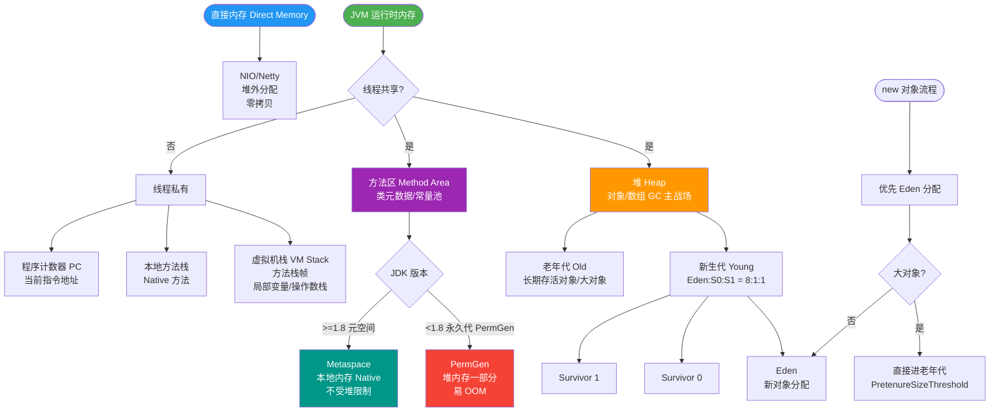
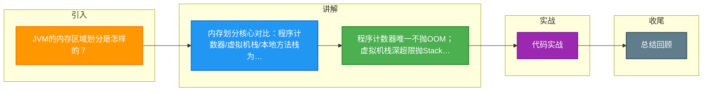

# JVM的内存区域划分是怎样的？

JVM内存区域在运行时数据区主要分为：线程私有区域和线程共享区域。

**1. 线程私有区域（生命周期与线程相同）**
- **程序计数器**：
  - 作用：当前线程所执行的字节码的行号指示器。
  - 细节：如果正在执行Java方法，记录正在执行的虚拟机字节码指令地址；如果正在执行Native方法，计数器值为空。
  - 特点：唯一一个在JVM规范中没有规定任何OutOfMemoryError情况的区域。

- **虚拟机栈**：
  - 作用：描述Java方法执行的内存模型。每个方法在执行时都会创建一个栈帧。
  - 栈帧结构：包含**局部变量表**（存储基本数据类型和对象引用）、**操作数栈**、**动态链接**（指向运行时常量池的方法引用）、**返回地址**等。
  - 异常：如果线程请求的栈深度大于JVM所允许的深度，抛出`StackOverflowError`；如果栈动态扩展无法申请到足够内存，抛出`OutOfMemoryError`。

- **本地方法栈**：
  - 作用：为虚拟机使用到的Native方法服务。
  - 细节：HotSpot VM直接将本地方法栈和虚拟机栈合二为一。

**2. 线程共享区域（生命周期随虚拟机启动/关闭）**
- **Java堆**：
  - 作用：存放对象实例和数组，是垃圾收集器管理的主要区域。
  - 结构：从GC角度细分为新生代、老年代。
  - 异常：如果在堆中没有内存完成实例分配，并且堆无法再扩展时，抛出`OutOfMemoryError`。

- **方法区**：
  - 作用：存储类信息、常量、静态变量、即时编译器编译后的代码等数据。
  - 细节：包含运行时常量池。JDK 1.8后使用元空间实现，位于本地内存。

**3. 直接内存**
- 作用：并不是JVM运行时数据区的一部分，但被频繁使用（如NIO）。
- 原理：通过Native函数库直接分配堆外内存，使用`DirectByteBuffer`作为引用进行操作，避免了在Java堆和Native堆中来回复制数据，提高性能。
- 异常：当本机内存不足时，也会导致OOM。

### 实战案例
在开发高并发网关服务时，曾遇到频繁Full GC导致系统停顿（STW），经Dump分析发现是`Metaspace`（方法区）空间不足。原因是框架使用了CGLib动态代理产生大量代理类，且未设置`MaxMetaspaceSize`上限，导致元空间挤占了物理内存。解决策略是设置合理的`MaxMetaspaceSize`并排查类加载机制。

### 代码示例
```java
// 演示堆外内存的申请与使用，避免Java堆内的拷贝开销
import java.nio.ByteBuffer;

public class DirectMemoryDemo {
    public static void main(String[] args) {
        // 分配10MB的直接内存（堆外内存）
        ByteBuffer directBuffer = ByteBuffer.allocateDirect(10 * 1024 * 1024);
        System.out.println("Direct Memory Allocated");
        // 这部分内存不受GC堆内存限制，但计入本地内存，需手动释放或依赖Cleaner
    }
}
```

### 内存区域对比

| 维度 | 程序计数器 | 虚拟机栈 | 堆 | 方法区 | 直接内存 |
| :--- | :--- | :--- | :--- | :--- | :--- |
| **共享/私有** | 线程私有 | 线程私有 | 线程共享 | 线程共享 | 线程共享 (本地内存) |
| **存储内容** | 字节码指令地址 | 局部变量、操作数栈、方法返回地址 | 对象实例、数组 | 类信息、常量、静态变量 | NIO缓冲区数据 |
| **GC回收** | 无 | 无 (随线程销毁) | 主要回收区域 | 主要回收类元数据 | 不由GC直接管理 (System.gc()触发) |
| **OOM异常** | 无 | StackOverflowError / OOM | OutOfMemoryError | OutOfMemoryError | OutOfMemoryError |
| **物理位置** | JVM内部 | JVM内部 | JVM内部 | JDK 8后位于本地内存 | 本地内存 |

```text
+-------------------------------------------------------+
|                    JVM Runtime Data Area              |
+-------------------------------------------------------+
|  Thread 1       |  Thread 2       |  ...   | Thread N |
| ┌─────────────┐ | ┌─────────────┐ |         | ┌───────┐ |
| │  PC Reg     | | │  PC Reg     | |         | │ PC    | |
| ├─────────────┤ | ├─────────────┤ |         | ├───────┤ |
| │  VM Stack   | | │  VM Stack   | |         | │Stack  | |
| ├─────────────┤ | ├─────────────┤ |         | ├───────┤ |
| │ Native Stack| | │ Native Stack| |         | │Native | |
| └─────────────┘ | └─────────────┘ |         | └───────┘ |
+-------------------------------------------------------+
|              Shared by All Threads                    |
|  ┌───────────────────────┐  ┌───────────────────────┐ |
|  │       Heap Area       │  │    Method Area         | |
|  │ (Young Gen + Old Gen) │  │ (Metaspace / PermGen)  | |
|  └───────────────────────┘  └───────────────────────┘ |
+-------------------------------------------------------+
|           Direct Memory (Off-Heap)                    |
+-------------------------------------------------------+
```


## 核心流程图



## 记忆要点
- 内存划分核心对比：程序计数器/虚拟机栈/本地方法栈为线程私有，而Java堆/方法区为线程共享。
- 程序计数器唯一不抛OOM；虚拟机栈深超限抛StackOverflowError。
- 堆存对象实例且分代，方法区存类元数据（JDK1.8后为元空间，移至本地内存）。
- 直接内存非运行时数据区，常用于NIO堆外分配以实现零拷贝，物理内存不足会OOM。

## 结构化回答


**30 秒电梯演讲：** 办公区：每个员工有独立工位（私有），大家共用会议室和仓库（共享）。

**展开框架：**
1. **线程私有** — 程序计数器、虚拟机栈、本地方法栈
2. **线程共享** — 堆、方法区
3. **JVM** — 直接内存不属于JVM运行时数据区

**收尾：** 这是我实战中的理解，您想深入哪一段？


## 视频脚本

> 预计时长：4 分钟 | 由浅入深

| 时间 | 画面/字幕 | 口播台词 | 讲解要点 |
|------|----------|----------|----------|
| 0:00 | 标题卡：JVM的内存区域划分是怎样的 | 今天这道题：JVM的内存区域划分是怎样的。30 秒先给你讲清楚。 | 开场钩子 |
| 0:20 | 核心概念动画/示意图 | 办公区：每个员工有独立工位（私有），大家共用会议室和仓库（共享）。 | 核心概念 |
| 0:40 | 线程私有示意图 | 线程私有：程序计数器、虚拟机栈、本地方法栈 | 线程私有 |
| 1:10 | 线程共享示意图 | 线程共享：堆、方法区 | 线程共享 |
| 1:40 | 总结卡 + 下期预告 | 记住今天这几个关键词，面试一定用得上。下期见。 | 收尾 |

---

### 视频流程图




## 延伸：请介绍一下JVM的内存结构是什么？

> 合并自 `jvm-012`（相似度 70%）

JVM 的内存结构在运行时数据区主要包含以下几个核心部分。需要注意的是，JVM 规范规定的是逻辑结构，不同的虚拟机实现（如 HotSpot）在具体实现上可能会有细微差别（例如方法区的实现）。

### 1. 程序计数器
- **线程私有**：生命周期与线程相同。
- **作用**：可以看作是当前线程所执行的字节码的行号指示器。字节码解释器工作时就是通过改变这个计数器的值来选取下一条需要执行的字节码指令。
- **特点**：**唯一**一个在 Java 虚拟机规范中没有规定任何 `OutOfMemoryError` 情况的区域。
- **场景**：如果线程正在执行的是一个 Java 方法，这个计数器记录的是正在执行的虚拟机字节码指令的地址；如果正在执行的是 Native 方法，这个计数器值则为空。

### 2. Java 虚拟机栈
- **线程私有**：生命周期与线程相同，描述 Java 方法执行的内存模型。
- **栈帧**：每个方法在执行的同时都会创建一个栈帧，用于存储局部变量表、操作数栈、动态链接、方法出口等信息。每一个方法从调用直至执行完成的过程，就对应着一个栈帧在虚拟机栈中从入栈到出栈的过程。
- **异常**：
  - 线程请求的栈深度大于 JVM 所允许的深度 -> `StackOverflowError`。
  - 若虚拟机栈可以动态扩展，扩展时无法申请到足够的内存 -> `OutOfMemoryError`。

### 3. 本地方法栈
- **线程私有**：与虚拟机栈非常相似，区别在于虚拟机栈为 Java 方法服务，而本地方法栈则为 Native 方法服务。
- **实现**：HotSpot 虚拟机直接把本地方法栈和虚拟机栈合二为一。

### 4. 堆
- **线程共享**：是被所有线程共享的一块内存区域，在虚拟机启动时创建。
- **作用**：**存放对象实例**。几乎所有的对象实例都在这里分配内存（随着 JIT 编译器的发展与逃逸分析技术逐渐成熟，栈上分配、标量替换优化手段会导致对象分配在栈上或标量中）。
- **GC 主战场**：是垃圾收集器管理的主要区域。现在收集器基本都采用**分代收集**算法，所以堆还可以细分为：新生区和老年代。
- **异常**：如果在堆中没有内存完成实例分配，并且堆也无法再扩展时，抛出 `OutOfMemoryError`。

### 5. 方法区
- **线程共享**：用于存储已被虚拟机加载的类信息、常量、静态变量、即时编译器编译后的代码等数据。
- **演变与别名**：在 JDK 8 之前，习惯称之为“永久代”。JDK 8 以后，HotSpot 取消了永久代，改用元空间。元空间使用的是本地内存，不再受限于 JVM 堆内存大小，只受限于系统可用内存。
- **运行时常量池**：是方法区的一部分。Class 文件中除了有类的版本、字段、方法、接口等描述信息外，还有一项信息是常量池，用于存放编译期生成的各种字面量和符号引用，这部分内容将在类加载后进入方法区的运行时常量池中存放。
- **异常**：当方法区无法满足内存分配需求时，抛出 `OutOfMemoryError`。

### 内存结构 ASCII 架构图
```text
+-------------------------------------------------------+
|                     JVM 运行时数据区                    |
+-------------------------------------------------------+
|  线程 1               |  线程 2             |  线程 N  |
| +-------------------+ | +----------------+ | +-------+ |
| | 程序计数器 (PC)    | | |   PC Register   | | |  PC   | |
| +-------------------+ | +----------------+ | +-------+ |
| +-------------------+ | +----------------+ | +-------+ |
| |   虚拟机栈 (VM)    | | |  VM Stack       | | | Stack | |<-- 栈帧 (Stack Frame)
| | [局部变量/操作栈] | | | [Frame...]      | | | [..]  | |
| +-------------------+ | +------------

---

### 实战深化

#### 1. 实战案例：Metaspace OOM 排查
在微服务架构中，若使用大量 CGLib 动态代理或频繁进行 Spring Bean 的热加载/重启，会导致 Metaspace 内存持续增长且不释放。JDK 8 中若设置 `-XX:MaxMetaspaceSize` 过小或未设置（默认仅受限于物理内存），可能会吞噬宿主机内存导致容器被 OOM Kill，而非 JVM 抛出 OOM。**核心经验**：生产环境务必限制 MaxMetaspaceSize（如设置为 256m 或 512m），防止内存泄漏打垮宿主机。

#### 2. 代码示例：StackOverflowError 模拟
```java
// Java
public class StackOverflowDemo {
    private static int count = 0;
    
    public static void recursion() {
        count++;
        recursion(); // 无限递归，栈帧深度不断累加
    }
    
    public static void main(String[] args) {
        try {
            recursion();
        } catch (StackOverflowError e) {
            System.out.println("Stack depth: " + count); // 输出 JVM 支持的最大栈深度
        }
    }
}
```

## 记忆要点

- PC寄存器是唯一不会发生OOM的区域，线程私有，负责记录当前线程正在执行的字节码行号。
- 虚拟机栈和本地方法栈均线程私有，因为深度超限会抛StackOverflowError，扩展超限则抛OOM。
- 堆是线程共享的GC主战场，因为几乎存放所有对象实例，所以无法分配时抛出OOM。
- 方法区演进对比：JDK8前叫永久代占用JVM内存，JDK8后改叫元空间占用本地物理内存。

## 结构化回答


**30 秒电梯演讲：** 像工厂的分区：流水线（栈）、仓库（堆）、会议室（方法区）。

**展开框架：**
1. **GC** — 堆存对象，线程共享且GC主战场
2. **栈存方法调** — 栈存方法调用，线程私有自动销毁
3. **方法区存类元** — 方法区存类元数据与常量

**收尾：** 这是我实战中的理解，您想深入哪一段？


## 视频脚本

> 预计时长：3 分钟 | 由浅入深

| 时间 | 画面/字幕 | 口播台词 | 讲解要点 |
|------|----------|----------|----------|
| 0:00 | 标题卡：请介绍一下JVM的内存结构是什么 | 今天这道题：请介绍一下JVM的内存结构是什么。30 秒先给你讲清楚。 | 开场钩子 |
| 0:20 | 核心概念动画/示意图 | 像工厂的分区：流水线（栈）、仓库（堆）、会议室（方法区）。 | 核心概念 |
| 0:40 | 堆存对象示意图 | 堆存对象，线程共享且GC主战场 | 堆存对象 |
| 1:10 | 总结卡 + 下期预告 | 记住今天这几个关键词，面试一定用得上。下期见。 | 收尾 |

### 视频流程图


