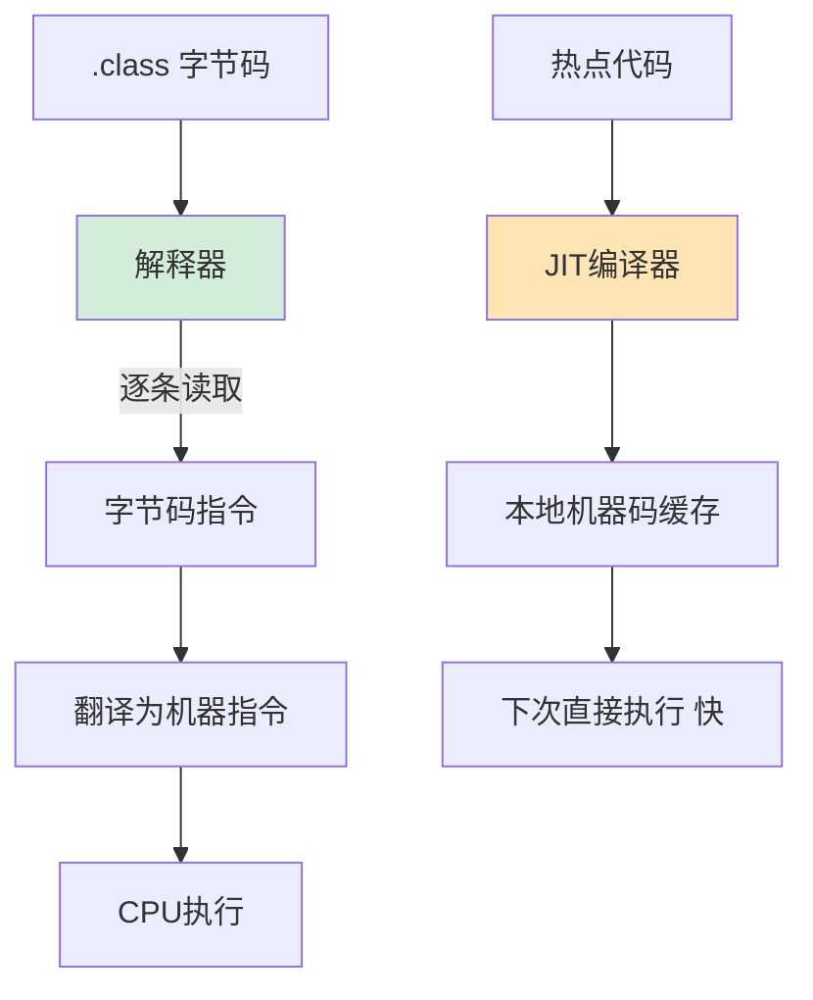

# JVM解释器的工作原理是什么？

**JVM 解释器工作原理**：

解释器是 JVM 执行引擎的核心组件之一。它在运行时逐行读取字节码指令，将其“翻译”成对应的本地机器码并立即执行。这使得 Java 程序可以跨平台运行，不需要针对特定平台预先编译。现代 JVM（如 HotSpot）采用解释器与 JIT 混合模式：解释器负责启动速度，JIT 负责运行时的性能优化。

### 实战案例
在微服务冷启动压测中发现，JVM 刚启动的前几百个请求响应时间（RT）非常高，导致健康检查失败。这是因为热点代码尚未被 JIT 编译器优化，完全依赖解释器逐条执行字节码，效率较低。通过开启“分层编译”并预热服务，让解释器先收集运行信息，引导 JIT 编译生成高效机器码，成功降低了冷启动延迟。

### 代码示例
```java
// 模拟解释器执行循环的字节码逻辑（伪代码示意）
public class InterpreterLoop {
    public static void main(String[] args) {
        int sum = 0;
        // 初始阶段：解释器逐条解释执行 iadd 等指令，效率低
        // 运行多次后：JIT 检测到是热点代码，编译成本地机器码，直接执行，类似 C++ 效率
        for (int i = 0; i < 100000; i++) {
            sum += i; 
        }
        System.out.println(sum);
    }
}
```

### 执行引擎组件对比

| 维度 | 解释器 | JIT 编译器 | AOT 编译器 (GraalVM) |
| :--- | :--- | :--- | :--- |
| **执行时机** | 运行时逐条解释 | 运行时将热点代码编译为机器码 | 程序运行前编译为机器码 |
| **启动速度** | 快 (无编译开销) | 较慢 (需等待编译) | 最快 (直接执行) |
| **执行效率** | 低 (每次都要翻译) | 高 (编译后直接执行) | 高 (接近 C++) |
| **内存占用** | 低 (不需要缓存机器码) | 较高 (CodeCache 占用空间) | 低 (无需运行时编译) |
| **优化能力** | 无 (无分析数据) | 强 (基于运行时的性能剖析) | 中 (基于静态分析) |
| **主要作用** | 保证启动响应，处理非热点代码 | 提升长期运行的性能 | 缩短启动时间，降低内存峰值 |

## 技术原理

- **字节码到机器码的字节级翻译**：HotSpot 解释器用**模板解释器（Template Interpreter）**——预先生成每条字节码对应的机器码片段（模板），存入 `StubRoutines` / `InterpreterCodelet`。运行时按字节码 opcode 跳转到对应模板执行，而非 switch-case 解释。这比纯软件解释快很多（接近"每条字节码 = 几条机器码"的映射）。`iload` 字节码 → 加载局部变量表的 int 到操作数栈；`iadd` → 弹出两个 int 相加压回栈，逐条解释。
- **混合模式（Tiered Compilation）的工作流**：现代 JVM 默认 `-Xmixed`——①**解释器**执行所有代码（启动快，无编译开销）；②**C1 编译器**（Client）对热点做简单优化（方法内联、基本优化），用 **Method invocation counter** 触发；③**C2 编译器**（Server）对超热点做激进优化（逃逸分析、锁消除、循环展开），基于 C1 的 profile 数据触发。分层编译 `-XX:+TieredCompilation`（JDK 10+ 默认开启）让三层协同：解释 → C1 → C2。
- **热点探测（Hot Code Detection）**：JVM 用**方法调用计数器** + **回边计数器**（for/while 循环）统计。计数器溢出（默认 10000 次，`-XX:CompileThreshold`）触发 JIT 编译。**Method invocation counter 是衰减的**——长时间不调用会衰减，避免冷方法被编译。这个机制保证 JIT 资源用在真正热点上。
- **解释器与 JIT 的去优化（Deoptimization）**：JIT 基于 profile 生成"乐观优化"（如"这个 if 永远是 true"），但运行时若 profile 失效（突然进了 else 分支），JIT 要**去优化**——丢弃编译代码，回退到解释器重新执行。这是"非稳定优化"的代价，但对正确性必须保证。

## 命令演示

```bash
# 1. 查看执行模式
java -version                            # 显示 "mixed mode" 即开启混合
java -Xint -version                      # 纯解释模式（启动快、运行慢，仅调试用）
java -Xcomp -version                     # 纯编译模式（启动慢、运行快，调试用）

# 2. 控制分层编译与阈值
-XX:+TieredCompilation                   # 开启分层（JDK 10+ 默认开启）
-XX:CompileThreshold=10000               # 方法调用 10000 次触发 JIT
-XX:+PrintCompilation                    # 打印 JIT 编译日志
-XX:+UnlockDiagnosticVMOptions -XX:+PrintInlining   # 查看方法内联决策

# 3. JIT 日志解读
# "made not entrant" → 该编译代码失效（去优化或被新版本替代）
# "made zombie" → 该编译代码可回收（无引用）
# "1 java.lang.String::hashCode" → C1 编译
# "4 java.util.HashMap::put" → C2 编译

# 4. JIT 内存（CodeCache）
-XX:InitialCodeCacheSize=16m
-XX:ReservedCodeCacheSize=256m           # CodeCache 上限，过小会让 JIT 停止编译
-XX:+PrintCodeCache                      # 打印 CodeCache 使用情况
```

## 常见坑/注意事项

- **冷启动 RT 高的本质**：服务刚启动时所有方法在解释器跑，效率低。若健康检查/压测立刻打满流量，RT 会爆。对策：预热（启动后先压一定流量让 JIT 编译热点）或 AOT（GraalVM Native Image 直接跳过预热）。
- **CompileThreshold 调小不一定是好事**：阈值调低（如 100）会让更多方法被编译，看起来快，但 CodeCache 会涨，C2 编译占 CPU 严重，反而劣化整体性能。生产环境保持默认。
- **CodeCache 满了的后果**：`CodeCache is full. Compiler has been disabled`，JIT 停止工作，性能急剧下降。监控 `-XX:+PrintCodeCache`，必要时调大 `ReservedCodeCacheSize`。
- **JIT 与测试覆盖的偏差**：压测/生产 profile 决定 JIT 编译哪些方法，新代码上线初期可能未编译，性能不稳。重要服务上线后做"灰度预热"——先用小流量跑，让 JIT 编译热点，再放大流量。
- **On-Stack Replacement（OSR）**：长循环（如百万次）中途触发 JIT 编译，把当前正在执行的栈帧替换为编译版本。OSR 优化质量不如普通 JIT（因为只能看到循环内 profile），但避免长循环一直在解释器跑。


## 核心流程图



## 记忆要点

- 核心定义：解释器逐条翻译字节码为机器码并立刻执行，保障跨平台与启动速度。
- 执行模式对比：解释器负责启动快但执行效率低，而JIT编译器相反负责高频优化。
- 现代JVM采用解释器+JIT混合模式，兼顾快速响应与长期运行的峰值性能。
- 实战排查：微服务冷启动RT高是因为代码尚未被JIT编译，可通过开启分层编译预热。

## 结构化回答


**30 秒电梯演讲：** 像现场翻译，主持人念一句，翻译马上翻一句。

**展开框架：**
1. **逐条解释字节** — 逐条解释字节码指令
2. **实现跨平台运** — 实现跨平台运行的基础
3. **启动快但执行** — 启动快但执行效率相对较低

**收尾：** 这是我实战中的理解，您想深入哪一段？


## 视频脚本

> 预计时长：4 分钟 | 由浅入深

| 时间 | 画面/字幕 | 口播台词 | 讲解要点 |
|------|----------|----------|----------|
| 0:00 | 标题卡：JVM解释器的工作原理是什么 | 今天这道题：JVM解释器的工作原理是什么。30 秒先给你讲清楚。 | 开场钩子 |
| 0:20 | 核心概念动画/示意图 | 像现场翻译，主持人念一句，翻译马上翻一句。 | 核心概念 |
| 0:40 | 逐条解释字节码指令示意图 | 逐条解释字节码指令 | 逐条解释字节码指令 |
| 1:10 | 实现跨平台运行的基础示意图 | 实现跨平台运行的基础 | 实现跨平台运行的基础 |
| 1:40 | 总结卡 + 下期预告 | 记住今天这几个关键词，面试一定用得上。下期见。 | 收尾 |
