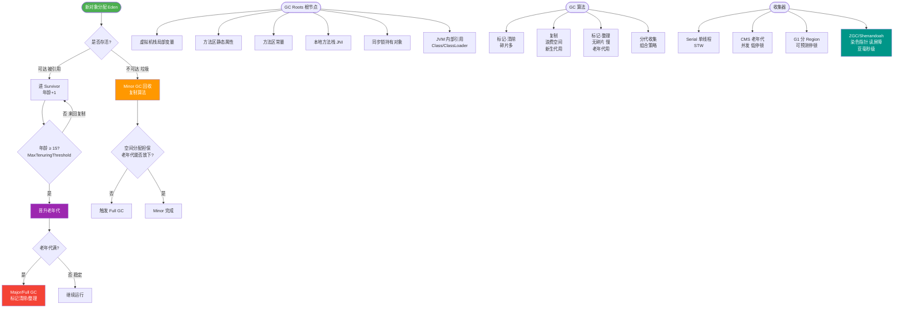

# Serial Old收集器（单线程标记整理算法 ）是什么？

Serial Old 是 Serial 垃圾收集器的老年代版本。

**特点：**
1. **单线程**：使用一个线程进行垃圾回收，执行 GC 时必须暂停所有工作线程（STW，Stop-The-World）。
2. **标记-整理算法**：
   - **标记**：找出所有存活的对象。
   - **整理**：将存活对象向一端移动（压缩），然后清理掉端边界以外的内存。
   - **优势**：消除内存碎片，有利于大对象分配。

**应用场景：**
1. **Client 模式**：作为虚拟机运行在 Client 模式下的老年代默认收集器，内存占用小，简单高效。
2. **Server 模式**：主要有两个用途：
   - 在 JDK 1.5 及之前版本中，与 Parallel Scavenge 收集器搭配使用（PS 无法与 CMS 搭配）。
   - 作为 CMS 收集器发生“**Concurrent Mode Failure**”失败时的后备预案（兜底方案）。当 CMS 并发清理时内存不足，会触发 Full GC，此时 Serial Old 会进行单线程标记整理。

### 实战案例
在排查某老旧系统的 CMS 故障时，发现日志中出现 `Concurrent Mode Failure`，随后 CPU 飙升且接口响应时间激增到几十秒。这是因为并发回收期间对象创建速度过快，触发了 Serial Old 的兜底机制。最终通过调大 `-XX:CMSInitiatingOccupancyFraction` 降低回收触发阈值解决。

### 代码示例
```java
// 模拟大对象分配导致内存不足，触发Full GC
// 在开启了 CMS 且配置不当的情况下，可能触发 Serial Old
public class FullGC {
    public static void main(String[] args) {
        byte[][] array = new byte[1024][];
        int count = 0;
        while (true) {
            // 不断分配 1MB 对象，若老年代空间不足且CMS运行时，可能触发 Serial Old
            array[count++ % 1024] = new byte[1 * 1024 * 1024];
        }
    }
}
```

### 算法对比
| 特性 | 标记-清除 (Mark-Sweep) | 标记-整理 (Mark-Compact) |
| :--- | :--- | :--- |
| **速度** | 快（无需移动对象） | 慢（需移动对象并更新引用） |
| **内存碎片** | **严重**（产生不连续空间） | 无（整理后连续） |
| **算法复杂度** | 低 | 高 |
| **典型应用** | CMS 老年代 | Serial Old, Parallel Old, G1 |

### ## 常见考点
1. **标记-整理算法与标记-清除算法的区别？**
   - 标记-清除会产生不连续的内存碎片；标记-整理会将存活对象移动，整理出连续内存空间，但代价是移动对象的性能开销。
2. **Concurrent Mode Failure 是什么？**
   - CMS 运行期间，老年代预留的空间无法满足新对象的分配请求（并发失败），此时会触发 Full GC，退化为 Serial Old 收集器进行单线程 GC，导致长时间的 STW。
3. **Serial Old 在现代 Java 中还有用吗？**
   - 主要用在桌面应用或微服务中内存较小的场景，以及作为 CMS 的后备。对于大内存服务端应用，通常使用 G1 或 ZGC 等低延迟收集器。


## 核心流程图



## 记忆要点
- BIO核心痛点：同步阻塞且一连接一线程，并发量受限于线程数导致资源枯竭。
- NIO核心机制：同步非阻塞多路复用，利用Channel、Buffer和Selector处理多连接。
- AIO核心机制：异步非阻塞，由操作系统底层数据拷贝完成后直接执行回调通知应用。
- 实战演进：Tomcat从BIO切换至NIO协议，能大幅降低线程上下文切换并提升吞吐量。

## 结构化回答


**30 秒电梯演讲：** 保洁大爷在关店后（STW）一个人整理老仓库（整理内存），不让人进来。

**展开框架：**
1. **单线程回收** — 单线程回收，简单但效率低
2. **使用标记-整理算法** — 使用标记-整理算法，无内存碎片
3. **CMS** — 常作为CMS收集器失败时的后备预案

**收尾：** 这是我实战中的理解，您想深入哪一段？


## 视频脚本

> 预计时长：4 分钟 | 由浅入深

| 时间 | 画面/字幕 | 口播台词 | 讲解要点 |
|------|----------|----------|----------|
| 0:00 | 标题卡：Serial Old收集器（单线程标记整理算法 ）是什么 | 今天这道题：Serial Old收集器（单线程标记整理算法 ）是什么。30 秒先给你讲清楚。 | 开场钩子 |
| 0:20 | 核心概念动画/示意图 | 保洁大爷在关店后（STW）一个人整理老仓库（整理内存），不让人进来。 | 核心概念 |
| 0:40 | 单线程回收示意图 | 单线程回收，简单但效率低 | 单线程回收 |
| 1:10 | 标记-整理算法示意图 | 使用标记-整理算法，无内存碎片 | 标记-整理算法 |
| 1:40 | 总结卡 + 下期预告 | 记住今天这几个关键词，面试一定用得上。下期见。 | 收尾 |
