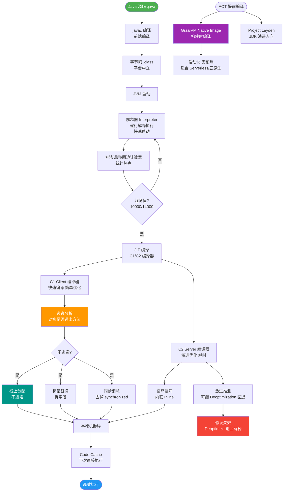
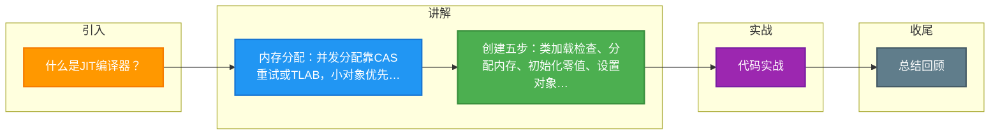

# 什么是JIT编译器？

JIT（Just-In-Time）编译器是 JVM 的核心组件之一，用于将字节码动态编译成本地机器码以提高执行效率。

### 1. 解释器 vs JIT 编译器
*   **解释器**：逐条解释字节码并执行。启动快，但执行效率低（浪费在解释过程）。
*   **JIT 编译器**：将热点代码（频繁执行的代码）编译成本地机器码。执行效率高（接近 C++），但编译需要消耗时间和资源。

### 2. 为什么要共存？
JVM 默认采用**解释器 + JIT 编译器**混合模式（Mixed Mode）：
1.  **启动阶段**：解释器先发挥作用，响应迅速，避免等待编译，缩短启动时间。
2.  **运行阶段**：随着时间推移，JIT 编译器通过**热点探测**识别频繁执行的代码（热点），将其编译成本地代码缓存到 CodeCache，后续直接调用机器码，极大提高运行效率。

### JIT 编译分层架构（JDK 8+）
```text
Client Layer (C1 Compiler)
   │   简单、快速的编译，进行基本优化
   ▼
Server Layer (C2 Compiler)
   │   复杂、耗时的编译，进行深度优化（内联、逃逸分析等）
   │
   └──> Interpreter (解释器)
       收集 profiling 信息
```

### 3. 热点探测
JIT 通过计数器判断方法是否为热点代码：
*   **方法调用计数器**：统计方法被调用的次数（默认阈值 Client 为 1500，Server 为 10000）。如果热度衰减（一段时间没调用），计数减半。
*   **回边计数器**：统计循环体执行的次数。用于触发栈上替换（OSR，On Stack Replacement），即在循环体中直接将字节码替换为机器码，无需等待方法结束。

### 实战案例
某微服务在冷启动时耗时 10秒，但运行一段时间后核心接口耗时仅为 10ms。这是典型的 JIT 预热效果。但若是定时任务，执行时间短且频率低，反而会因为 JIT 编译开销导致性能波动，这种情况建议关闭 JIT 或调整分层策略。

### 代码示例
```java
// 查看 JIT 编译日志（需开启 -XX:+PrintCompilation）
// 日志示例： 123   1       java.lang.String::hashCode (55 bytes)

// 逃逸分析优化示例：对象未逃逸，会被分配在栈上或拆解
public void test() {
    // 对象 alloc 仅在方法内使用，JIT 可能会将其优化掉（标量替换）
    Object alloc = new Object(); 
    System.out.println(alloc);
}
```

### 对比分析
| 维度 | 解释器 | C1 编译器 (Client) | C2 编译器 (Server) |
| :--- | :--- | :--- | :--- |
| **编译速度** | N/A (即时执行) | 快 | 慢 |
| **执行速度** | 慢 | 中等 | **最快** (深度优化) |
| **启动时间** | 快 | 较快 | 慢 (需预热) |
| **优化手段** | 无 | 简单优化 (内联、去虚拟化) | 复杂优化 (逃逸分析、循环展开) |
| **内存占用** | 低 (无 CodeCache) | 中 | 高 (CodeCache 较大) |

### ## 常见考点
1. **什么是逃逸分析？**
   - C2 编译器的高级优化技术。分析对象的作用域，如果对象只在一个线程内使用（未逃逸），可能会进行**栈上分配**（不占用堆内存）、**标量替换**（拆解为基本类型）或**同步消除**（去除锁）。
2. **什么是分层编译？**
   - 为了平衡启动速度和峰值性能，JVM 引入分层编译（Tiered Compilation）。方法先由 C1 编译（带 Profiling），如果运行非常频繁，再由 C2 进行深度编译。
3. **OSR (On Stack Replacement) 是什么？**
   - 当一个方法正在执行时（尤其是循环中），如果被判定为热点，JIT 会在当前栈帧状态下直接将字节码切换为编译后的机器码继续执行。


## 核心流程图



## 记忆要点
- 内存分配：并发分配靠CAS重试或TLAB，小对象优先在TLAB中实现无锁极速分配。
- 创建五步：类加载检查、分配内存、初始化零值、设置对象头、执行init构造方法。
- 对象布局三步：对象头存Mark Word元数据，实例数据存字段，对齐填充补齐8字节。
- 实战排查：堆内存正常但物理内存飙升，需排查DirectByteBuffer堆外内存未释放。

## 结构化回答

**30 秒电梯演讲：** 同声传译：解释器是现场一句句翻（慢）；JIT是把常用的段落提前背好（快）。

**展开框架：**
1. **JVM** — JVM采用解释器与JIT编译器混合执行模式
2. **热点探测发现频繁代码** — 热点探测发现频繁代码，编译为本地机器码
3. **JIT** — JIT牺牲部分内存和启动时间换取高性能

**收尾：** 这块我踩过一些坑，您想深入聊哪一段——原理细节、实战案例还是常见踩坑？

## 视频脚本

> 预计时长：4 分钟 | 由浅入深

| 时间 | 画面/字幕 | 口播台词 | 讲解要点 |
|------|----------|----------|----------|
| 0:00 | 标题卡：什么是JIT编译器 | 今天这道题：什么是JIT编译器。30 秒先给你讲清楚。 | 开场钩子 |
| 0:20 | 核心概念动画/示意图 | 同声传译：解释器是现场一句句翻（慢）；JIT是把常用的段落提前背好（快）。 | 核心概念 |
| 0:40 | JVM示意图 | JVM采用解释器与JIT编译器混合执行模式 | JVM |
| 1:10 | 热点探测发现频繁代码示意图 | 热点探测发现频繁代码，编译为本地机器码 | 热点探测发现频繁代码 |
| 1:40 | 总结卡 + 下期预告 | 记住今天这几个关键词，面试一定用得上。下期见。 | 收尾 |

### 视频流程图



