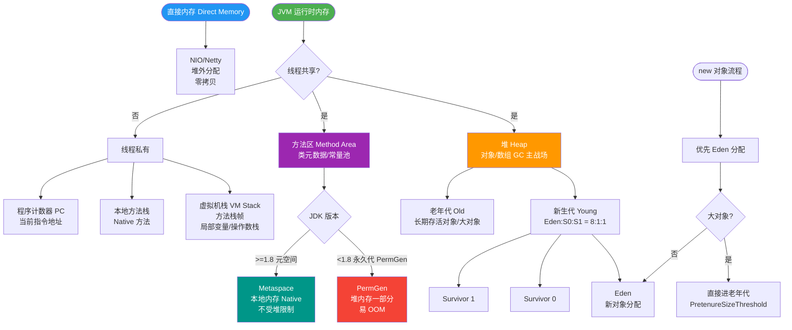
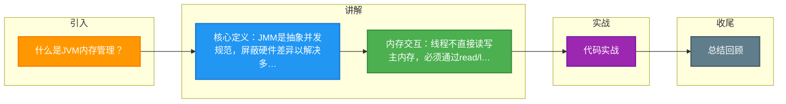

# 什么是JVM内存管理？

JVM 内存管理主要涉及**运行时数据区**的划分以及**对象的创建与回收**机制。

### 1. 运行时数据区
分为**线程私有**和**线程共享**两大类：

**线程私有：**
1.  **程序计数器**：记录当前线程执行的字节码指令地址。如果执行 Native 方法，计数器值为 Undefined。
2.  **Java 虚拟机栈**：存储栈帧，包含局部变量表、操作数栈、动态连接、返回地址等。方法调用即对应栈帧的入栈出栈。StackOverflowError 通常由递归过深导致。
3.  **本地方法栈**：为 Native 方法服务（如 Java 调用 C/C++ 代码）。

**线程共享：**
1.  **Java 堆**：存放对象实例，垃圾收集器管理的主要区域。可细分为新生代（Eden, Survivor）和老年代。
2.  **方法区**：存储类信息、常量、静态变量、即时编译器编译后的代码等。
3.  **运行时常量池**：方法区的一部分，存放字面量和符号引用。

### JVM 运行时数据区架构图
```text
┌─────────────────────────────────────────────┐
│              Method Area (方法区)            │
│  (类信息、静态变量、常量池、JIT代码)          │
└─────────────────────────────────────────────┘
┌─────────────────────────────────────────────┐
│                  Heap (堆)                   │
│  ┌──────────┐  ┌─────────────────────┐      │
│  │  Young   │  │       Old           │      │
│  │ (Eden/S0/S1)│   (老年代/长寿对象)   │      │
│  └──────────┘  └─────────────────────┘      │
└─────────────────────────────────────────────┘

  Thread A                         Thread B
┌───────────────┐               ┌───────────────┐
│ PC Register   │               │ PC Register   │
│ JVM Stack     │               │ JVM Stack     │
│ Native Stack  │               │ Native Stack  │
└───────────────┘               └───────────────┘
```

### 2. 对象的创建过程
1.  **类加载检查**：检查常量池中是否有该类的符号引用，是否已加载、解析和初始化。
2.  **分配内存**：
    - **指针碰撞**：内存规整时，指针向空闲区移动划分内存。
    - **空闲列表**：内存不规整时，维护列表记录可用块。
    - **并发安全**：使用 **CAS+失败重试** 或 **TLAB (Thread Local Allocation Buffer，本地线程分配缓冲)** 解决。
3.  **初始化零值**：将内存（除对象头外）清零，保证对象实例字段不赋值也能直接使用（默认值 0/false/null）。
4.  **设置对象头**：设置对象的类元数据指针、哈希码、GC 分代年龄、锁状态标志等。
5.  **执行 init 方法**：按程序员意愿初始化对象（执行构造函数、字段赋值等）。

### 3. 对象的内存布局
1.  **对象头**：
    - **Mark Word**：存储运行时数据（Hash Code、GC 分代年龄、锁状态标志、线程持有的锁、偏向线程 ID、偏向时间戳）。
    - **类型指针**：指向对象类元数据的指针（数组对象还包含数组长度）。
2.  **实例数据**：对象真正存储的有效信息（字段内容）。存储顺序受字段宽度、VM 参数影响，相同宽度的字段分配在一起。
3.  **对齐填充**：保证对象大小为 8 字节的整数倍（HotSpot 要求），提高内存访问效率。

### 实战案例：堆外内存泄漏排查
在高并发 Netty 服务中，曾遇到堆内存（Heap）正常但进程物理内存持续飙升。通过 `pmap` 查看进程内存映射，发现是因为 `DirectByteBuffer` 分配的堆外内存未及时释放，且未触发 `System.gc()` 导致 Cleaner 线程无法回收，最终需通过调大 `-XX:MaxDirectMemorySize` 并监控堆外内存使用解决。

### 关键代码示例：TLAB 线程局部分配缓冲
```java
// JVM 启动参数开启 TLAB (默认开启)
// -XX:+UseTLAB -XX:TLABSize=256k
// 在多线程环境下，对象优先在 TLAB 中分配，避免加锁竞争堆内存

public class TLABDemo {
    public static void main(String[] args) {
        // 大对象直接在堆中分配，小对象优先在 TAB 中分配
        for (int i = 0; i < 100000; i++) {
            Object obj = new Object(); // 极大概率在 TLAB 分配
        }
    }
}
```

### 内存区域对比表
| 区域 | 线程私有/共享 | 作用 | 存储内容 | 异常类型 |
| :--- | :--- | :--- | :--- | :--- |
| **程序计数器** | 私有 | 指令行号指示器 | 当前字节码指令地址 | 无 (唯一不会 OOM 的区域) |
| **JVM 栈** | 私有 | Java 方法调用 | 栈帧(局部变量、操作数栈) | StackOverflowError / OOM |
| **本地方法栈** | 私有 | Native 方法服务 | Native 方法调用栈 | StackOverflowError / OOM |
| **Java 堆** | 共享 | 存储对象实例 | 对象实例、数组 | OutOfMemoryError |
| **方法区** | 共享 | 类元数据、常量 | 类信息、静态变量、常量 | OutOfMemoryError |

## 常见考点
1. **对象头包含哪些信息？**
   - Mark Word（运行时数据，如锁状态、GC 年龄）和类型指针（指向类元数据）。


## 核心流程图



## 记忆要点
- 核心定义：JMM是抽象并发规范，屏蔽硬件差异以解决多线程共享变量的原子与一致问题。
- 内存交互：线程不直接读写主内存，必须通过read/load等指令操作自身工作内存的副本。
- 三大特性：synchronized保原子与可见，volatile保可见与禁止指令重排的有序性。
- 实战避坑：DCL单例必须加volatile，防止对象半初始化的指令重排被其他线程误读。

## 结构化回答

**30 秒电梯演讲：** 堆是共享仓库，栈是每个人干活的工作台；对象创建就是申请仓库空间并填表。

**展开框架：**
1. **堆栈分离** — 堆栈分离：堆存对象（共享），栈存局部变量和栈帧（私有）
2. **对象创建** — 对象创建包含分配内存、初始化零值、设置对象头、执行init
3. **对象头** — 对象头包含Mark Word（锁状态/GC信息）和类型指针

**收尾：** 这块我踩过一些坑，您想深入聊哪一段——原理细节、实战案例还是常见踩坑？

## 视频脚本

> 预计时长：4 分钟 | 由浅入深

| 时间 | 画面/字幕 | 口播台词 | 讲解要点 |
|------|----------|----------|----------|
| 0:00 | 标题卡：什么是JVM内存管理 | 今天这道题：什么是JVM内存管理。30 秒先给你讲清楚。 | 开场钩子 |
| 0:20 | 核心概念动画/示意图 | 堆是共享仓库，栈是每个人干活的工作台；对象创建就是申请仓库空间并填表。 | 核心概念 |
| 0:40 | 堆栈分离示意图 | 堆栈分离：堆存对象（共享），栈存局部变量和栈帧（私有） | 堆栈分离 |
| 1:10 | 对象创建示意图 | 对象创建包含分配内存、初始化零值、设置对象头、执行init | 对象创建 |
| 1:40 | 总结卡 + 下期预告 | 记住今天这几个关键词，面试一定用得上。下期见。 | 收尾 |

### 视频流程图



