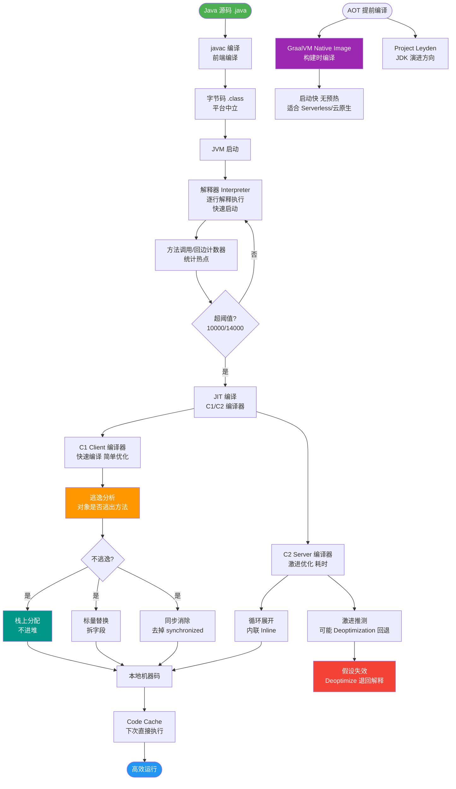

# 什么是指令集？

指令集是 CPU 能识别的所有机器码指令的集合，是程序与硬件沟通的桥梁。

### 1. 基础概念
*   **机器码**：二进制编码的指令，CPU 直接执行。
*   **汇编**：机器码的助记符形式，便于人类阅读和编写。
*   **字节码**：一种中间码（如 Java 字节码），不直接依赖特定硬件平台，需要 JVM 解释或编译为机器码。

### 2. JVM 执行引擎与指令集
物理机的执行引擎直接基于硬件指令集；而 JVM 的执行引擎由软件实现，可以执行不被硬件直接支持的**字节码指令集**。

**关键细节**：
- **基于栈的指令集**：JVM 字节码通常是基于栈的。优点是平台无关、代码紧凑；缺点是执行速度相对较慢（因为需要频繁入栈出栈，内存访问次数多）。
- **基于寄存器的指令集**：典型的如 x86 汇编。优点是性能高（依赖寄存器）；缺点是指令集复杂，移植性差。

### 3. 执行流程
1.  **取指**：执行引擎根据**程序计数器**（PC Register）中的地址，从内存中取出指令。
2.  **解码**：将字节码指令解析为具体的操作。
3.  **执行**：根据虚拟机栈中的数据（局部变量表、操作数栈）执行操作，或将结果写回栈/堆。
4.  **更新**：更新程序计数器指向下一条指令。

**解释执行 vs 编译执行流程图：**
```text
┌─────────────────────────────────────────────────────┐
│                    Java 源代码                       │
└────────────────────┬────────────────────────────────┘
                     │ 编译 (javac)
                     v
┌─────────────────────────────────────────────────────┐
│                    字节码文件                         │
└────────────────────┬────────────────────────────────┘
                     │ 加载
      ┌──────────────┴──────────────┐
      v                             v
┌───────────────┐          ┌───────────────┐
│  解释器       │          │  即时编译器   │
│ (Interpreter) │          │   (JIT C1/C2) │
└───────┬───────┘          └───────┬───────┘
        │                         │
        │ 逐条解释执行             │ 热点代码编译
        v                         v
┌───────────────────────────────────────────────┐
│               操作系统 / 硬件 CPU              │
└───────────────────────────────────────────────┘
```

### 实战案例：字节码增强实现无侵入埋点
在 SkyWalking 等监控系统中，利用字节码技术修改 Class 文件。在方法调用前后插入收集耗时和参数的指令，而不修改源代码。这需要深刻理解 `invokedynamic`、`aload`、`invokevirtual` 等指令含义以及局部变量表的槽位占用，避免插入指令导致原有变量索引偏移错误。

### 关键代码示例：基于栈的执行 i++
```java
// 源代码
public void incr() {
    int i = 0;
    i++; // 关注此处的字节码执行
}

// 对应字节码 (javap -c)
// 0: iconst_0      // 将常量 0 压入操作数栈
// 1: istore_1      // 将栈顶值弹出存入局部变量表 Slot 1
// 2: iinc 1, 1     // **关键**：直接对局部变量表 Slot 1 的值 +1 (不需要入栈)
// 5: return
```

### 指令集架构对比表
| 特性 | 基于栈 | 基于寄存器 |
| :--- | :--- | :--- |
| **代表架构** | JVM, .NET CLR | x86, ARM | 
| **指令数量** | 少 (指令紧凑，Code Cache 小) | 多 (操作码需包含寄存器地址) |
| **实现难度** | 简单 (无需依赖硬件寄存器，易移植) | 困难 (需要特定硬件寄存器支持) |
| **执行效率** | 较低 (频繁出入栈，内存访问多) | 较高 (直接访问寄存器，零地址指令) |
| **代码体积** | 小 (无需指定操作数地址) | 大 (需显式指定源/目的寄存器) |

## 常见考点
1. **基于栈 vs 基于寄存器**：追问 JVM 为什么要选择基于栈的指令集设计（主要是为了跨平台和移植性，缺点是性能略低）。
2. **字节码与机器码的区别**：追问字节码如何转化为机器码，以及解释执行和编译执行混合模式的触发条件（如热点探测）。
3. **局部变量表与操作数栈的交互**：追问 i++ 指令在字节码层面的执行过程（iinc、iload 等指令的顺序）。


## 核心流程图



## 记忆要点
- 核心定义：指令集是CPU或JVM能识别的机器码或字节码集合，是软硬件沟通桥梁。
- 架构对比：JVM基于栈以求跨平台移植，而x86等物理机基于寄存器以求极致性能。
- 优缺点：因为基于栈需频繁出入栈，所以执行慢但代码紧凑；基于寄存器直接读写，速度快但体积大。
- 执行流程：执行引擎依托PC寄存器，按取指、解码、执行、更新PC四步循环工作。
- 底层细节：剖析i++的字节码，其核心是iinc指令直接修改局部变量表，无需操作数栈。

## 结构化回答


**30 秒电梯演讲：** 指令集是CPU的词典；字节码是通用的草稿，执行引擎负责翻译成具体的方言（机器码）。

**展开框架：**
1. **CPU** — 指令集决定了CPU能执行的操作
2. **JVM** — JVM执行引擎解释或编译字节码指令
3. **PC** — 执行流程依赖程序计数器（PC寄存器）定位指令

**收尾：** 这是我实战中的理解，您想深入哪一段？


## 视频脚本

> 预计时长：4 分钟 | 由浅入深

| 时间 | 画面/字幕 | 口播台词 | 讲解要点 |
|------|----------|----------|----------|
| 0:00 | 标题卡：什么是指令集 | 今天这道题：什么是指令集。30 秒先给你讲清楚。 | 开场钩子 |
| 0:20 | 核心概念动画/示意图 | 指令集是CPU的词典；字节码是通用的草稿，执行引擎负责翻译成具体的方言（机器码）。 | 核心概念 |
| 0:40 | 指令集示意图 | 指令集决定了CPU能执行的操作 | 指令集 |
| 1:10 | JVM示意图 | JVM执行引擎解释或编译字节码指令 | JVM |
| 1:40 | 总结卡 + 下期预告 | 记住今天这几个关键词，面试一定用得上。下期见。 | 收尾 |
