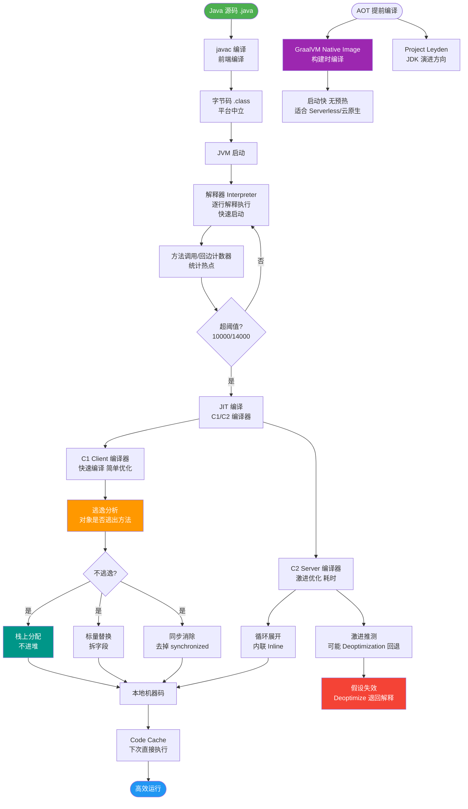

# 什么是提前编译和即时编译优劣？

JVM 的编译方式主要分为 **AOT（Ahead-Of-Time，提前编译）** 和 **JIT（Just-In-Time，即时编译）**。

### 1. 提前编译 (AOT)
*   **定义**：在程序运行之前，将字节码直接编译成本地机器码（如 .exe, .so）。
*   **优点**：
    1.  **省资源**：避免了运行时编译的开销，节省 CPU 和内存资源。
    2.  **启动快**：无需等待编译，直接执行机器码，启动速度极快。
*   **缺点**：
    1.  **优化受限**：由于缺乏运行时的性能分析信息，无法进行深度的预测性优化。
    2.  **平台依赖**：编译产物依赖特定操作系统和硬件架构。
*   **补充细节**：GraalVM 是实现高性能 AOT 的关键。在 Java 9 之后引入 `jaotc` 工具，允许在构建时生成共享库。AOT 编译会牺牲一些 Java 的动态特性（如动态类加载、反射）来换取启动速度。

### 2. 即时编译 (JIT)
*   **定义**：在程序运行过程中，将热点代码编译成本地机器码。
*   **优点**：
    1.  **性能分析制导优化**：基于运行时统计信息（热点探测），进行针对性优化，峰值性能高。
    2.  **激进预测性优化**：可以进行内联、逃逸分析等复杂优化。
*   **缺点**：
    1.  **启动慢**：需要预热时间，编译过程会消耗资源。
    2.  **内存占用**：编译后的机器码需要占用代码缓存空间。

**分层编译示意图：**
```text
┌──────────────────────────────────────────┐
│            解释执行             │  (C0 级: 快速启动，收集性能信息)
└──────────────┬───────────────────────────┘
               │ 热点探测
               v
┌──────────────────────────────────────────┐
│       C1 编译 (Client Compiler)           │  (C1 级: 简单优化，带 Profiling)
└──────────────┬───────────────────────────┘
               │ 多次调用/循环次数更多
               v
┌──────────────────────────────────────────┐
│       C2 编译 (Server Compiler)           │  (C2 级: 激进优化，峰值性能最高)
└──────────────────────────────────────────┘
```
*   **补充细节**：现代 JVM（如 HotSpot）默认使用**分层编译**（Tiered Compilation）。方法先由解释器执行，当达到一定阈值被标记为“热点”后，先由 C1 编译器编译（执行带统计信息的简单优化），如果热点持续，再由 C2 编译器进行深度优化。

### 3. 实战深化

**实战案例**：在 Serverless 场景（如 AWS Lambda）中，函数频繁冷启动导致延迟极高，采用 GraalVM Native Image（AOT）可将启动时间从秒级降至毫秒级；但在高并发长期运行的微服务中，C2 JIT 的峰值性能通常优于 AOT，若盲目开启 AOT 可能导致吞吐量下降。

**对比表格**：

| 特性 | AOT (提前编译) | JIT (即时编译) |
| :--- | :--- | :--- |
| **启动速度** | 极快（直接执行机器码） | 较慢（需预热） |
| **峰值性能** | 较低（缺乏运行时信息） | 极高（基于热点深度优化） |
| **内存占用** | 低（无 Code Cache 开销） | 高（占用元空间及 Code Cache） |
| **动态特性** | 较弱（反射/JNI 需配置） | 强（完全支持） |
| **适用场景** | Serverless、CLI 工具、桌面应用 | 长期运行的后端服务、大数据计算 |

**代码示例 (GraalVM Native Image 配置)**：
```xml
<!-- Maven pom.xml 配置 Native Image 插件 -->
<plugin>
    <groupId>org.graalvm.buildtools</groupId>
    <artifactId>native-maven-plugin</artifactId>
    <configuration>
        <!-- 反射资源配置文件，解决AOT动态特性丢失问题 -->
        <reflectionConfigFiles>
            <reflectionConfigFile>src/main/resources/reflect-config.json</reflectionConfigFile>
        </reflectionConfigFiles>
    </configuration>
</plugin>
```

## 常见考点
1. **热点探测机制**：追问 JVM 如何判断一段代码是热点代码（基于计数器的抽样检测和方法调用计数器、回边计数器），以及热度衰减的概念。
2. **C1 与 C2 编译器的区别**：追问 C1 关注启动速度，C2 关注峰值性能，以及 Graal 编译器（JVMCI）替代 C2 的趋势。
3. **逃逸分析**：追问 JIT 编译中的逃逸分析如何实现栈上分配、标量替换和锁消除，从而提升性能。


## 核心流程图



## 记忆要点
- 对比记忆：AOT 重启动与资源（适合Serverless），而 JIT 重峰值性能（适合长期服务）。
- 因果句：因为 AOT 提前编译无运行时数据，所以启动极快但难做深度优化。
- 因果句：因为 JIT 依赖运行时热点探测，所以峰值性能极高但需预热消耗内存。
- 分层编译口诀：解释执行打底，C1 负责 Client 快速简单优化，C2 负责 Server 激进深度优化。

## 结构化回答

**30 秒电梯演讲：** AOT是预制菜（开锅即吃，口味一般）；JIT是现炒（慢工出细活，口味极佳）。

**展开框架：**
1. **AOT** — AOT在运行前编译，启动快，省资源，但优化弱
2. **JIT** — JIT在运行中编译热点代码，优化深，性能高，但启动慢
3. **JVM主要** — JVM主要使用JIT，GraalVM等引入AOT技术

**收尾：** 这块我踩过一些坑，您想深入聊哪一段——原理细节、实战案例还是常见踩坑？

## 视频脚本

> 预计时长：4 分钟 | 由浅入深

| 时间 | 画面/字幕 | 口播台词 | 讲解要点 |
|------|----------|----------|----------|
| 0:00 | 标题卡：什么是提前编译和即时编译优劣 | 今天这道题：什么是提前编译和即时编译优劣。30 秒先给你讲清楚。 | 开场钩子 |
| 0:20 | 核心概念动画/示意图 | AOT是预制菜（开锅即吃，口味一般）；JIT是现炒（慢工出细活，口味极佳）。 | 核心概念 |
| 0:40 | AOT示意图 | AOT在运行前编译，启动快，省资源，但优化弱 | AOT |
| 1:10 | JIT示意图 | JIT在运行中编译热点代码，优化深，性能高，但启动慢 | JIT |
| 1:40 | 总结卡 + 下期预告 | 记住今天这几个关键词，面试一定用得上。下期见。 | 收尾 |
