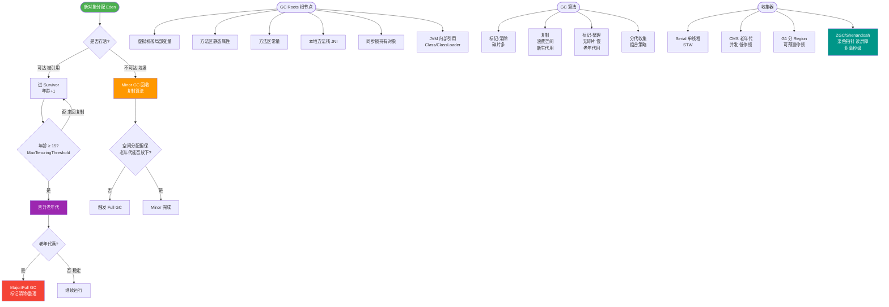

# 如何确定垃圾？

### 如何确定垃圾？

在Java中，确定一个对象是否是垃圾（即可以被回收），主要有两种算法：引用计数法和可达性分析法。

**1. 引用计数算法**
- **原理**：给对象中添加一个引用计数器，每当有一个地方引用它时，计数器值就加1；当引用失效时，计数器值就减1。任何时刻计数器为0的对象就是不可能再被使用的。
- **缺点**：**无法解决循环引用问题**。例如对象A引用对象B，对象B也引用对象A，除此之外没有任何引用指向它们，但它们的引用计数都不为0，导致无法被回收。
- **现状**：主流Java虚拟机并没有选用引用计数算法来管理内存。

**2. 可达性分析算法**
- **原理**：这是Java主流的选择。基本思路是通过一系列称为“**GC Roots**”的对象作为起始点，从这些节点开始向下搜索，搜索所走过的路径称为引用链。当一个对象到GC Roots没有任何引用链相连（即从GC Roots到这个对象不可达）时，则证明此对象是不可用的。
- **GC Roots 对象包括**：
  1. 虚拟机栈（栈帧中的本地变量表）中引用的对象。
  2. 方法区中类静态属性引用的对象。
  3. 方法区中常量引用的对象。
  4. 本地方法栈中JNI（即一般说的Native方法）引用的对象。

**对象引用链示意图**
```
       GC Roots (栈变量 / 静态变量)
             │
             ├───────> Object A
             │           │
             │           v
             │       Object B
             │
             ├───────> Object C ───> Object D
             │
             └───────> Object E (引用链断裂，不可达)
                           ↓
                      标记为垃圾
```

**补充：不可达对象的最终命运**
即使通过可达性分析判定为不可达的对象，也并非“非死不可”。要真正宣告一个对象死亡，至少要经历两次标记过程：
1. 第一次标记并进行筛选：如果对象没有覆盖`finalize()`方法，或者`finalize()`方法已经被虚拟机调用过，则视为“没有必要执行”。
2. 如果有必要执行`finalize()`，对象会被放置在一个F-Queue队列中，稍后由虚拟机自动建立的低优先级Finalizer线程去执行它。如果在`finalize()`方法中对象重新与引用链上的任何一个对象建立关联（如自救），则它在第二次标记时会被移出“即将回收”集合。

**## 常见考点**
1. **不同的引用类型**：强引用、软引用、弱引用、虚引用在垃圾回收时的区别（如SoftReference在内存不足时回收，WeakReference无论内存是否足只要发现就回收，PhantomReference必须配合ReferenceQueue使用，无法通过引用获取对象）。
2. **方法区作为GC Roots**：方法区中的静态变量和常量引用的对象作为GC Roots的具体场景。
3. **finalize()方法的局限性**：为什么不建议使用finalize()方法（运行代价高、不确定性大、已被Java 9+标记为deprecated），以及官方推荐的替代方案（如Cleaner或try-with-resources）。

---

**实战案例**：
在开发高性能缓存时，我曾踩过“内存泄漏”的坑：使用静态 `Map` 存储临时对象，由于生命周期与全局一致，对象一直被 GC Roots（静态变量）引用，导致 OOM。改用 `WeakHashMap` 后，当外部强引用消失，对象即可被 GC 及时回收，解决了泄漏问题。

**代码示例**：
```java
// 使用 WeakHashMap 避免由静态变量导致的无法回收
Map<String, Object> cache = new WeakHashMap<>();
Object value = new Object();
cache.put("temp_key", value); 

// 当 value 的外部强引用置空后，且仅被 WeakHashMap 引用时
value = null; 
System.gc(); // 触发GC（建议测试用），此时 cache 中的 entry 可能会被回收
```

**对比表格**：

| 特性 | 引用计数法 | 可达性分析法 |
| :--- | :--- | :--- |
| **核心原理** | 通过计数器记录引用数量 | 从 GC Roots 向下搜索引用链 |
| **循环引用** | **无法处理**（导致内存泄漏） | **可正常处理**（相互引用若不可达则回收） |
| **实现复杂度** | 简单，效率高 | 需要遍历对象图，暂停应用（Stop The World） |
| **主流应用** | Python, 内存管理模块 | Java, C# (JVM/.NET CLR) |


## 核心流程图



## 记忆要点
- 淘汰对比：引用计数法无法解决循环引用，而可达性分析是JVM主流选择。
- 核心机制：从 GC Roots 向下搜索，无引用链相连的对象即为死亡垃圾。
- GC Roots 四件套：虚拟机栈、本地方法栈、静态属性、常量引用的对象。
- 自救机制：不可达对象需经历两次标记，并在 finalize() 中重新建立引用方可自救。

## 结构化回答


**30 秒电梯演讲：** 像是捉迷藏，从特定起点（Roots）顺藤摸瓜，摸不到的孤家寡人就是垃圾。

**展开框架：**
1. **引用计数法无法解** — 引用计数法无法解决循环引用问题
2. **Java使用可达** — 性分析算法判定对象存活
3. **GC Roots** — 包括栈引用、静态变量、常量等

**收尾：** 这是我实战中的理解，您想深入哪一段？


## 视频脚本

> 预计时长：4 分钟 | 由浅入深

| 时间 | 画面/字幕 | 口播台词 | 讲解要点 |
|------|----------|----------|----------|
| 0:00 | 标题卡：如何确定垃圾 | 今天这道题：如何确定垃圾。30 秒先给你讲清楚。 | 开场钩子 |
| 0:20 | 核心概念动画/示意图 | 像是捉迷藏，从特定起点（Roots）顺藤摸瓜，摸不到的孤家寡人就是垃圾。 | 核心概念 |
| 0:40 | 引用计数法示意图 | 引用计数法无法解决循环引用问题 | 引用计数法 |
| 1:10 | Java示意图 | Java使用可达性分析算法判定对象存活 | Java |
| 1:40 | 总结卡 + 下期预告 | 记住今天这几个关键词，面试一定用得上。下期见。 | 收尾 |
