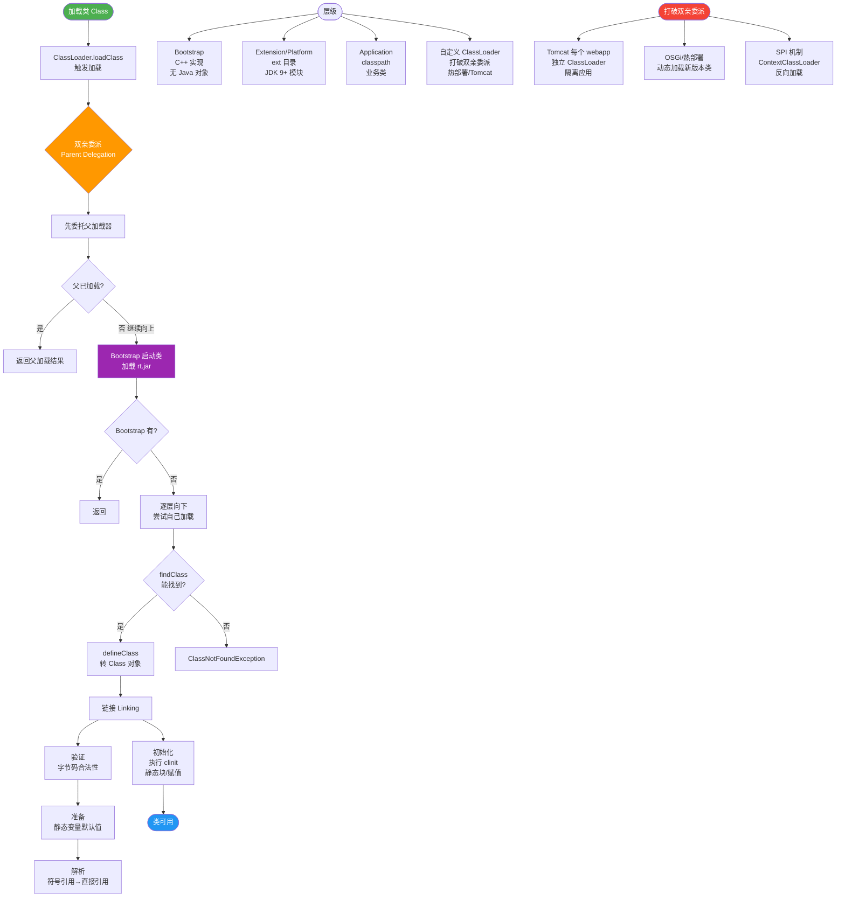

# 类加载机制是什么？

### 类加载机制详解

类加载机制描述了虚拟机如何将描述类的数据从Class文件加载到内存，并对数据进行校验、转换解析和初始化，最终形成可以被虚拟机直接使用的Java类型。

**一、类的生命周期**
一个类从被加载到虚拟机内存开始，到卸载出内存为止，包含7个阶段：
1. **加载**
2. **验证**
3. **准备**
4. **解析**
5. **初始化**
6. **使用**
7. **卸载**

其中，验证、准备、解析三个部分统称为连接。

**二、关键阶段详解**

**1. 加载**
JVM需要完成三件事：
- 通过类的全限定名获取定义此类的二进制字节流。
- 将字节流代表的静态存储结构转化为方法区的运行时数据结构。
- 在堆中生成一个代表这个类的`java.lang.Class`对象，作为方法区数据访问的入口。

**2. 验证**
确保Class文件的字节流包含的信息符合当前虚拟机的要求，保证被加载类的正确性，不会危害虚拟机自身安全。包括文件格式验证、元数据验证、字节码验证、符号引用验证。

**3. 准备**
- 为类的**静态变量**分配内存，并设置**默认初始值**（零值）。
- 注意：此时只设置零值，例如 `public static int value = 123;` 在准备阶段 value 被设为 0。
- 特例：如果类字段字段属性表中存在 `ConstantValue` 属性（即被 `final` 修饰），则在准备阶段就会被初始化为指定的值。

**4. 解析**
将常量池内的符号引用替换为直接引用的过程。

**5. 初始化**
- 这是类加载过程的最后一步，也是真正开始执行类中定义的Java程序代码。
- 执行类构造器 `<clinit>()` 方法。该方法由编译器自动收集类中的所有类变量的赋值动作和静态语句块中的语句合并产生。
- 虚拟机保证子类的 `<clinit>()` 执行前，父类的 `<clinit>()` 已经执行完毕。

**三、初始化时机**
以下情况会触发初始化（主动引用）：
- 遇到 new、getstatic、putstatic 或 invokestatic 字节码指令时。
- 使用 java.lang.reflect 包的方法对类进行反射调用时。
- 初始化类时，如果父类还没初始化，先触发父类初始化。
- 虚拟机启动时，初始化包含 main 方法的类。

以下情况**不会**触发初始化（被动引用）：
- 通过子类引用父类的静态字段，只会触发父类初始化。
- 定义数组类，不会触发数组中元素类的初始化。
- 引用常量（编译期常量）不会触发定义常量的类初始化。

**四、实战进阶**

**1. 实战案例**
在使用 **Spring** 框架时，如果通过 `@Value` 注入一个静态变量，会发现注入失败（为 null）。原因在于：`<clinit>()` 在类加载阶段执行，此时 Spring 容器尚未启动完成 Bean 的实例化和属性填充。解决办法通常是使用非静态 setter 方法或 `@PostConstruct` 注解的方法来手动赋值。

**2. 代码示例**
```java
public class Parent {
    static int value = 1;
    static { System.out.println("Parent init"); }
}
public class Child extends Parent {
    static { System.out.println("Child init"); }
}

// 场景：访问子类中定义的静态字段
// System.out.println(Child.value); 
// 输出：Parent init -> 1
// 结果：Child类未被初始化（被动引用），符合JVM规范
```


## 核心流程图



## 记忆要点
- 生命周期：加载、验证、准备、解析、初始化、使用、卸载（连接含前三者）。
- 准备与初始化对比：准备阶段仅赋「零值」，而初始化执行 clinit 赋「真实值」。
- 常量特例：final 修饰的常量在准备阶段就会被直接赋值，无需等初始化。
- 被动引用不触发初始化：通过子类调父类静态变量、定义数组类、引用常量。

## 结构化回答


**30 秒电梯演讲：** 就像组装家具，先送货（加载），再检查零件（验证），分类摆放（准备），按图拼装（初始化）。

**展开框架：**
1. **生命周期分为加载** — 连接（验证/准备/解析）、初始化、使用、卸载
2. **准备阶段为静态变** — 准备阶段为静态变量分配内存并设零值
3. **初始化阶段执行<** — 初始化阶段执行<clinit>方法

**收尾：** 这是我实战中的理解，您想深入哪一段？


## 视频脚本

> 预计时长：4 分钟 | 由浅入深

| 时间 | 画面/字幕 | 口播台词 | 讲解要点 |
|------|----------|----------|----------|
| 0:00 | 标题卡：类加载机制是什么 | 今天这道题：类加载机制是什么。30 秒先给你讲清楚。 | 开场钩子 |
| 0:20 | 核心概念动画/示意图 | 就像组装家具，先送货（加载），再检查零件（验证），分类摆放（准备），按图拼装（初始化）。 | 核心概念 |
| 0:40 | 生命周期分示意图 | 生命周期分为加载、连接（验证/准备/解析）、初始化、使用、卸载 | 生命周期分 |
| 1:10 | 准备阶段示意图 | 准备阶段为静态变量分配内存并设零值 | 准备阶段 |
| 1:40 | 总结卡 + 下期预告 | 记住今天这几个关键词，面试一定用得上。下期见。 | 收尾 |
