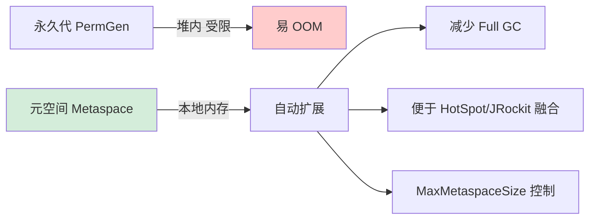

# 为什么JDK 1.8使用元空间替代永久代？

### 为什么JDK 1.8使用元空间替代永久代？

JDK 1.8 使用元空间替代永久代，主要基于以下几个原因：

**1. 内存大小限制与OOM风险**
- **永久代**：是JVM堆内存的一部分，其大小受 `-XX:MaxPermSize` 参数限制（默认较小）。由于类的元数据大小通常难以预测，容易导致 `java.lang.OutOfMemoryError: PermGen space` 错误。
- **元空间**：使用**本地内存**，受系统可用内存限制，默认上限很大。只要系统内存足够，就不会轻易出现OOM，减少了调优的复杂度。

**2. 融合JRockit虚拟机**
- Oracle在收购Sun后，计划融合HotSpot和JRockit两款虚拟机。JRockit并没有永久代的概念，移除永久代有助于统一实现，降低合并难度。

**3. 调优困难**
- 在永久代中，开发人员很难准确预测一个类及其元数据需要占用多少内存，导致 `-XX:MaxPermSize` 的设置往往依赖经验或反复试错。元空间可以自动扩展，大大简化了内存管理。

**4. 性能优化**
- 元空间将元数据（如类信息、方法数据）与对象数据（在堆中）分离，有助于减少GC的压力，特别是Full GC的频率，因为元空间的垃圾收集（主要是卸载无用的类）通常与堆的垃圾收集解耦。

### 深度补充

**1. 实战案例**
在开发基于 **OSGi** 的复杂模块化应用时，不同模块可能加载不同版本的同类库。在永久代模式下，频繁的类卸载和重新加载会导致永久代内存碎片化严重，最终引发内存泄漏或 Full GC 频繁。元空间的设计支持更高效的类卸载机制，显著提升了此类热部署场景的稳定性。

**2. 关键参数对比**
| 参数 (JDK 1.7) | 参数 (JDK 1.8) | 作用 |
| :--- | :--- | :--- |
| `-XX:PermSize` | `-XX:MetaspaceSize` | 初始空间大小 |
| `-XX:MaxPermSize` | `-XX:MaxMetaspaceSize` | 最大空间大小 |
| `-XX:PermSize` 通常需显式设置 | `-XX:MaxMetaspaceSize` 默认无上限 | 管理策略差异 |

**3. 代码示例**
虽然 Java 代码层面无直接感知，但在 JVM 启动脚本配置上有明显区别：
```bash
# JDK 1.7 启动参数示例
java -XX:PermSize=128m -XX:MaxPermSize=256m MyApp

# JDK 1.8 启动参数示例 (通常无需设置MaxMetaspaceSize，除非要防止单进程占用过多物理内存)
java -XX:MetaspaceSize=128m -XX:MaxMetaspaceSize=512m MyApp
```

## 技术原理

- **永久代 vs 元空间的内存位置差异**：永久代（PermGen）是 JVM 堆的一部分，大小受 `-XX:MaxPermSize`（默认 64~82MB）硬性限制，超过就 `OutOfMemoryError: PermGen space`。元空间（Metaspace）在**本地内存（Native Memory）**中分配，与堆解耦，默认上限是物理内存上限（可设 `-XX:MaxMetaspaceSize`）。这解决了"类元数据大小难以预估导致 OOM"的痛点。
- **元空间为什么用本地内存**：①堆内对象（永久代）要被 GC 管理，但类元数据生命周期与 ClassLoader 绑定，GC 扫描效率低；②本地内存扩容无堆上限约束，适合动态类加载场景（CGLib、JSP、Groovy）；③HotSpot 与 JRockit 融合——JRockit 没有永久代，统一架构必须移除。
- **类元数据的内容**：Klass 元数据（类名、字段、方法、常量池、字节码）+ Method 元数据（方法编译产物、profile）。**字符串常量池和静态变量**在 JDK 7 就从永久代移到堆，JDK 8 元空间只存"类结构"，不存对象实例。这是常见误解——很多人以为"静态变量在元空间"。
- **元空间的回收条件（类卸载）**：元空间的 GC 比堆更难触发——一个 ClassLoader 被卸载需同时满足①该 ClassLoader 无引用、②其加载的所有 Class 无实例、③这些 Class 无引用。**GC 不会自动卸载 ClassLoader**，需 Full GC（或并发类元数据回收，JDK 8u40+ 的 Metaspace 内部有专门 GC）。这就是为什么 CGLib 动态代理泄漏会让 Metaspace 一直涨。

## 对比/选型

| 维度 | 永久代 (JDK ≤1.7) | 元空间 (JDK 1.8+) |
|------|------------------|------------------|
| 内存位置 | JVM 堆内 | 本地内存（Native） |
| 大小上限 | `-XX:MaxPermSize`（默认 82MB） | 默认无上限（物理内存） |
| OOM 错误 | `PermGen space` | `Metaspace` |
| GC 扫描 | Full GC 扫描堆+永久代 | 独立的类元数据回收 |
| 调优 | 反复试错 | 自动扩容，简单 |
| 适用 | 类加载稳定 | 动态类加载场景（OSGi/Agent） |

## 命令演示

```bash
# JDK 1.7 永久代参数（已废弃）
-XX:PermSize=128m -XX:MaxPermSize=512m

# JDK 1.8+ 元空间参数
-XX:MetaspaceSize=128m                  # 触发 GC 的阈值（首次达到会 Full GC 并调整）
-XX:MaxMetaspaceSize=512m                # 上限（防止单进程吃光物理内存）
-XX:MinMetaspaceFreeRatio=40             # GC 后空闲比例 <40% 才扩容
-XX:MaxMetaspaceFreeRatio=70             # GC 后空闲比例 >70% 才缩容
-XX:MaxMetaspaceExpansion=1m             # 单次扩容上限

# 查看元空间使用（jcmd）
jcmd <pid> GC.class_stats                # 类元数据详细分布

# GC 日志关键信息
-Xlog:gc*=info,gc+metaspace=debug:file=gc.log
# 关键日志：
# "Metaspace       used 120M, capacity 150M, committed 160M, reserved 1G"
# "Metaspace GC" → 元空间触发 Full GC（类卸载）

# 常见诊断：Metaspace OOM
# -XX:+TraceClassLoading -XX:+TraceClassUnloading    # 跟踪类加载/卸载
# -XX:+UnlockDiagnosticVMOptions -XX:+PrintClassLoaderHierarchy
```

## 常见坑/注意事项

- **MaxMetaspaceSize 必须设置**：默认无上限，遇到类泄漏时会把整个容器/物理机内存吃光，触发 OOM Killer。生产环境必设 `-XX:MaxMetaspaceSize=512m`（或更高，根据业务）。
- **CGLib/反射动态代理泄漏**：每次反射调用会动态生成代理类，若 ClassLoader 未卸载，代理类持续累积，Metaspace 一直涨。`-XX:+TraceClassLoading` 定位是哪个 ClassLoader。修复：复用 Proxy 实例、用 MethodHandle 替代反射。
- **MetaspaceSize 的理解误区**：很多人以为 `-XX:MetaspaceSize=128m` 是"初始大小"，其实是"**触发首次 Full GC 的阈值**"——达到 128M 时触发 Full GC 卸载无用类，然后阈值上调。设小一点（如 64M）可让无用类更早卸载。
- **JSP/Groovy 类加载泄漏**：JSP 重新编译会加载新 Class，旧 Class 的 ClassLoader 若未销毁，Metaspace 涨。重启 Tomcat 或定期 Full GC（不推荐）可缓解。从架构层避免频繁 JSP 热部署。
- **堆外内存监控**：Metaspace 不在堆里，常规 `-XX:+HeapDumpOnOutOfMemoryError` 抓不到。用 `jcmd VM.native_memory`（需 `-XX:NativeMemoryTracking=summary`）查看本地内存分布，定位 Metaspace 占用。


## 核心流程图



## 记忆要点

- 换元原因：永久代大小固定易 OOM，而元空间用本地内存，自动扩容极大降低溢出风险。
- 融合背景：为了融合 HotSpot 与 JRockit，JRockit 无永久代，统一架构必须移除。
- 解耦 GC：元空间将元数据与堆内对象分离，避免了 Full GC 时扫描永久代的低效。
- 实战痛点：动态代理（CGLib）生成大量类，永久代易满，而元空间对此支持更好。

## 结构化回答


**30 秒电梯演讲：** 把仓库从自家小院（受限的永久代）搬到外面的广场（本地内存），地方宽敞不用担心挤爆。

**展开框架：**
1. **永久代内存大小受** — 永久代内存大小受限易OOM
2. **元空间使用本地内** — 元空间使用本地内存自动扩展
3. **便于HotSpo** — t与JRockit融合

**收尾：** 这是我实战中的理解，您想深入哪一段？


## 视频脚本

> 预计时长：3 分钟 | 由浅入深

| 时间 | 画面/字幕 | 口播台词 | 讲解要点 |
|------|----------|----------|----------|
| 0:00 | 标题卡：为什么JDK 1.8使用元空间替代永久代 | 今天这道题：为什么JDK 1.8使用元空间替代永久代。30 秒先给你讲清楚。 | 开场钩子 |
| 0:20 | 核心概念动画/示意图 | 把仓库从自家小院（受限的永久代）搬到外面的广场（本地内存），地方宽敞不用担心挤爆。 | 核心概念 |
| 0:40 | 永久代内存大小受限易OOM示意图 | 永久代内存大小受限易OOM | 永久代内存大小受限易OOM |
| 1:10 | 总结卡 + 下期预告 | 记住今天这几个关键词，面试一定用得上。下期见。 | 收尾 |
