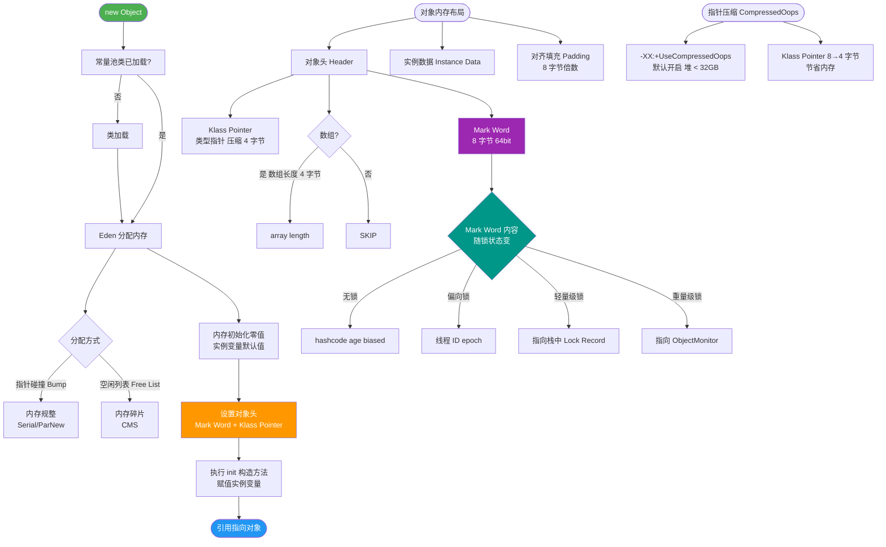

# JVM中对象创建的完整过程是什么？

### JVM中对象创建的完整过程

当JVM遇到一条字节码指令（如 `new`）时，对象创建过程主要分为以下5个步骤：

**1. 类加载检查**
- 虚拟机遇到 `new` 指令时，首先去检查这个指令的参数是否能在常量池中定位到一个类的符号引用。
- 检查这个符号引用代表的类是否已被加载、解析和初始化过。如果没有，必须先执行相应的类加载过程。

**2. 分配内存**
- 类加载检查通过后，虚拟机将为新生对象分配内存。
- 对象所需内存的大小在类加载完成后便可完全确定。
- **分配方式**：
  - **指针碰撞**：如果Java堆中内存是绝对规整的（所有用过的内存放一边，空闲的放另一边），通过指针移动来分配内存。
  - **空闲列表**：如果Java堆中的内存并不是规整的，虚拟机必须维护一个列表，记录哪些内存块是可用的，从列表中找到足够大的空间划分给实例。
- **并发处理**：在并发情况下，为保证线程安全，可采用CAS+失败重试 或 **TLAB**（本地线程分配缓冲）机制。

**3. 初始化零值**
- 内存分配完成后，虚拟机需要将分配到的内存空间都初始化为零值（不包括对象头）。
- 这一步保证了对象的实例字段在Java代码中可以不赋初值就直接使用，程序能访问到这些字段的数据类型所对应的零值。

**4. 设置对象头**
- 虚拟机对对象进行必要的设置，例如这个对象是哪个类的实例、如何才能找到类的元数据信息、对象的哈希码、对象的GC分代年龄等信息。
- 这些信息存放在**对象头**之中。

**5. 执行 `<init>` 方法**
- 上面工作完成后，从虚拟机的视角来看，一个新的对象已经产生了。
- 但是从Java程序的视角来看，对象创建才刚刚开始，因为 `<init>` 方法还没有执行，所有的字段都还为零。
- 执行 `<init>` 方法（即构造函数），按照程序员的意愿对对象进行初始化，从而一个真正可用的对象才算完全产生。

### 关键细节补充
- **TLAB 机制**：每个线程在堆中预先分配一小块私有内存。线程创建小对象时直接在 TLAB 中分配，无需加锁，只有在 TLAB 用尽并分配新 TLAB 时才需要同步。通过 `-XX:+UseTLAB` 开启（默认开启）。
- **指针碰撞 vs 空闲列表**：
  - **Serial、ParNew** 等带有压缩整理过程的收集器，采用指针碰撞。
  - **CMS** 这种基于清除算法的收集器，由于产生大量碎片，只能采用空闲列表。
- **内存初始化边界**：零值初始化保证了对象实例字段在不赋值时的默认值（如 int 为 0，boolean 为 false，引用为 null）。

### 对象创建流程图
```text
[指令: new] 
     |
     v
+-------------------+
| 1. 类加载检查     |-----> (未加载) ----> [类加载器加载] 
+-------------------+                       |
     | (已加载)                          v
     v                            +-------------------+
+-------------------+              | 回到检查步骤     |
| 2. 分配内存       |              +-------------------+
| (指针碰撞/列表)   |
| (TLAB/CAS)        |
+-------------------+
     |
     v
+-------------------+
| 3. 初始化零值     |  (设置默认值)
+-------------------+
     |
     v
+-------------------+
| 4. 设置对象头     |  (Class指针/HashCode/锁信息)
+-------------------+
     |
     v
+-------------------+
| 5. 执行 <init>    |  (构造函数/实例初始化块)
+-------------------+
     |
     v
[ 对象创建完成 ]
```

### 实战进阶

**1. 实战案例**
在**高并发网关**场景下，如果出现频繁的 Full GC 且伴随着大量的 `new` 指令卡顿，通常是因为 Eden 区太小导致 TLAB 空间频繁耗尽，线程回退到堆上进行 CAS 分配，造成激烈的锁竞争。调优策略通常是调大 `-XX:TLABSize` 或增加 Eden 区大小，以减少并发冲突。

**2. 代码示例**
```java
public class ObjectCreationDemo {
    private int a; // 步骤3：默认初始化为 0
    private Integer b = 10; // 步骤5：执行 <init> 时赋值

    public ObjectCreationDemo() {
        this.a = 5; // 步骤5：构造函数中再次赋值
    }
    // 实际字节码层面，new 指令后跟随 invokespecial <init> 指令
}
```


## 核心流程图



## 记忆要点
- 五步口诀：类加载检查、分配内存、初始化零值、设置对象头、执行<init>
- 因为堆内存是否规整，所以分配方式分为指针碰撞和空闲列表两种
- 因为并发安全，所以采用CAS重试或TLAB（本地线程分配缓冲）机制
- 因为零值初始化，所以对象实例字段无需赋初值即可直接使用
- 从虚拟机视角<init>执行前对象已产生，但从Java视角构造函数执行完才可用

## 结构化回答


**30 秒电梯演讲：** 像盖房子：先看图纸（检查类），然后圈地（分配内存），毛坯平地（初始化零值），挂牌子（设置对象头），最后装修（执行构造函数）。

**展开框架：**
1. **先检查类** — 先检查类是否已加载
2. **在堆中分配内** — 在堆中分配内存（指针碰撞或空闲列表）
3. **初始化内存为** — 初始化内存为零值

**收尾：** 这是我实战中的理解，您想深入哪一段？


## 视频脚本

> 预计时长：3 分钟 | 由浅入深

| 时间 | 画面/字幕 | 口播台词 | 讲解要点 |
|------|----------|----------|----------|
| 0:00 | 标题卡：JVM中对象创建的完整过程是什么 | 今天这道题：JVM中对象创建的完整过程是什么。30 秒先给你讲清楚。 | 开场钩子 |
| 0:20 | 核心概念动画/示意图 | 像盖房子：先看图纸（检查类），然后圈地（分配内存），毛坯平地（初始化零值），挂牌子（设置对象头），最后装修（执行构造函数）。 | 核心概念 |
| 0:40 | 先检查类示意图 | 先检查类是否已加载 | 先检查类 |
| 1:10 | 总结卡 + 下期预告 | 记住今天这几个关键词，面试一定用得上。下期见。 | 收尾 |
