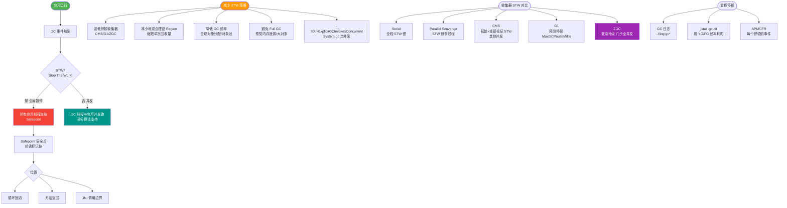
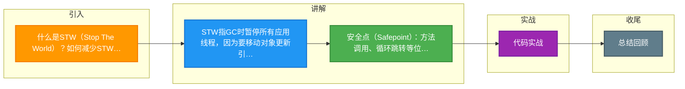

# 什么是STW（Stop The World）？如何减少STW？

STW是指JVM在进行垃圾回收时，暂停所有应用线程。因为GC过程中需要移动对象、更新引用，必须保证一致性。

减少STW的方法：
①选择低停顿的GC收集器，如G1、ZGC、Shenandoah
②合理设置堆大小，避免过大堆导致GC时间过长
③使用并发收集器（CMS），让GC线程和应用线程并发执行
④设置合理的GC停顿时间目标：-XX:MaxGCPauseMillis
⑤减少对象创建速率，降低GC频率

安全点：JVM在方法调用、循环跳转等位置设置安全点，线程运行到安全点才能被暂停。

### 关键细节补充
1. **STW 的根本原因**：
   - **可达性分析的准确性**：如果在分析对象引用关系时，应用线程还在修改引用关系，会导致分析结果不准确（浮动垃圾或对象丢失）。
   - **一致性要求**：GC Root 枚举和对象移动整理时，必须冻结所有线程，保证引用关系的快照一致性。

2. **安全点与安全区域**：
   - **安全点**：程序执行过程中只有在特定的位置（如方法调用、循环回跳、异常跳转）才会暂停。JVM通过 OopMap（普通对象指针映射）快速定位栈上的 GC Root。如果在非安全点（如正在执行密集计算且无函数调用），线程必须等到进入安全点才能响应中断。
   - **安全区域**：指在一段代码片段中，引用关系不会发生变化（如线程处于 Sleep 或 Blocked 状态）。在这个区域内的任意地方发起 GC 都是安全的。线程离开安全区域时，必须检查是否完成了 GC Root 枚举，否则必须等待直到完成。

3. **不同 GC 的 STW 特性**：
   - **Parallel Scavenge / Parallel Old**：全程 STW，吞吐量高，但停顿时间可能很长。
   - **CMS**：初始标记和重新标记阶段 STW，并发标记和并发清除阶段与应用线程并发。
   - **G1**：基于 Region，支持可预测的停顿时间模型。只有初始标记、最终标记和清理/回收阶段会有短暂 STW。
   - **ZGC / Shenandoah**：致力于实现几乎完全并发的 GC，STW 时间通常在 10ms 以内（ZGC目标 <1ms）。

4. **参数调优细节**：
   - `-XX:MaxGCPauseMillis`：在 G1 中设置此值会让 G1 尝试调整回收的 Region 数量来满足目标，但这并不意味着停顿时间一定小于该值，且过小的目标可能导致垃圾回收频繁，反而降低吞吐量。
   - `-XX:CompileThreshold` 调整也会影响安全点进入的频率。

### 实战案例
某高并发网关服务在处理大促流量时，因为频繁打印 DEBUG 日志产生大量临时对象，导致 Young GC 频繁触发。虽然使用的是 G1 收集器，但由于对象分配速率超过了 G1 的 Region 回收速度，最终频繁发生 Full GC，导致服务 STW 长达数秒，造成上游超时。

### GC 线程与应用线程交互流程
```text
应用线程                  GC 线程
   |                              |
   | <执行代码>                   |
   | (到达 Safepoint)             |
   | <轮询中断指令>               |
   | (检测到 GC 请求)             |
   | <停止执行>                   |
   | <保存 JVM 上下文>            |
   |---------------------------> |
   | (挂起 / 进入 Safe Region)    |
   |                              |
   |                              | <标记 / 整理 / 复制>
   |                              | <更新引用>
   |                              |
   | <-------------------------- |
   | (恢复执行)                   |
   |                              |
```

### 常见考点
1. **除了 GC，还有哪些情况会发生 STW？**
   - **JIT 去优化**：当代码被 invalidated 时，需要从编译代码退回到解释执行。
   - **堆转储**：执行 `jmap -histo:live pid` 或 `jmap -dump:format=b,file=heap.hprof pid` 时。
   - **Biased Lock Revocation**：撤销偏向锁时可能触发短暂的停顿。
   - **死锁检测**或某些 `VMOperations`（如类重定义）。

### 不同 GC 停顿特性对比
| 特性 | Parallel GC | CMS (Concurrent Mark Sweep) | G1 (Garbage First) | ZGC / Shenandoah |
| :--- | :--- | :--- | :--- | :--- |
| **核心目标** | 高吞吐量 | 低停顿 | 可预测停顿 + 高吞吐 | 极低停顿 (<10ms) |
| **STW 阶段** | 全程 STW | 初始标记、重新标记 (STW) | 初始标记、最终标记、混合回收 (STW) | 几乎全程并发 (仅极短 STW) |
| **适用场景** | 后台运算、批处理 | 早期 Web 应用 (JDK8 逐渐弃用) | 大堆内存 (4GB - 32GB+) | 超大堆内存 (TB 级) |
| **碎片化问题** | 较少 | 严重 (使用碎片整理) | 空间整理 (Region 复制) | 读屏障 / 染色指针解决 |


## 核心流程图



## 记忆要点
- STW指GC时暂停所有应用线程，因为要移动对象更新引用，必须保证一致性
- 安全点(Safepoint)：方法调用、循环跳转等位置，线程运行到此才能被暂停
- 减少STW核心：选择G1/ZGC等低停顿收集器，合理设置堆和停顿目标
- ZGC/Shenandoah几乎全并发，STW通常控制在10ms以内

## 结构化回答


**30 秒电梯演讲：** 就像打扫卫生时，所有人都得暂停走动，保洁员才能安全清理。

**展开框架：**
1. **GC** — GC为了移动对象和更新引用必须暂停线程
2. **CMS** — 使用并发收集器（CMS/G1/ZGC）减少停顿
3. **合理设置堆大** — 合理设置堆大小和停顿时间目标

**收尾：** 这是我实战中的理解，您想深入哪一段？


## 视频脚本

> 预计时长：3 分钟 | 由浅入深

| 时间 | 画面/字幕 | 口播台词 | 讲解要点 |
|------|----------|----------|----------|
| 0:00 | 标题卡：什么是STW（Stop The World）？如何减少STW | 今天这道题：什么是STW（Stop The World）？如何减少STW。30 秒先给你讲清楚。 | 开场钩子 |
| 0:20 | 核心概念动画/示意图 | 就像打扫卫生时，所有人都得暂停走动，保洁员才能安全清理。 | 核心概念 |
| 0:40 | GC示意图 | GC为了移动对象和更新引用必须暂停线程 | GC |
| 1:10 | 总结卡 + 下期预告 | 记住今天这几个关键词，面试一定用得上。下期见。 | 收尾 |

### 视频流程图



