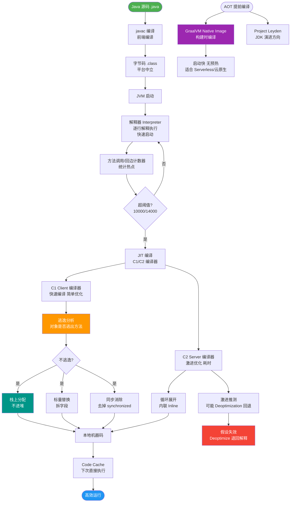

# 什么是逃逸分析？它带来了哪些优化？

逃逸分析是一种JIT编译优化技术，分析对象的动态作用域，判断对象是否逃逸出方法或线程。

**三种逃逸级别：**
- 全局逃逸：对象被方法返回或赋值给静态变量
- 方法逃逸：对象被作为参数传递给其他方法
- 未逃逸：对象只在方法内部使用

**未逃逸对象带来的优化：**
1. **栈上分配**：将对象分配在栈帧而非堆中，方法出栈时内存自动销毁，减轻GC压力。
2. **同步消除**：JVM编译时通过逃逸分析确定对象不会逃逸出当前线程，则移除` synchronized` 锁。
3. **标量替换**：将聚合对象（对象）拆解为标量（基本数据类型）直接在栈上使用，不再创建对象。

**原理与边界：**
- **原理**：JIT 编译器在解析字节码时，建立数据流图，分析对象引用指向。若对象仅限方法内，且生命周期随方法结束而结束，则视为未逃逸。
- **代价**：逃逸分析本身消耗 CPU 资源，计算耗时。若分析耗时超过优化带来的收益，JVM 可能放弃该优化。
- **参数**：`-XX:+DoEscapeAnalysis` 开启（JDK 7u6 后默认开启），`-XX:+EliminateAllocations` 开启标量替换，`-XX:+PrintEscapeAnalysis` 打印分析信息。

**标量替换示意图**：
```text
原代码 (未逃逸对象):        JIT优化后 (标量替换):
public void method() {      public void method() {
  Point p = new Point(x, y);    int p_x = x;    // 标量
  use(p.x, p.y);               int p_y = y;    // 标量
}                               use(p_x, p_y);
                              }
```

### 实战案例
在高性能的日志序列化库中，创建临时对象（如 StringBuilder 或 DTO）通常会导致严重的 GC 压力。开启逃逸分析和标量替换后，这些临时对象被拆解为基本类型直接在寄存器或栈中运算，避免了堆内存分配，使得 TPS 提升了约 30%，且 GC 次数降为 0。

### 代码示例（标量替换验证）
```java
// JVM 参数: -XX:+DoEscapeAnalysis -XX:+EliminateAllocations -XX:+PrintEliminateAllocations
public class EscapeTest {
    public static void main(String[] args) {
        long sum = 0;
        for (int i = 0; i < 100000; i++) {
            sum += alloc().i;
        }
        System.out.println(sum);
    }
    // 此方法经过 JIT 编译后，MyObject 不会被分配在堆上
    private static MyObject alloc() {
        return new MyObject(1); 
    }
}
class MyObject { int i; public MyObject(int i) { this.i = i; } }
```

## 常见考点
1. **是否所有的对象都能在栈上分配？** 
   不是。只有未逃逸对象且满足大小限制（JVM 栈帧空间有限）的对象才可能栈上分配。大对象或逃逸对象必须在堆中分配。
2. **逃逸分析发生在编译的哪个阶段？** 
   发生在即时编译（JIT）的中间代码分析阶段，属于静态分析的一种。
3. **标量替换和栈上分配的关系？** 
   标量替换是比栈上分配更激进的优化。如果允许标量替换，对象甚至可能完全不存在（不分配内存）；栈上分配通常指将对象整体分配在栈上。实践中 JVM 常用标量替换代替栈上分配。


## 核心流程图



## 记忆要点
- 逃逸分析是一种JIT优化技术，分析对象动态作用域判断是否逃逸出方法或线程
- 逃逸级别：全局逃逸、方法逃逸、未逃逸（仅方法内部使用）
- 未逃逸对象带来三大优化：栈上分配、同步消除、标量替换
- 标量替换最激进，直接将对象拆解为基本类型在栈上使用，甚至不创建对象

## 结构化回答


**30 秒电梯演讲：** 就像外卖只在店吃就不打包（栈上分配），不需要防洒漏（锁消除）。

**展开框架：**
1. **分析对象** — 分析对象是否逃出方法或线程
2. **GC** — 未逃逸可栈上分配，自动回收减轻GC压力
3. **未逃逸** — 未逃逸可消除同步锁

**收尾：** 这是我实战中的理解，您想深入哪一段？


## 视频脚本

> 预计时长：4 分钟 | 由浅入深

| 时间 | 画面/字幕 | 口播台词 | 讲解要点 |
|------|----------|----------|----------|
| 0:00 | 标题卡：什么是逃逸分析？它带来了哪些优化 | 今天这道题：什么是逃逸分析？它带来了哪些优化。30 秒先给你讲清楚。 | 开场钩子 |
| 0:20 | 核心概念动画/示意图 | 就像外卖只在店吃就不打包（栈上分配），不需要防洒漏（锁消除）。 | 核心概念 |
| 0:40 | 分析对象示意图 | 分析对象是否逃出方法或线程 | 分析对象 |
| 1:10 | 未逃逸示意图 | 未逃逸可栈上分配，自动回收减轻GC压力 | 未逃逸 |
| 1:40 | 总结卡 + 下期预告 | 记住今天这几个关键词，面试一定用得上。下期见。 | 收尾 |

---

## 延伸：JIT 编译器的逃逸分析会做哪些优化？栈上分配/锁消除/标量替换的原理？

> 合并自 `jvm-088`（相似度 70%）

【逃逸分析】
逃逸分析是 JIT 编译器的高级优化技术，用于分析对象的作用域。如果对象的作用域仅限于当前方法或线程（即未逃逸），JVM 可进行针对性优化。HotSpot 中通过 `-XX:+DoEscapeAnalysis` 开启（默认开启）。

【3大核心优化原理】
1. **栈上分配**
   - **原理**：未逃逸对象分配在栈帧中，随方法出栈自动销毁，无需 GC 回收。
   - **细节**：HotSpot 并未真正实现"在栈上分配对象结构"，而是通过"标量替换"实现的。本质是将对象打散为局部变量，不存在堆内存分配。
   - **优势**：减少 GC 压力，提高缓存命中率。

2. **锁消除**
   - **原理**：JIT 编译时，通过逃逸分析确认对象仅被当前线程访问，则自动消除 synchronized 锁操作。
   - **细节**：基于逃逸分析支持，若对象未逃逸，锁本身无效；若局部变量对象引用（如 `new String().append()`）未逃逸，JIT 会移除锁的字节码。
   - **示例**：`StringBuffer` 是线程安全的，但若仅局部使用，编译后会消除 `append` 方法的锁开销。

3. **标量替换**
   - **原理**：将聚合量（对象）拆解为标量（基本数据类型、引用），直接在栈或寄存器中分配。
   - **细节**：例如 `Point p = new Point(1,2); return p.x+p.y;` 优化后变为 `int x=1, y=2; return x+y;`，完全去除了对象内存分配。
   - **参数**：`-XX:+EliminateAllocations`（默认开启）。

【其他JIT优化】
- **方法内联**：将热点小方法的代码直接拷贝到调用处，消除调用开销（压栈、跳转），为其他优化（如标量替换）提供基础。
- **循环展开**：减少循环次数判断开销，增加指令级并行。
- **公共子表达式消除**：重复计算的表达式结果复用。

【标量替换示例代码流】
```text
原始代码:              JIT 编译后:
----------             ----------
new Point(x, y)    =>   int x = ...
sum = p.x + p.y    =>   int y = ...
                     sum = x + y
(不再创建 Point 对象)
```

【## 常见考点】
1. **为什么说 Java 不一定比 C++ 慢**：解释 JIT 逃逸分析和标量替换带来的性能红利。
2. **JIT 与 C++ 编译器的区别**：JIT 是运行时编译，拥有更多运行时信息进行激进优化（如基于 Profile 的内联）。
3. **逃逸分析的失效**：对象返回给外部、赋值给成员变量或被其他线程引用时，逃逸分析失效。

## 记忆要点

- 核心前提：逃逸分析判定对象是否逃出方法或线程
- 栈上分配：未逃逸对象栈上分配，随帧销毁免 GC（实则依赖标量替换）
- 锁消除：未逃逸对象无并发竞争，JIT 自动抹除同步锁
- 标量替换：对象打散为基本类型，存于栈或寄存器，彻底免堆分配
- 其他JIT优化：方法内联消除调用开销，是其他优化的基础

## 结构化回答


**30 秒电梯演讲：** 像快餐店打包：发现你在店吃（不逃逸），就直接用盘子（栈）不用打包盒（堆），用完即洗。

**展开框架：**
1. **GC** — 不逃逸对象可栈上分配或标量替换，免GC
2. **单线程对象的锁** — 单线程对象的锁可被消除
3. **标量替换是** — 标量替换是将对象拆解为基本类型使用

**收尾：** 逃逸分析精度如何？什么情况不准？


## 视频脚本

> 预计时长：5 分钟 | 由浅入深

| 时间 | 画面/字幕 | 口播台词 | 讲解要点 |
|------|----------|----------|----------|
| 0:00 | 标题卡：JIT 编译器的逃逸分析会做哪些优化？栈上分配/锁消除/标量替换的原理 | 今天这道题：JIT 编译器的逃逸分析会做哪些优化？栈上分配/锁消除/标量替换的原理。30 秒先给你讲清楚。 | 开场钩子 |
| 0:20 | 核心概念动画/示意图 | 像快餐店打包：发现你在店吃（不逃逸），就直接用盘子（栈）不用打包盒（堆），用完即洗。 | 核心概念 |
| 0:40 | 不逃逸对象示意图 | 不逃逸对象可栈上分配或标量替换，免GC | 不逃逸对象 |
| 1:10 | 单线程对象的锁示意图 | 单线程对象的锁可被消除 | 单线程对象的锁 |
| 1:40 | 标量替换示意图 | 标量替换是将对象拆解为基本类型使用 | 标量替换 |
| 2:10 | 总结卡 + 下期预告 | 记住三个词就能答好这道题。下期追问：逃逸分析精度如何？什么情况不准？ | 收尾 |
