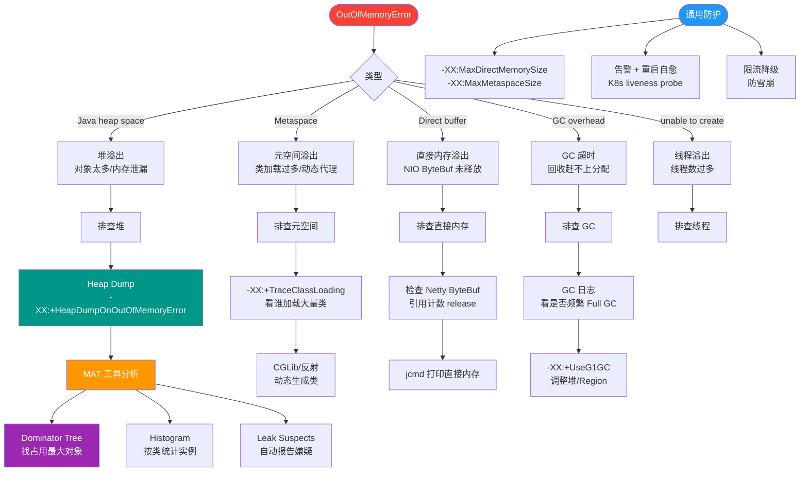

# 内存溢出（OOM）和内存泄漏有什么区别？

**内存溢出（OOM）**：程序申请内存时没有足够空间，抛出OutOfMemoryError。常见原因：堆设置过小、创建大量大对象、内存泄漏导致可用空间减少。

**内存泄漏**：对象不再使用但无法被GC回收，因为仍有引用指向它。常见原因：静态集合不断添加对象但不清理、数据库/IO连接未关闭、ThreadLocal未remove、监听器未注销。

**关系**：内存泄漏是渐进过程，随着泄漏加剧最终导致内存溢出。

**排查方法**：jmap -dump生成heap dump → MAT/VisualVM分析 → 找到GC Roots引用链 → 定位代码。

**详细区分与架构**：

| 特性 | 内存溢出 | 内存泄漏 |
| :--- | :--- | :--- |
| **本质** | 真的没内存了 | 内存虽被占用但无法回收 |
| **速度** | 可能瞬间发生（如分配巨型数组） | 缓慢积累，系统越来越慢 |
| **现象** | OutOfMemoryError | 老年代持续增长，频繁 Full GC |
| **恢复性** | 通常需重启或扩容 | 排查泄漏点修复后可恢复 |

**内存泄漏诊断流程图**：
```text
系统运行缓慢/频繁GC
        │
        ├─> jstat 查看GC情况 (FGC 增长快? 老年代占比高?)
        │       │
        │       └─ Yes (疑似泄漏)
        │               │
        │               ├─> jmap -dump:format=b,file=heap.hprof <pid>
        │               │
        │               └─> MAT分析
        │                       ├─> Dominator Tree (查看占用内存最大的对象)
        │                       └─> Path to GC Roots (查找谁在引用)
        │
        └─ No (可能是正常峰值或Dump时机不对)
```

### 实战案例
某报表服务上线后，每隔一天必须重启，否则响应变慢。经排查发现，代码中使用静态 HashMap 作为本地缓存，但只有 put 没有 remove 策略。随着用户查询不同维度的报表，Map 持续膨胀，最终填满堆内存导致频繁 Full GC 甚至 OOM。改为 Guava Cache 或 Caffeine（带过期策略）后问题解决。

### 代码示例（模拟内存泄漏）
```java
import java.util.ArrayList;
import java.util.List;

// 模拟静态集合导致的内存泄漏
public class MemLeakSimulator {
    // 静态变量生命周期与类相同，不会被 GC 回收
    static List<byte[]> cache = new ArrayList<>();

    public static void main(String[] args) throws InterruptedException {
        while (true) {
            // 持续向静态集合添加数据，且不清理
            cache.add(new byte[1024 * 1024]); // 1MB
            Thread.sleep(50);
        }
    }
}
```

**关键细节**：
- **Java 中的泄漏**：通常是逻辑性的，即开发者误以为对象会被回收，但实际上被静态变量、长生命周期集合（如 HashMap）或未关闭的回调持有。
- **虚引用与 WeakHashMap**：使用 `WeakHashMap` 或软引用/弱引用可以缓解部分缓存导致的泄漏。

## 常见考点
1. **如何快速区分是内存泄漏还是内存溢出？** 
   观察老年代使用率。如果Full GC后老年代使用率依然很高（居高不下），通常是内存泄漏；如果Full GC后有明显下降，说明只是内存溢出或峰值流量。
2. **ThreadLocal 为什么会导致内存泄漏？** 
   ThreadLocal 的 Key 是弱引用，会被回收，但 Value 是强引用链（Thread -> ThreadLocalMap -> Entry -> Value）。如果 Thread 线程长期不结束（如线程池），Key 没了但 Value 还在，导致泄漏。解决方法：必须手动 remove。
3. **OOM 排查时，除了 Dump 还有哪些现场信息要收集？** 
   CPU 使用率、线程堆栈、GC 日志、系统负载。有时 OOM 是因为 CPU 满导致 GC 停顿太长，而非物理内存不足。


## 核心流程图



## 记忆要点
- OOM是内存溢出（真的没内存了），内存泄漏是对象不用了却无法被回收
- 内存泄漏是渐进过程，随着泄漏加剧，最终必然导致内存溢出
- 常见泄漏原因：静态集合不清理、ThreadLocal未remove、IO连接未关闭
- 排查链路：jmap dump生成快照 -> MAT分析Dominator Tree -> 定位GC Roots引用链

## 结构化回答

**30 秒电梯演讲：** 溢出是钱包空了买不起，泄漏是钱掉进夹缝拿不出来。

**展开框架：**
1. **内存溢出** — 内存溢出：申请时无足够空间，直接报错
2. **内存泄漏** — 内存泄漏：无用对象被引用导致无法回收
3. **泄漏** — 泄漏是渐进过程，最终会导致溢出

**收尾：** 这块我踩过一些坑，您想深入聊哪一段——原理细节、实战案例还是常见踩坑？

## 视频脚本

> 预计时长：3 分钟 | 由浅入深

| 时间 | 画面/字幕 | 口播台词 | 讲解要点 |
|------|----------|----------|----------|
| 0:00 | 标题卡：内存溢出（OOM）和内存泄漏有什么区别 | 今天这道题：内存溢出（OOM）和内存泄漏有什么区别。30 秒先给你讲清楚。 | 开场钩子 |
| 0:20 | 核心概念动画/示意图 | 溢出是钱包空了买不起，泄漏是钱掉进夹缝拿不出来。 | 核心概念 |
| 0:40 | 内存溢出示意图 | 内存溢出：申请时无足够空间，直接报错 | 内存溢出 |
| 1:10 | 总结卡 + 下期预告 | 记住今天这几个关键词，面试一定用得上。下期见。 | 收尾 |
