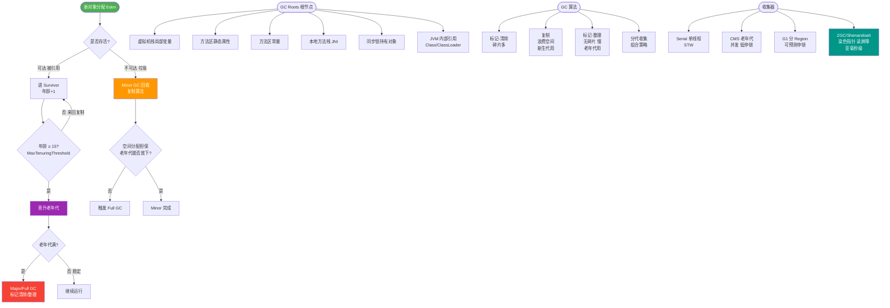

# ZGC收集器有什么特点？

ZGC (Z Garbage Collector) 是 JDK 11 引入的低延迟垃圾收集器，JDK 15 正式可用，旨在实现无论堆内存多大，停顿时间都不超过 10ms（JDK 21 更是优化至亚毫秒级）。

**核心特点**：
- **极低停顿**：停顿时间 < 10ms，且停顿时间不随堆的大小增加而增加（支持 TB 级堆内存）。
- **并发整理**：几乎所有的阶段（包括对象的移动/整理）都是并发的，STW 时间极短。

**关键技术细节**：

1. **染色指针**：
   这是 ZGC 的核心创新。它利用 64 位指针中的高 42~18 位（视操作系统和实现而定）来存储 GC 状态信息（如 Finalizable、Remapped、Marked0、Marked1），而不是像传统 GC 那样将信息存在对象头中。
   - 优势：只需要查看指针就能知道对象状态，大幅降低对象访问的开销；支持多重映射将多个虚拟内存地址映射到同一物理页面。

2. **读屏障**：
   ZGC 几乎完全移除了写屏障，转而使用**读屏障**。每次从堆中读取引用时，都会执行一段微小的代码片段（由 JIT 编译内联，性能开销极小）。
   - 作用：如果对象正在被移动，读屏障会修正指针，确保应用线程总是访问到最新的对象地址。

3. **负载屏障**：
   类似于读屏障，主要用于修正对象引用。

4. **Region 动态划分**：
   ZGC 的 Region 具有动态性（Small, Medium, Large），以适应不同大小的对象。大对象（Large Region）不进行复制，只做重定位。

**工作阶段（并发）**：
ZGC 的周期主要包括：并发标记 -> 并发预备重分配 -> 并发重分配 -> 并发重映射。

```text
ZGC 并发处理流程：
应用线程: ───[读屏障修正指针]──> 读取对象 ───[读屏障修正指针]──>
            ▲                       │
            │                       │
GC线程  : ───[标记/移动对象]─────────┘
```

**适用场景**：
- 对延迟极其敏感的系统（如高频交易、实时广告竞价）。
- 超大内存应用（几百 GB 甚至 TB 级）。

### 实战案例
某金融行情推送服务堆内存达 128GB，使用 G1 在大促高峰期偶发 500ms+ 的停顿。切换至 ZGC 后，在同样的负载下，99.99% 的 GC 停顿控制在 2ms 以内，彻底解决了丢包卡顿问题，但吞吐量下降了约 5%（可接受范围）。

### 关键代码配置
```bash
# JDK 17+ ZGC 启动参数
-XX:+UnlockExperimentalVMOptions -XX:+UseZGC 
-XX:ConcGCThreads=2  # 并发GC线程数，建议设为逻辑核数的1/8左右
-XX:ZCollectionInterval=5 # GC触发间隔(秒)
```

## 常见考点
1. ZGC 为什么停顿时间这么短？
   使用染色指针 + 读屏障，使得 GC 线程移动对象时，应用线程可以通过读屏障自我修正指针，不需要像 G1 那样进行复杂的 SATB 或全堆扫描的 STW 操作。STW 仅用于根节点扫描和极短的状态切换。
2. ZGC 的染色指针有什么限制？
   需要操作系统支持多重映射，且目前主要在 64 位系统上有效（依赖于 64 位指针的冗余空间）。
3. ZGC 和 G1 的区别？
   G1 是基于 Region 的标记-复制，有短暂的 STW 进行对象移动整理；ZGC 是基于染色指针的并发整理，对象移动是并发的，STW 几乎可以忽略不计。
4. ZGC 支持 NUMA 吗？
   支持，ZGC 设计之初就考虑了 NUMA 架构，会优先在本地内存分配对象。


## 核心流程图



## 记忆要点
- 核心目标：支持 TB 级超大堆，停顿时间 <10ms 且不随堆增大而增加
- 核心技术：利用 64 位指针冗余位存储 GC 状态，称为染色指针
- 并发整理：GC 移动对象时，应用线程通过读屏障自我修正指针地址
- 阶段对比：G1 整理需短暂 STW，而 ZGC 标记和整理几乎完全并发

## 结构化回答


**30 秒电梯演讲：** 给每个物品贴隐形标签，搬运时用特制眼镜（读屏障）看，不耽误别人走路。

**展开框架：**
1. **停顿时间极短** — 停顿时间极短（<10ms）且不随堆增大而增加
2. **使用染色指针** — 使用染色指针在低位存元数据
3. **读屏障实现并发整理** — 读屏障实现并发整理，几乎无内存碎片

**收尾：** 这是我实战中的理解，您想深入哪一段？


## 视频脚本

> 预计时长：4 分钟 | 由浅入深

| 时间 | 画面/字幕 | 口播台词 | 讲解要点 |
|------|----------|----------|----------|
| 0:00 | 标题卡：ZGC收集器有什么特点 | 今天这道题：ZGC收集器有什么特点。30 秒先给你讲清楚。 | 开场钩子 |
| 0:20 | 核心概念动画/示意图 | 给每个物品贴隐形标签，搬运时用特制眼镜（读屏障）看，不耽误别人走路。 | 核心概念 |
| 0:40 | 停顿时间极短（<10ms示意图 | 停顿时间极短（<10ms）且不随堆增大而增加 | 停顿时间极短（<10ms |
| 1:10 | 染色指针示意图 | 使用染色指针在低位存元数据 | 染色指针 |
| 1:40 | 总结卡 + 下期预告 | 记住今天这几个关键词，面试一定用得上。下期见。 | 收尾 |
