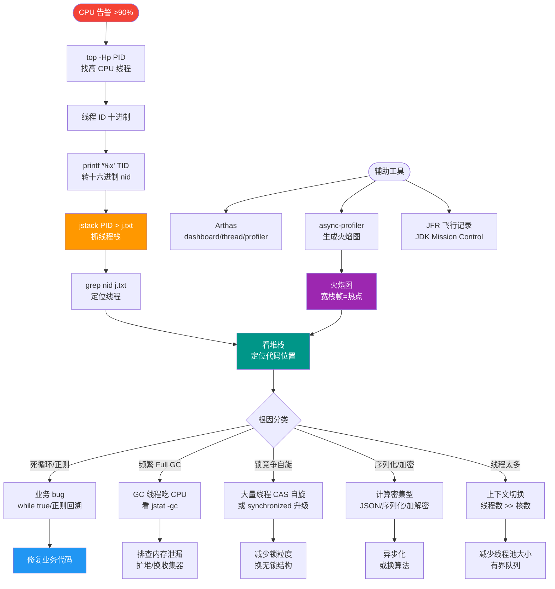

# CPU占用过高如何排查？

### 1. 确定高占用进程
使用 `top` 命令查看系统资源使用情况，找到 CPU 占用率最高的 Java 进程，并记录其 PID。

### 2. 确定高占用线程
使用 `top -Hp <PID>` 命令查看该进程下所有线程的资源消耗，找到 CPU 占用最高的线程，记录其 TID（线程 ID）。

### 3. 线程 ID 转换
Java 的 Native 线程 ID 与堆栈中的十六进制 ID 对应，使用命令 `printf "%x\n" <TID>` 将十进制 TID 转换为十六进制格式（ nid 在 jstack 中的格式）。

### 4. 查看线程堆栈
使用 `jstack <PID> | grep <十六进制TID>` (或者使用 `jstack <PID> > pid.log` 后搜索) 定位到具体的线程堆栈信息。

### 5. 代码定位与问题分析
根据堆栈中的代码行号，定位到具体业务代码。常见导致 CPU 过高的原因包括：
- **死循环**：代码逻辑错误导致无法退出。
- **频繁 Full GC**：GC 线程 CPU 飙升，需配合 `jstat -gc` 确认。
- **密集计算**：如加密/解密、正则匹配、复杂算法。
- **上下文切换**：线程数过多或锁竞争严重，导致系统态 CPU 高。

### 工具推荐
- **Arthas**：使用 `thread` 命令直接打印 CPU 最高的线程堆栈，或使用 `profiler` 生成火焰图。
- **async-profiler**：采样分析 CPU 性能瓶颈，生成火焰图。

### ⚠️ 边界条件与细节
- **用户态 vs 内核态**：通过 `top` 查看 `%user` 和 `%sys`。如果 `%sys` 很高，可能是上下文切换过多或系统调用频繁；如果 `%user` 很高，通常是业务代码计算密集。
- **僵尸线程**：检查是否存在线程无法终止的情况。
- **GC 影响**：如果 CPU 飙升伴随 STW (Stop The World)，优先排查 GC 日志。

### 流程图
```text
┌──────────────┐     ┌──────────────────┐
│   top 命令   │ ──► │ 找到高 CPU 进程   │
│ (System View)│     │ (Get PID)        │
└──────┬───────┘     └────────┬─────────┘
       │                      │
       ▼                      ▼
┌──────────────┐     ┌──────────────────┐
│ top -Hp PID  │ ──► │ 找到高 CPU 线程   │
│(Thread View) │     │ (Get TID)        │
└──────┬───────┘     └────────┬─────────┘
       │                      │
       ▼                      ▼
┌──────────────┐     ┌──────────────────┐
│ printf "%x"  │ ──► │ TID 转 16进制     │
│              │     │ (Get Hex TID)    │
└──────┬───────┘     └────────┬─────────┘
       │                      │
       ▼                      ▼
┌──────────────┐     ┌──────────────────┐
│ jstack PID   │ ──► │ 定位线程堆栈代码  │
│ grep Hex TID │     │ (Fix Bug)        │
└──────────────┘     └──────────────────┘
```

### 实战案例
生产环境某次服务 CPU 飙升至 100%，`top -Hp` 发现高 CPU 线程不断变化，且 `jstack` 显示线程处于 `Runnable` 状态但在 `java.util.regex` 相关代码中。排查发现是业务代码在循环中误用了复杂的正则匹配（如贪婪匹配）处理大文本，优化正则逻辑后 CPU 降至正常水平。

### 关键代码操作
```bash
# 快速定位 CPU 最高线程及其堆栈 (一条龙命令)
tid=$(ps -mp <PID> -o THREAD,tid,time | sort -rn | head -1 | awk '{print $2}')
printf "0x%x\n" $tid
jstack <PID> | grep -A 20 "0x$tid"
```

## 常见考点
1. **用户态与内核态 CPU 高的区别及排查方向**（用户态查业务逻辑，内核态查线程数和锁）。
2. **除了 jstack，你还用过哪些工具定位线上问题？**（Arthas, perf, async-profiler）。
3. **如果 jstack 卡住不输出怎么办？**（可能死锁或进程本身处于 D 状态/不可中断睡眠状态，需排查系统负载或挂起进程）。


## 核心流程图



## 记忆要点
- 定位进程：用 top 命令找到高 CPU 的 Java 进程 PID
- 定位线程：用 top -Hp PID 找到高 CPU 的线程 TID
- 进制转换：因为 jstack 中 nid 是十六进制，所以需 printf "%x" 转换 TID
- 分析堆栈：用 jstack 过滤出该线程堆栈，定位具体业务代码行

## 结构化回答


**30 秒电梯演讲：** 抓耗子：先定房间(进程)，再听响声(线程)，最后堵洞(代码)。

**展开框架：**
1. **top命令定位高** — top命令定位高CPU进程PID
2. **top -Hp定** — top -Hp定位高CPU线程TID
3. **TID转16进制** — TID转16进制配合jstack查堆栈

**收尾：** 这是我实战中的理解，您想深入哪一段？


## 视频脚本

> 预计时长：4 分钟 | 由浅入深

| 时间 | 画面/字幕 | 口播台词 | 讲解要点 |
|------|----------|----------|----------|
| 0:00 | 标题卡：CPU占用过高如何排查 | 今天这道题：CPU占用过高如何排查。30 秒先给你讲清楚。 | 开场钩子 |
| 0:20 | 核心概念动画/示意图 | 抓耗子：先定房间(进程)，再听响声(线程)，最后堵洞(代码)。 | 核心概念 |
| 0:40 | top命令定位高CPU进程示意图 | top命令定位高CPU进程PID | top命令定位高CPU进程 |
| 1:10 | top -Hp定位高CPU示意图 | top -Hp定位高CPU线程TID | top -Hp定位高CPU |
| 1:40 | 总结卡 + 下期预告 | 记住今天这几个关键词，面试一定用得上。下期见。 | 收尾 |
