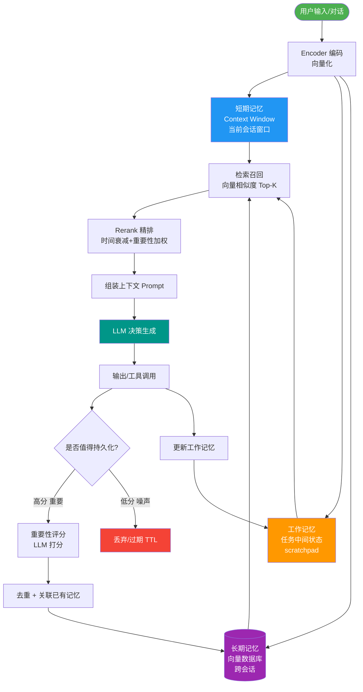

# 各种 OOM（OutOfMemoryError）如何排查和解决？Metaspace/堆/直接内存溢出分别怎么办？

【常见OOM类型及排查】
1. **Java heap space（堆溢出）**
   - **场景**：内存泄漏（对象无法回收）或内存溢出（大对象/分配过多）。
   - **边界**：老年代或新生代填满，FullGC 后内存仍不足。
   - **排查**：开启 -XX:+HeapDumpOnOutOfMemoryError，拿到 Dump 文件用 MAT/JProfiler 分析 Dominator Tree，查找 GC Roots 依赖链。
   - **解决**：修复泄漏代码（如未关闭的连接）；如无泄漏则调大 -Xmx/-Xms（通常设为机器内存的 60%-80%）。

2. **Metaspace（元空间溢出）**
   - **场景**：动态生成类（CGLIB、Spring AOP、JSP、Groovy、反射代理）过多，类加载器未卸载。
   - **参数**：-XX:MaxMetaspaceSize（默认无上限），-XX:CompressedClassSpaceSize。
   - **排查**：jmap -clstats <pid> 统计类加载器数量；jcmd <pid> GC.class_histogram 查看类加载情况。
   - **解决**：设置合理的 MaxMetaspaceSize；排查框架是否无限生成代理类（如 OGNL 表达式循环使用）。

3. **Direct buffer memory（直接内存溢出）**
   - **场景**：Netty/RocketMQ 等 NIO 框架使用堆外内存（DirectByteBuffer）未释放，或显式分配超出 -XX:MaxDirectMemorySize。
   - **原理**：DirectByteBuffer 分配调用 Unsafe.allocateMemory，由 Cleaner 虚引用触发回收，若 GC 压力大或 Cleaner 线程执行滞后会导致溢出。
   - **排查**：开启 -XX:NativeMemoryTracking=detail，使用 jcmd <pid> VM.native_memory summary 查看内存组成；通过 GC 日志查看 System.gc() 调用（DirectByteBuffer 内存不足时会尝试触发 FullGC 释放）。
   - **解决**：调大 -XX:MaxDirectMemorySize（默认等于堆大小）；检查 NIO 应用代码是否手动释放；设置 -Dio.netty.leakDetection.level=paranoid 检测泄漏。

4. **GC overhead limit exceeded**
   - **场景**：应用程序花费超过 98% 的时间进行 GC 且回收的内存少于 2%。
   - **实质**：严重的堆内存不足或内存泄漏，导致 CPU 空转。
   - **解决**：同堆溢出排查，属堆溢出的极限表现，可临时通过 -XX:-UseGCOverheadLimit 屏蔽该报错（治标不治本）。

5. **unable to create new native thread（线程溢出）**
   - **场景**：创建的线程数超过 OS 限制或 JVM 栈内存耗尽。
   - **关键公式**：MaxMemory = (ProcessSize) + (ThreadCount * (Xss + StackPage + ThreadLocalAlloc))
   - **排查**：jstack <pid> | wc -l 统计线程数；ulimit -u 查看用户进程限制；cat /proc/<pid>/limits。
   - **解决**：降低线程数（改用线程池）；减小 -Xss（默认 1MB，可降至 256k）；调高 OS ulimit -u 或 /proc/sys/vm/max_map_count。

6. **StackOverflowError**
   - **场景**：线程栈深度超过限制，常见于无限递归。
   - **排查**：查看堆栈找出递归代码。
   - **解决**：修复递归逻辑；若必要可增大 -Xss（如 -Xss2m）。

【必开参数】
-XX:+HeapDumpOnOutOfMemoryError -XX:HeapDumpPath=/path/dump.hprof -XX:+PrintGCDetails -XX:+PrintGCTimeStamps

【## 常见考点】
1. **Shallow Heap vs Retained Heap**：MAT 分析中，Shallow Heap 是对象本身大小，Retained Heap 是对象被 GC 后能释放的总大小（关键区别）。
2. **元空间为什么会泄漏**：关注自定义 ClassLoader 是否未解耦导致类无法卸载。
3. **直接内存和堆内存的区别**：直接内存不受堆大小限制，但受本机物理内存限制，GC 扫描不到。

## 核心流程图

## 记忆要点
- 堆溢出(Java heap space)：查泄漏或加堆，用 MAT 看 Dominator Tree 找大对象
- 元空间溢出：动态代理生成类太多，需设上限排查 ClassLoader 泄漏
- 直接内存溢出：NIO堆外内存未释放，查 Netty 或调大 MaxDirectMemorySize
- 线程溢出：超OS限制或栈太多，降 -Xss 大小或换线程池
- 排查利器：HeapDumpOnOutOfMemoryError 必开，拿 Dump 找 GC Roots 链

## 结构化回答

**30 秒电梯演讲：** 像仓库爆仓：是货物太多（堆）、货架太满（元空间）、还是通道堵死（栈）？

**展开框架：**
1. **MAT** — 堆溢出查泄漏或大对象，用MAT分析
2. **元空间溢出** — 元空间溢出通常由动态生成类过多引起
3. **NIO** — 直接内存溢出查NIO ByteBuffer，限制MaxDirectMemory

**收尾：** MAT如何分析内存泄漏？支配树是什么？

## 视频脚本

> 预计时长：4 分钟 | 由浅入深

| 时间 | 画面/字幕 | 口播台词 | 讲解要点 |
|------|----------|----------|----------|
| 0:00 | 标题卡：各种 OOM（OutOfMemoryError）如何排查和解决？Metaspace/堆/直接内存溢出分别怎么办 | 今天这道题：各种 OOM（OutOfMemoryError）如何排查和解决？Metaspace/堆/直接内存溢出分别怎么办。30 秒先给你讲清楚。 | 开场钩子 |
| 0:20 | 核心概念动画/示意图 | 像仓库爆仓：是货物太多（堆）、货架太满（元空间）、还是通道堵死（栈）？。 | 核心概念 |
| 0:40 | 堆溢出查泄漏或大对象示意图 | 堆溢出查泄漏或大对象，用MAT分析 | 堆溢出查泄漏或大对象 |
| 1:10 | 元空间溢出通常示意图 | 元空间溢出通常由动态生成类过多引起 | 元空间溢出通常 |
| 1:40 | 总结卡 + 下期预告 | 记住三个词就能答好这道题。下期追问：MAT如何分析内存泄漏？支配树是什么？ | 收尾 |
