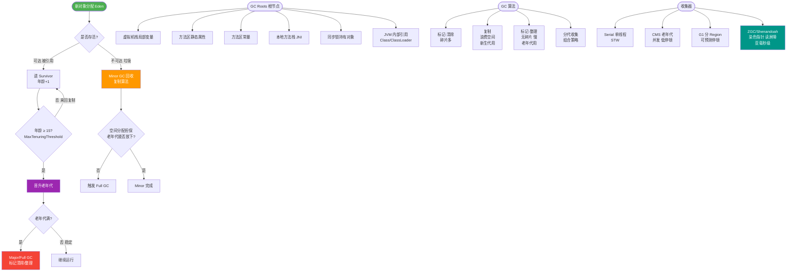
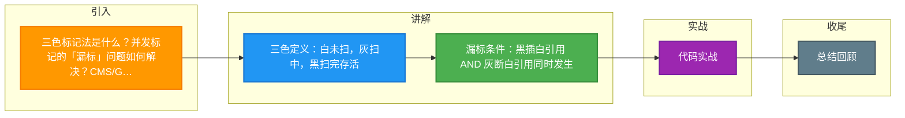

# 三色标记法是什么？并发标记的「漏标」问题如何解决？CMS/G1/ZGC 分别怎么处理？

【三色标记法】
并发标记阶段使用三种颜色标记对象状态：
- **白色**：未标记（初始状态，最终未标记即垃圾）。
- **灰色**：已标记，但引用对象未扫描完成（中间状态，位于工作队列）。
- **黑色**：已标记，且引用对象已全部扫描完成（完成状态，存活）。

【并发标记状态流转】
```text
      (扫描引用)          (发现引用)
  [白色] --------> [灰色] --------> [黑色]
      ^                |               
      | (断开引用)      | (处理完引用)  
      +----------------|---------------+
```

【漏标问题】
漏标指：**本应存活的白色对象被错误回收**。发生需同时满足两个条件：
1. 插入：黑色对象新增了指向白色对象的引用。
2. 删除：灰色对象到白色对象的引用被断开。

【实战案例】
在高并发网关场景下，使用 CMS 垃圾回收器时，曾因业务线程在并发标记期间断开旧引用并建立新引用，导致偶发的关键配置对象被误回收（NoClassDefFoundError），最终通过调低 CMSInitiatingOccupancyFraction 提前触发 GC 并开启 `-XX:+CMSConcurrentMTEnabled` 缓解。

【解决方案对比】
| 特性 | CMS (增量更新) | G1 / Shenandoah (SATB) | ZGC (染色指针) |
| :--- | :--- | :--- | :--- |
| **关注点** | 黑色对象新增引用白色 | 灰色对象断开白色引用 | 指针元数据标记 |
| **实现机制** | 写屏障记录新增引用，Remark 时重新扫描 | 写屏障记录被删除的旧引用（快照），作为根重新扫描 | 读屏障，检查指针 Mark Word / View，触发并发标记动作 |
| **优点** | 简单直接 | 浮动垃圾少，适合 Region 碎片化整理 | 完全并发，Region 粒度小，停顿极低 (<10ms) |
| **缺点** | Remark 阶段可能停顿较长 | 需要维护 SATB 队列，占用额外内存 | 依赖 64-bit 指针，压缩指针受限，硬件要求高 |

【关键代码示例：SATB 模拟逻辑】
```java
// 伪代码演示 SATB 写屏障逻辑
void field_write(o.f, new_ref) {
    // 1. 获取旧引用
    Object old_ref = o.f;
    // 2. 写屏障：如果当前处于 GC 并发阶段，且旧引用不为空，加入 SATB 队列
    if (G1SATBQueue.is_active() && old_ref != null) {
        G1SATBQueue.enqueue(old_ref);
    }
    // 3. 执行实际赋值
    o.f = new_ref;
}
```

【写屏障】
是 JIT 在引用赋值前后插入的一段汇编代码，用于在并发标记时捕获引用变化。它是应用线程的负担，应尽量减少。

【## 常见考点】
1. **SATB 和增量更新的区别**：SATB 牺牲浮动垃圾的空间换取时间效率（适合 G1 的 Region 模型）；增量更新则是通过牺牲 CPU 重新标记的时间来保证准确性（适合 CMS）。
2. **并发标记产生的浮动垃圾**：GC 过程中产生的对象如果不处理，就会变成浮动垃圾留到下次 GC 回收。
3. **为什么要三色标记**：分治思想，允许并发，避免全停顿。


## 核心流程图



## 记忆要点
- 三色定义：白未扫，灰扫中，黑扫完存活
- 漏标条件：黑插白引用 AND 灰断白引用同时发生
- CMS解法：增量更新（关注黑增白），重新标记阶段再扫
- G1解法：SATB（关注灰断白），写屏障记录旧引用快照
- ZGC解法：染色指针+读屏障，指针自带元数据实现全并发

## 结构化回答


**30 秒电梯演讲：** 像垃圾分类回收员扫地，住户（应用）随时扔垃圾或移动位置，回收员需记录变化以免误判。

**展开框架：**
1. **黑白灰三色区分存活状态** — 黑白灰三色区分存活状态，并发标记可能漏标
2. **CMS** — CMS增量更新关注新增引用，G1 SATB关注断开引用
3. **ZGC** — ZGC用读屏障和染色指针实现并发整理

**收尾：** SATB和增量更新的本质区别？哪个更精确？


## 视频脚本

> 预计时长：4 分钟 | 由浅入深

| 时间 | 画面/字幕 | 口播台词 | 讲解要点 |
|------|----------|----------|----------|
| 0:00 | 标题卡：三色标记法是什么？并发标记的「漏标」问题如何解决？CMS/G1/ZGC 分别怎么处理 | 今天这道题：三色标记法是什么？并发标记的「漏标」问题如何解决？CMS/G1/ZGC 分别怎么处理。30 秒先给你讲清楚。 | 开场钩子 |
| 0:20 | 核心概念动画/示意图 | 像垃圾分类回收员扫地，住户（应用）随时扔垃圾或移动位置，回收员需记录变化以免误判。 | 核心概念 |
| 0:40 | 黑白灰三色区分存活状态示意图 | 黑白灰三色区分存活状态，并发标记可能漏标 | 黑白灰三色区分存活状态 |
| 1:10 | CMS增量更新关注新增引用示意图 | CMS增量更新关注新增引用，G1 SATB关注断开引用 | CMS增量更新关注新增引用 |
| 1:40 | 总结卡 + 下期预告 | 记住三个词就能答好这道题。下期追问：SATB和增量更新的本质区别？哪个更精确？ | 收尾 |

---

### 视频流程图




## 延伸：什么是三色标记法？

> 合并自 `jvm-063`（相似度 74%）

三色标记法是并发标记阶段使用的算法，用于跟踪对象的遍历状态，将对象分为三种颜色：

- **白色**：未被GC访问过的对象（或者已处理完但被重新引用的特定情况）。理论上，GC结束后仍为白色的代表不可达对象，会被回收。
- **灰色**：已被GC访问过（自身被标记），但其引用的其他对象尚未全部扫描完成。灰色对象通常存放在工作栈中等待处理。
- **黑色**：已被访问且其所有引用的对象都已扫描完成。黑色对象是稳定的，GC默认其不再引用白色对象。

**核心流程与状态转换**：
初始标记将GC Roots直接关联的对象标记为灰色 -> 并发标记从灰色对象遍历引用，将引用的白色标灰，自身标黑 -> 重新标记处理并发期间的变动。

```text
对象状态流转图：
┌─────────┐      扫描引用      ┌─────────┐      栈空/处理完毕      ┌─────────┐
│  白色   │ ────────────────> │  灰色   │ ────────────────────> │  黑色   │
│ (未访问)│                    │ (已访问)│                         │ (已完成)│
└─────────┘                    └─────────┘                         └─────────┘
      ▲                            │
      │                            │ 引用扫描中
      └────────────────────────────┘
           (发现新引用)
```

**漏标问题与解决方案**：
在并发标记过程中，用户线程修改引用关系可能导致两种漏标场景（本质是： dangling pointer 或 lost object）：
1. **赋值器将黑色对象引用指向白色对象**（黑色新增引用白色）。
2. **赋值器删除灰色对象对白色对象的引用**（灰色断开引用白色）。

**写屏障**是解决漏标的关键技术，在引用更新时拦截操作：
- **CMS (增量更新 Incremental Update)**：
  原理：当黑色对象新增引用白色对象时，将该黑色对象记录下来。
  处理：在重新标记（Remark）阶段，将这些黑色对象重新变为灰色，再次扫描。
  重点：关注**引用的新增**。

- **G1 (SATB - Snapshot At The Beginning)**：
  原理：在GC开始时，逻辑上创建对象图的快照。当灰色对象删除对白色对象的引用时，将该引用记录下来。
  处理：在重新标记阶段，根据记录的旧引用，将原本白色的对象强制标记为灰色（或直接保留）。
  重点：关注**引用的删除**，保留原始引用关系。

## 常见考点
1. 为什么需要三色标记？
   为了在并发标记阶段区分对象的扫描进度，使得GC线程和用户线程可以并发执行，而不需要全量STW。
2. SATB 和增量更新的根本区别是什么？
   SATB 试图恢复开始时刻的对象图快照（更保守，可能保留浮动垃圾），而增量更新关注并发过程中的新引用（需要再次扫描黑色对象，效率略低）。G1 选择 SATB 是因为其Region复制机制配合SATB效率更高。
3. 什么是浮动垃圾？
   并发标记过程中，用户线程新产生的对象（通常在黑色之后分配），或者在并发标记过程中变为垃圾的对象，本次GC无法回收，只能留到下次。
4. 如果在并发标记中黑色对象引用了白色，且白色对象原本唯一的引用（灰色）被断开了，会发生什么？
   这就是典型的漏标。SATB 会记录被断开的引用从而救活白色对象；增量更新会记录黑色对象的新引用从而再次扫描白色对象。

## 记忆要点

- 三色口诀：白(未访问)、灰(自身已标引用未扫)、黑(自身及引用全扫完)
- 并发漏标两个条件：黑新增指向白，且灰断开指向白的引用
- CMS用增量更新：拦截写操作，关注黑新增引用白，重标时黑退回灰
- G1用SATB：起始快照，关注灰删除引用白，保留并发初期的对象引用关系

## 结构化回答


**30 秒电梯演讲：** 遍历清单：已处理（黑）、处理中（灰）、未处理（白）。

**展开框架：**
1. **白色** — 未访问，可能被回收
2. **灰色** — 已访问但引用未全扫描
3. **黑色** — 已访问且引用全扫描

**收尾：** 这是我实战中的理解，您想深入哪一段？


## 视频脚本

> 预计时长：4 分钟 | 由浅入深

| 时间 | 画面/字幕 | 口播台词 | 讲解要点 |
|------|----------|----------|----------|
| 0:00 | 标题卡：什么是三色标记法 | 今天这道题：什么是三色标记法。30 秒先给你讲清楚。 | 开场钩子 |
| 0:20 | 核心概念动画/示意图 | 遍历清单：已处理（黑）、处理中（灰）、未处理（白）。 | 核心概念 |
| 0:40 | 白色示意图 | 白色：未访问，可能被回收 | 白色 |
| 1:10 | 灰色示意图 | 灰色：已访问但引用未全扫描 | 灰色 |
| 1:40 | 总结卡 + 下期预告 | 记住今天这几个关键词，面试一定用得上。下期见。 | 收尾 |

### 视频流程图


