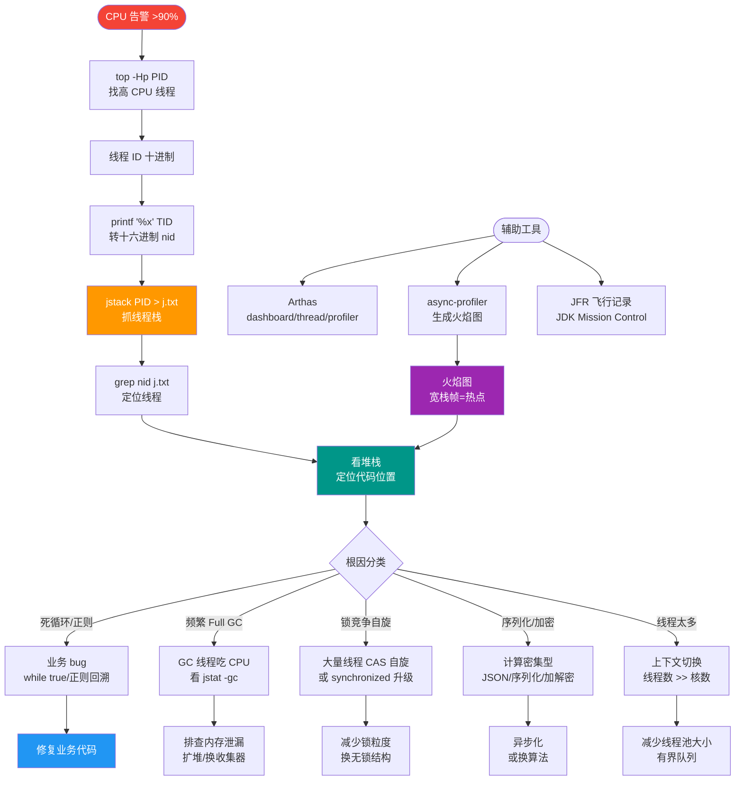

# 线上问题如何用 Arthas 在不重启应用的情况下排查？常用命令有哪些？

【Arthas 核心机制】
基于 Java Agent + Attach API，BootStrap ClassLoader 加载进目标 JVM，通过 Instrumentation 重定义类、字节码增强，实现对生产环境的零侵入诊断。

【常用命令详解】
1. **dashboard**：实时仪表盘，展示线程、内存堆使用情况、GC 频率。快速判断系统宏观健康度。
2. **thread**
   - `thread -n 3`：列出 CPU 使用率 Top 3 的线程（定位死循环）。
   - `thread -b`：检测死锁线程（Blocked 状态）。
3. **jad**：反编译加载的类。`jad com.Xxx` 用于确认线上运行代码是否为最新版本（解决“我明明改了代码为什么没生效”的问题）。
4. **watch**：观测方法执行数据。
   - 示例：`watch com.UserService getUser '{params,returnObj,throwExp}' -x 2`。
   - 进阶：`condition` 过滤，如 ` '#cost>100'` 观察耗时超过 100ms 的调用。
5. **trace**：追踪方法调用链路耗时。
   - 示例：`trace com.UserService doTask`。输出树状调用链，定位具体耗时在哪个子方法（如 DB、RPC）。
6. **stack**：查看方法被调用的调用栈。`stack com.UserService findUser`，查明谁在调用这个方法。
7. **profiler**：异步采集 CPU 火焰图。
   - 使用：`profiler start` (采集), `profiler stop --format html` (生成火焰图)。主要分析热点代码。
8. **sc / sm**：Search Class / Search Method。`sc -d com.Xxx` 查看 ClassLoader 加载路径，解决类冲突（Jar 包冲突）。
9. **ognl**：执行 Java 表达式。`ognl '@com.Xxx@staticField'` 获取静态变量值，或调用静态方法。
10. **heapdump**：相当于 jcmd dump heap。
    - 使用：`heapdump /tmp/dump.hprof`，结合 MAT 分析。

【实战案例】
某次上线后订单服务 RT 突然飙升，使用 `trace` 排查发现所有请求都卡在 `RedisConnectionPool.getResource`，进一步配合 `tt` (TimeTunnel) 记录慢请求的入参，发现是某次变更导致 Key 序列化方式不兼容，引发了连接池死锁。

【关键代码示例：动态修改日志级别】
```bash
# 场景：生产环境出现 bug 需要开启 DEBUG 日志但不想重启
# 1. 查找 Logger 类
sc -d org.apache.commons.logging.LogFactory
# 2. 使用 ognl 修改特定类的日志级别
ognl '@org.slf4j.LoggerFactory@getLogger("com.example.Service").setLevel(@ch.qos.logback.classic.Level@DEBUG)'
```

【工具对比】
| 维度 | Arthas | JProfiler / YourKit | VisualVM | jstat |
| :--- | :--- | :--- | :--- | :--- |
| **侵入性** | 低 (动态 Attach) | 高 (需 Agent 启动) | 低 (JMX/Attach) | 极低 (CLI) |
| **实时性** | 高 (交互式命令) | 高 | 一般 | 高 (秒级监控) |
| **功能深度** | 极深 (字节码增强) | 深 (内存/CPU) | 一般 | 浅 (GC/Class) |
| **适用场景** | 线上应急排查 | 开发/压测深度分析 | 简单监控 | 脚本监控/趋势分析 |

【## 常见考点】
1. **Arthas 与 JMX 的区别**：Arthas 是侵入式字节码增强，功能更强大；JMX 是标准 API，性能好但维度有限。
2. **watch 与 trace 的开销**：都会降低运行速度，`watch` 仅输出目标点，`trace` 会遍历调用树，线上压测时使用且需控制采样。
3. **Tunnel Server**：Arthas 隧道服务器，用于反向连接（穿透防火墙连接内网 JVM）。


## 核心流程图



## 记忆要点
- 核心机制：Java Agent + Attach API，零侵入字节码增强
- 看宏观与CPU：dashboard 看全局，thread -n 找高CPU，-b 找死锁
- 查代码与耗时：jad 反编译确认版本，trace 定位链路耗时
- 查数据与动态改：watch 观测入参出参，ognl 动态改日志级别
- 堆分析：heapdump 导出 hprof，sc -d 排查类冲突

## 结构化回答

**30 秒电梯演讲：** 像给病人做CT检查，不用开刀（重启），就能看清内部运行情况。

**展开框架：**
1. **dashboard看全局** — dashboard看全局，thread定位死锁和CPU高
2. **trace和watch** — trace和watch定位慢方法和调用参数
3. **jad反编译验证代码版本** — jad反编译验证代码版本，profiler生成火焰图

**收尾：** 关于这个问题，我还可以展开聊——Arthas的原理是什么？您想从哪个角度深入？

## 视频脚本

> 预计时长：4 分钟 | 由浅入深

| 时间 | 画面/字幕 | 口播台词 | 讲解要点 |
|------|----------|----------|----------|
| 0:00 | 标题卡：线上问题如何用 Arthas 在不重启应用的情况下排查？常用命令有哪些 | 今天这道题：线上问题如何用 Arthas 在不重启应用的情况下排查？常用命令有哪些。30 秒先给你讲清楚。 | 开场钩子 |
| 0:20 | 核心概念动画/示意图 | 像给病人做CT检查，不用开刀（重启），就能看清内部运行情况。 | 核心概念 |
| 0:40 | dashboard看全局示意图 | dashboard看全局，thread定位死锁和CPU高 | dashboard看全局 |
| 1:10 | trace和watch示意图 | trace和watch定位慢方法和调用参数 | trace和watch |
| 1:40 | 总结卡 + 下期预告 | 记住三个词就能答好这道题。下期追问：Arthas的原理是什么？如何attach到JVM？ | 收尾 |
