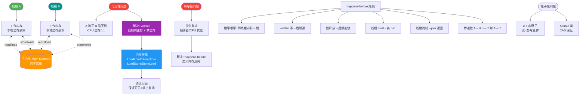

# 为什么 final 字段能保证线程安全初始化？它和 volatile 有什么区别？

【final 字段的语义】
`final` 修饰的变量在构造函数返回值前必须完成初始化。JMM 规定：**final 字段的写入 happens-before 对象引用的读取**。这意味着其他线程拿到对象引用后，无需同步手段，**必须看到 final 字段被正确初始化的值**。

【内存屏障原理】
JIT 编译器在构造函数结束（return 之前）生成代码时，会插入一个 **StoreStore 屏障**。

```text
  CPU 指令执行顺序（简化模型）
  --------------------------
  1. 写入 final 字段值 (Store)
  2. StoreStore 屏障 (禁止重排序)
  3. 写入对象引用到堆栈/变量 (Store)
```
StoreStore 屏障保证了：**禁止将步骤 3 的「对象引用写」重排序到步骤 1 的「final 字段写」之前**。如果没有这个屏障，其他线程可能看到一个未完成初始化（final 为 null 或 0）的对象引用。

【实战实例】
```java
class Config {
    private final int port;  // 保证可见性
    private String host;     // 非final，不保证
    public Config() {
        this.port = 8080;
        this.host = "localhost"; 
    }
}
// 线程 A 发布 Config
// 线程 B 读取 config引用
// 此时 B 可能看到：config != null, config.port == 8080 (必然), config.host == null (可能)
```

【实战案例】
在高性能网关（如 Netty）中，通常会将核心的 Handler 链定义为 `final`。曾遇到过一个 Bug：开发者在构造器中初始化了一个非 final 的 Map，并通过 `this` 引用逃逸到其他线程，导致负载均衡器拿到 Map 为 null，引发流量分发不均。改用 `final` 或安全发布机制后修复。

【final vs volatile】

| 维度 | final | volatile |
| :--- | :--- | :--- |
| **核心特性** | 不可变性，写一次后不可变 | 可见性、有序性，不保证原子性 |
| **内存屏障** | 仅在构造函数退出时的 StoreStore 屏障 | 每次读写均有屏障（写时 StoreLoad，开销大） |
| **适用场景** | 安全发布、常量定义、构建不可变对象 | 状态标志位、双重检查锁（DCL）、 happens-before 规则保障 |
| **指令重排** | 禁止构造器内 final 写与引用赋值重排 | 禁止特定类型的指令重排（如 1-7-6 操作） |

【安全发布】
包含多个 final 字段的对象是天然线程安全的。即使没有 synchronized，只要正确返回 `this` 或通过 volatile/static 变量发布，其他线程就能读到 final 的正确值。

【注意陷阱】
虽然 final 引用本身保证了可见性，但如果 final 引用的是可变对象（如 `final int[] arr`），其他线程能读到 `arr` 引用不为 null，但不能保证 `arr[0]` 是最新值，除非数组元素也是 volatile 或加锁。

【## 常见考点】
1. **为什么 DCL 单例中实例必须是 volatile？**
   - 因为 `instance = new Singleton()` 分为 3 步：1.分配内存 2.初始化 3.指向引用。不加 volatile，指令重排可能导致 2 和 3 对调，其他线程拿到未初始化的对象。加上 volatile（写屏障）或 final 字段机制可解决，但通常用 volatile 保证完整的可见性。
2. **数组元素是 final 能保证线程安全吗？**
   - 不能。`final` 保证的是数组引用的值（地址）不被修改，数组内部状态修改仍然依赖于同步机制。
3. **String 的不可变性源码体现**：String 内部的 char[] 和 hash 字段都是 final 的，展示了其线程安全设计的底层依据。


## 核心流程图



## 记忆要点
- 核心语义：构造函数结束前 final 写入 happens-before 对象引用的读取
- 底层原理：构造 return 前插入 StoreStore 屏障，禁止引用写与 final 写重排
- 安全发布：final 保证其他线程拿到对象时，字段必然已初始化完毕
- 对比 volatile：final 保证初始化安全且仅写一次，volatile 保证每次读写可见
- 注意陷阱：final 引用不可变，但若指向集合等可变对象，内部状态仍需加锁

## 结构化回答

**30 秒电梯演讲：** 像房子装修完封门（屏障），看房时必须装修完才能开门，不能看到半成品。

**展开框架：**
1. **final字段写入** — final字段写入在构造返回前对其他线程可见
2. **底层依赖StoreStore** — 底层依赖StoreStore屏障防止指令重排
3. **区别于volatile** — 区别于volatile，final是不可变的一次性安全保障

**收尾：** 关于这个问题，我还可以展开聊——如果 final 字段引用的是一个可变对象（如 final List），还线程安全吗？您想从哪个角度深入？

## 视频脚本

> 预计时长：4 分钟 | 由浅入深

| 时间 | 画面/字幕 | 口播台词 | 讲解要点 |
|------|----------|----------|----------|
| 0:00 | 标题卡：为什么 final 字段能保证线程安全初始化？它和 volatile 有什么区别 | 今天这道题：为什么 final 字段能保证线程安全初始化？它和 volatile 有什么区别。30 秒先给你讲清楚。 | 开场钩子 |
| 0:20 | 核心概念动画/示意图 | 像房子装修完封门（屏障），看房时必须装修完才能开门，不能看到半成品。 | 核心概念 |
| 0:40 | final字段写入示意图 | final字段写入在构造返回前对其他线程可见 | final字段写入 |
| 1:10 | 底层依赖StoreStore示意图 | 底层依赖StoreStore屏障防止指令重排 | 底层依赖StoreStore |
| 1:40 | 总结卡 + 下期预告 | 记住三个词就能答好这道题。下期追问：如果 final 字段引用的是一个可变对象（如 final List），还线程安全吗？ | 收尾 |
