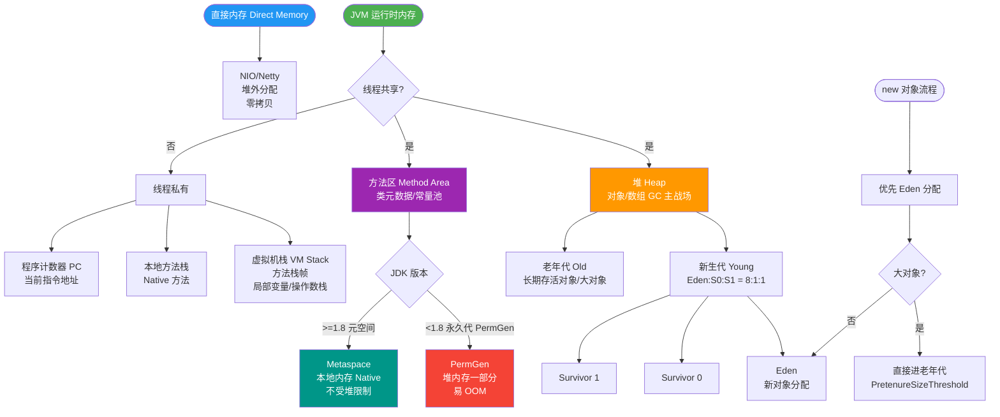

# 在生产环境中，JVM 发生 OOM（内存溢出）后，你通常会保留哪些现场证据？利用 MAT 工具分析 heap dump 文件时，如何快速定位到造成内存泄漏的嫌疑对象？

发生 OOM 时，首要证据是堆转储文件（通过 `-XX:+HeapDumpOnOutOfMemoryError -XX:HeapDumpPath=/path/` 生成），同时需保留 GC 日志（`-Xloggc`）分析内存趋势，以及 `jstack` 线程栈排查死锁或阻塞。使用 MAT 分析时，优先查看 Leak Suspects 报告和 Dominator Tree 中 Retained Size 最大的对象，通过引用链定位到 GC Root，结合 Histogram 检查对象数量异常增长，最终定位到具体业务代码。

## 技术原理

- **保留现场三件套：HeapDump 文件、GC 日志、jstack 线程栈**：OOM 后要立即固定证据。Heap Dump 通过 `-XX:+HeapDumpOnOutOfMemoryError -XX:HeapDumpPath=/data/dump.hprof` 自动生成，是分析内存泄漏的核心；GC 日志通过 `-Xlog:gc*:file=/data/gc.log:time,uptime` 记录每次 GC 的堆变化趋势；`jstack <pid>` 抓线程栈定位 OOM 发生时谁在跑、是否死锁/阻塞。三者结合才能完整还原现场。
- **MAT 快攻第一步：直奔 Leak Suspects 和 Dominator Tree**：MAT 打开 hprof 后第一步看 **Leak Suspects** 报告——它自动分析出最可能泄漏的对象及其 GC Root 路径，省去手动摸索。第二步看 **Dominator Tree**（支配树）按 **Retained Size**（保留大小，即对象被回收能释放的内存）降序排，最大的对象就是内存大头，往往是泄漏嫌疑犯。
- **通过 GC Root 引用链定位不可回收对象**：在 Dominator Tree 里对大对象用 `Path To GC Roots → exclude weak/soft references`，能看到强引用链——从该对象一路追溯到 GC Root（静态变量、活动线程栈、Synchronized 监视器等）。这条链就是"为什么对象不能被回收"的答案，链的终点往往指向业务代码的某个静态 Map 或缓存。
- **结合 Histogram 异常增长和线程栈定位代码**：Histogram 视图按 Class 聚合实例数。对比正常 vs OOM 时的 hprof，某类（如 `byte[]`、`UserDTO`）实例数异常增长就是嫌疑。再结合 jstack 当时哪个线程在跑（如某 HTTP 线程），把对象类型 + 线程栈 + 引用链交叉验证，最终定位到具体业务代码行。

## 命令演示

生产必备 JVM 参数（启动时配好）：

```bash
java \
  -XX:+HeapDumpOnOutOfMemoryError \
  -XX:HeapDumpPath=/data/dumps/ \
  -XX:+ExitOnOutOfMemoryError \
  -Xlog:gc*:file=/data/logs/gc.log:time,uptime,level,tags:filecount=10,filesize=50M \
  -jar app.jar
```

OOM 发生后的现场抓取：

```bash
# 1. OOM 时 hprof 已自动生成（看路径）
ls -lh /data/dumps/

# 2. 立即抓线程栈（进程若还在）
jstack <pid> > /tmp/jstack_oom.txt

# 3. 抓 GC 原因快照
jcmd <pid> GC.heap_info
jmap -histo:live <pid> | head -30        # 直方图 top 对象
```

MAT 分析流程：

```
1. 打开 hprof → 下载 Leak Suspects 报告
   └─ Problem Suspect 1: 占 800MB 的 java.util.HashMap
2. 点开 Dominator Tree → 按 Retained Size 降序
   └─ HashMap@0x7f..  retained 850MB
3. 右键 → Merge Shortest Paths to GC Roots → exclude weak refs
   └─ HashMap ← CacheManager.staticCache  (GC Root: 静态变量)
4. 看 HashMap 内部 → 是订单对象未清理 → 定位到代码 CacheManager.putNeverExpire()
```

## 常见坑/注意事项

- **HeapDump 巨大要预留给磁盘**：dump 文件通常等于堆大小（4G 堆就 4G dump），目录空间不够会写失败丢失现场。生产用独立大磁盘。
- **OOM 后进程可能退出**：加 `-XX:+ExitOnOutOfMemoryError` 让进程 OOM 后立即退出，由 K8s/systemd 自动重启；否则进程可能僵死挂着。
- **MAT 内存要够**：MAT 分析大 hprof 自身要堆，分析 8G hprof 要 MAT 起码 `-Xmx4g`，否则 MAT 自己 OOM。
- **Retained Size ≠ Shallow Size**：分析泄漏看 Retained（含引用的所有对象总和），Shallow（对象自身大小）会误导。
- **生产 dump 要谨慎**：手动 `jmap -dump` 会 STW 全堆暂停，几 G 堆可能卡几十秒，影响线上。优先靠自动 OOM dump 或在低峰操作。
- **GC Root 类型**：常见有静态变量（最常见泄漏源）、活动线程栈（局部变量）、Synchronized 监视器、JNI 全局引用；排除 weak/soft 后剩下的强引用才是泄漏嫌疑。


## 核心流程图



## 记忆要点
- 现场三件套：HeapDump文件、GC日志、jstack线程栈
- MAT快攻第一步：直奔 Leak Suspects 报告找嫌疑犯
- 查大对象：Dominator Tree 按 Retained Size 降序找最占内存者
- 顺藤摸瓜：从大对象沿 Reference 追溯到 GC Root 定位业务代码
- 看数量：Histogram 检查某类对象的异常 Instance Count

## 结构化回答


**30 秒电梯演讲：** 像厨房水管爆了，先关总闸保留现场（Heap Dump），再顺着水流（引用链）找到漏水点（泄漏对象）。

**展开框架：**
1. **保留 Heap ** — Dump、GC 日志和线程栈
2. **MAT 看 Le** — ak Suspects 和 Dominator Tree
3. **通过 GC Ro** — ot 引用链定位不可回收对象

**收尾：** 这是我实战中的理解，您想深入哪一段？


## 视频脚本

> 预计时长：4 分钟 | 由浅入深

| 时间 | 画面/字幕 | 口播台词 | 讲解要点 |
|------|----------|----------|----------|
| 0:00 | 标题卡：在生产环境中，JVM 发生 OOM（内存溢出）后，你通常会保留哪些现场证据？利用 MAT 工具分析 heap dump 文件时，如何快速定位到造成内存泄漏的嫌疑对象 | 今天这道题：在生产环境中，JVM 发生 OOM（内存溢出）后，你通常会保留哪些现场证据？利用 MAT 工具分析 heap dump 文件时，如何快速定位到造成内存泄漏的嫌疑对象。30 秒先给你讲清楚。 | 开场钩子 |
| 0:20 | 核心概念动画/示意图 | 像厨房水管爆了，先关总闸保留现场（Heap Dump），再顺着水流（引用链）找到漏水点（泄漏对象）。 | 核心概念 |
| 0:40 | 保留 Heap Dump示意图 | 保留 Heap Dump、GC 日志和线程栈 | 保留 Heap Dump |
| 1:10 | MAT 看 Leak示意图 | MAT 看 Leak Suspects 和 Dominator Tree | MAT 看 Leak |
| 1:40 | 总结卡 + 下期预告 | 记住今天这几个关键词，面试一定用得上。下期见。 | 收尾 |
