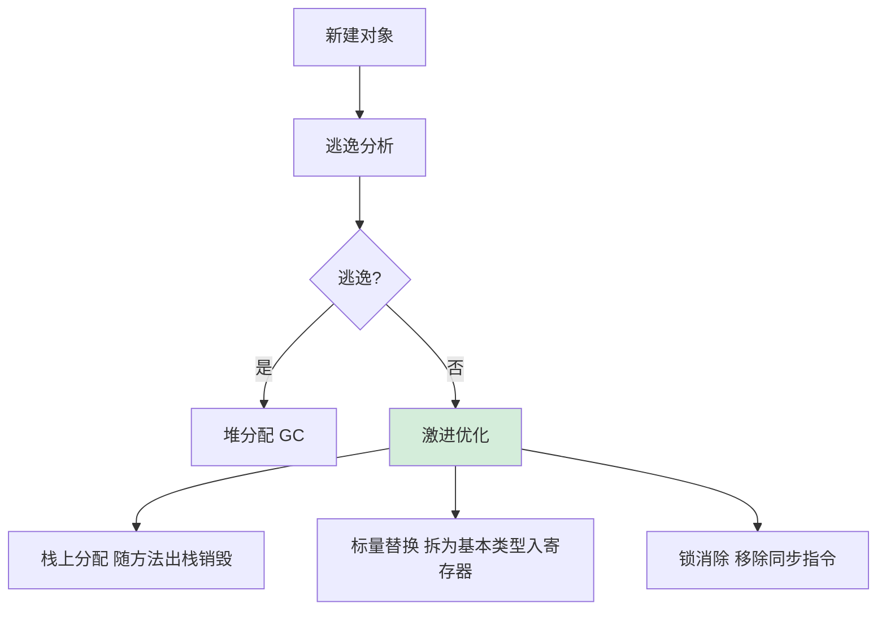

# JIT 编译器中的“逃逸分析”优化是如何工作的？它可以直接带来哪三种具体的性能优化手段？

逃逸分析是 JVM JIT 编译器的一项高级优化技术，用于分析对象的作用域。如果分析发现一个对象只在方法内部使用（即未逃逸出方法），JIT 就可以进行激进优化。它能带来三种优化：1. 栈上分配：未逃逸的对象可以直接在栈帧中分配内存，随方法出栈自动销毁，免去 GC 回收开销；2. 标量替换：若对象未被整体使用，JIT 可能将其拆解为若干个基本数据类型（标量）来替代，可能直接寄存器存储，消除对象创建；3. 锁消除：若对象未逃逸，意味着只有当前线程能访问它，那么对其同步加锁是多余的，JIT 会自动消除锁指令。这些优化能显著减少堆内存压力和 CPU 消耗。

## 技术原理

- **优化前提：JIT 分析对象未逃逸出方法或线程**：逃逸分析（Escape Analysis）是 JIT（C2 编译器）在编译期对每个对象的"作用域"做静态分析——分析对象是否会被方法外（方法逃逸）或其他线程（线程逃逸）持有。分析的依据是对象的赋值/返回/传参路径。结论分三种：全局逃逸（被外部持有）、参数逃逸（被调用方持有但可控）、未逃逸（仅在方法内局部使用）。只有"未逃逸"的对象才能享受下面的三项优化。
- **优化一 栈上分配：未逃逸对象在栈帧分配，免 GC 回收开销**：未逃逸的对象方法返回后就消亡，没必要进堆。理论上可以分配在线程栈帧上随方法出栈自动销毁，免去 GC 标记/搬运。**注意**：HotSpot 实际上没有真正的栈上分配，而是通过下面的"标量替换"间接实现等效效果（标量替换后的"对象"已不存在）。
- **优化二 锁消除：单线程访问的同步锁，编译期自动擦除**：如果锁对象本身未逃逸（如 `new StringBuffer()` 局部使用），不可能被其他线程访问，对其加锁纯属浪费。JIT 在编译期自动移除 `synchronized` 的 monitorenter/monitorexit 指令。如 `StringBuffer.append` 在局部变量上被调用时锁会被消除。
- **优化三 标量替换：打散对象为基本类型，直接走寄存器免堆分配**：标量（Scalar）是不可再分的基础值（int/long/引用），聚合量（Aggregate）是对象。若对象未逃逸且字段可独立访问，JIT 把对象"拆解"成若干标量散布到各使用点，可能直接放寄存器或栈 slot，连"对象"本身都不创建了。这是 HotSpot 真正实现"栈上分配"的方式。

## 代码示例

观察逃逸分析效果：

```java
// 1. 未逃逸 → 触发标量替换（不真正创建对象）
public long compute() {
    Point p = new Point(3, 4);   // p 未逃逸出方法
    return p.x * p.x + p.y * p.y;
}
// JIT 标量替换后等价于：
// long x = 3, y = 4; return x*x + y*y;  —— 没有堆分配！

// 2. 锁消除
public String concat(String a, String b) {
    StringBuffer sb = new StringBuffer();   // sb 局部使用，未逃逸
    sb.append(a).append(b);                 // StringBuffer 是 synchronized
    return sb.toString();
}
// JIT 消除 append 的锁，等价于 StringBuilder 性能

// 3. 方法逃逸（无法优化）
public Point createPoint() {
    return new Point(3, 4);     // 对象作为返回值逃逸出方法
}
```

打印 JIT 优化结果：

```bash
# JDK 8
java -XX:+DoEscapeAnalysis -XX:+PrintEscapeAnalysis -XX:+UnlockDiagnosticVMOptions \
     -XX:+PrintInlining -cp app.jar Main

# JDK 11+ 用 JMH 配合 -XX:+PrintEscapeAnalysis 看是否标量替换
# 或用 jitwatch 可视化分析
```

## 对比/选型

| 优化 | 前提 | 效果 | 验证 |
|------|------|------|------|
| 栈上分配 | 未逃逸 | 减少 GC 压力 | 实际靠标量替换实现 |
| 锁消除 | 锁对象未逃逸 | 去 synchronized 开销 | `-XX:+EliminateLocks` |
| 标量替换 | 未逃逸+可拆解 | 避免堆分配、走寄存器 | `-XX:+EliminateAllocations` |

## 常见坑/注意事项

- **逃逸分析本身有开销**：JIT 要花 CPU 做分析，热方法才会被编译并分析；冷代码仍是解释执行无优化。所以 microbenchmark 要充分预热（JMH 推荐 5-10 轮预热）。
- **"栈上分配"是术语误用**：HotSpot 文档常说"栈上分配"但实际是标量替换。真正想做栈上分配的 OpenJ9 等其他 JVM 才有。
- **不要为优化写丑陋代码**：手动用基本类型替代对象、避免局部对象，反而让代码可读性变差。JIT 已经做得很好，写清晰的对象化代码即可。
- **`-XX:+DoEscapeAnalysis` 默认开启**：JDK 8 起默认 true，没必要手动开启；关闭反而不推荐。
- **分配消除的边界**：对象大、字段多、有复杂控制流时 JIT 可能放弃标量替换，回到堆分配。性能敏感路径用 JMH 测真实效果而非臆测。
- **逃逸分析对 lambda 友好**：Stream 操作里的临时对象大多未逃逸，能被标量替换消化，所以 Stream 性能在 JIT 优化后并不比 for 循环差。


## 核心流程图



## 记忆要点

- 优化前提：JIT 分析对象未逃逸出方法或线程（仅在局部使用）
- 优化一 栈上分配：未逃逸对象在栈帧分配，免 GC 回收开销
- 优化二 锁消除：单线程访问的同步锁，编译期自动擦除
- 优化三 标量替换：打散对象为基本类型，直接走寄存器免堆分配

## 结构化回答

**30 秒电梯演讲：** 就像写草稿纸，字只给自己看，用完即扔（栈分配）；只记关键词不写句子（标量替换）；独居卧室不用反锁（锁消除）。

**展开框架：**
1. **栈上分配** — 栈上分配：对象随方法出栈自动销毁，免除GC
2. **标量替换** — 标量替换：拆解对象为基本类型，直接用寄存器
3. **锁消除** — 锁消除：私有对象无需同步，移除锁指令

**收尾：** 这块我踩过一些坑，您想深入聊哪一段——原理细节、实战案例还是常见踩坑？

## 视频脚本

> 预计时长：4 分钟 | 由浅入深

| 时间 | 画面/字幕 | 口播台词 | 讲解要点 |
|------|----------|----------|----------|
| 0:00 | 标题卡：JIT 编译器中的“逃逸分析”优化是如何工作的？它可以直接带来哪三种具体的性能优化手段 | 今天这道题：JIT 编译器中的“逃逸分析”优化是如何工作的？它可以直接带来哪三种具体的性能优化手段。30 秒先给你讲清楚。 | 开场钩子 |
| 0:20 | 核心概念动画/示意图 | 就像写草稿纸，字只给自己看，用完即扔（栈分配）；只记关键词不写句子（标量替换）；独居卧室不用反锁（锁消除）。 | 核心概念 |
| 0:40 | 栈上分配示意图 | 栈上分配：对象随方法出栈自动销毁，免除GC | 栈上分配 |
| 1:10 | 标量替换示意图 | 标量替换：拆解对象为基本类型，直接用寄存器 | 标量替换 |
| 1:40 | 总结卡 + 下期预告 | 记住今天这几个关键词，面试一定用得上。下期见。 | 收尾 |
