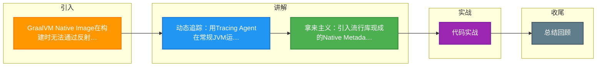

# GraalVM Native Image在构建时无法通过反射访问类，除了编写反射配置文件，还有哪些更现代的解决方案？

除了传统的手动编写`reflect-config.json`，现代解决方案主要有：1. 使用GraalVM Tracing Agent：在JVM模式下运行应用或测试，Agent会自动拦截反射调用并生成配置文件；2. 利用Native Metadata Repositories：对于流行库（如Netty、Spring），社区已经维护了现成的配置元数据，引入对应依赖或使用Maven/Gradle插件自动下载配置即可；3. 尽量使用`java.lang.invoke.VarHandle`或`MethodHandle`替代反射，这些API对AOT编译更友好。此外，构建时可通过`--initialize-at-run-time`指定特定类在运行时初始化以绕过部分问题。

## 技术原理

- **Tracing Agent 运行时自动拦截生成配置**：GraalVM 提供 `native-image-agent`，在常规 JVM 模式下挂载运行（`-agentlib:native-image-agent`），它会拦截所有反射/资源/动态代理/序列化调用，运行结束后自动生成 `reflect-config.json`、`resource-config.json`、`jni-config.json`、`serialization-config.json`。配合应用跑一遍完整测试覆盖所有反射路径，就能生成全套配置，免去手写。最佳实践是用多个 input 文件合并（`config-output-dir + access-filter-file`）覆盖不同场景。
- **Native Metadata Repositories 复用社区现成配置**：主流库（Netty、Spring、Jackson、Hibernate 等）都通过 `org.graalvm.nativeimage:svm` 提供现成的元数据仓库（如 `native-image-svm-metadata-netty`）。引入对应 Maven 依赖或用 `native-image` 的 `--metadata-dir` 加载，库内部的反射配置自动生效，省去自己逆向研究库内部反射。
- **VarHandle/MethodHandle 替代反射更适配 AOT**：`MethodHandle`/`VarHandle` 是 JDK 7/9 引入的、比反射更"静态"的元编程 API——它们的方法签名在编译期可确定，GraalVM 能在 AOT 阶段直接解析句柄目标并内联，无需运行时反射查找。改用这些 API 从根上消除对反射配置的依赖，对 AOT 最友好。

## 命令演示

Tracing Agent 自动生成配置：

```bash
# 1. 常规 JVM 模式挂载 agent 跑应用（覆盖所有反射路径）
java -agentlib:native-image-agent=config-output-dir=src/main/resources/META-INF/native-image \
     -jar target/app-runner.jar

# 2. 跑测试覆盖更多路径（追加到同目录）
java -agentlib:native-image-agent=config-write-period-secs=5,experimental-class-lookup-support=true \
     -jar app.jar

# 3. 检查生成的配置
ls src/main/resources/META-INF/native-image/
# reflect-config.json resource-config.json jni-config.json serialization-config.json

# 4. 用这些配置构建 Native Image
native-image -H:ConfigurationFileDirectories=src/main/resources/META-INF/native-image \
             -jar app.jar  app-native
```

引入社区元数据（Maven）：

```xml
<!-- Netty 的现成反射配置 -->
<dependency>
    <groupId>org.graalvm.nativeimage</groupId>
    <artifactId>svm</artifactId>
    <scope>provided</scope>
</dependency>
<!-- 配合 native-image-maven-plugin 自动加载 classpath 上的配置 -->
```

代码层用 MethodHandle 替代反射：

```java
// 反射写法（AOT 不友好，需配置）
Method m = MyClass.class.getDeclaredMethod("doIt", String.class);
m.invoke(obj, "arg");

// MethodHandle 写法（AOT 友好，无需配置）
MethodHandle mh = MethodHandles.lookup()
    .findVirtual(MyClass.class, "doIt", MethodType.methodType(void.class, String.class));
mh.invoke(obj, "arg");

// VarHandle 替代反射字段访问
VarHandle vh = MethodHandles.lookup()
    .findVarHandle(MyClass.class, "value", int.class);
vh.set(obj, 42);
```

## 对比/选型

| 方案 | 工作量 | 覆盖度 | 维护性 |
|------|--------|--------|--------|
| 手写 reflect-config | 极高 | 易遗漏 | 差（库升级就失效）|
| Tracing Agent | 低（跑测试即可）| 取决于覆盖率 | 中（需重跑）|
| 社区 Metadata | 极低 | 高（库自带） | 好（库维护）|
| MethodHandle 替代 | 中（改代码）| 高 | 极好（彻底消除）|

## 常见坑/注意事项

- **Tracing Agent 的覆盖率决定配置质量**：Agent 只记录跑到的反射路径，漏跑的代码路径在 Native Image 时仍报错。必须用集成测试、端到端测试覆盖所有反射调用点，必要时多个 input 合并。
- **配置要随库升级重新生成**：第三方库升级后内部反射可能变化，旧配置可能失效或冗余，CI 流水线建议每次发版重新跑 Agent。
- **`--initialize-at-build-time` vs `--initialize-at-run-time`**：GraalVM 默认在构建期初始化大部分类（提速），但用到运行时才能定的类（如读环境变量初始化的 static 块）要显式 `--initialize-at-run-time=com.app.Config`，否则构建出错。
- **反射配置过大影响启动**：配置里类太多会让 Native Image 编译期工作变多、二进制变大，要定期清理无用条目。
- **Spring Boot 3 + GraalVM 已集成**：Spring AOT 引擎在构建期自动处理大部分 Bean 元数据，配合 Tracing Agent 几乎免配置。新项目优先用 Spring Boot 3 的 native 支持。
- **动态代理要单独配**：JDK 动态代理和 CGLIB 代理的类在 AOT 下都需要显式声明（ProxyClassConfig），Agent 会自动捕获但手写易漏。


## 核心流程图

```mermaid
flowchart TD
    JAVA_SRC([Java 源码]) --> JAR[标准 JAR/WAR<br/>字节码]

    JAR --> NATIVE_BUILD[Native Image 构建<br/>GraalVM native-image]

    subgraph BUILD["构建时 AOT 分析"]
    SCAN[静态分析可达性<br/>从 main 入口] --> REACH[扫描反射/序列化<br/>动态代理 JNI]
    REACH --> CONFIG[生成 reflect-config.json<br/>resource-config.json]
    CONFIG --> AOT_COMP[AOT 编译<br/>Closed World]
    AOT_COMP --> OPT[激进优化<br/>死代码消除 内联]
    OPT --> BINARY[原生可执行文件]
    end

    BINARY --> RUN_N[启动时间 ms 级<br/>vs JVM 秒级]
    RUN_N --> MEM_LOW[内存占用 MB 级<br/>vs JVM GB 级]
    RUN_N --> SERVERLESS[Serverless/Function<br/>理想选择]

    LIMIT([代价/限制]) --> L1[无 JIT 运行时优化<br/>峰值吞吐低]
    LIMIT --> L2[反射需配置<br/>动态字节码不支持]
    LIMIT --> L3[构建慢<br/>几分钟到十几分钟]
    LIMIT --> L4[堆 profiling 弱<br/>GC 选项少]

    LIMIT --> SOLUTION{解决方案}
    SOLUTION --> PROFILE[Profile-guided<br/>运行采样生成配置]
    SOLUTION --> RUNTIME_COMP[GraalVM EE<br/>运行时 JIT (CRAC)]
    SOLUTION --> LEYDEN2[Project Leyden<br/>主线 JDK 演进]

    FRAMEWORK([框架支持]) --> QUARKUS[Quarkus<br/>原生支持 AOT]
    FRAMEWORK --> SPRING3[Spring Boot 3<br/>AOT 处理 + GraalVM]
    FRAMEWORK --> MICRONAUT[Micronaut<br/>编译期注入]

    LAYER([分层 JAR Layered Jar]) --> LAYER_EXTRACT[jarmode extract<br/>分离 layers]
    LAYER_EXTRACT --> DOCKER[Docker 多阶段<br/>依赖层缓存]

    style JAVA_SRC fill:#4CAF50,color:#fff
    style BINARY fill:#2196F3,color:#fff
    style AOT_COMP fill:#FF9800,color:#fff
    style RUN_N fill:#009688,color:#fff
    style LIMIT fill:#F44336,color:#fff
    style LEYDEN2 fill:#9C27B0,color:#fff

```

## 记忆要点
- 动态追踪：用Tracing Agent在常规JVM运行拦截反射，自动生成配置文件
- 拿来主义：引入流行库现成的Native Metadata，免去手动编写反射配置的痛苦
- 底层替代：尽量用MethodHandle或VarHandle替换反射，因为它们对AOT更友好

## 结构化回答

**30 秒电梯演讲：** 就像以前装修要自己画图纸（手写配置），现在用扫房软件自动画（Agent），或者直接下载别人的图纸（Metadata库），甚至用标准化积木（AOT友好API）代替定制零件。

**展开框架：**
1. **Tracing Agent** — Tracing Agent运行时自动拦截生成配置
2. **Native Metadat** — Native Metadata Repositories复用社区现成配置
3. **VarHandle/Meth** — VarHandle/MethodHandle替代反射更适配AOT

**收尾：** 这块我踩过一些坑，您想深入聊哪一段——原理细节、实战案例还是常见踩坑？

## 视频脚本

> 预计时长：3 分钟 | 由浅入深

| 时间 | 画面/字幕 | 口播台词 | 讲解要点 |
|------|----------|----------|----------|
| 0:00 | 标题卡：GraalVM Native Image在构建时无法通过反射访问类，除了编写反射配置文件，还有哪些更现代的解决方案 | 今天这道题：GraalVM Native Image在构建时无法通过反射访问类，除了编写反射配置文件，还有哪些更现代的解决方案。30 秒先给你讲清楚。 | 开场钩子 |
| 0:20 | 核心概念动画/示意图 | 就像以前装修要自己画图纸（手写配置），现在用扫房软件自动画（Agent），或者直接下载别人的图纸（Metadata库），甚至用标准化积木（AOT友好API）代替定制零件。 | 核心概念 |
| 0:40 | Tracing Agent示意图 | Tracing Agent运行时自动拦截生成配置 | Tracing Agent |
| 1:10 | 总结卡 + 下期预告 | 记住今天这几个关键词，面试一定用得上。下期见。 | 收尾 |

### 视频流程图



