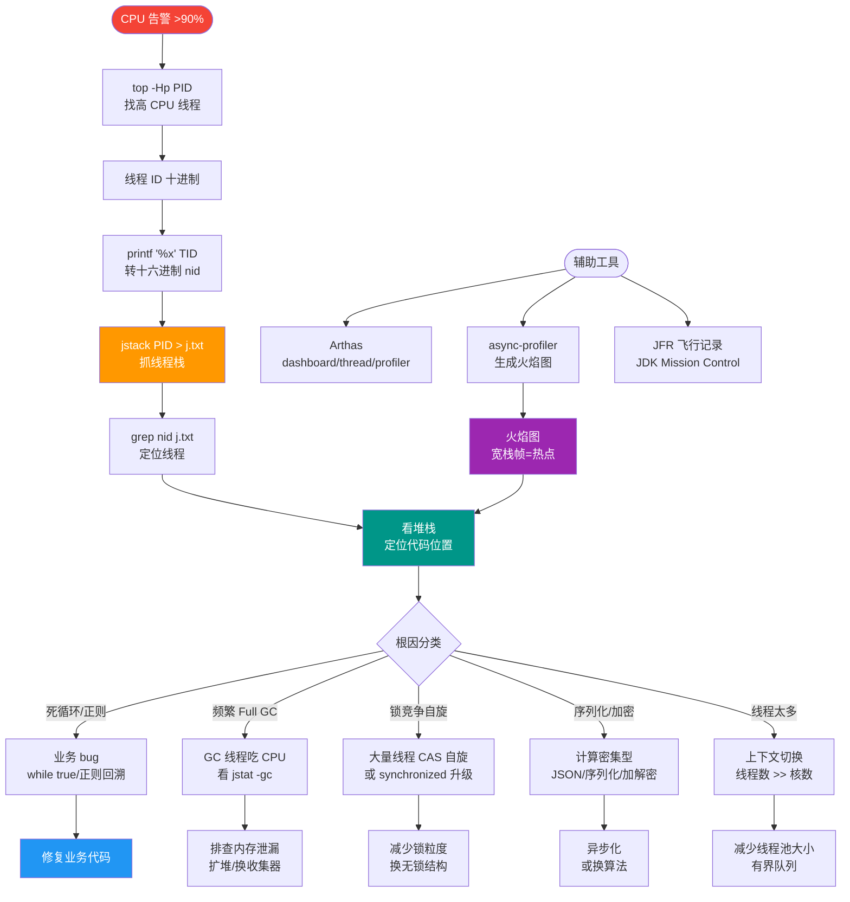

# 如何基于 Async-Profiler 生成火焰图并分析 CPU 热点？

Async-Profiler 是一款 Java 低开销的性能分析工具。首先，下载并解压 profiler.sh 脚本。启动应用后，执行 `./profiler.sh -d 30 -f output.html <pid>` 对目标 JVM 进行 30 秒的采样。生成的火焰图中，横轴代表样本数（即 CPU 时间），纵轴代表调用栈深度。通过观察火焰图中“最宽”且处于栈底的矩形块，可以快速定位消耗 CPU 最多的方法。分析时需关注业务逻辑中的热点循环、频繁的字符串操作或正则匹配。如果是 I/O 阻塞导致的 CPU 波动，火焰图会显示线程处于 `Unsafe.park` 或 Socket 读取状态，此时应结合线程 Dump 进行阻塞分析，而非单纯优化算法。

**实战案例**：某支付网关在高峰期CPU飙升，通过火焰图发现 `java.util.regex.Pattern` 编译方法占据顶层热点，定位到是每次请求都重新编译了正则表达式而非复用 `Pattern` 对象，优化后吞吐量提升40%。

**代码示例**（Java Agent 启动模式）：
```bash
# 在应用启动时挂载，避免Attach被拒绝
java -agentpath:/path/to/libasyncProfiler.so=start,file=flame.html,interval=10ms -jar app.jar
```

## 技术原理

- **采样原理（Sampling vs Tracing）**：Async-Profiler 用**事件驱动采样**——基于 HotSpot 的 `AsyncGetCallTrace`（AGCT）接口，由操作系统定时器（`itimer` 或 `perf_events`）按固定间隔（默认 10ms，可调到 100us）触发中断，记录当前线程的完整调用栈。相比插桩（Tracing）逐条记录方法进出，采样开销极低（<1% CPU），适合生产环境在线诊断。栈出现频率越高 = 该方法占 CPU 时间越长，统计意义上近似真实耗时。
- **火焰图的坐标系**：火焰图把成千上万个调用栈样本**合并成矩形堆叠**——横轴是**调用栈被采样的次数**（即 CPU 时间占比，宽=慢），纵轴是**栈深度**（上层=调用者，下层=被调用者）。每个矩形的宽度等于"它及其子调用被采样的总次数"。找"最宽的矩形"就是找 CPU 消耗最大的函数。颜色无实际意义，仅便于区分。
- **CPU 火焰图 vs Wall Clock 火焰图**：默认 `cpu` 模式只采 CPU 上的栈，I/O 阻塞期间线程让出 CPU 不会被采到，看到的火焰图全是计算热点。若要分析请求端到端耗时（含 I/O），用 `wall` 模式（`--event wall`），它会采所有 RUNNABLE 线程的栈，此时 `Unsafe.park` / `SocketRead` 会显著出现，用于排查"慢"而非"CPU 高"。
- **`Unsafe.park` 的语义**：线程在等待锁（`ReentrantLock`/`synchronized`）或 `Future.get()` 时会调用 `Unsafe.park` 让出 CPU。火焰图里它占大头说明瓶颈在**等待**而非**计算**——此时优化算法无效，应减少锁竞争或异步化 I/O。

## 命令演示

```bash
# 1. 基础采样：对 PID 12345 采样 30 秒，输出交互式 HTML 火焰图
./profiler.sh -d 30 -f /tmp/cpu.html 12345

# 2. 指定事件：CPU（默认）、wall（含阻塞）、alloc（内存分配）、lock（锁竞争）
./profiler.sh -e wall -d 60 -f /tmp/wall.html 12345     # 排查"慢"
./profiler.sh -e alloc -d 30 -f /tmp/alloc.html 12345    # 找内存分配热点
./profiler.sh -e lock  -d 30 -f /tmp/lock.html 12345     # 找锁竞争

# 3. Agent 模式（应用启动即挂载，避免 Attach 被拒）
java -agentpath:/opt/libasyncProfiler.so=start,event=cpu,file=/tmp/flame.html,interval=1ms -jar app.jar

# 4. 高精度采样（10us interval，需 root 或 perf_event_paranoid 调低）
sudo ./profiler.sh -d 10 -i 10us -f /tmp/precise.html 12345

# 5. 只采特定线程（用正则匹配线程名）
./profiler.sh -d 30 -t -I "http-nio-8080-exec-*" -f /tmp/threads.html 12345
```

读图步骤：① 打开 HTML，浏览器内可缩放；② 从栈底（main/run）往上看，找**异常宽**的矩形；③ 点击该矩形放大其子调用栈；④ 若是业务方法，查代码看能否减少循环/缓存；若是 JDK 方法（如 `Pattern.compile`），检查是否反复创建对象。

## 常见坑/注意事项

- **采样偏差（短时任务）**：采样间隔 10ms，若热点方法执行 <1ms，可能根本采不到，低估其重要性。对极短任务要用更小 interval（如 100us），或改用 Tracing 工具（如 JMH）。
- **JIT 与解释执行混合**：火焰图里看到的栈可能包含 `<Interpreter>` 或 `<C2 compiler>`，这是 JVM 内部栈帧，非业务代码。需熟悉 JVM 内部符号，避免误判。
- **容器环境的权限问题**：Docker/K8s 容器默认 `perf_event_paranoid` 限制严格，AGCT 可能不可用，需加 `--cap-add SYS_PTRACE` 或 `--privileged`，或退回 `itimer` 模式（精度略差但无需特权）。
- **CPU 100% 但火焰图无明显热点**：可能是**多线程都在跑但各自占不多**，单线程视角看不出。用 `-t`（线程分离）模式，按线程拆分火焰图，再看哪类线程多。
- **生产环境的开销**：默认 10ms interval 下开销 <1% CPU，但 `wall` 或高精度采样开销显著增加，生产环境慎用高精度模式，建议先在压测环境采样。
- **JFR 是更生产友好的替代**：JDK 11+ 内置的 Java Flight Recorder（JFR）开销同样 <1%，且与 Async-Profiler 互补——JFR 长期持续记录能捕捉偶发问题，Async-Profiler 短时高精度采样适合复现场景，两者配合覆盖大部分诊断需求。
- **火焰图只是起点，还要做差分分析**：优化前后各采一份火焰图，用差分火焰图（red/blue 对比）直接看哪些方法变宽了（变慢）、哪些变窄了（变快），避免凭感觉判断优化效果。


## 核心流程图



## 记忆要点
- 低开销采样：执行 profiler.sh -d 30 -f <pid> 即可输出交互式火焰图
- 识图口诀：横轴是CPU执行时间占比，纵轴是调用栈深度，找最宽的矩形定位热点
- 避坑指南：CPU飙升若因I/O阻塞引起，火焰图多显示Unsafe.park，需结合线程Dump分析

## 结构化回答

**30 秒电梯演讲：** 像给跑步者录像一样记录代码运行轨迹，画面中出现越宽的动作说明耗时越久，就是我们要优化的卡顿点。

**展开框架：**
1. **采样指令** — 采样指令：./profiler.sh -d 30 -f output.html <pid>
2. **读图逻辑** — 读图逻辑：横向越宽代表CPU耗时越长，纵向代表调用深度。
3. **区分阻塞** — 区分阻塞：正则/循环算计算热点，Unsafe.park算IO阻塞。

**收尾：** 这块我踩过一些坑，您想深入聊哪一段——原理细节、实战案例还是常见踩坑？

## 视频脚本

> 预计时长：4 分钟 | 由浅入深

| 时间 | 画面/字幕 | 口播台词 | 讲解要点 |
|------|----------|----------|----------|
| 0:00 | 标题卡：如何基于 Async-Profiler 生成火焰图并分析 CPU 热点 | 今天这道题：如何基于 Async-Profiler 生成火焰图并分析 CPU 热点。30 秒先给你讲清楚。 | 开场钩子 |
| 0:20 | 核心概念动画/示意图 | 像给跑步者录像一样记录代码运行轨迹，画面中出现越宽的动作说明耗时越久，就是我们要优化的卡顿点。 | 核心概念 |
| 0:40 | 采样指令示意图 | 采样指令：./profiler.sh -d 30 -f output.html <pid> | 采样指令 |
| 1:10 | 读图逻辑示意图 | 读图逻辑：横向越宽代表CPU耗时越长，纵向代表调用深度。 | 读图逻辑 |
| 1:40 | 总结卡 + 下期预告 | 记住今天这几个关键词，面试一定用得上。下期见。 | 收尾 |
