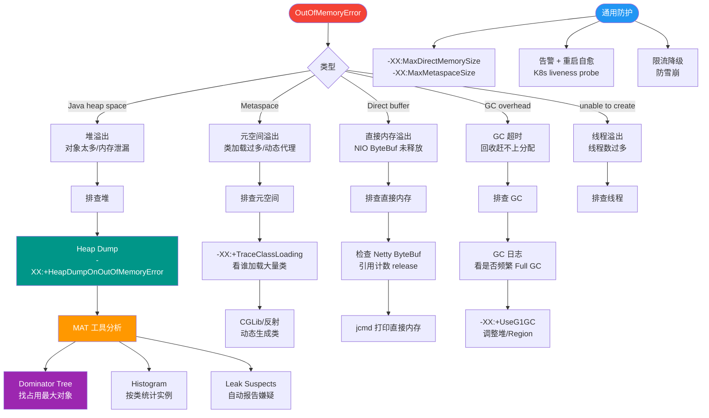

# 使用 MAT 分析内存泄漏时，Dominator Tree（支配树）和 Histogram（直方图）有什么区别？

在 MAT (Memory Analyzer Tool) 中，Histogram 按类列出所有对象实例，可以快速查看哪个类的对象数量最多，适合发现大量重复创建的小对象（如 String 或基本类型包装类）。而 Dominator Tree 则展示了对象的引用支配关系，即如果一个对象被 GC 回收，那么它支配的所有对象也会被回收。在分析内存泄漏时，应优先查看 Dominator Tree 中 Retained Heap（保留堆大小）最大的对象，它们往往是内存泄漏的源头。通常结合“Path to GC Roots”功能，查看该大对象是被哪个静态变量或长生命周期的线程局部变量所引用，从而定位泄漏代码。

**实战案例**：排查某在线教育平台OOM时，Histogram显示 `char[]` 数量巨大但无法定位来源，切换到 Dominator Tree 发现 Retained Heap 最大的是一个 `ConcurrentHashMap`，顺藤摸瓜发现是缓存未设置过期策略导致的堆外内存泄漏间接影响堆内存。

**对比表格**：
| 维度 | Histogram (直方图) | Dominator Tree (支配树) |
| :--- | :--- | :--- |
| **核心视角** | 类的统计视图（对象数量/Shallow Heap） | 对象的引用支配视图（Retained Heap） |
| **主要用途** | 发现对象数量暴增的类型（如重复创建） | 定位内存占用总量最大的“罪魁祸首” |
| **层级关系** | 扁平化按类分组 | 树状结构展示对象间的持有关系 |
| **典型场景** | 分析 Shallow Heap 泄漏、排查缓存击穿 | 分析 Retained Heap 泄漏、查找无法回收的大对象 |

## 技术原理

- **Histogram 的类聚合视角**：MAT 直方图按 Java 类聚合统计——列出每个 class 的**对象数量（Objects）**、**Shallow Heap（对象自身占用字节数，不含引用对象）**、**Retained Heap（被该类所有对象"持有"的堆大小）**。它回答"哪类对象最多/最占内存"。典型泄漏场景：HashMap 条目 500 万个、`byte[]` 2GB、自定义 DTO 类实例数异常——这些在 Histogram 里按数量或 Shallow 排序一眼可见。
- **Dominator Tree 的支配关系**：支配树基于**支配者（Dominator）**概念构建——对象 A 是 B 的支配者，当且仅当删除 A 会导致 B 也被回收（B 的所有 GC Roots 路径都经过 A）。树根是 GC Roots，每个节点的 Retained Heap = 它自身 + 它**独占支配**的所有后代之和。回答"删掉哪个对象能释放最多内存"。Top 节点往往就是泄漏源——一个 Cache 或 ThreadLocal 持有了海量数据。
- **Retained Heap 的计算陷阱**：Retained Heap 只算**独占支配**的部分，共享对象（被多个支配者引用）不计入任何一方。因此一个大对象可能 Shallow 很小但 Retained 巨大（持有大量后代），也可能 Retained 很小（后代都被别人共享支配）。实战中要结合"Merge Shortest Path to GC Roots"看引用链，避免被 Retained 数字误导。
- **三种分析路径的分工**：①Histogram 找异常类型 → ②Dominator Tree 找最大持有者 → ③Path to GC Roots 找引用源头。这三步是从"症状"到"病因"的标准诊断流程，单看任何一步都不够。

## 命令演示（MAT 操作流程）

```
# 1. 获取堆 dump
jcmd <pid> GC.heap_dump /tmp/heap.hprof
# 或 JVM 启动时配置 OOM 自动 dump
-XX:+HeapDumpOnOutOfMemoryError -XX:HeapDumpPath=/tmp/

# 2. 用 MAT 打开 hprof，先看 Leak Suspects Report（自动诊断）

# 3. Histogram 视图（排查数量暴增）
#    - 点击 "Histogram" 图标
#    - 按 "Objects" 列降序，找实例数异常的类
#    - 右键该类 → "Merge Shortest Paths" → "to GC Roots" → "exclude weak/soft references"
#    看是谁持有这些对象

# 4. Dominator Tree 视图（定位最大持有者）
#    - 点击 "Dominator Tree" 图标
#    - 按 "% Retained Heap" 降序
#    - 顶部对象通常是泄漏源
#    - 展开树查看持有链：ConcurrentHashMap → Entry[] → Entry(key,value) → 大 byte[]
```

OQL（Object Query Language）示例：

```sql
-- 查找所有未关闭的 PreparedStatement（排查游标泄漏）
SELECT * FROM java.sql.PreparedStatement s WHERE s.cancelled = false

-- 查找体积最大的 byte[]（排查内存中大对象）
SELECT * FROM byte[] b WHERE b.length > 1000000

-- 查找所有 HashMap 实例及其 entry 数量
SELECT m, m.table.@length FROM java.util.HashMap m
```

## 常见坑/注意事项

- **Shallow Heap ≠ Retained Heap**：Shallow 只算对象头+字段指针（一个 HashMap 实例 Shallow 仅几十字节），Retained 才算它持有的全部。Histogram 默认显示 Shallow，排查泄漏要切到 Retained。
- **支配树计算的开销**：MAT 计算 Dominator Tree 需要构建支配关系图，对超大堆（>32GB）可能 OOM 或耗时几分钟。建议用 `--launcher.XXMaxHeapSize` 调大 MAT 自身堆。
- **WeakReference 干扰**：弱引用、软引用会让对象"看似被引用但 GC 可回收"，掩盖泄漏。查 Path to GC Roots 时务必勾选 "exclude weak/soft/phantom references"，否则会看到一堆无意义的引用链。
- **类加载器泄漏**：Web 容器（Tomcat）热部署时，旧的 ClassLoader 持有大量类对象无法回收，Histogram 显示 `java.lang.Class` 数量暴增。需在 Dominator Tree 找 WebappClassLoader 实例，查其持有哪个未销毁的 Servlet。
- **堆 dump 的时机**：在 OOM 时 dump 可能太晚（堆已损坏），建议用 `jcmd` 在业务异常但尚未 OOM 时主动 dump，或开启 `-XX:+HeapDumpBeforeFullGC` 在每次 Full GC 前抓快照。


## 核心流程图



## 记忆要点
- 视角差异：Histogram按类聚合看对象数量，Dominator Tree按引用链看支配关系
- 场景对比：排查数量暴增的小对象用Histogram，寻找内存泄漏源头用Dominator Tree
- 泄漏定位：优先看Dominator Tree中Retained Heap最大的节点，顺藤摸瓜找GC Roots

## 结构化回答

**30 秒电梯演讲：** Histogram像仓库物资清单，告诉你螺丝钉哪个型号最多；Dominator Tree像封箱包裹图，告诉你那个巨大的箱子里包了谁，拆了它就能腾出最大空间。

**展开框架：**
1. **Histogram** — Histogram按类统计对象数量，适合排查频繁创建的小对象泄漏
2. **Dominator Tree** — Dominator Tree按保留堆大小排序，直接定位占用内存最大的对象
3. **实战优先看Dominator** — 实战优先看Dominator Tree的Top对象，配合GC Roots找持有者

**收尾：** 这块我踩过一些坑，您想深入聊哪一段——原理细节、实战案例还是常见踩坑？

## 视频脚本

> 预计时长：3 分钟 | 由浅入深

| 时间 | 画面/字幕 | 口播台词 | 讲解要点 |
|------|----------|----------|----------|
| 0:00 | 标题卡：使用 MAT 分析内存泄漏时，Dominator Tree（支配树）和 Histogram（直方图）有什么区别 | 今天这道题：使用 MAT 分析内存泄漏时，Dominator Tree（支配树）和 Histogram（直方图）有什么区别。30 秒先给你讲清楚。 | 开场钩子 |
| 0:20 | 核心概念动画/示意图 | Histogram像仓库物资清单，告诉你螺丝钉哪个型号最多；Dominator Tree像封箱包裹图，告诉你那个巨大的箱子里包了谁，拆了它就能腾出最大空间。 | 核心概念 |
| 0:40 | Histogram示意图 | Histogram按类统计对象数量，适合排查频繁创建的小对象泄漏 | Histogram |
| 1:10 | 总结卡 + 下期预告 | 记住今天这几个关键词，面试一定用得上。下期见。 | 收尾 |
