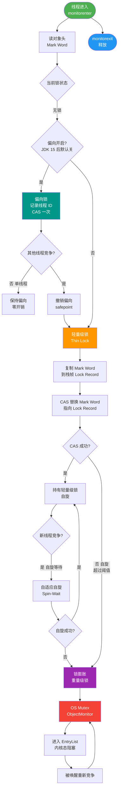

# 在Java中，对象是如何在堆内存中布局的？请解释对象头包含哪些信息，以及这些信息在锁升级过程中起到了什么作用？

Java对象在堆内存中的布局分为三部分：对象头、实例数据和对齐填充。

**对象头**是关键，通常占用12字节（32位JVM为8字节），包含两部分信息：
1. **Mark Word**：存储自身的运行时数据，如哈希码、GC分代年龄、锁状态标志等。
2. **类型指针**：指向对象类元数据的指针，确定该对象是哪个类的实例。

**锁升级与Mark Word**：在JDK 1.6之后，锁进行了优化，Mark Word的内容会随锁状态变化：
- **无锁**：存储对象HashCode。
- **偏向锁**：线程ID存储在Mark Word中，标识锁被该线程独占，避免CAS操作。
- **轻量级锁**：Mark Word指向线程栈中Lock Record的指针，通过CAS自旋竞争。
- **重量级锁**：指向堆中Monitor对象的指针，涉及操作系统互斥量。

这种动态布局使得JVM能根据竞争程度自动调整锁级别，在无竞争或低竞争时减少开销。

**实战案例**：
在排查高并发下的接口响应抖动时，通过 JOL 工具打印对象头发现锁已膨胀为重量级锁（0x02 指向 Monitor），导致频繁的用户态/内核态切换。分析发现是因为在同步块中调用了 `wait()` 或存在多线程激烈竞争，后改为并发集合消除了同步块，性能恢复。

**代码示例 (Java)**：
```java
import org.openjdk.jol.info.ClassLayout;

public class LockLayoutDemo {
    public static void main(String[] args) {
        Object o = new Object();
        // 打印无锁状态的对象头 (001)
        System.out.println(ClassLayout.parseInstance(o).toPrintable());
        synchronized (o) {
            // 打印轻量级锁 (00) 或 偏向锁 (101) 状态的对象头
            System.out.println(ClassLayout.parseInstance(o).toPrintable());
        }
    }
}
```

**锁状态结构对比**：

| 锁状态 | 存储内容 (Mark Word 32bit) | 锁标识 | 性能开销 | 适用场景 |
| :--- | :--- | :--- | :--- | :--- |
| **无锁** | 对象 HashCode、分代年龄 | 001 | 无 | 无线程访问 |
| **偏向锁** | 线程 ID、Epoch、分代年龄 | 101 | 极低 (无 CAS) | 仅有一个线程反复进入同步块 |
| **轻量级锁** | 指向栈中 Lock Record 的指针 | 00 | 低 (CAS 自旋) | 两个线程交替执行，无竞争 |
| **重量级锁** | 指向堆中 Monitor 对象的指针 | 10 | 高 (内核态互斥) | 多线程并发竞争同一把锁 |

## 技术原理

对象布局和锁升级的设计哲学是**用同一块 64 bit 的 Mark Word，根据运行时竞争激烈程度动态复用空间，存储不同锁状态所需的信息**。这是 JVM 在"内存占用"和"并发性能"之间的精妙权衡。

- **对象布局三段式**：每个 Java 对象在堆里由对象头（Header）+ 实例数据（Instance Data）+ 对齐填充（Padding）组成。对象头通常 12 字节（64 位 JVM 开启指针压缩：8 字节 Mark Word + 4 字节 Klass Pointer；关闭压缩则 16 字节）。实例数据按字段类型大小排序（longs/doubles 先，然后 ints，然后 shorts/chars，然后 bytes，最后引用），父类字段在子类之前。对齐填充让对象总大小是 8 字节的整数倍（便于内存对齐访问）。
- **Mark Word 的复用机制**：64 位 JVM 下 Mark Word 是 64 bit，不同锁状态下这 64 bit 存储完全不同的内容——通过最低 3 bit 的"锁标志位"区分当前是哪种状态。例如无锁态存 HashCode（31 bit）+ 分代年龄（4 bit）+ 偏向位（1 bit）+ 锁标志位（2 bit）；偏向锁态存 线程 ID（54 bit）+ Epoch（2 bit）+ 分代年龄（4 bit）。这样设计避免为每个对象都预留 Monitor 指针空间（绝大多数对象根本不会竞争锁）。
- **锁升级的触发条件**：
  - **无锁→偏向锁**：JVM 启动后默认延迟开启偏向锁（4 秒），第一个线程进入 synchronized 块时通过 CAS 写入线程 ID，后续同一线程进入只对比 ID 无需 CAS。
  - **偏向锁→轻量级锁**：出现第二个线程竞争时（CAS 失败），等待全局安全点撤销偏向锁，升级为轻量级锁——Mark Word 存指向栈帧 Lock Record 的指针，竞争线程在用户态 CAS 自旋。
  - **轻量级锁→重量级锁**：自旋超过阈值（默认 10 次或自适应）仍未拿到锁，升级为重量级锁——Mark Word 存指向 ObjectMonitor 的指针，未竞争到的线程被 park 挂起到内核等待队列。
- **升级不可逆**：一旦升级到重量级锁，即使后续无竞争也不会降级回轻量级（但锁释放后 monitor 会被回收）。这是为了避免频繁升降级的额外开销。所以"短时高并发→长时无并发"的场景，重量级锁会一直占着。
- **JDK 15 废弃偏向锁**：偏向锁在维护成本（代码复杂）和现代 CAS 性能提升下收益变小，JDK 15 起默认关闭，JDK 18 起彻底废弃。现代 JVM 直接从轻量级锁开始。

## 代码示例

```java
// 1. 用 JOL 查看对象布局（最直观的工具）
import org.openjdk.jol.info.ClassLayout;
import org.openjdk.jol.vm.VM;

public class LayoutDemo {
    public static void main(String[] args) throws InterruptedException {
        Object o = new Object();
        System.out.println("=== 无锁状态 ===");
        System.out.println(ClassLayout.parseInstance(o).toPrintable());
        // Mark Word 末尾：0 01（无锁可偏向，normal）

        System.out.println("=== 偏向锁（延迟 5s 等偏向启动）===");
        Thread.sleep(5000);
        synchronized (o) {
            System.out.println(ClassLayout.parseInstance(o).toPrintable());
            // Mark Word 末尾：1 01（偏向锁，含线程 ID）
        }

        System.out.println("=== 轻量级锁（多线程 CAS 竞争）===");
        Thread t1 = new Thread(() -> {
            synchronized (o) {
                System.out.println(ClassLayout.parseInstance(o).toPrintable());
                // Mark Word 末尾：00（轻量级锁，指向 Lock Record）
            }
        });
        t1.start();
        t1.join();

        System.out.println("=== 重量级锁（激烈竞争）===");
        for (int i = 0; i < 10; i++) {
            new Thread(() -> {
                synchronized (o) {
                    try { Thread.sleep(100); } catch (Exception e) {}
                }
            }).start();
        }
        Thread.sleep(50);
        synchronized (o) {
            System.out.println(ClassLayout.parseInstance(o).toPrintable());
            // Mark Word 末尾：10（重量级锁，指向 ObjectMonitor）
        }
    }
}
```

```java
// 2. 锁升级实战排查：发现重量级锁后改用并发集合
public class ServiceBad {
    private final Map<String, User> cache = new HashMap<>();   // 同步块保护

    public User get(String key) {
        synchronized (cache) {            // 高并发下激烈竞争，升级为重量级锁
            return cache.get(key);
        }
    }
}

// 优化：用 ConcurrentHashMap，每个桶独立锁，避免单锁竞争
public class ServiceGood {
    private final ConcurrentHashMap<String, User> cache = new ConcurrentHashMap<>();

    public User get(String key) {
        return cache.get(key);            // 桶级 CAS，无锁升级
    }
}
```

```bash
# 3. 命令行观察锁状态
# 查看偏向锁是否启用（JDK 15 之前）
java -XX:+PrintFlagsFinal -version | grep UseBiasedLocking
# 默认 true（JDK 15+ 默认 false）

# 强制开启偏向锁（JDK 14 及以前）
java -XX:+UseBiasedLocking -XX:BiasedLockingStartupDelayMillis=0 MyApp

# 关闭偏向锁（推荐现代 JDK）
java -XX:-UseBiasedLocking MyApp
```

## 对比选型

| 锁状态 | Mark Word 内容 | 标志位 | 开销 | 适用 | 触发 |
| :--- | :--- | :--- | :--- | :--- | :--- |
| **无锁** | HashCode/分代年龄 | 001 | 无 | 无并发访问 | 默认 |
| **偏向锁** | 线程 ID + Epoch | 101 | 极低（无 CAS） | 单线程重复进入 | 第一个线程进入（JDK 15 前有效）|
| **轻量级锁** | Lock Record 指针 | 00 | 低（用户态 CAS 自旋） | 2 个线程交替，无真竞争 | 第二个线程竞争 |
| **重量级锁** | ObjectMonitor 指针 | 10 | 高（内核态互斥+park） | 多线程激烈竞争 | 自旋失败 |

## 常见坑

- **JDK 15+ 偏向锁默认关闭**：很多教程还讲偏向锁，但现代 JDK（15+）已默认禁用，JDK 18 彻底移除。面试回答时要说明这一点，不要当作当前主流。
- **重量级锁不会自动降级**：一旦升级，即使后续无并发也保持重量级。排查"接口偶发抖动"时如果 JOL 看到锁已是 10（重量级），即便当时无并发也是历史遗留。
- **wait/notify 强制升级到重量级锁**：这两个方法依赖 ObjectMonitor，调用时如果还在轻量级锁状态会立即升级。在轻量级锁状态下调用 wait 会抛 IllegalMonitorStateException 之前先膨胀。
- **hashCode() 调用会撤销偏向锁**：偏向锁状态下 Mark Word 没空间存 HashCode（被线程 ID 占了），调用 `hashCode()` 必须先撤销偏向锁到无锁态再存 HashCode，这是"加了 hashCode 后偏向锁失效"的根因。
- **LongAdder 优于 synchronized 累加**：高并发计数场景，`synchronized` 或 `AtomicLong` 会升级锁或 CAS 失败率高。`LongAdder` 分段累加（多个 Cell），最后求和，吞吐高 10 倍以上。
- **JOL 输出要读懂末 3 bit**：JOL 输出的 hex 末尾 3 bit 直接对应锁状态——`001` 无锁、`101` 偏向、`00` 轻量级、`10` 重量级。排查时一眼就能判断。


## 核心流程图



## 记忆要点
- 对象布局：分为对象头、实例数据、对齐填充，核心锁信息记录在对象头的Mark Word
- 锁升级链：无锁(存Hashcode) -> 偏向锁(存线程ID) -> 轻量级锁(CAS自旋) -> 重量级锁(Monitor互斥)
- 升级代价：偏向锁极低开销，轻量级锁避免系统调用，重量级锁因涉及内核态切换开销极大

## 结构化回答

**30 秒电梯演讲：** 对象头就像一个多功能电子价签，平时显示商品条码（无锁），被客户预定后显示会员ID（偏向锁），多人争抢时变成排队号码牌（轻量级），抢得太激烈就切换为人工服务柜台号（重量级）。

**展开框架：**
1. **布局** — 布局由对象头、实例数据、对齐填充组成
2. **Mark Word** — Mark Word存储锁状态、Hash码等，随竞争程度复用空间
3. **锁升级路径** — 锁升级路径：偏向锁（线程ID）-> 轻量级锁（栈指针）-> 重量级锁（Monitor指针）

**收尾：** 这块我踩过一些坑，您想深入聊哪一段——原理细节、实战案例还是常见踩坑？

## 视频脚本

> 预计时长：3 分钟 | 由浅入深

| 时间 | 画面/字幕 | 口播台词 | 讲解要点 |
|------|----------|----------|----------|
| 0:00 | 标题卡：在Java中，对象是如何在堆内存中布局的？请解释对象头包含哪些信息，以及这些信息在锁升级过程中起到了什么作用 | 今天这道题：在Java中，对象是如何在堆内存中布局的？请解释对象头包含哪些信息，以及这些信息在锁升级过程中起到了什么作用。30 秒先给你讲清楚。 | 开场钩子 |
| 0:20 | 核心概念动画/示意图 | 对象头就像一个多功能电子价签，平时显示商品条码（无锁），被客户预定后显示会员ID（偏向锁），多人争抢时变成排队号码牌（轻量级），抢得太激烈就切换为人工服务柜台号（重量级）。 | 核心概念 |
| 0:40 | 布局示意图 | 布局由对象头、实例数据、对齐填充组成 | 布局 |
| 1:10 | 总结卡 + 下期预告 | 记住今天这几个关键词，面试一定用得上。下期见。 | 收尾 |
