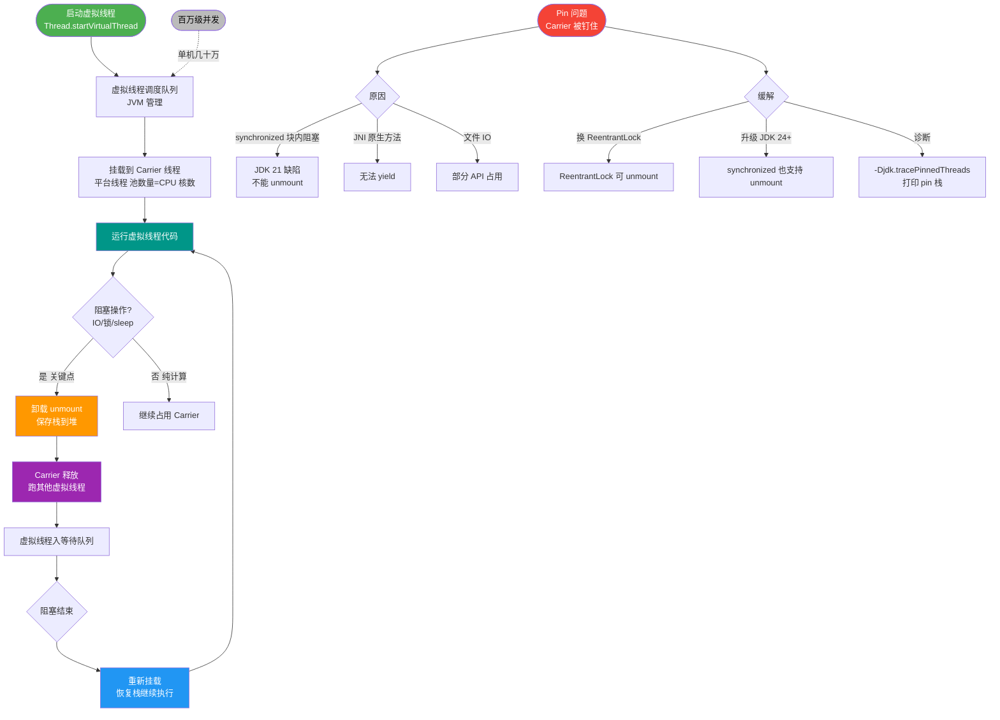

# JDK 21 引入的虚拟线程与传统的平台线程在底层调度模型上有何本质区别？在 I/O 密集型场景下，虚拟线程如何解决“池化焦虑”问题？

传统平台线程是 OS 线程 1:1 包装，成本高需池化；虚拟线程是 JVM 轻量级线程（M:N 模型），栈在堆内存，阻塞时自动挂起释放 Carrier Thread，允许百万级并发，消除了对 I/O 密集型场景下的“池化焦虑”。

**实战案例**：
在旧版 Tomcat 使用 200 线程池处理高并发请求时，一旦下游服务响应变慢，线程池很快耗尽导致整个服务拒绝请求。迁移到 JDK 21 虚拟线程后，仅需调整 `Executors.newVirtualThreadPerTaskExecutor()` 即可轻松处理 10万+ 并发请求，且不再受限于固定线程数。

**代码示例 (Java)**：
```java
import java.util.concurrent.Executors;

// 旧方式：固定大小线程池，容易耗尽
// ExecutorService service = Executors.newFixedThreadPool(200);

// 新方式：虚拟线程，不限制并发数量（受限于系统资源）
try (var service = Executors.newVirtualThreadPerTaskExecutor()) {
    for (int i = 0; i < 100_000; i++) {
        service.submit(() -> {
            // 模拟 IO 阻塞，此时 Carrier Thread 会被释放去执行其他虚拟线程
            Thread.sleep(Duration.ofSeconds(1));
        });
    }
}
```

**平台线程 vs 虚拟线程对比**：

| 维度 | 平台线程 | 虚拟线程 |
| :--- | :--- | :--- |
| **调度模型** | 1:1 (映射到 OS 线程) | M:N (JVM 调度到 OS 线程) |
| **创建成本** | 高 (需分配原生栈内存 ~1MB) | 极低 (仅分配堆内存对象 ~几KB) |
| **阻塞行为** | 阻塞 OS 线程，浪费 CPU | 挂载时释放 Carrier Thread，极低成本 |
| **数量上限** | 几千个 (受 OS 限制) | 百万级 (受限于堆内存) |
| **适用场景** | CPU 密集型计算 | I/O 密集型 (DB查询, RPC调用) |

## 技术原理

- **M:N 调度的底层实现**：每个虚拟线程对应一个 `Continuation` 对象（JDK 内部类），它把"运行栈帧"序列化成堆上的对象。虚拟线程跑在 **Carrier Thread**（ForkJoinPool 的平台线程）上，当虚拟线程遇到阻塞 I/O（`Socket.read`、`Lock.lock`），JVM 把 Continuation **yield**（挂起），把栈帧保存到堆，Carrier 线程被释放去跑其他虚拟线程。I/O 完成后再把 Continuation **resume**（恢复）到某个 Carrier 线程继续执行。整个挂起/恢复由 JVM 在用户态完成，不涉及 OS 上下文切换。
- **载体线程（Carrier Thread）的调度**：所有 Carrier 线程由一个共享的 `ForkJoinPool` 管理，默认大小 = CPU 核数（`Runtime.availableProcessors()`）。虚拟线程被提交到这个池的 work-stealing 队列。这意味着**真正跑业务的并发度仍受 CPU 核数限制**，虚拟线程的"百万并发"指的是"百万个等待中的任务"，而非百万个 CPU 密集任务。CPU 密集型任务用虚拟线程无收益，反而增加调度开销。
- **栈的按需分配与拷贝**：虚拟线程的栈不在 OS 线程栈上，而在堆内存中。初始只分配几百字节（只存 Continuation 引用），运行时按需"栈帧拷贝"到 Carrier 的栈上执行，阻塞时再拷回堆。这是虚拟线程内存占用极低（KB 级）的根本原因，百万虚拟线程只需几 GB 堆。
- **pinning（钉住）问题**：某些操作会让虚拟线程无法卸载——`synchronized` 块内阻塞、JNI 调用、`Object.wait()` 等。此时虚拟线程被"钉"在 Carrier 线程上，Carrier 被阻塞无法跑其他虚拟线程。JDK 21 用 `synchronized` 仍会 pinning，JDK 24（JEP 491）修复了这个问题，让 `synchronized` 也能卸载。监控指标 `jdk.VirtualThreadPinned` 可定位 pinning 热点。

## 代码示例

```java
import java.util.concurrent.*;
import java.time.Duration;

// 1. 每任务一虚拟线程（最简单，适合短任务）
try (ExecutorService es = Executors.newVirtualThreadPerTaskExecutor()) {
    for (int i = 0; i < 100_000; i++) {
        es.submit(() -> {
            // 阻塞 I/O：HTTP 调用、DB 查询、Thread.sleep
            // 阻塞期间 Carrier 释放，可跑其他虚拟线程
            return httpClient.send(request, BodyHandlers.ofString());
        });
    }
}  // try-with-resources 自动等待所有任务完成

// 2. 与结构化并发（JDK 21+）配合
try (var scope = new StructuredTaskScope.ShutdownOnFailure()) {
    Future<User> userF = scope.fork(() -> fetchUser(id));
    Future<Order> orderF = scope.fork(() -> fetchOrder(id));
    scope.join();              // 等所有子任务完成
    scope.throwIfFailed();     // 任一失败则抛异常，其他任务被取消
    return new Result(userF.get(), orderF.get());
}

// 3. Spring Boot 3.3 开启虚拟线程 Tomcat
// application.properties: spring.threads.virtual.enabled=true
// 每个 HTTP 请求跑在独立虚拟线程，无需配置线程池大小

// 4. 警惕：synchronized 内阻塞会 pinning（JDK 21）
public void badExample() {
    synchronized (lock) {           // 虚拟线程被 pin 住，Carrier 被占
        Thread.sleep(1000);         // 改用 ReentrantLock 可避免
    }
}
```

## 常见坑/注意事项

- **CPU 密集型用虚拟线程无收益**：虚拟线程解决"I/O 等待时的线程浪费"，对纯计算任务，虚拟线程反而增加 Continuation 管理开销。CPU 密集仍用平台线程池（大小=核数）。
- **synchronized + 阻塞 = pinning**：JDK 21 中 `synchronized` 块内 I/O 阻塞会让 Carrier 线程被钉住，无法卸载，退化成平台线程行为。改用 `ReentrantLock`（不 pinning），或升级 JDK 24+（JEP 491 修复）。用 `-Djdk.tracePinnedThreads=full` 排查。
- **ThreadLocal 的内存膨胀**：每个虚拟线程都有独立的 ThreadLocal，百万虚拟线程 × 多个 ThreadLocal 会内存暴涨。JDK 20 引入 `ScopedValue`（不可变、生命周期短）替代部分 ThreadLocal 场景。
- **池化虚拟线程是反模式**：虚拟线程创建/销毁成本极低，应"用即弃"（per-task executor），不要复用。复用会让 ThreadLocal/异常处理跨任务污染。
- **第三方库的兼容性**：使用 native stack walking（如某些 profiler/agent）或假设"线程数有限"的库（如 HikariCP 默认连接数=10 但虚拟线程能并发 10 万请求）需调整。HikariCP 要把 `maximumPoolSize` 调大，或改用支持虚拟线程的连接池。


## 核心流程图



## 记忆要点
- 调度对比：平台线程1:1映射OS需池化，虚拟线程M:N调度且由JVM托管
- 阻塞行为：因虚拟线程I/O阻塞时会自动卸载并释放Carrier线程，所以杜绝了线程浪费
- 核心收益：创建成本极低（KB级），轻松支持百万并发，彻底解决I/O密集型场景的池化焦虑

## 结构化回答

**30 秒电梯演讲：** 平台线程像专用出租车（座位少、贵、每单必占），虚拟线程像共享单车（极多、便宜、需骑行时才占用路面）。

**展开框架：**
1. **调度模型** — 调度模型：平台线程 1:1 映射内核线程，虚拟线程 M:N 映射到 Carrier 线程
2. **资源消耗** — 资源消耗：虚拟线程栈在堆内存，轻量且按需伸缩，支持百万级并发
3. **阻塞** — 阻塞优化：IO 阻塞时自动卸载（Continuation 挂起），不占用底层 OS 线程

**收尾：** 这块我踩过一些坑，您想深入聊哪一段——原理细节、实战案例还是常见踩坑？

## 视频脚本

> 预计时长：3 分钟 | 由浅入深

| 时间 | 画面/字幕 | 口播台词 | 讲解要点 |
|------|----------|----------|----------|
| 0:00 | 标题卡：JDK 21 引入的虚拟线程与传统的平台线程在底层调度模型上有何本质区别？在 I/O 密集型场景下，虚拟线程如何解决“池化焦虑”问题 | 今天这道题：JDK 21 引入的虚拟线程与传统的平台线程在底层调度模型上有何本质区别？在 I/O 密集型场景下，虚拟线程如何解决“池化焦虑”问题。30 秒先给你讲清楚。 | 开场钩子 |
| 0:20 | 核心概念动画/示意图 | 平台线程像专用出租车（座位少、贵、每单必占），虚拟线程像共享单车（极多、便宜、需骑行时才占用路面）。 | 核心概念 |
| 0:40 | 调度模型示意图 | 调度模型：平台线程 1:1 映射内核线程，虚拟线程 M:N 映射到 Carrier 线程 | 调度模型 |
| 1:10 | 总结卡 + 下期预告 | 记住今天这几个关键词，面试一定用得上。下期见。 | 收尾 |
